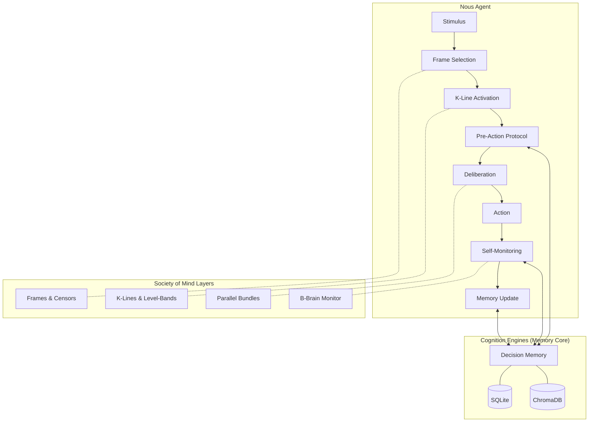
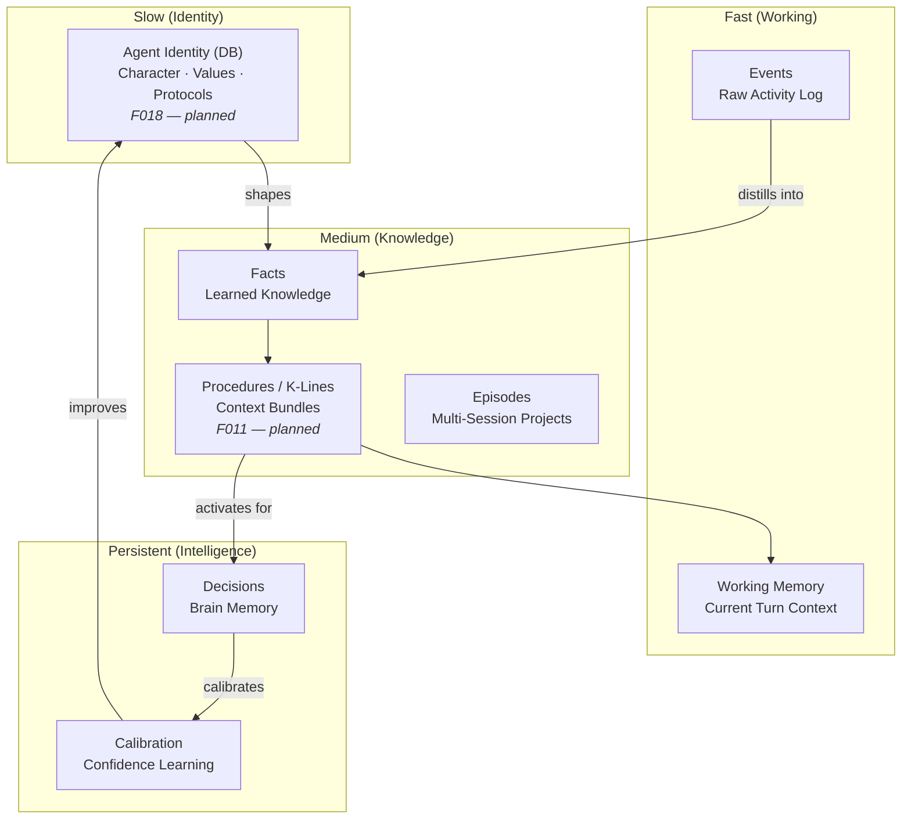
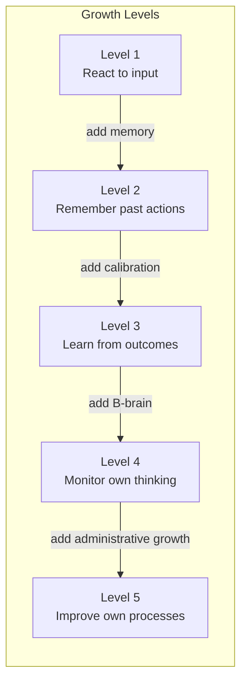
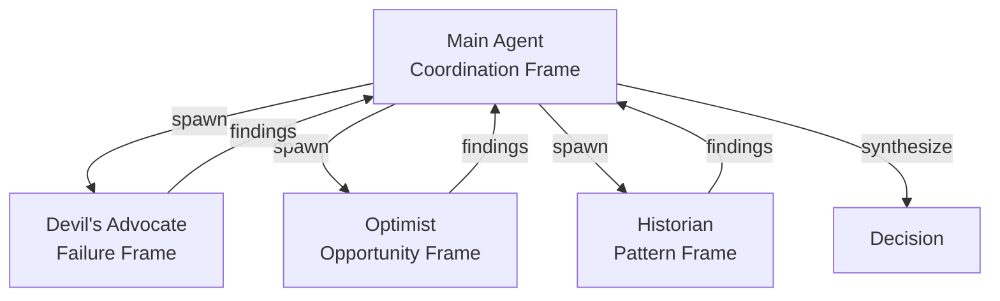

<p align="center">
  
</p>

# Nous

**A cognitive architecture for AI agents, grounded in Minsky's Society of Mind.**

Nous is a framework for building AI agents that think, learn, and grow — not just respond. It uses [Cognition Engines](https://github.com/tfatykhov/cognition-agent-decisions) as its decision memory core, and implements Marvin Minsky's Society of Mind principles as first-class architectural components.

> *"To explain the mind, we have to show how minds are built from mindless stuff."* — Marvin Minsky

## Why Nous?

Current AI agents are stateless reactors. They receive a prompt, generate a response, and forget. Even agents with "memory" just store and retrieve text — there's no structure, no learning, no growth.

Nous is different. It gives agents:

- **Structured memory** that mirrors how minds actually work (not just vector search)
- **Decision intelligence** that learns from past choices and calibrates confidence
- **Self-monitoring** that catches mistakes before they happen
- **Administrative growth** — agents get smarter by managing themselves better, not just accumulating more knowledge

## Architecture Overview



## Core Concepts

### From Minsky

| Concept | Chapter | Nous Implementation |
|---------|---------|----------------------|
| K-Lines | Ch 8 | Context bundles with level-bands (upper fringe / core / lower fringe) |
| Censors | Ch 9 | Guardrails that block actions, not modify them |
| Papert's Principle | Ch 10 | Administrative growth through detours, not replacements |
| Frames | Ch 25 | One active frame at a time; explicit frame-switching |
| B-Brains | Ch 6 | Self-monitoring layer that watches the agent think |
| Parallel Bundles | Ch 18 | Multiple independent reasons > one logical chain |
| Polynemes | Ch 19 | Tags as cross-agency activation signals |
| Nemes | Ch 20 | Micro-features that constrain search (bridge-definitions) |
| Pronomes | Ch 21 | Separation of assignment (what) from action (how) |
| Attachment Learning | Ch 17 | Goal formation through reinforcement of subgoals |

### From Cognition Engines

| Component | Role in Nous |
|-----------|---------------|
| Decision Memory | Long-term episodic memory for all agent choices |
| Pre-Action Protocol | Mandatory think-before-acting loop |
| Deliberation Traces | B-brain consciousness — recording thought as it happens |
| Calibration | Learning to trust your own confidence estimates |
| Guardrails | Censors that enforce boundaries |
| Bridge Definitions | Structure + function descriptions for semantic recall |
| Graph Store | Decision relationships and dependency tracking |

## The Nous Loop

Every agent action follows this cycle:

```
SENSE → FRAME → RECALL → DELIBERATE → ACT → MONITOR → LEARN
```

### 1. SENSE (Stimulus Reception)
The agent receives input — a message, an event, a timer. Raw perception.

### 2. FRAME (Interpretation)
Select a cognitive frame for interpreting the input. "Is this a bug report? A creative request? A decision point?" The frame determines which agencies activate.

**Minsky insight:** You can only hold one frame at a time (Necker cube). Frame-switching is explicit, not automatic. For important decisions, spawn parallel frames via sub-agents (Devil's Advocate, Optimist, etc.).

### 3. RECALL (K-Line Activation)
Activate relevant K-lines — context bundles that reconstruct the mental state needed for this type of work. K-lines connect at three levels:

- **Upper fringe** (goals): weakly attached, may not apply
- **Core** (patterns & tools): strongly attached, the transferable knowledge
- **Lower fringe** (implementation details): easily displaced by current context

**Minsky insight:** Memory is reconstruction, not retrieval. You don't "find" old knowledge — you become a version of yourself that had it.

### 4. DELIBERATE (Pre-Action Protocol)
Before acting, query the decision memory:

1. **Query similar past decisions** — what happened when I faced this before?
2. **Check guardrails** — am I allowed to do this?
3. **Record intent** — capture the deliberation trace BEFORE acting
4. **Assess confidence** — how sure am I? (calibration feedback loop)

**Minsky insight:** Consciousness is menu lists, not deep access. The deliberation trace IS the thinking, not a record of it.

### 5. ACT (Execution)
Do the thing. While working, capture reasoning with micro-thoughts — the B-brain watches the A-brain work.

### 6. MONITOR (Self-Assessment)
After acting, the B-brain evaluates:
- Did the action match the intent?
- Were there unexpected consequences?
- Should a censor be activated for next time?

**Minsky insight:** Keep the watcher simple and rule-based. Meta-decisions about decision-making are recursive and dangerous.

### 7. LEARN (Memory Update)
Update memory at all levels:
- **Decision memory** — finalize the decision record with outcome
- **K-lines** — create or update context bundles if new patterns emerged
- **Calibration** — feed confidence vs outcome back into the system
- **Guardrails** — add new censors if a failure mode was discovered

## Memory Architecture



**Key principle:** Each layer learns to exploit the last, then stabilizes and becomes a foundation. Layers become substrates. The slowest-changing layers provide the most continuity.

## Growth Model

Nous agents grow through **Papert's Principle**: the most crucial steps in mental growth are based on acquiring new administrative ways to use what one already knows.

This means:
- **Don't add more knowledge** when an agent fails — add a better manager
- **Build detours, not replacements** — intercept existing behavior, don't rip it out
- **Friction beats reminders** — reduce the steps to do the right thing
- **Censors > modifications** — when something fails, add a blocker, don't alter the method



Most AI agents operate at Level 1-2. Nous targets Level 5.

## Confidence & Calibration

Nous agents track their confidence and learn from it:

- Every decision records a confidence score (0.0 - 1.0)
- Outcomes are reviewed and compared to predictions
- **Brier scores** measure calibration accuracy over time
- Agents that say "80% confident" should be right ~80% of the time

**Fredkin's Paradox:** When two options seem equally good, the choice matters least. Stop agonizing at 0.50 confidence — pick one and move. Save deliberation energy for decisions where options are actually different.

## Frame-Splitting Protocol

For important decisions, Nous supports **parallel cognitive frames** via sub-agents:



Each sub-agent is locked into a single interpretive frame. The main agent synthesizes their perspectives. This overcomes Minsky's "one frame at a time" limitation through parallel processing.

## Relationship to Cognition Engines

Nous applies the same decision intelligence principles proven by [Cognition Engines](https://github.com/tfatykhov/cognition-agent-decisions) — decisions, deliberation traces, calibration, guardrails, bridge definitions — but is a completely independent implementation.

**Same ideas, not same code.**

Cognition Engines is a standalone server for any AI agent that needs decision memory. Nous's Brain module is a purpose-built embedded implementation of those principles, optimized for in-process use with zero network overhead.

```
Cognition Engines  →  proved the ideas work (standalone server, MCP/JSON-RPC)
Nous Brain       →  applies those ideas as an embedded organ (Python library, Postgres)
```

Both projects evolve independently. The shared asset is the philosophy, not the codebase.

## Research Questions

1. **How much structure is optimal?** Too little and the agent doesn't learn. Too much and it's rigid. Where's the sweet spot?

2. **Can administrative growth be automated?** Papert's Principle says growth is about better managers. Can an agent bootstrap its own management layer?

3. **What's the minimum viable Society?** Which Minsky concepts are essential vs nice-to-have? What's the smallest set that produces emergent intelligence?

4. **How do frame conflicts resolve?** When parallel frames disagree, what's the arbitration mechanism?

5. **Does calibration plateau?** As decisions accumulate, does calibration continue improving or hit diminishing returns?

6. **Can K-lines transfer between agents?** If Agent A learns a K-line, can Agent B use it? What's lost in translation?

7. **How does Fredkin's Paradox interact with stakes?** Low-stakes decisions should resolve fast. High-stakes decisions need more deliberation. What's the mapping?

## Configuration

Key environment variables (see `.env.example` for the full list):

| Variable | Default | Description |
|----------|---------|-------------|
| `NOUS_IDENTITY_PROMPT` | Built-in default | **Agent identity.** Injected as the first section of every system prompt. This is how Nous knows who it is and how to behave. Override to customize personality. |
| `NOUS_MODEL` | `claude-sonnet-4-5-20250514` | LLM model for the main agent loop |
| `NOUS_MAX_TURNS` | `10` | Max tool-use iterations per turn. Increase for complex multi-step tasks. |
| `NOUS_THINKING_MODE` | `off` | Extended thinking: `off`, `adaptive` (recommended for 4.6), or `manual` |
| `NOUS_EFFORT` | `high` | Thinking depth for adaptive mode: `low`, `medium`, `high`, `max` |
| `NOUS_EVENT_BUS_ENABLED` | `true` | Enable async event handlers (episode summarizer, fact extractor) |
| `NOUS_WORKSPACE_DIR` | `/tmp/nous-workspace` | Agent workspace directory |

## Status

🚀 **v0.1.0 — shipped and deployed.**

All core architecture is implemented and running:

| Component | Status | Description |
|-----------|--------|-------------|
| Brain (F001) | ✅ Shipped | Decision recording, deliberation traces, calibration, guardrails, graph |
| Heart (F002) | ✅ Shipped | Episodes, facts, procedures, censors, working memory |
| Cognitive Layer (F003) | ✅ Shipped | Frame selection, recall, deliberation, monitoring, reflection |
| Runtime (F004) | ✅ Shipped | REST API (12 endpoints), MCP server, Telegram bot |
| Context Engine (F005) | ✅ Shipped | Intent-driven retrieval, token budgets, dedup |
| Event Bus (F006) | ✅ Shipped | In-process async bus with automated handlers |
| Memory Improvements (F010) | ✅ Shipped | Episode summaries, fact extraction, user tagging |

**Stats:** ~11,800 lines of Python · 424 tests · 18 Postgres tables · Docker deployment

See [Feature Index](docs/features/INDEX.md) for the full breakdown.

## License

Apache 2.0

## Acknowledgments

- **Marvin Minsky** — *Society of Mind* (1986) provides the theoretical foundation
- **Cognition Engines** — decision intelligence substrate
- Built with curiosity and too much coffee ☕
