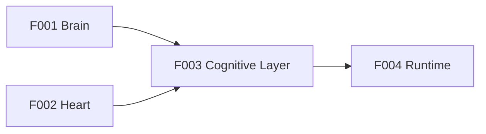

# F003: Cognitive Layer (The Nous Loop)

**Status:** Shipped (PR #10)
**Priority:** P0 — The thinking machinery
**Origin:** Minsky's Society of Mind, implemented as Claude Agent SDK hooks

## Summary

The Cognitive Layer is what makes Nous think, not just respond. It orchestrates Brain and Heart through the Nous Loop: Sense → Frame → Recall → Deliberate → Act → Monitor → Learn.

Implemented as hooks in the Claude Agent SDK — intercepts that add cognitive structure without replacing the underlying agent behavior.

## The Nous Loop

```
SENSE → FRAME → RECALL → DELIBERATE → ACT → MONITOR → LEARN
  │        │        │         │          │        │         │
  │     Select    Load     Check       LLM    Assess    Update
  │     cognitive  K-lines  guardrails  does   outcome   memory
  │     frame     + facts  + record    the            + create
  │                        intent     work            censors
```

## Hook Integration

```python
from nous.brain import Brain
from nous.heart import Heart
from nous.cognitive import CognitiveLayer
from claude_agent_sdk import ClaudeSDKClient, ClaudeAgentOptions

brain = Brain(db_pool)
heart = Heart(db_pool)
cognitive = CognitiveLayer(brain, heart)

options = ClaudeAgentOptions(
    system_prompt=cognitive.build_system_prompt(),
    hooks={
        "pre_tool_use": cognitive.pre_action_hook,
        "post_tool_use": cognitive.post_action_hook,
        "pre_response": cognitive.frame_validation_hook,
        "on_error": cognitive.censor_creation_hook,
    }
)

async with ClaudeSDKClient(options=options) as client:
    await client.query("Should we use Redis for caching?")
```

## Components

### Frame Engine

Selects cognitive frame before processing. Determines which agencies activate.

```python
class FrameEngine:
    async def select(self, input: str, context: dict) -> CognitiveFrame:
        """Choose the right frame for this input."""
        
        # 1. Pattern match (fast)
        frame = self.pattern_match(input)
        if frame and frame.confidence > 0.8:
            return frame
        
        # 2. LLM classify (fallback)
        return await self.llm_classify(input, self.registry.all())
    
    async def split(self, input: str, frames: list[str]) -> list[SubAgent]:
        """Spawn parallel frames for important decisions."""
        agents = []
        for frame_id in frames:
            frame = self.registry.get(frame_id)
            agent = await spawn_sub_agent(
                system_prompt=frame.as_prompt(),
                input=input
            )
            agents.append(agent)
        return agents
```

**Initial frame registry:**

| Frame | Pattern Triggers | Behavior |
|-------|-----------------|----------|
| `task` | do, create, build, fix, implement | Action-oriented, structured |
| `question` | what, why, how, explain, describe | Research, thorough |
| `decision` | should we, which, choose, compare, evaluate | Pre-action mandatory, parallel reasons |
| `creative` | brainstorm, explore, what if, imagine | Expansive, fewer censors |
| `conversation` | hey, hi, thanks, how are you | Lightweight, no heavy machinery |
| `debug` | error, bug, broken, failing, not working | Logs first, reproduce second |

### Recall Engine

Activates relevant context from Brain and Heart.

```python
class RecallEngine:
    async def activate(self, frame: CognitiveFrame, input: str) -> Context:
        """Load everything the agent needs for this task."""
        
        context = Context()
        
        # 1. Procedures for this frame/domain
        procedures = await self.heart.recall(
            frame.domain, type="procedure", limit=3
        )
        for proc in procedures:
            await self.heart.activate_procedure(proc.id)
            context.add(proc, band="core")
        
        # 2. Similar past decisions
        decisions = await self.brain.query(input, limit=5)
        context.add(decisions, band="core")
        
        # 3. Relevant facts
        facts = await self.heart.recall(input, type="fact", limit=10)
        context.add(facts, band="lower_fringe")  # Easily displaced
        
        # 4. Active censors
        censors = await self.heart.get_active_censors()
        context.add(censors, band="core")  # Always present
        
        # 5. Update working memory
        await self.heart.set_working_memory(context)
        
        return context
```

### Deliberation Engine

Records reasoning during work.

```python
class DeliberationEngine:
    async def start(self, description: str, frame: CognitiveFrame) -> str:
        """Begin deliberation — record intent."""
        decision = await self.brain.record(
            description=f"Plan: {description}",
            confidence=0.5,  # Updated as reasoning progresses
            category=frame.default_category,
            stakes=frame.default_stakes
        )
        return decision.id
    
    async def think(self, decision_id: str, thought: str):
        """Capture a micro-thought."""
        await self.brain.think(decision_id, thought)
    
    async def finalize(self, decision_id: str, description: str, 
                       confidence: float, **kwargs):
        """Update decision with final outcome."""
        await self.brain.update(decision_id, 
            description=description,
            confidence=confidence,
            **kwargs
        )
```

### Monitor Engine

Post-action self-assessment.

```python
class MonitorEngine:
    async def assess(self, decision_id: str, action_result: Any) -> Assessment:
        """Evaluate what just happened."""
        decision = await self.brain.get(decision_id)
        
        assessment = Assessment(
            decision_id=decision_id,
            intended=decision.description,
            actual=str(action_result),
            surprise_level=await self.calculate_surprise(decision, action_result),
        )
        
        # Check if we need new censors
        if assessment.surprise_level > 0.7:
            await self.heart.flag_for_censor_review(decision_id)
        
        return assessment
    
    async def learn(self, episode_summary: str, decisions: list[str]):
        """End-of-task learning."""
        
        # 1. Record episode
        episode = await self.heart.record_episode(
            summary=episode_summary,
            decision_ids=decisions
        )
        
        # 2. Extract facts
        await self.heart.post_episode_extraction(episode)
        
        # 3. Update procedure effectiveness
        # (handled by extraction pipeline)
```

## System Prompt Construction

The cognitive layer builds a dynamic system prompt:

```python
class CognitiveLayer:
    def build_system_prompt(self, frame: CognitiveFrame, context: Context) -> str:
        """Construct system prompt with cognitive context."""
        
        sections = []
        
        # Identity (slow-changing)
        sections.append(self.identity_prompt)
        
        # Active frame
        sections.append(f"""
## Current Frame: {frame.name}
{frame.description}

Questions to consider:
{chr(10).join(f'- {q}' for q in frame.questions_to_ask)}
""")
        
        # Relevant past decisions
        if context.decisions:
            sections.append("## Relevant Past Decisions")
            for d in context.decisions:
                sections.append(f"- [{d.outcome}] {d.description} (confidence: {d.confidence})")
        
        # Active procedures
        if context.procedures:
            sections.append("## Active Procedures")
            for p in context.procedures:
                sections.append(f"### {p.name}")
                for pattern in p.core_patterns:
                    sections.append(f"- {pattern}")
        
        # Active censors
        if context.censors:
            sections.append("## ⚠️ Active Censors (DO NOT VIOLATE)")
            for c in context.censors:
                sections.append(f"- **{c.action.upper()}:** {c.trigger_pattern} — {c.reason}")
        
        # Calibration note
        cal = context.calibration
        if cal:
            sections.append(f"""
## Calibration Note
Your recent accuracy: {cal.accuracy:.0%}. Brier score: {cal.brier:.3f}.
{"You tend to be overconfident — consider lowering estimates." if cal.bias == "over" else ""}
{"You tend to be underconfident — trust yourself more." if cal.bias == "under" else ""}
""")
        
        return "\n\n".join(sections)
```

## Feature Dependencies



The Cognitive Layer requires both Brain and Heart to function. It's the orchestrator that makes them work together as a mind.

## End-of-Session Reflection

*Added from LangChain Agent Builder memory lessons (research/013)*

When a session ends (≥ 3 turns), the Runtime generates a reflection via LLM:
- What was the main task?
- What was learned? (extracted as `learned: <fact>` lines)
- What should be done differently?

The reflection text is passed to `CognitiveLayer.end_session(reflection=...)` which:
1. Includes reflection as episode lessons
2. Parses `learned:` lines into facts via `Heart.facts.learn(source="reflection")`
3. The Cognitive Layer itself makes NO LLM calls — reflection is generated by Runtime

This addresses the compaction problem: sessions accumulate implicit knowledge that would otherwise be lost.

---

*"The LLM is already smart. The cognitive layer makes it wise."*
