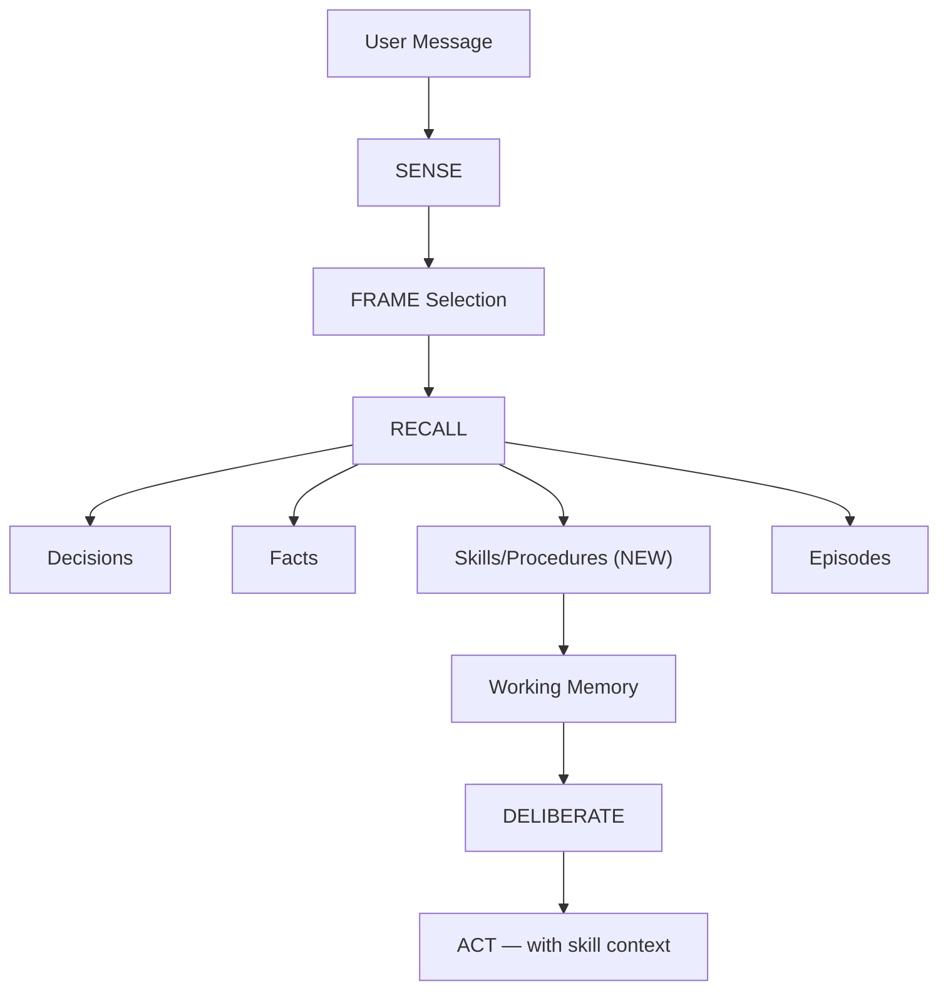
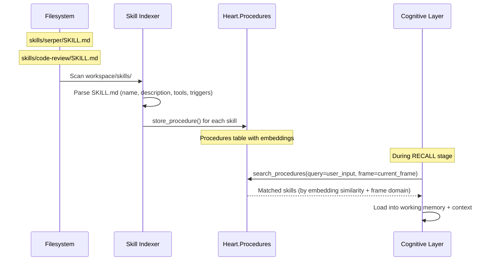

# F011 — Skill Discovery & Auto-Activation

> **Status:** Planned
> **Priority:** P1
> **Depends on:** F003 (Cognitive Layer), F002 (Heart — Procedures)
> **Estimated effort:** ~4-6 hours

## Problem

Nous has skills (code-review, serper, web tools) stored as files in the workspace, but:
- **No indexing** — skills aren't registered anywhere the cognitive loop can find them
- **No auto-activation** — the agent must manually recall skill existence from facts
- **No matching** — there's no mechanism to match incoming tasks to relevant skills
- **No loading** — skill context (instructions, tool paths, patterns) isn't injected into working memory

Currently, skill awareness depends entirely on facts learned via `learn_fact`. If the fact isn't recalled (wrong query, low similarity), the skill is invisible.

## Solution

Use the existing **Procedure** system in Heart as the skill registry. Procedures already have:
- `name`, `domain`, `description`
- `goals` (upper fringe — what it's for)
- `core_patterns`, `core_tools`, `core_concepts` (middle — transferable knowledge)
- `implementation_notes` (lower fringe — specific details)
- `activation_count`, `success_count`, `failure_count` (effectiveness tracking)
- `tags` and `embedding` for semantic search

Skills are procedures that come from the filesystem rather than being learned from experience.

## Architecture



### Skill Discovery happens at the RECALL stage

This is the natural fit because:
1. **FRAME** has already classified the task type (task, decision, debug, conversation, creative)
2. **RECALL** is where we search all memory types — adding procedures/skills is a natural extension
3. Skills load into **Working Memory** as items with high relevance
4. The **Context Engine** already has a procedures budget slot (priority 7)

### Registration Flow



## Design

### 1. Skill Manifest (SKILL.md frontmatter)

Skills already have `SKILL.md` files. Add structured frontmatter:

```yaml
---
name: serper-search
description: Google search via Serper.dev API
domain: research          # maps to procedure domain
triggers:                 # keywords/phrases that should activate this skill
  - web search
  - google
  - find online
  - research
  - look up
frames:                   # which cognitive frames auto-activate this skill
  - task
  - debug
tools:                    # tools this skill provides/enhances
  - web_search
  - web_fetch
requires:                 # dependencies
  - SERPER_API_KEY
---
```

### 2. Skill Indexer (`nous/skills/indexer.py`)

New module that:
- Scans `NOUS_WORKSPACE_DIR/skills/` on startup
- Parses SKILL.md frontmatter
- Creates/updates procedure records in Heart via `store_procedure()`
- Generates embeddings from description + triggers for semantic matching
- Re-indexes on `skill_added` / `skill_removed` events

```python
class SkillIndexer:
    """Index workspace skills as procedures in Heart."""

    async def index_all(self, workspace_dir: str) -> list[ProcedureDetail]:
        """Scan skills directory and register as procedures."""
        skills_dir = Path(workspace_dir) / "skills"
        if not skills_dir.exists():
            return []

        results = []
        for skill_dir in skills_dir.iterdir():
            if not skill_dir.is_dir():
                continue
            skill_md = skill_dir / "SKILL.md"
            if not skill_md.exists():
                continue

            manifest = self._parse_manifest(skill_md)
            procedure = await self._register_skill(manifest)
            results.append(procedure)

        return results

    def _parse_manifest(self, path: Path) -> SkillManifest:
        """Parse SKILL.md frontmatter into SkillManifest."""
        ...

    async def _register_skill(self, manifest: SkillManifest) -> ProcedureDetail:
        """Create or update procedure from skill manifest."""
        input = ProcedureInput(
            name=manifest.name,
            domain=manifest.domain,
            description=manifest.description,
            goals=manifest.triggers,          # upper fringe = when to activate
            core_tools=manifest.tools,        # middle = what tools it provides
            core_patterns=manifest.triggers,  # middle = activation patterns
            implementation_notes=[str(manifest.path)],  # lower fringe = where to find it
            tags=["skill", "filesystem"] + manifest.frames,
        )
        return await self._heart.store_procedure(input)
```

### 3. Cognitive Layer Integration (RECALL stage)

In `CognitiveLayer.pre_turn()`, after frame selection:

```python
# During RECALL — search procedures/skills by input + frame
procedures = await self._heart.search_procedures(
    query=user_input,
    domain=frame.frame_id,  # frame-based filtering
    limit=3,
)

# Load matched skills into working memory
for proc in procedures:
    await self._heart.working_memory.load_item(
        session_id=session_id,
        item=WorkingMemoryItem(
            ref_id=proc.id,
            ref_type="procedure",
            content=proc.description,
            relevance=similarity_score,
        ),
    )
```

### 4. Context Engine (procedures budget)

The context engine already has a procedures slot at priority 7. Currently unused because no procedures exist. Once skills are indexed as procedures, they'll automatically flow into context:

```python
# context.py — already implemented, just needs data
# 7. Procedures (F11: skills auto-surfaced here)
if budget.procedures > 0 and "procedure" not in skip_types:
    procedures = await self._heart.search_procedures(...)
    ...
```

### 5. Frame-Based Auto-Activation

Map frames to skill domains:

| Frame | Auto-activate skills with domain |
|-------|----------------------------------|
| task | Any matching domain |
| debug | debugging, code-review |
| decision | architecture, process |
| conversation | (none — lightweight) |
| creative | writing, design |

Skills with matching `frames` in their manifest are boosted in recall.

### 6. Effectiveness Tracking

When a skill is activated and the turn succeeds/fails:
- `success_count++` or `failure_count++` via `record_procedure_outcome()`
- Skills with low effectiveness get deprioritized in recall
- Links to episodes via `episode_procedures` table (currently empty)

## Database Impact

**No new tables.** Uses existing:
- `heart.procedures` — skill registry (currently 0 rows)
- `heart.episode_procedures` — skill-episode links (currently 0 rows)
- `heart.working_memory.items` — loaded skill context (currently always empty)

All three tables are built and waiting for data.

## Files Changed

| File | Change |
|------|--------|
| `nous/skills/__init__.py` | New package |
| `nous/skills/indexer.py` | Skill indexer (~150 lines) |
| `nous/skills/manifest.py` | SKILL.md parser (~60 lines) |
| `nous/cognitive/layer.py` | Add procedure search to RECALL stage |
| `nous/main.py` | Run skill indexer on startup |
| `tests/test_skill_indexer.py` | Tests (~200 lines) |

**Estimated:** ~410 lines new code, ~50 lines modified

## Relationship to Other Features

- **F002 Heart (Procedures)** — Skills ARE procedures. Same storage, same API.
- **F003 Cognitive Layer** — Skill discovery slots into the existing RECALL stage.
- **F005 Context Engine** — Procedures budget already allocated at priority 7.
- **F008 Memory Lifecycle** — Skills from filesystem are "permanent" (re-indexed on startup). Learned procedures from experience follow normal lifecycle.
- **v0.2.0 F011 K-Line Learning** — Learned procedures complement filesystem skills. Over time, Nous discovers its own "skills" from repeated patterns.

## Open Questions

1. Should skills be re-indexed on every startup, or only when files change (fswatch)?
2. Should the agent be able to create new skill files from learned procedures (the reverse flow)?
3. How to handle skill conflicts (two skills claim the same domain/triggers)?
4. Should skill SKILL.md content be loaded into context verbatim, or summarized?
