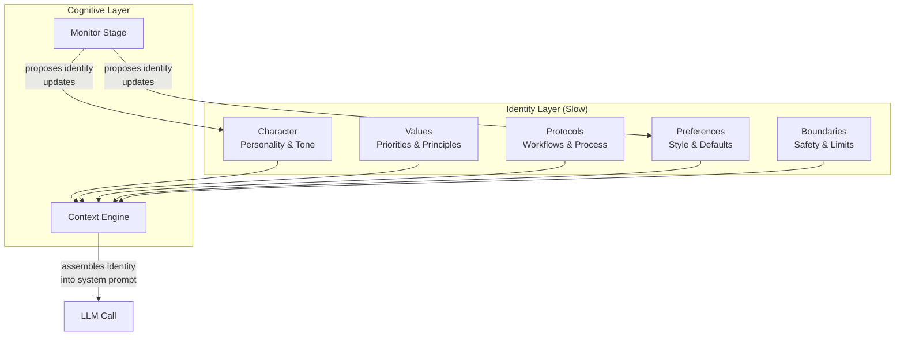
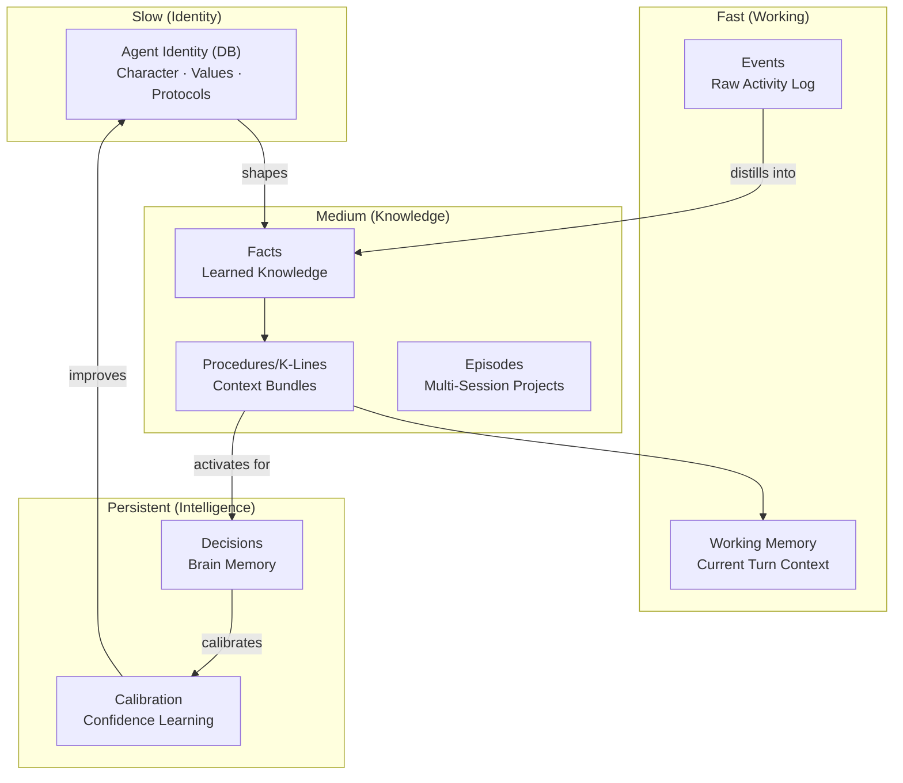

# F018 — Agent Identity

> **Status:** Planned
> **Priority:** P2
> **Depends on:** F002 (Heart), F003 (Cognitive Layer)
> **Estimated effort:** ~3-4 hours

## Problem

Nous's identity is a single env var (`NOUS_IDENTITY_PROMPT`) — a static string injected into every system prompt. This has three problems:

1. **No structure** — character, values, protocols, and preferences are all mashed into one blob
2. **No evolution** — identity can't change without restarting the container with a new env var
3. **No learning** — Nous can't update its own identity based on experience

The README's memory architecture diagram shows SOUL.md and AGENTS.md as the slow-changing identity layer, but these don't exist in Nous. The diagram is aspirational, not real.

## Solution

Replace the static identity prompt with a **DB-backed identity system** that the agent can read, use, and evolve.

### Identity as Structured Data

```
system.agent_identity
├── character     — personality traits, tone, voice
├── values        — what matters, priorities, boundaries
├── protocols     — how to work (decision process, PR workflow, etc.)
├── preferences   — formatting, tools, communication style
└── boundaries    — what NOT to do, safety constraints
```

Each section is a versioned record that can be updated independently. The cognitive layer assembles them into the system prompt at runtime.

## Architecture



## Design

### 1. New Table: `system.agent_identity`

```sql
CREATE TABLE system.agent_identity (
    id UUID PRIMARY KEY DEFAULT gen_random_uuid(),
    agent_id VARCHAR(50) NOT NULL REFERENCES system.agents(agent_id),
    section VARCHAR(50) NOT NULL,  -- character, values, protocols, preferences, boundaries
    content TEXT NOT NULL,
    version INTEGER NOT NULL DEFAULT 1,
    updated_at TIMESTAMPTZ NOT NULL DEFAULT NOW(),
    updated_by VARCHAR(50),  -- 'user', 'agent', 'system'
    previous_version_id UUID REFERENCES system.agent_identity(id),
    UNIQUE(agent_id, section, version)
);

CREATE INDEX idx_identity_agent_section ON system.agent_identity(agent_id, section);
```

### 2. Identity Manager (`nous/identity/manager.py`)

```python
class IdentityManager:
    """Manages agent identity — the slow-changing 'soul' layer."""

    SECTIONS = ["character", "values", "protocols", "preferences", "boundaries"]

    async def get_identity(self, agent_id: str) -> AgentIdentity:
        """Load current identity (latest version of each section)."""
        ...

    async def get_section(self, agent_id: str, section: str) -> IdentitySection:
        """Load a specific section."""
        ...

    async def update_section(
        self, agent_id: str, section: str, content: str, updated_by: str = "user"
    ) -> IdentitySection:
        """Update a section (creates new version, links to previous)."""
        ...

    async def get_history(self, agent_id: str, section: str) -> list[IdentitySection]:
        """Get version history for a section."""
        ...

    def assemble_prompt(self, identity: AgentIdentity) -> str:
        """Assemble identity sections into a system prompt prefix."""
        parts = []
        for section in self.SECTIONS:
            if section in identity.sections:
                parts.append(f"## {section.title()}\n{identity.sections[section].content}")
        return "\n\n".join(parts)
```

### 3. Seed from NOUS_IDENTITY_PROMPT

On first startup (no identity rows in DB):
- If `NOUS_IDENTITY_PROMPT` is set, parse it into sections and seed the DB
- If not set, use built-in defaults (same as current `config.py` default)
- After seeding, the env var becomes a fallback only — DB takes precedence

```python
async def seed_from_env(self, agent_id: str, identity_prompt: str):
    """Parse env var identity prompt into structured sections."""
    # Simple heuristic: split on markdown H2 headers
    # Or store as a single "character" section if unstructured
    existing = await self.get_identity(agent_id)
    if existing.sections:
        return  # Already seeded

    await self.update_section(
        agent_id, "character", identity_prompt, updated_by="system"
    )
```

### 4. Context Engine Integration

Replace the static identity prompt injection with a DB lookup:

```python
# context.py — build_context()

# Current (static):
system_prompt = self._identity_prompt + "\n\n" + context_sections

# New (DB-backed):
identity = await self._identity_manager.get_identity(agent_id)
identity_prompt = self._identity_manager.assemble_prompt(identity)
system_prompt = identity_prompt + "\n\n" + context_sections
```

### 5. Self-Evolution (Future)

The Monitor stage can propose identity updates based on patterns:

```python
# monitor.py — post_turn analysis

# If agent discovers a strong preference over many turns:
# e.g., "I consistently choose Python over TypeScript"
await identity_manager.update_section(
    agent_id, "preferences",
    content="...(updated preferences)...",
    updated_by="agent"
)
```

**Guardrails for self-evolution:**
- Agent can only update `preferences` and `protocols` sections
- `character`, `values`, and `boundaries` require user approval
- All changes are versioned with rollback capability
- Rate limit: max 1 identity update per day

## Updated Memory Architecture Diagram



## Files Changed

| File | Change |
|------|--------|
| `nous/identity/__init__.py` | New package |
| `nous/identity/manager.py` | IdentityManager (~120 lines) |
| `nous/identity/schemas.py` | AgentIdentity, IdentitySection models (~40 lines) |
| `nous/storage/models.py` | AgentIdentity ORM model (~20 lines) |
| `nous/cognitive/context.py` | Replace static identity with DB lookup (~10 lines) |
| `nous/main.py` | Initialize IdentityManager, seed from env (~10 lines) |
| `tests/test_identity.py` | Tests (~150 lines) |
| `README.md` | Update memory architecture diagram |

**Estimated:** ~350 lines new code, ~20 lines modified

## Migration Path

1. Add `system.agent_identity` table (Alembic migration)
2. On startup, seed from `NOUS_IDENTITY_PROMPT` if DB is empty
3. Context engine reads from DB instead of config
4. `NOUS_IDENTITY_PROMPT` becomes fallback-only (backwards compatible)
5. Future: Telegram commands to view/edit identity (`/identity`, `/identity set character ...`)

## Open Questions

1. Should identity be per-session or per-agent? (Proposed: per-agent, shared across sessions)
2. How granular should sections be? 5 sections or more fine-grained?
3. Should the agent propose identity updates via a tool call, or should Monitor detect patterns automatically?
4. How to handle identity conflicts when user and agent update the same section?
