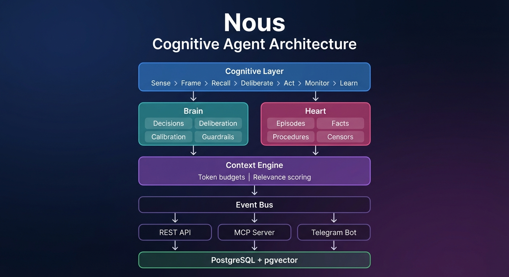

# Nous Feature Index

## v0.1.0 — "The Thinking Agent"

### P0: Core Architecture
| Feature | Name | Status | Description |
|---------|------|--------|-------------|
| F001 | [Brain Module](F001-brain-module.md) | ✅ Shipped | Decision intelligence — recording, deliberation, calibration, guardrails, graph |
| F002 | [Heart Module](F002-heart-module.md) | ✅ Shipped | Memory system — episodic, semantic, procedural, working, censors |
| F003 | [Cognitive Layer](F003-cognitive-layer.md) | ✅ Shipped | The Nous Loop — frames, recall, deliberation, monitoring, end-of-session reflection |
| F004 | [Runtime](F004-runtime.md) | ✅ Shipped | Docker container, REST API, MCP interface, Telegram bot |
| F005 | [Context Engine](F005-context-engine.md) | ✅ Shipped | Frame-adaptive context assembly (implemented as `cognitive/context.py`) |
| F006 | [Event Bus](F006-event-bus.md) | ✅ Shipped | In-process async event bus, automated handlers |

### P1: Intelligence & Measurement
| Feature | Name | Status | Description |
|---------|------|--------|-------------|
| F007 | [Metrics & Growth](F007-metrics-growth.md) | Planned | 5-level measurement framework, weekly growth reports, automatic tracking |
| F008 | [Memory Lifecycle](F008-memory-lifecycle.md) | Planned | Auto lifecycle for all memory types — confirm, trim, archive, escalate, retire, **generalize** |

### P1: Capabilities
| Feature | Name | Status | Description |
|---------|------|--------|-------------|
| F009 | [Async Subtasks](F009-async-subtasks.md) | Planned | Background task queue — parallel execution, non-blocking chat, Postgres-backed workers |
| F010 | [Memory Improvements](F010-memory-improvements.md) | ✅ Shipped | Episode summaries, clean decision descriptions, proactive fact learning, user-tagged episodes |

### P0: Identity & Context
| Feature | Name | Status | Description |
|---------|------|--------|-------------|
| F018 | [Agent Identity](F018-agent-identity.md) | ✅ Shipped | DB-backed identity — initiation protocol, versioned sections, tiered context model |

### Implementation Specs

All shipped implementation specs with PR references:

| Spec | Name | Status | PR |
|------|------|--------|-----|
| 001 | Postgres Scaffold | ✅ Shipped | #1 |
| 002 | Brain Module | ✅ Shipped | #2 |
| 003 | Heart Module | ✅ Shipped | #3 |
| 003.1 | Heart Enhancements | ✅ Shipped | #6 |
| 003.2 | Frame-Tagged Encoding | ✅ Shipped | — |
| 004 | Cognitive Layer | ✅ Shipped | #10 |
| 004.1 | CEL Guardrails | ✅ Shipped | #10 |
| 005 | Runtime (REST + MCP + Runner) | ✅ Shipped | — |
| 005.1 | Smart Context Preparation | ✅ Shipped | — |
| 005.2 | Direct API Rewrite | ✅ Shipped | #15 |
| 005.3 | Web Tools | ✅ Shipped | #16 |
| 005.4 | Streaming Responses | ✅ Shipped | #23 |
| 005.5 | Noise Reduction | ✅ Shipped | #20 |
| 006 | Event Bus | ✅ Shipped | — |
| 006.2 | Context Quality | ✅ Shipped | #31 |
| 007 | Extended Thinking | ✅ Shipped | — |
| 007.1 | Thinking Indicators | ✅ Shipped | #53 |
| 007.2 | Topic-Aware Recall | ✅ Shipped | #55 |
| 007.3 | Improve _is_informational() | ✅ Shipped | #55 |
| 007.4 | Fix Unpopulated Columns | ✅ Shipped | #55 |
| 007.5 | Recall Min Threshold | ⏸ Reverted | #59 — superseded by 008 |
| 008 | Agent Identity & Tiered Context | ✅ Shipped | #60, #61, #62 — F018 identity + tiered context + API |
| 008.1-P1 | Tool Output Pruning + Token Estimation | ✅ Shipped | #69 |
| 008.1-P2 | History Compaction Core | ✅ Shipped | #70 |
| 008.1-P3 | Durable Integration (persistence, events, knowledge extraction) | ✅ Shipped | #71 |
| 008.1-P4 | Adaptive Compaction | 📋 Specced | — |
| 008.2 | Topic-Aware Recall v2 | 📋 Specced | — full spec deferred; spike merged |
| 008.3 | Episode Summary Backfill & Lifecycle | ✅ Shipped | #79 — backfill unsummarized episodes, active flag lifecycle |
| 008.4 | Episode Summary Quality | ✅ Shipped | — enhanced prompt, candidate_facts, smart truncation, decision context |
| 008.5 | Decision Review Loop | 🏗️ In Progress | — auto-review signals, REST endpoints, calibration |
| 009.1-009.4 | Memory Lifecycle Implementation | 📦 Shelved | — system too young (53 facts, 86 episodes at time of assessment) |
| 010.1 | Health Dashboard (F007 Phase 1) | 📋 Specced | — enrich GET /status |
| — | Streaming Keepalive + Tool Timeout | ✅ Shipped | #73 — keepalive during Anthropic wait, `NOUS_TOOL_TIMEOUT` |
| — | Typing Indicator Fix | ✅ Shipped | — continuous typing via background task |
| — | Topic Persistence Spike | ✅ Shipped | #75 — `_resolve_focus_text()` follow-up detection |
| — | Deliberation Thinking Capture | ✅ Shipped | #76 — extended thinking blocks → `brain.thoughts`, garbage cleanup |
| — | Phase 1 Voice | ✅ Shipped | — 3 procedures (send_email, notify_tim, talk_to_emerson) + 2 censors |
| — | RRF Score Fix | ✅ Shipped | #64 — use original hybrid scores instead of RRF ranking |
| — | Query Deduplication Fix | ✅ Shipped | — prevent doubled query when topic = input |
| — | Tier 3 Threshold Tuning | ✅ Shipped | #66 — decision threshold 0.3→0.20 |

### Phase 2 — Quality (next to build)

| Feature | Name | Priority | Description |
|---------|------|----------|-------------|
| #38 | _is_informational() Phase 2 | P1 | Partially addressed by PR #76 (delete instead of abandon). Further tuning possible. |
| #52 | Topic-Aware Recall v2 | P1 | Spike merged (#75). Full 008.2 spec exists if spike proves insufficient. |
| F011 | [Skill Discovery](F011-skill-discovery.md) | P1 | Index workspace skills as procedures, auto-surface in RECALL based on task/frame. |
| 010.1 | Health Dashboard | P1 | Enrich GET /status with episode outcome breakdown, fact health, decision stats. |

### Phase 3 — Growth

| Feature | Name | Priority | Description |
|---------|------|----------|-------------|
| F007 | Metrics & Growth | P2 | Calibration, Brier scores, outcome tracking. Decision data now clean (27 real decisions). |
| F008 | Memory Lifecycle | P2 | Shelved — system too young. Revisit when data grows. Specs 009.1-009.4 written. |
| F012 | K-Line Learning | P2 | Auto-create procedures from repeated patterns. |
| 008.1-P4 | Adaptive Compaction | P2 | LLM-powered summarization with configurable triggers. Spec written. |

### Future

| Feature | Name | Description |
|---------|------|-------------|
| F013 | Frame Splitting | Parallel cognitive frames via sub-agents |
| F014 | Model Router | LLM portability via proxy layer |
| F015 | Growth Engine | Administrative self-improvement (Papert's Principle) |
| F016 | Multi-Agent | Nous agents sharing knowledge |
| F017 | Dashboard | Visual growth tracking and cognitive state |
| F019 | [Nous Website](F019-nous-website.md) | Developer-first open-source framework site (mem-brain.ai) |

## Stats

- **Total source:** ~32,800 lines of Python
- **Test count:** 857 tests across 46 test files
- **Database:** 16 tables across 2 schemas (brain, heart)
- **Tools:** 10 agent tools (record_decision, recall_deep, learn_fact, create_censor, store_identity, complete_initiation, bash, read_file, write_file, web_search, web_fetch)
- **Endpoints:** 17 REST endpoints + MCP server + Telegram bot
- **Feature specs:** 14 feature docs + 17 research notes
- **Voice:** 3 communication procedures (email, Telegram, A2A) + 2 censors

## Research Notes

| # | Title | Key Topic |
|---|-------|-----------|
| [001](../research/001-foundations.md) | Foundations | Problem statement, Nous hypothesis |
| [002](../research/002-minsky-mapping.md) | Minsky Mapping | 14 chapters → Nous components |
| [003](../research/003-runtime-decision.md) | Runtime Decision | Claude Agent SDK + model router |
| [004](../research/004-storage-architecture.md) | Storage Architecture | Postgres + pgvector, swappable backends |
| [005](../research/005-cognitive-layer.md) | Cognitive Layer | The seven systems |
| [006](../research/006-v01-features.md) | v0.1.0 Features | Initial feature plan |
| [007](../research/007-memory-integration.md) | Memory Integration | 5 memory types, CE integration |
| [008](../research/008-database-design.md) | Database Design | 20 tables, 3 schemas, full SQL |
| [009](../research/009-context-management.md) | Context Management | Token budgets, relevance scoring |
| [010](../research/010-summarization-strategy.md) | Summarization | 3-tier compression, episode lifecycle |
| [011](../research/011-measuring-success.md) | Measuring Success | 5-level metrics, growth reports |
| [012](../research/012-automation-pipeline.md) | Automation Pipeline | Event bus, 7 handlers, full wiring |
| [013](../research/013-langchain-memory-lessons.md) | LangChain Memory Lessons | 5 takeaways: reflection, generalization, validation, approval gates |
| [014](../research/014-group-evolving-agents.md) | GEA | Experience sharing for open-ended self-improvement |
| [015](../research/015-deep-thinking-ratio.md) | DTR | Measuring real reasoning effort, not token count |
| [016](../research/016-agent-memory-synthesis.md) | Agent Memory Synthesis | 9 papers on LLM agent memory (2025-2026) — retrieval, consolidation, generalization |

## Architecture Summary

## Database: 16 Tables, 2 Schemas

| Schema | Tables | Purpose |
|--------|--------|---------|
| `brain` (8) | decisions, decision_tags, decision_reasons, decision_bridge, thoughts, graph_edges, guardrails, calibration_snapshots | Decision intelligence |
| `heart` (8) | episodes, episode_decisions, episode_procedures, facts, procedures, censors, working_memory, conversation_state | Memory system |
