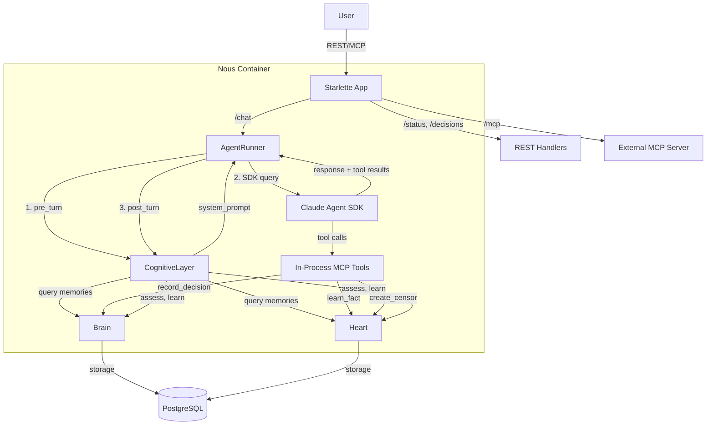

# 005: Agent Runtime — The Deployment Shell

**Status:** Shipped
**Priority:** P0 — Makes Nous actually runnable
**Estimated Effort:** 10-12 hours
**Prerequisites:** 001 (merged), 002 (merged), 003 (merged), 004-cognitive-layer (merged)
**Feature Spec:** [F004-runtime.md](../features/F004-runtime.md)

## Objective

Implement the Runtime — the deployment shell that packages Brain, Heart, and Cognitive Layer into a runnable agent with **Claude Agent SDK** integration. One `docker compose up` gives you a thinking agent with REST API, MCP external interface, persistent memory, and **in-process Brain/Heart tools**.

After this phase:
```bash
docker compose up -d
curl -X POST http://localhost:8000/chat \
  -H "Content-Type: application/json" \
  -d '{"message": "Should we use Redis for caching?"}'
```

Claude will see relevant past decisions, facts, and censors in its system prompt (guaranteed, no tool calls), and can optionally call `record_decision`, `learn_fact`, `create_censor` tools to update memory.

## Architecture



**Key Flow:**
1. **READ (automatic)**: `pre_turn()` queries Brain/Heart → builds system prompt with memories
2. **ACT**: SDK's `query()` calls Claude with system prompt + in-process MCP tools
3. **WRITE (optional)**: Claude decides to call `record_decision`, `learn_fact`, etc.
4. **LEARN**: `post_turn()` assesses turn, extracts lessons, checks for missed tool calls

## Hybrid Memory Architecture

This is the **core Nous design**:

| Operation | How | Why |
|-----------|-----|-----|
| **READ** | pre_turn builds system prompt with relevant memories | Guaranteed every turn, zero tool call overhead |
| **WRITE** | MCP tools (`record_decision`, `learn_fact`, etc.) | Claude decides when to write, only if needed |
| **Frame-conditional instructions** | System prompt includes "you MUST call record_decision" for decision frame | Ensures critical writes happen |
| **Safety net** | post_turn checks if expected tool calls happened | Can auto-record if Claude forgot |

**Example system prompt (decision frame):**
```markdown
## Active Censors
- **BLOCK:** production changes → code review required first

## Related Decisions
- [success] Used Redis for session caching (confidence: 0.85)
  Tags: architecture, caching, redis

## Required Actions
You MUST call record_decision before your final answer.
Include: description, confidence (0-1), stakes, category, at least 2 reasons.

## Memory Tools
- record_decision: Log decisions with confidence and reasoning
- learn_fact: Store new knowledge for future recall
- recall_deep: Search memory beyond your current context
- create_censor: Create a guardrail from a mistake
```

Claude sees the Redis decision WITHOUT calling any tools (READ automatic). If it decides to use Redis again, it MUST call `record_decision` (WRITE enforced by frame).

## File-by-File Specification

### 1. `nous/config.py` — Settings Updates (~40 lines added)

Add runtime and SDK-specific settings to the existing Settings class.

```python
# Add to existing Settings class:

    # Runtime
    host: str = "0.0.0.0"
    port: int = 8000

    # Anthropic Auth — two modes:
    # 1. Direct API key (pay-per-token): set ANTHROPIC_API_KEY
    # 2. Subscription token (Pro/Max plan): set ANTHROPIC_AUTH_TOKEN
    # If both set, auth_token takes precedence.
    anthropic_api_key: str = Field("", validation_alias="ANTHROPIC_API_KEY")
    anthropic_auth_token: str = Field("", validation_alias="ANTHROPIC_AUTH_TOKEN")

    # Agent identity
    agent_name: str = "Nous"
    agent_description: str = "A thinking agent that learns from experience"
    identity_prompt: str = ""  # Overridden by config file or env

    # MCP
    mcp_enabled: bool = True

    # Model
    model: str = "claude-sonnet-4-5-20250514"
    max_tokens: int = 4096

    # SDK settings
    sdk_max_turns: int = 10  # Max tool use iterations per query
    sdk_permission_mode: str = "auto"  # "auto" or "manual"
    sdk_workspace: str = "/tmp/nous-workspace"  # For Bash/Read/Write tools
    sdk_allowed_tools: list[str] = Field(
        default_factory=lambda: [
            "bash",
            "read",
            "write",
            "edit",
            "record_decision",
            "learn_fact",
            "recall_deep",
            "create_censor",
        ]
    )
```

**Notes:**
- `sdk_max_turns`: Prevents infinite tool loops (default 10)
- `sdk_permission_mode`: "auto" trusts Claude, "manual" requires HITL approval (future)
- `sdk_workspace`: Root directory for built-in file tools (isolated from Nous code)
- `sdk_allowed_tools`: Whitelist of tool names Claude can use

### 2. `nous/api/__init__.py` (~5 lines)

```python
"""Nous API — REST and MCP interfaces."""
```

### 3. `nous/api/tools.py` (~250 lines) — **NEW**

In-process MCP tools for Brain/Heart via Claude Agent SDK.

```python
"""In-process MCP tools for Brain and Heart.

Exposes 4 tools to Claude via the SDK's @tool decorator:
  record_decision — Write a decision to Brain
  learn_fact      — Write a fact to Heart
  recall_deep     — Deep search across all memory types
  create_censor   — Create a guardrail from experience

These tools run in-process (zero latency) and use the same
database session as the main transaction.
"""

import logging
from typing import Any

from claude_agent_sdk import create_sdk_mcp_server, tool

from nous.brain import Brain
from nous.brain.schemas import ReasonInput, RecordInput
from nous.heart import Heart
from nous.heart.schemas import CensorInput, FactInput

logger = logging.getLogger(__name__)


# ------------------------------------------------------------------
# Tool: record_decision
# ------------------------------------------------------------------


@tool(
    "record_decision",
    "Record a decision with confidence, reasoning, and stakes. Use when making any architecture, tooling, or process choice.",
    {
        "description": {
            "type": "string",
            "description": "What decision was made (clear, specific)",
        },
        "confidence": {
            "type": "number",
            "description": "Confidence level 0.0-1.0 (0.8+ = high confidence)",
        },
        "category": {
            "type": "string",
            "enum": ["architecture", "process", "integration", "tooling", "security"],
            "description": "Decision category",
        },
        "stakes": {
            "type": "string",
            "enum": ["low", "medium", "high", "critical"],
            "description": "How important is this decision",
        },
        "reasons": {
            "type": "array",
            "items": {
                "type": "object",
                "properties": {
                    "type": {
                        "type": "string",
                        "enum": [
                            "pattern",
                            "analysis",
                            "authority",
                            "intuition",
                            "empirical",
                            "analogy",
                            "elimination",
                            "constraint",
                        ],
                        "description": "Type of reasoning",
                    },
                    "text": {"type": "string", "description": "The reasoning itself"},
                },
                "required": ["type", "text"],
            },
            "description": "List of reasons (min 2 for quality)",
        },
        "tags": {
            "type": "array",
            "items": {"type": "string"},
            "description": "Reusable keywords (e.g. 'redis', 'caching', 'performance')",
        },
        "pattern": {
            "type": "string",
            "description": "Abstract pattern this decision represents (helps future recall)",
        },
        "context": {
            "type": "string",
            "description": "Relevant background or constraints",
        },
    },
)
async def record_decision(args: dict[str, Any]) -> dict[str, Any]:
    """Tool handler for record_decision.

    Expected to be called with (brain, heart) in closure via
    create_nous_tools(brain, heart).

    Returns MCP tool result format:
    {"content": [{"type": "text", "text": "..."}]}
    """
    # This is a placeholder — actual implementation will be in create_nous_tools()
    # which wraps the tool functions with brain/heart context.
    raise NotImplementedError("Tool must be wrapped by create_nous_tools()")


# ------------------------------------------------------------------
# Tool: learn_fact
# ------------------------------------------------------------------


@tool(
    "learn_fact",
    "Store a new fact in memory. Use when you learn something worth remembering (preferences, rules, domain knowledge).",
    {
        "content": {
            "type": "string",
            "description": "The fact to remember (clear, atomic statement)",
        },
        "category": {
            "type": "string",
            "enum": ["preference", "rule", "observation", "definition", "constraint"],
            "description": "Type of fact",
        },
        "source": {
            "type": "string",
            "description": "Where this fact came from (e.g. 'user stated', 'documentation', 'observation')",
        },
        "subject": {
            "type": "string",
            "description": "What/who this fact is about (optional, for organization)",
        },
    },
)
async def learn_fact(args: dict[str, Any]) -> dict[str, Any]:
    """Tool handler for learn_fact."""
    raise NotImplementedError("Tool must be wrapped by create_nous_tools()")


# ------------------------------------------------------------------
# Tool: recall_deep
# ------------------------------------------------------------------


@tool(
    "recall_deep",
    "Search across ALL memory types (decisions, facts, episodes, procedures) for information beyond what's in your current context.",
    {
        "query": {
            "type": "string",
            "description": "What to search for",
        },
        "memory_type": {
            "type": "string",
            "enum": ["all", "decisions", "facts", "episodes", "procedures"],
            "description": "Which memory types to search (default: all)",
        },
        "limit": {
            "type": "integer",
            "description": "Max results to return (default: 5)",
        },
    },
)
async def recall_deep(args: dict[str, Any]) -> dict[str, Any]:
    """Tool handler for recall_deep."""
    raise NotImplementedError("Tool must be wrapped by create_nous_tools()")


# ------------------------------------------------------------------
# Tool: create_censor
# ------------------------------------------------------------------


@tool(
    "create_censor",
    "Create a guardrail from a mistake or near-miss. Use when you realize a pattern should be blocked or warned about in future.",
    {
        "trigger_pattern": {
            "type": "string",
            "description": "Text pattern that should trigger this censor (e.g. 'production', 'rm -rf')",
        },
        "reason": {
            "type": "string",
            "description": "Why this is dangerous or problematic",
        },
        "action": {
            "type": "string",
            "enum": ["warn", "block", "absolute"],
            "description": "What to do when triggered (warn=log, block=prevent+require override, absolute=hard block)",
        },
        "domain": {
            "type": "string",
            "description": "Where this applies (e.g. 'deployment', 'data-deletion', 'security')",
        },
    },
)
async def create_censor(args: dict[str, Any]) -> dict[str, Any]:
    """Tool handler for create_censor."""
    raise NotImplementedError("Tool must be wrapped by create_nous_tools()")


# ------------------------------------------------------------------
# Tool factory with Brain/Heart context
# ------------------------------------------------------------------


def create_nous_tools(brain: Brain, heart: Heart):
    """Create tool functions with Brain/Heart context.

    Returns dict of tool_name -> async callable for SDK registration.
    """

    async def _record_decision(args: dict[str, Any]) -> dict[str, Any]:
        """Record decision to Brain."""
        try:
            # Parse reasons
            reasons_raw = args.get("reasons", [])
            reasons = [ReasonInput(type=r["type"], text=r["text"]) for r in reasons_raw]

            # Build RecordInput
            input_data = RecordInput(
                description=args["description"],
                confidence=args["confidence"],
                category=args["category"],
                stakes=args["stakes"],
                reasons=reasons,
                tags=args.get("tags", []),
                pattern=args.get("pattern"),
                context=args.get("context"),
            )

            # Record to Brain (no session param = auto-managed session)
            detail = await brain.record(input_data)

            return {
                "content": [
                    {
                        "type": "text",
                        "text": f"Decision recorded: {detail.id}\n"
                        f"Quality score: {detail.quality_score:.2f}\n"
                        f"Confidence: {detail.confidence:.2f}",
                    }
                ]
            }
        except Exception as e:
            logger.exception("record_decision tool failed")
            return {"content": [{"type": "text", "text": f"Error recording decision: {e}"}]}

    async def _learn_fact(args: dict[str, Any]) -> dict[str, Any]:
        """Store fact to Heart."""
        try:
            input_data = FactInput(
                content=args["content"],
                category=args["category"],
                source=args["source"],
                subject=args.get("subject"),
            )

            detail = await heart.learn(input_data)

            return {
                "content": [
                    {
                        "type": "text",
                        "text": f"Fact stored: {detail.id}\n"
                        f"Category: {detail.category}\n"
                        f"Confidence: {detail.confidence:.2f}",
                    }
                ]
            }
        except Exception as e:
            logger.exception("learn_fact tool failed")
            return {"content": [{"type": "text", "text": f"Error storing fact: {e}"}]}

    async def _recall_deep(args: dict[str, Any]) -> dict[str, Any]:
        """Search memory."""
        try:
            query = args["query"]
            memory_type = args.get("memory_type", "all")
            limit = args.get("limit", 5)

            if memory_type == "all":
                # Unified recall via Heart
                results = await heart.recall(query, limit=limit)
                lines = []
                for r in results:
                    lines.append(f"[{r.type}] {r.summary} (score: {r.score:.2f})")
                    if r.metadata:
                        meta_str = ", ".join(f"{k}={v}" for k, v in r.metadata.items() if v is not None)
                        lines.append(f"  {meta_str}")
                return {"content": [{"type": "text", "text": "\n".join(lines) if lines else "No results found."}]}

            elif memory_type == "decisions":
                results = await brain.query(query, limit=limit)
                lines = [f"[{r.outcome}] {r.description} (confidence: {r.confidence:.2f})" for r in results]
                return {"content": [{"type": "text", "text": "\n".join(lines) if lines else "No results found."}]}

            elif memory_type == "facts":
                results = await heart.search_facts(query, limit=limit)
                lines = [f"{r.content} [{r.category}] (confidence: {r.confidence:.2f})" for r in results]
                return {"content": [{"type": "text", "text": "\n".join(lines) if lines else "No results found."}]}

            elif memory_type == "episodes":
                results = await heart.search_episodes(query, limit=limit)
                lines = [f"[{r.outcome}] {r.summary} ({r.started_at.strftime('%Y-%m-%d')})" for r in results]
                return {"content": [{"type": "text", "text": "\n".join(lines) if lines else "No results found."}]}

            elif memory_type == "procedures":
                results = await heart.search_procedures(query, limit=limit)
                lines = [
                    f"{r.name} ({r.domain or 'general'}) - "
                    f"effectiveness: {r.effectiveness or 'unknown'}, "
                    f"used: {r.activation_count}x"
                    for r in results
                ]
                return {"content": [{"type": "text", "text": "\n".join(lines) if lines else "No results found."}]}

            else:
                return {"content": [{"type": "text", "text": f"Unknown memory type: {memory_type}"}]}

        except Exception as e:
            logger.exception("recall_deep tool failed")
            return {"content": [{"type": "text", "text": f"Error searching memory: {e}"}]}

    async def _create_censor(args: dict[str, Any]) -> dict[str, Any]:
        """Create censor to Heart."""
        try:
            input_data = CensorInput(
                trigger_pattern=args["trigger_pattern"],
                reason=args["reason"],
                action=args["action"],
                domain=args.get("domain"),
            )

            detail = await heart.add_censor(input_data)

            return {
                "content": [
                    {
                        "type": "text",
                        "text": f"Censor created: {detail.id}\n"
                        f"Action: {detail.action}\n"
                        f"Pattern: {detail.trigger_pattern}",
                    }
                ]
            }
        except Exception as e:
            logger.exception("create_censor tool failed")
            return {"content": [{"type": "text", "text": f"Error creating censor: {e}"}]}

    return {
        "record_decision": _record_decision,
        "learn_fact": _learn_fact,
        "recall_deep": _recall_deep,
        "create_censor": _create_censor,
    }


def create_nous_mcp_server(brain: Brain, heart: Heart):
    """Create MCP server with Nous tools for SDK integration.

    Returns server object that SDK can register as mcp_servers=[...].
    """
    tools_dict = create_nous_tools(brain, heart)

    # Create MCP server with SDK helper
    # NOTE: The SDK's create_sdk_mcp_server expects tool functions, not @tool decorated ones
    # We register the actual implementations here
    server = create_sdk_mcp_server(
        "nous",
        version="0.1.0",
        tools=list(tools_dict.values()),
    )

    return server
```

**Notes:**
- Tools are **async** and return MCP-compliant dicts
- Each tool gets Brain/Heart via closure (zero latency, in-process)
- Tools use auto-managed sessions (call `brain.record()` without session param)
- Error handling: catch exceptions, return error message as tool result
- `create_nous_mcp_server()` returns server for SDK registration

### 4. `nous/api/runner.py` (~200 lines)

Agent runner using Claude Agent SDK's `query()` for one-shot turns.

```python
"""Agent runner — executes a single conversational turn via Claude Agent SDK.

Wires CognitiveLayer.pre_turn() and post_turn() around the SDK's query()
for agentic tool use with in-process Brain/Heart tools.
"""

import logging
import os
from dataclasses import dataclass, field

from claude_agent_sdk import ClaudeAgentOptions, query

from nous.api.tools import create_nous_mcp_server
from nous.brain import Brain
from nous.cognitive import CognitiveLayer, TurnContext, TurnResult
from nous.config import Settings
from nous.heart import Heart

logger = logging.getLogger(__name__)


@dataclass
class Message:
    """A single message in a conversation."""

    role: str  # "user" or "assistant"
    content: str


@dataclass
class Conversation:
    """Tracks a multi-turn conversation."""

    session_id: str
    messages: list[Message] = field(default_factory=list)
    turn_contexts: list[TurnContext] = field(default_factory=list)


class AgentRunner:
    """Runs conversational turns with cognitive layer hooks.

    Uses Claude Agent SDK's query() with in-process MCP tools for
    Brain/Heart. CognitiveLayer handles pre_turn (context assembly)
    and post_turn (assessment, learning).
    """

    def __init__(
        self,
        cognitive: CognitiveLayer,
        brain: Brain,
        heart: Heart,
        settings: Settings,
    ) -> None:
        self._cognitive = cognitive
        self._brain = brain
        self._heart = heart
        self._settings = settings
        self._conversations: dict[str, Conversation] = {}
        self._nous_server = None

    async def start(self) -> None:
        """Initialize SDK components.

        Sets up Anthropic auth env vars (SDK reads them automatically)
        and creates the in-process MCP server for Brain/Heart tools.
        """
        # SDK reads from env vars — set them based on settings
        if self._settings.anthropic_auth_token:
            # Subscription token takes precedence
            os.environ["ANTHROPIC_AUTH_TOKEN"] = self._settings.anthropic_auth_token
        elif self._settings.anthropic_api_key:
            # Direct API key
            os.environ["ANTHROPIC_API_KEY"] = self._settings.anthropic_api_key
        else:
            raise RuntimeError(
                "No Anthropic credentials configured. " "Set ANTHROPIC_API_KEY or ANTHROPIC_AUTH_TOKEN."
            )

        # Create in-process MCP server for Nous tools
        self._nous_server = create_nous_mcp_server(self._brain, self._heart)

    async def close(self) -> None:
        """Close resources (SDK handles its own cleanup)."""
        pass

    async def run_turn(
        self,
        session_id: str,
        user_message: str,
        agent_id: str | None = None,
    ) -> tuple[str, TurnContext]:
        """Execute a single conversational turn.

        Steps:
        1. Get or create Conversation for session_id
        2. Call cognitive.pre_turn() → TurnContext (system prompt, frame, decision_id)
        3. Append user message to conversation history
        4. Call SDK query() with:
           - system_prompt from TurnContext
           - conversation history
           - in-process Nous MCP server
           - SDK options (max_turns, allowed_tools, workspace, etc.)
        5. Collect response and tool results from SDK stream
        6. Append assistant message to conversation history
        7. Build TurnResult with response + tool_results
        8. Call cognitive.post_turn() with TurnResult
        9. Return (response_text, turn_context)

        On SDK error:
        - Log the error
        - Create TurnResult with error field set
        - Still call post_turn (so monitor can assess)
        - Return error message to user
        """
        _agent_id = agent_id or self._settings.agent_id
        conversation = self._get_or_create_conversation(session_id)

        # Step 2: pre_turn
        try:
            turn_context = await self._cognitive.pre_turn(_agent_id, session_id, user_message)
        except Exception as e:
            logger.exception("pre_turn failed")
            return f"Error preparing turn: {e}", TurnContext(
                system_prompt="",
                frame=self._cognitive._frames._default_selection(),
            )

        # Step 3: append user message
        conversation.messages.append(Message(role="user", content=user_message))
        conversation.turn_contexts.append(turn_context)

        # Step 4: call SDK query()
        response_text = ""
        tool_results = []
        error = None

        try:
            # Format conversation history for SDK
            messages = self._format_messages(conversation)

            # Add frame-conditional tool instructions to system prompt
            enhanced_prompt = self._add_frame_instructions(turn_context)

            # SDK options
            options = ClaudeAgentOptions(
                system_prompt=enhanced_prompt,
                allowed_tools=self._settings.sdk_allowed_tools,
                mcp_servers=[self._nous_server],
                permission_mode=self._settings.sdk_permission_mode,
                max_turns=self._settings.sdk_max_turns,
                cwd=self._settings.sdk_workspace,
                model=self._settings.model,
                max_tokens=self._settings.max_tokens,
            )

            # Stream results from SDK
            async for event in query(
                message=user_message,
                messages=messages,
                options=options,
            ):
                # SDK yields events: text chunks, tool calls, tool results
                if event.type == "text":
                    response_text += event.content
                elif event.type == "tool_call":
                    # Tool call logged (SDK handles execution)
                    logger.info("Tool called: %s", event.tool_name)
                elif event.type == "tool_result":
                    # Tool result available
                    tool_results.append(
                        {
                            "tool_name": event.tool_name,
                            "arguments": event.arguments or {},
                            "result": event.result,
                            "error": event.error,
                        }
                    )

        except Exception as e:
            logger.exception("SDK query failed")
            error = str(e)
            response_text = f"I encountered an error: {e}"

        # Step 6: append assistant message
        conversation.messages.append(Message(role="assistant", content=response_text))

        # Step 7: build TurnResult
        from nous.cognitive.schemas import ToolResult

        turn_result = TurnResult(
            response_text=response_text,
            tool_results=[
                ToolResult(
                    tool_name=tr["tool_name"],
                    arguments=tr.get("arguments", {}),
                    result=tr.get("result"),
                    error=tr.get("error"),
                )
                for tr in tool_results
            ],
            error=error,
        )

        # Step 8: post_turn
        try:
            assessment = await self._cognitive.post_turn(_agent_id, session_id, turn_result, turn_context)

            # Safety net: check for missed tool calls
            if turn_context.frame.frame_id in ("decision", "task", "debug"):
                if turn_context.decision_id and not any(
                    tr.tool_name == "record_decision" for tr in turn_result.tool_results
                ):
                    logger.warning(
                        "Decision frame used but record_decision NOT called. "
                        "Decision %s left incomplete. "
                        "Consider auto-recording in future.",
                        turn_context.decision_id,
                    )
                    # Future: auto-record with basic description from response_text

        except Exception as e:
            logger.exception("post_turn failed")

        return response_text, turn_context

    async def end_conversation(self, session_id: str, agent_id: str | None = None) -> None:
        """End a conversation with reflection.

        1. If conversation has >= 3 turns, generate reflection:
           - Call SDK query() with conversation history + reflection prompt
           - Extract "learned: ..." lines from response
        2. Call cognitive.end_session(reflection=reflection_text)
        3. Remove from self._conversations
        """
        _agent_id = agent_id or self._settings.agent_id
        conversation = self._conversations.get(session_id)

        if conversation is None:
            logger.warning("end_conversation called for non-existent session %s", session_id)
            return

        reflection = None
        if len(conversation.messages) >= 6:  # 3+ turns (user + assistant each)
            try:
                # Generate reflection via SDK
                reflection_prompt = (
                    "Review this conversation. Summarize briefly:\n"
                    "1. What was the main task?\n"
                    "2. What went well?\n"
                    "3. What should be done differently?\n"
                    "4. List any new facts learned as 'learned: <fact>' lines (one per line)."
                )

                messages = self._format_messages(conversation)
                messages.append({"role": "user", "content": reflection_prompt})

                options = ClaudeAgentOptions(
                    system_prompt="You are reflecting on a conversation.",
                    max_turns=1,
                    model=self._settings.model,
                    max_tokens=1024,
                )

                reflection_text = ""
                async for event in query(message=reflection_prompt, messages=messages, options=options):
                    if event.type == "text":
                        reflection_text += event.content

                reflection = reflection_text

            except Exception:
                logger.warning("Reflection generation failed for session %s", session_id)

        # Call cognitive layer end_session
        await self._cognitive.end_session(_agent_id, session_id, reflection=reflection)

        # Remove from dict
        self._conversations.pop(session_id, None)

    def _get_or_create_conversation(self, session_id: str) -> Conversation:
        """Get existing or create new conversation."""
        if session_id not in self._conversations:
            self._conversations[session_id] = Conversation(session_id=session_id)
        return self._conversations[session_id]

    def _format_messages(self, conversation: Conversation) -> list[dict]:
        """Format conversation history for SDK.

        Returns list of {"role": "user"|"assistant", "content": "..."}
        Limits to last 20 messages to avoid token overflow.
        """
        limit = 20
        recent_messages = conversation.messages[-limit:]
        return [{"role": m.role, "content": m.content} for m in recent_messages]

    def _add_frame_instructions(self, turn_context: TurnContext) -> str:
        """Add frame-conditional tool instructions to system prompt.

        Decision frame: MUST call record_decision
        Task frame: Should call learn_fact for new knowledge
        Debug frame: Should call record_decision for root cause + create_censor for patterns
        All frames: List available memory tools
        """
        prompt_parts = [turn_context.system_prompt]

        frame_id = turn_context.frame.frame_id

        # Frame-specific instructions
        if frame_id == "decision":
            prompt_parts.append(
                "\n## Required Actions\n"
                "You MUST call record_decision before your final answer.\n"
                "Include: description, confidence (0-1), stakes, category, at least 2 reasons with different types."
            )
        elif frame_id == "task":
            prompt_parts.append(
                "\n## After Completing Work\n"
                "Call learn_fact for any new knowledge discovered during this task."
            )
        elif frame_id == "debug":
            prompt_parts.append(
                "\n## When You Find the Root Cause\n"
                "Call record_decision to log what you found and the fix applied.\n"
                "If the error pattern should be caught in future, call create_censor."
            )

        # Always include tool reference
        prompt_parts.append(
            "\n## Memory Tools\n"
            "- record_decision: Log decisions with confidence and reasoning\n"
            "- learn_fact: Store new knowledge for future recall\n"
            "- recall_deep: Search memory beyond your current context\n"
            "- create_censor: Create a guardrail from a mistake"
        )

        return "\n".join(prompt_parts)
```

**Notes:**
- Uses SDK's `query()` async iterator (one-shot, stateless)
- Conversation history managed in-memory (dict by session_id)
- Frame-conditional instructions added to system prompt (enforces tool use)
- Safety net in post_turn checks if expected tools were called
- Reflection generation uses SDK for >= 3 turn conversations

### 5. `nous/api/rest.py` (~250 lines)

REST API via Starlette (no changes from original spec, kept for completeness).

```python
"""REST API for Nous agent.

Endpoints:
  POST /chat              — Send message, get response
  DELETE /chat/{session}  — End conversation
  GET  /status            — Agent status + memory stats + calibration
  GET  /decisions         — List recent decisions (Brain)
  GET  /decisions/{id}    — Get decision detail
  GET  /episodes          — List recent episodes (Heart)
  GET  /facts             — Search facts (Heart)
  GET  /censors           — Active censors (Heart)
  GET  /frames            — Available frames
  GET  /calibration       — Calibration report (Brain)
  GET  /health            — Health check (DB connectivity)
"""

import logging
from uuid import uuid4

from starlette.applications import Starlette
from starlette.requests import Request
from starlette.responses import JSONResponse
from starlette.routing import Route

from nous.api.runner import AgentRunner
from nous.brain import Brain
from nous.cognitive import CognitiveLayer
from nous.config import Settings
from nous.heart import Heart
from nous.storage.database import Database

logger = logging.getLogger(__name__)


def create_app(
    runner: AgentRunner,
    brain: Brain,
    heart: Heart,
    cognitive: CognitiveLayer,
    database: Database,
    settings: Settings,
) -> Starlette:
    """Create the Starlette ASGI app with all routes."""

    async def chat(request: Request) -> JSONResponse:
        """POST /chat — Send a message, get a response."""
        try:
            body = await request.json()
            message = body.get("message")
            session_id = body.get("session_id") or str(uuid4())

            if not message:
                return JSONResponse({"error": "message required"}, status_code=400)

            response, turn_context = await runner.run_turn(session_id, message)

            return JSONResponse(
                {
                    "response": response,
                    "session_id": session_id,
                    "frame": turn_context.frame.frame_id,
                    "decision_id": turn_context.decision_id,
                }
            )
        except Exception as e:
            logger.exception("chat endpoint failed")
            return JSONResponse({"error": str(e)}, status_code=500)

    async def end_chat(request: Request) -> JSONResponse:
        """DELETE /chat/{session_id} — End a conversation."""
        try:
            session_id = request.path_params["session_id"]
            await runner.end_conversation(session_id)
            return JSONResponse({"status": "ended", "session_id": session_id})
        except Exception as e:
            logger.exception("end_chat failed")
            return JSONResponse({"error": str(e)}, status_code=500)

    async def status(request: Request) -> JSONResponse:
        """GET /status — Agent status overview."""
        try:
            calibration = await brain.get_calibration()
            async with database.session() as session:
                # Memory counts via simple SQL
                from sqlalchemy import func, select

                from nous.storage.models import Censor, Decision, Episode, Fact, Procedure

                decision_count = await session.scalar(
                    select(func.count()).select_from(Decision).where(Decision.agent_id == settings.agent_id)
                )
                fact_count = await session.scalar(
                    select(func.count()).select_from(Fact).where(Fact.agent_id == settings.agent_id)
                )
                episode_count = await session.scalar(
                    select(func.count()).select_from(Episode).where(Episode.agent_id == settings.agent_id)
                )
                procedure_count = await session.scalar(
                    select(func.count()).select_from(Procedure).where(Procedure.agent_id == settings.agent_id)
                )
                censor_count = await session.scalar(
                    select(func.count())
                    .select_from(Censor)
                    .where(Censor.agent_id == settings.agent_id, Censor.active == True)  # noqa: E712
                )

            return JSONResponse(
                {
                    "agent_id": settings.agent_id,
                    "agent_name": settings.agent_name,
                    "model": settings.model,
                    "calibration": {
                        "brierScore": calibration.brier_score,
                        "accuracy": calibration.accuracy,
                        "totalDecisions": calibration.total_decisions,
                        "reviewedCount": calibration.reviewed_count,
                    },
                    "memory": {
                        "active_conversations": len(runner._conversations),
                        "active_censors": censor_count,
                        "total_decisions": decision_count,
                        "total_facts": fact_count,
                        "total_episodes": episode_count,
                        "total_procedures": procedure_count,
                    },
                }
            )
        except Exception as e:
            logger.exception("status endpoint failed")
            return JSONResponse({"error": str(e)}, status_code=500)

    async def list_decisions(request: Request) -> JSONResponse:
        """GET /decisions?limit=20&offset=0 — Recent decisions."""
        try:
            limit = int(request.query_params.get("limit", 20))
            # For simple list, query with empty string (matches all)
            decisions = await brain.query("", limit=limit)
            return JSONResponse(
                {
                    "decisions": [
                        {
                            "id": str(d.id),
                            "description": d.description,
                            "confidence": d.confidence,
                            "category": d.category,
                            "stakes": d.stakes,
                            "outcome": d.outcome,
                            "pattern": d.pattern,
                            "tags": d.tags,
                            "created_at": d.created_at.isoformat(),
                        }
                        for d in decisions
                    ],
                    "total": len(decisions),
                }
            )
        except Exception as e:
            logger.exception("list_decisions failed")
            return JSONResponse({"error": str(e)}, status_code=500)

    async def get_decision(request: Request) -> JSONResponse:
        """GET /decisions/{id} — Decision detail."""
        try:
            from uuid import UUID

            decision_id = UUID(request.path_params["id"])
            detail = await brain.get(decision_id)
            if detail is None:
                return JSONResponse({"error": "not found"}, status_code=404)

            return JSONResponse(
                {
                    "id": str(detail.id),
                    "description": detail.description,
                    "context": detail.context,
                    "pattern": detail.pattern,
                    "confidence": detail.confidence,
                    "category": detail.category,
                    "stakes": detail.stakes,
                    "quality_score": detail.quality_score,
                    "outcome": detail.outcome,
                    "outcome_result": detail.outcome_result,
                    "reviewed_at": detail.reviewed_at.isoformat() if detail.reviewed_at else None,
                    "created_at": detail.created_at.isoformat(),
                    "tags": detail.tags,
                    "reasons": [{"type": r.type, "text": r.text} for r in detail.reasons],
                    "thoughts": [{"id": str(t.id), "text": t.text} for t in detail.thoughts],
                }
            )
        except Exception as e:
            logger.exception("get_decision failed")
            return JSONResponse({"error": str(e)}, status_code=500)

    async def list_episodes(request: Request) -> JSONResponse:
        """GET /episodes?limit=20 — Recent episodes."""
        try:
            limit = int(request.query_params.get("limit", 20))
            episodes = await heart.list_episodes(limit=limit)
            return JSONResponse(
                {
                    "episodes": [
                        {
                            "id": str(e.id),
                            "summary": e.summary,
                            "title": e.title,
                            "outcome": e.outcome,
                            "started_at": e.started_at.isoformat() if e.started_at else None,
                            "ended_at": e.ended_at.isoformat() if e.ended_at else None,
                        }
                        for e in episodes
                    ]
                }
            )
        except Exception as e:
            logger.exception("list_episodes failed")
            return JSONResponse({"error": str(e)}, status_code=500)

    async def search_facts(request: Request) -> JSONResponse:
        """GET /facts?q=query&limit=20 — Search facts."""
        try:
            query_param = request.query_params.get("q")
            if not query_param:
                return JSONResponse({"error": "q parameter required"}, status_code=400)
            limit = int(request.query_params.get("limit", 20))
            facts = await heart.search_facts(query_param, limit=limit)
            return JSONResponse(
                {
                    "facts": [
                        {
                            "id": str(f.id),
                            "content": f.content,
                            "category": f.category,
                            "subject": f.subject,
                            "confidence": f.confidence,
                            "source": f.source,
                        }
                        for f in facts
                    ]
                }
            )
        except Exception as e:
            logger.exception("search_facts failed")
            return JSONResponse({"error": str(e)}, status_code=500)

    async def list_censors(request: Request) -> JSONResponse:
        """GET /censors — Active censors."""
        try:
            censors = await heart.list_censors()
            return JSONResponse(
                {
                    "censors": [
                        {
                            "id": str(c.id),
                            "trigger_pattern": c.trigger_pattern,
                            "reason": c.reason,
                            "action": c.action,
                            "domain": c.domain,
                            "activation_count": c.activation_count,
                        }
                        for c in censors
                    ]
                }
            )
        except Exception as e:
            logger.exception("list_censors failed")
            return JSONResponse({"error": str(e)}, status_code=500)

    async def list_frames(request: Request) -> JSONResponse:
        """GET /frames — Available cognitive frames."""
        try:
            frames = await cognitive._frames.list_frames(settings.agent_id)
            return JSONResponse(
                {
                    "frames": [
                        {
                            "frame_id": f.frame_id,
                            "frame_name": f.frame_name,
                            "description": f.description,
                            "default_category": f.default_category,
                            "default_stakes": f.default_stakes,
                        }
                        for f in frames
                    ]
                }
            )
        except Exception as e:
            logger.exception("list_frames failed")
            return JSONResponse({"error": str(e)}, status_code=500)

    async def calibration(request: Request) -> JSONResponse:
        """GET /calibration — Full calibration report."""
        try:
            report = await brain.get_calibration()
            return JSONResponse(
                {
                    "brierScore": report.brier_score,
                    "accuracy": report.accuracy,
                    "totalDecisions": report.total_decisions,
                    "reviewedCount": report.reviewed_count,
                    "bins": [
                        {"binStart": b.bin_start, "binEnd": b.bin_end, "count": b.count, "accuracy": b.accuracy}
                        for b in report.bins
                    ],
                }
            )
        except Exception as e:
            logger.exception("calibration endpoint failed")
            return JSONResponse({"error": str(e)}, status_code=500)

    async def health(request: Request) -> JSONResponse:
        """GET /health — Health check."""
        try:
            async with database.session() as session:
                from sqlalchemy import text

                await session.execute(text("SELECT 1"))
            return JSONResponse({"status": "healthy"})
        except Exception as e:
            logger.exception("health check failed")
            return JSONResponse({"status": "unhealthy", "error": str(e)}, status_code=503)

    routes = [
        Route("/chat", chat, methods=["POST"]),
        Route("/chat/{session_id}", end_chat, methods=["DELETE"]),
        Route("/status", status),
        Route("/decisions", list_decisions),
        Route("/decisions/{id}", get_decision),
        Route("/episodes", list_episodes),
        Route("/facts", search_facts),
        Route("/censors", list_censors),
        Route("/frames", list_frames),
        Route("/calibration", calibration),
        Route("/health", health),
    ]

    return Starlette(routes=routes)
```

### 6. `nous/api/mcp.py` (~180 lines)

MCP server for **external** agent-to-agent communication (unchanged from original spec).

```python
"""MCP interface — lets other agents interact with Nous.

Exposes 5 tools:
  nous_chat    — Send a message, get a response
  nous_recall  — Search across all memory types
  nous_status  — Get agent status and calibration
  nous_teach   — Add a fact or procedure to Nous's memory
  nous_decide  — Ask Nous to make a decision (forces decision frame)

Uses mcp library's low-level Server + Streamable HTTP transport,
mounted at /mcp on the same Starlette app.
"""

import logging
from typing import Any

from mcp.server import Server
from mcp.server.streamable_http import StreamableHTTPSessionManager
from mcp.types import TextContent, Tool

from nous.api.runner import AgentRunner
from nous.brain import Brain
from nous.config import Settings
from nous.heart import Heart

logger = logging.getLogger(__name__)


def create_mcp_server(
    runner: AgentRunner,
    brain: Brain,
    heart: Heart,
    settings: Settings,
) -> StreamableHTTPSessionManager:
    """Create MCP server with Nous tools.

    Returns StreamableHTTPSessionManager to be mounted on Starlette.
    """

    server = Server("nous")

    @server.list_tools()
    async def list_tools() -> list[Tool]:
        return [
            Tool(
                name="nous_chat",
                description="Send a message to Nous and get a response. Nous will think about your message using its decision intelligence and memory systems.",
                inputSchema={
                    "type": "object",
                    "properties": {
                        "message": {"type": "string", "description": "Your message to Nous"},
                        "session_id": {
                            "type": "string",
                            "description": "Optional session ID for multi-turn conversations",
                        },
                    },
                    "required": ["message"],
                },
            ),
            Tool(
                name="nous_recall",
                description="Search Nous's memory for relevant information. Searches across decisions, facts, episodes, and procedures.",
                inputSchema={
                    "type": "object",
                    "properties": {
                        "query": {"type": "string", "description": "What to search for"},
                        "memory_type": {
                            "type": "string",
                            "enum": ["all", "decisions", "facts", "episodes", "procedures"],
                            "description": "Type of memory to search (default: all)",
                        },
                        "limit": {"type": "integer", "description": "Max results (default: 5)"},
                    },
                    "required": ["query"],
                },
            ),
            Tool(
                name="nous_status",
                description="Get Nous's current status: calibration accuracy, memory counts, active frames.",
                inputSchema={"type": "object", "properties": {}},
            ),
            Tool(
                name="nous_teach",
                description="Teach Nous a new fact or procedure. Facts are things to know; procedures are how-to knowledge.",
                inputSchema={
                    "type": "object",
                    "properties": {
                        "type": {
                            "type": "string",
                            "enum": ["fact", "procedure"],
                            "description": "What kind of knowledge",
                        },
                        "content": {"type": "string", "description": "The knowledge to teach"},
                        "domain": {"type": "string", "description": "Domain or category (optional)"},
                        "source": {"type": "string", "description": "Where this knowledge came from"},
                    },
                    "required": ["type", "content"],
                },
            ),
            Tool(
                name="nous_decide",
                description="Ask Nous to make a decision. Forces the decision cognitive frame for thorough analysis with guardrails, similar past decisions, and calibrated confidence.",
                inputSchema={
                    "type": "object",
                    "properties": {
                        "question": {"type": "string", "description": "The decision to make"},
                        "stakes": {
                            "type": "string",
                            "enum": ["low", "medium", "high", "critical"],
                            "description": "How important is this decision (default: medium)",
                        },
                    },
                    "required": ["question"],
                },
            ),
        ]

    @server.call_tool()
    async def call_tool(name: str, arguments: dict[str, Any]) -> list[TextContent]:
        """Route tool calls to appropriate handlers."""
        if name == "nous_chat":
            message = arguments["message"]
            session_id = arguments.get("session_id", "mcp-session")
            response, _ = await runner.run_turn(session_id, message)
            return [TextContent(type="text", text=response)]

        elif name == "nous_recall":
            query = arguments["query"]
            memory_type = arguments.get("memory_type", "all")
            limit = arguments.get("limit", 5)

            if memory_type == "all":
                results = await heart.recall(query, limit=limit)
                lines = [f"[{r.type}] {r.summary} (score: {r.score:.2f})" for r in results]
                return [TextContent(type="text", text="\n".join(lines) if lines else "No results found.")]

            elif memory_type == "decisions":
                results = await brain.query(query, limit=limit)
                lines = [f"[{r.outcome}] {r.description} (confidence: {r.confidence:.2f})" for r in results]
                return [TextContent(type="text", text="\n".join(lines) if lines else "No results found.")]

            elif memory_type == "facts":
                results = await heart.search_facts(query, limit=limit)
                lines = [f"{r.content} [{r.category}] (confidence: {r.confidence:.2f})" for r in results]
                return [TextContent(type="text", text="\n".join(lines) if lines else "No results found.")]

            elif memory_type == "episodes":
                results = await heart.search_episodes(query, limit=limit)
                lines = [f"[{r.outcome}] {r.summary}" for r in results]
                return [TextContent(type="text", text="\n".join(lines) if lines else "No results found.")]

            elif memory_type == "procedures":
                results = await heart.search_procedures(query, limit=limit)
                lines = [f"{r.name} ({r.domain or 'general'})" for r in results]
                return [TextContent(type="text", text="\n".join(lines) if lines else "No results found.")]

            else:
                return [TextContent(type="text", text=f"Unknown memory type: {memory_type}")]

        elif name == "nous_status":
            calibration = await brain.get_calibration()
            status_text = (
                f"Agent: {settings.agent_name} ({settings.agent_id})\n"
                f"Model: {settings.model}\n"
                f"Calibration: {calibration.brier_score:.3f} Brier, "
                f"{calibration.accuracy:.1%} accuracy ({calibration.reviewed_count}/{calibration.total_decisions} reviewed)"
            )
            return [TextContent(type="text", text=status_text)]

        elif name == "nous_teach":
            from nous.heart.schemas import FactInput, ProcedureInput

            teach_type = arguments["type"]
            content = arguments["content"]
            domain = arguments.get("domain")
            source = arguments.get("source", "mcp")

            if teach_type == "fact":
                input_data = FactInput(
                    content=content,
                    category="rule",
                    source=source,
                )
                fact = await heart.learn(input_data)
                return [TextContent(type="text", text=f"Fact stored: {fact.id}")]

            elif teach_type == "procedure":
                input_data = ProcedureInput(
                    name=content[:100],
                    description=content,
                    domain=domain or "general",
                )
                proc = await heart.store_procedure(input_data)
                return [TextContent(type="text", text=f"Procedure stored: {proc.id}")]

            else:
                return [TextContent(type="text", text=f"Unknown type: {teach_type}")]

        elif name == "nous_decide":
            question = arguments["question"]
            # Force decision frame by prepending "Should we:"
            if not question.lower().startswith("should"):
                question = f"Should we: {question}"

            response, turn_context = await runner.run_turn("mcp-decide-session", question)
            decision_info = ""
            if turn_context.decision_id:
                decision_info = f"\n\nDecision ID: {turn_context.decision_id}"
            return [TextContent(type="text", text=response + decision_info)]

        else:
            return [TextContent(type="text", text=f"Unknown tool: {name}")]

    # Create session manager
    session_manager = StreamableHTTPSessionManager(server)
    return session_manager
```

### 7. `nous/main.py` (~140 lines)

Entry point — wires everything together.

```python
"""Nous agent entry point.

Initializes all components and starts the server:
  Settings → Database → EmbeddingProvider → Brain → Heart → 
  CognitiveLayer → Runner → App → Uvicorn
"""

import asyncio
import logging
import sys

import uvicorn
from starlette.routing import Mount

from nous.api.mcp import create_mcp_server
from nous.api.rest import create_app
from nous.api.runner import AgentRunner
from nous.brain import Brain
from nous.brain.embeddings import EmbeddingProvider
from nous.cognitive import CognitiveLayer
from nous.config import Settings
from nous.heart import Heart
from nous.storage.database import Database

logger = logging.getLogger(__name__)


async def create_components(settings: Settings) -> tuple:
    """Initialize all components in dependency order.

    Returns (database, embedding_provider, brain, heart, cognitive, runner).

    1. Database — connection pool
    2. EmbeddingProvider — shared by Brain and Heart
    3. Brain — decision intelligence
    4. Heart — memory system (shares embedding provider, owns_embeddings=False)
    5. CognitiveLayer — orchestrator
    6. AgentRunner — SDK integration + LLM calls
    """
    database = Database(settings)
    await database.initialize()

    embedding_provider = None
    if settings.openai_api_key:
        embedding_provider = EmbeddingProvider(
            api_key=settings.openai_api_key,
            model=settings.embedding_model,
            dimensions=settings.embedding_dimensions,
        )

    brain = Brain(database, settings, embedding_provider)
    # Heart shares embedding provider, so set owns_embeddings=False
    heart = Heart(database, settings, embedding_provider, owns_embeddings=False)
    cognitive = CognitiveLayer(brain, heart, settings, settings.identity_prompt)
    runner = AgentRunner(cognitive, brain, heart, settings)
    await runner.start()

    return database, embedding_provider, brain, heart, cognitive, runner


async def shutdown(database, embedding_provider, brain, heart, runner) -> None:
    """Graceful shutdown in reverse order."""
    logger.info("Shutting down Nous...")
    await runner.close()
    await heart.close()  # Won't close embedding_provider (owns_embeddings=False)
    await brain.close()  # Will close embedding_provider
    await database.close()
    logger.info("Nous shutdown complete.")


def build_app(
    runner: AgentRunner,
    brain: Brain,
    heart: Heart,
    cognitive: CognitiveLayer,
    database: Database,
    settings: Settings,
) -> object:
    """Build the combined Starlette app with REST + MCP.

    REST routes mounted at /
    MCP server mounted at /mcp
    """
    app = create_app(runner, brain, heart, cognitive, database, settings)

    if settings.mcp_enabled:
        mcp_manager = create_mcp_server(runner, brain, heart, settings)
        # Mount MCP routes
        app.routes.append(Mount("/mcp", app=mcp_manager.handle_request))

    return app


def main() -> None:
    """Entry point — parse settings, build app, run server."""
    settings = Settings()

    # Configure logging
    logging.basicConfig(
        level=getattr(logging, settings.log_level.upper(), logging.INFO),
        format="%(asctime)s %(name)s %(levelname)s %(message)s",
    )

    logger.info("Starting Nous agent: %s (%s)", settings.agent_name, settings.agent_id)
    logger.info("Model: %s", settings.model)
    logger.info("Database: %s:%s/%s", settings.db_host, settings.db_port, settings.db_name)
    logger.info("MCP: %s", "enabled" if settings.mcp_enabled else "disabled")
    logger.info("SDK max_turns: %s", settings.sdk_max_turns)
    logger.info("SDK workspace: %s", settings.sdk_workspace)

    # Build components synchronously for uvicorn
    loop = asyncio.new_event_loop()
    database, embedding_provider, brain, heart, cognitive, runner = loop.run_until_complete(
        create_components(settings)
    )
    loop.close()

    app = build_app(runner, brain, heart, cognitive, database, settings)

    # Register shutdown
    import atexit

    atexit.register(lambda: asyncio.run(shutdown(database, embedding_provider, brain, heart, runner)))

    uvicorn.run(
        app,
        host=settings.host,
        port=settings.port,
        log_level=settings.log_level,
    )


if __name__ == "__main__":
    main()
```

**Notes:**
- EmbeddingProvider is shared between Brain and Heart
- Heart created with `owns_embeddings=False` to avoid double-close
- Brain created with `owns_embeddings=True` (default) to handle cleanup
- Runner.start() sets up SDK auth env vars and creates in-process MCP server

### 8. `Dockerfile` (~30 lines)

```dockerfile
FROM python:3.12-slim

WORKDIR /app

# Install system dependencies
# Note: Claude Agent SDK includes Claude Code CLI binary
RUN apt-get update && apt-get install -y --no-install-recommends \
    postgresql-client \
    curl \
    && rm -rf /var/lib/apt/lists/*

# Install Python dependencies
COPY pyproject.toml .
RUN pip install --no-cache-dir -e ".[runtime]"

# Copy source
COPY nous/ nous/
COPY sql/ sql/

# Create SDK workspace directory
RUN mkdir -p /tmp/nous-workspace && chmod 777 /tmp/nous-workspace

HEALTHCHECK --interval=30s --timeout=10s \
  CMD curl -f http://localhost:8000/health || exit 1

EXPOSE 8000

CMD ["python", "-m", "nous.main"]
```

**Notes:**
- Claude Agent SDK includes the Claude Code CLI binary (no separate install)
- SDK workspace created at `/tmp/nous-workspace` for built-in file tools
- Standard Python 3.12 slim base image

### 9. `docker-compose.yml` — Updated (~55 lines)

```yaml
services:
  nous:
    build: .
    container_name: nous-agent
    ports:
      - "${NOUS_PORT:-8000}:8000"
    environment:
      # Database
      - DB_HOST=postgres
      - DB_PORT=5432
      - DB_USER=nous
      - DB_PASSWORD=${DB_PASSWORD:-nous_dev_password}
      - DB_NAME=nous
      
      # Anthropic auth (set ONE of these)
      - ANTHROPIC_API_KEY=${ANTHROPIC_API_KEY:-}
      - ANTHROPIC_AUTH_TOKEN=${ANTHROPIC_AUTH_TOKEN:-}
      
      # Embeddings (optional)
      - OPENAI_API_KEY=${OPENAI_API_KEY:-}
      
      # Agent config
      - NOUS_AGENT_ID=${NOUS_AGENT_ID:-nous-default}
      - NOUS_AGENT_NAME=${NOUS_AGENT_NAME:-Nous}
      - NOUS_MODEL=${NOUS_MODEL:-claude-sonnet-4-5-20250514}
      - NOUS_LOG_LEVEL=${NOUS_LOG_LEVEL:-info}
      - NOUS_MCP_ENABLED=${NOUS_MCP_ENABLED:-true}
      
      # SDK settings
      - NOUS_SDK_MAX_TURNS=${NOUS_SDK_MAX_TURNS:-10}
      - NOUS_SDK_PERMISSION_MODE=${NOUS_SDK_PERMISSION_MODE:-auto}
      - NOUS_SDK_WORKSPACE=${NOUS_SDK_WORKSPACE:-/tmp/nous-workspace}
    depends_on:
      postgres:
        condition: service_healthy
    restart: unless-stopped

  postgres:
    image: pgvector/pgvector:pg17
    container_name: nous-postgres
    environment:
      POSTGRES_DB: nous
      POSTGRES_USER: nous
      POSTGRES_PASSWORD: ${DB_PASSWORD:-nous_dev_password}
    volumes:
      - pgdata:/var/lib/postgresql/data
      - ./sql/init.sql:/docker-entrypoint-initdb.d/001-init.sql
      - ./sql/seed.sql:/docker-entrypoint-initdb.d/002-seed.sql
    ports:
      - "${DB_PORT:-5432}:5432"
    healthcheck:
      test: ["CMD-SHELL", "pg_isready -U nous"]
      interval: 5s
      timeout: 5s
      retries: 5

volumes:
  pgdata:
```

### 10. `pyproject.toml` — Updated dependencies

```toml
[project]
name = "nous"
version = "0.1.0"
requires-python = ">=3.12"
dependencies = [
    "sqlalchemy[asyncio]>=2.0",
    "asyncpg>=0.30",
    "pydantic>=2.10",
    "pydantic-settings>=2.7",
    "cel-python>=0.1.8",
]

[project.optional-dependencies]
runtime = [
    "uvicorn>=0.30,<1.0",
    "starlette>=0.40,<1.0",
    "mcp>=1.0,<2.0",
    "claude-agent-sdk>=0.1.0",  # SDK for Claude Code integration
]
dev = [
    "pytest>=8.0",
    "pytest-asyncio>=0.24",
    "ruff>=0.8",
]

[tool.ruff]
line-length = 120
target-version = "py312"

[tool.ruff.lint]
select = ["E", "F", "I"]
ignore = ["E501"]

[tool.pytest.ini_options]
asyncio_mode = "auto"
```

**Notes:**
- `claude-agent-sdk` added to runtime dependencies
- SDK provides Claude Code CLI, in-process MCP tools, and agentic loop
- No more direct httpx dependency for LLM calls

### 11. `.env.example` — Updated

```env
# DB connection — shared by docker-compose AND Python app
DB_HOST=localhost
DB_PORT=5432
DB_USER=nous
DB_PASSWORD=nous_dev_password
DB_NAME=nous

# LLM — set ONE of these:
# Direct API key (pay-per-token)
ANTHROPIC_API_KEY=your_anthropic_key_here
# OR subscription token (Claude Pro/Max plan API access)
# ANTHROPIC_AUTH_TOKEN=your_subscription_token_here

# Embeddings (optional — keyword-only search if omitted)
OPENAI_API_KEY=your_openai_key_here

# Agent
NOUS_AGENT_ID=nous-default
NOUS_AGENT_NAME=Nous
NOUS_MODEL=claude-sonnet-4-5-20250514
NOUS_LOG_LEVEL=info
NOUS_MCP_ENABLED=true
NOUS_PORT=8000

# SDK settings
NOUS_SDK_MAX_TURNS=10
NOUS_SDK_PERMISSION_MODE=auto  # "auto" or "manual"
NOUS_SDK_WORKSPACE=/tmp/nous-workspace
```

## Test Specification

### `tests/test_runner.py` (~200 lines)

```python
# Uses pytest-asyncio and mocks for SDK query()

# test_run_turn_basic — sends message, gets response, returns (text, context)
# test_run_turn_creates_conversation — new session_id creates Conversation
# test_run_turn_appends_messages — conversation history grows each turn
# test_run_turn_calls_pre_turn — cognitive.pre_turn() called with input
# test_run_turn_calls_post_turn — cognitive.post_turn() called with result
# test_run_turn_with_tool_calls — SDK returns tool results, post_turn sees them
# test_run_turn_sdk_error — SDK raises exception → error message returned, post_turn still called
# test_run_turn_history_capped — messages capped at 20
# test_run_turn_frame_instructions_added — decision frame → system prompt contains "MUST call record_decision"
# test_run_turn_safety_net — decision frame + no record_decision tool call → warning logged
# test_end_conversation — removes from dict, calls cognitive.end_session()
# test_end_conversation_with_reflection — >= 3 turns → reflection generated via SDK
# test_end_conversation_nonexistent — doesn't error
# test_start_with_api_key — ANTHROPIC_API_KEY env var set
# test_start_with_auth_token — ANTHROPIC_AUTH_TOKEN env var set
# test_start_with_both — auth_token takes precedence
# test_start_with_neither — RuntimeError raised

# Mock fixture: MockCognitiveLayer that returns preset TurnContext
# Mock fixture: patch claude_agent_sdk.query to yield mock events (text, tool_call, tool_result)
```

### `tests/test_tools.py` (~180 lines) — **NEW**

```python
# Tests each in-process MCP tool function directly

# test_create_nous_tools — creates dict with 4 tool functions
# test_record_decision_success — calls brain.record, returns success message
# test_record_decision_validation_error — invalid confidence → error message
# test_record_decision_brain_error — brain.record raises → error message
# test_learn_fact_success — calls heart.learn, returns success message
# test_learn_fact_duplicate — heart.learn deduplicates → still success
# test_recall_deep_all — searches all memory types, merges via RRF
# test_recall_deep_decisions — searches brain only
# test_recall_deep_facts — searches heart.search_facts only
# test_recall_deep_empty — no results → "No results found."
# test_create_censor_success — calls heart.add_censor, returns success message
# test_create_censor_invalid_action — invalid action enum → error message

# Fixtures: pre-seeded DB with decisions, facts, episodes, procedures
# Fixture: Brain and Heart instances
```

### `tests/test_rest.py` (~220 lines)

```python
# Uses Starlette TestClient (httpx-based, no server needed).

# test_chat_basic — POST /chat → 200, response has message + session_id + frame
# test_chat_with_session — POST /chat with session_id → same session reused
# test_chat_decision_frame — input triggers decision frame → decision_id returned
# test_end_chat — DELETE /chat/{session} → 200
# test_status — GET /status → agent info + calibration + memory counts
# test_list_decisions — GET /decisions → list with total
# test_get_decision — GET /decisions/{id} → detail
# test_get_decision_not_found — GET /decisions/{bad_id} → 404
# test_list_episodes — GET /episodes → list
# test_search_facts — GET /facts?q=test → results
# test_search_facts_no_query — GET /facts → 400
# test_list_censors — GET /censors → active censors
# test_list_frames — GET /frames → 6 frames
# test_calibration — GET /calibration → report
# test_health — GET /health → healthy
# test_health_db_down — GET /health with broken DB → unhealthy

# Fixtures: pre-seeded DB with decisions, facts, episodes, censors
# Fixture: MockAgentRunner that returns canned responses
```

### `tests/test_mcp.py` (~150 lines)

```python
# Tests external MCP tool handlers directly (call_tool function).

# test_nous_chat — calls runner.run_turn, returns response
# test_nous_recall_all — searches brain + heart, merges results
# test_nous_recall_decisions — brain.query only
# test_nous_recall_facts — heart.facts.search only
# test_nous_status — returns calibration + counts
# test_nous_teach_fact — creates fact via heart.learn
# test_nous_teach_procedure — creates procedure via heart.procedures.store
# test_nous_decide — forces decision frame, calls runner.run_turn
# test_nous_decide_auto_prepends — doesn't start with "should" → prepends "Should we:"

# Fixtures: pre-seeded DB, MockAgentRunner
```

## Key Design Decisions

### D1: Starlette over FastAPI
Less magic, fewer dependencies, sufficient for our use case. We don't need automatic OpenAPI docs or Pydantic request validation (we do it manually). Easier to mount MCP alongside REST.

### D2: Claude Agent SDK (not raw httpx)
The SDK gives us:
- **Agentic tool loop** — Claude can call tools, see results, call more tools (up to max_turns)
- **Built-in tools** — Bash, Read, Write, Edit (standard toolkit)
- **In-process MCP** — zero latency Brain/Heart tools via `@tool` decorator
- **Hooks** — pre/post tool use (future enhancement)
- **Stateless query()** — we manage conversation history ourselves

This is MORE aligned with Nous philosophy than raw API calls — the SDK handles the tool orchestration loop, we handle the cognitive layer (pre/post turn hooks, context assembly, assessment, learning).

### D3: In-memory conversation state
Conversations live in a dict, not in the database. This is fine for v0.1.0 (single-instance). Persistent conversation state is a future feature. Episode tracking in Heart already captures the important bits.

### D4: Combined REST + MCP on single port
One port (8000) serves both REST (/) and MCP (/mcp). Simpler deployment than separate ports. MCP clients connect to `http://host:8000/mcp`.

### D5: Graceful shutdown via atexit
Not perfect (doesn't handle SIGKILL), but sufficient for Docker's SIGTERM → 10s grace. Uvicorn handles SIGTERM; atexit runs on clean exit.

### D6: MCP `nous_decide` forces decision frame
When another agent asks Nous to decide something, it should always use the full decision machinery (guardrails, similar decisions, deliberation). The decision frame is forced by prepending "Should we:" if not already a question.

### D7: No authentication for v0.1.0
The REST API and MCP server have no auth. This is a local/dev deployment. Auth is a future feature (API keys, JWT, or MCP auth extension).

### D8: Runtime dependencies are optional
`uvicorn`, `starlette`, `mcp`, `claude-agent-sdk` are in `[project.optional-dependencies] runtime`, not core deps. You can use Brain/Heart/Cognitive as a library without installing the server.

### D9: End-of-session reflection via SDK (from research/013)
When `end_conversation()` is called and the conversation has ≥ 3 turns, the Runner makes ONE additional SDK query() call to generate a reflection. The prompt asks for structured output with "learned: X" lines. This reflection is passed to `CognitiveLayer.end_session(reflection=...)` for fact extraction. Short conversations (< 3 turns) skip this to avoid waste.

**Reflection prompt template:**
```
Review this conversation. Summarize briefly:
1. What was the main task?
2. What went well?
3. What should be done differently?
4. List any new facts learned as "learned: <fact>" lines (one per line).
```

### D10: Dual Anthropic auth — API key and subscription token
Support both `ANTHROPIC_API_KEY` (direct pay-per-token via SDK) and `ANTHROPIC_AUTH_TOKEN` (Pro/Max subscription via SDK). The SDK reads these env vars automatically. If both are set, we set `ANTHROPIC_AUTH_TOKEN` (subscription takes precedence). Runner validates at startup that at least one is configured.

### D11: Frame-conditional tool instructions in system prompt
The ContextEngine builds the base system prompt (identity, censors, memories, frame description). The Runner **adds** frame-specific tool instructions:
- **Decision frame**: "You MUST call record_decision before your final answer."
- **Task frame**: "Call learn_fact for any new knowledge discovered during this task."
- **Debug frame**: "Call record_decision for root cause. Call create_censor if pattern should be blocked."
- **All frames**: List available memory tools

This ensures Claude knows when tool use is **required** vs **optional**, without modifying the CognitiveLayer (which is tool-agnostic).

### D12: post_turn safety net for missed tool calls
In `runner.run_turn()`, after calling `cognitive.post_turn()`, we check if the frame was decision/task/debug and a decision_id exists but NO `record_decision` tool was called. If so, log a warning. In future, we can auto-record a basic decision with description from response_text.

This prevents silent data loss when Claude forgets to call the required tool.

### D13: In-process MCP tools for Brain/Heart (zero latency)
The `@tool` decorator + `create_sdk_mcp_server()` pattern gives us MCP tools that run **in the same process** as the agent. No network calls, no serialization overhead. Tools use the same database session pool and can participate in transactions.

This is FASTER and SIMPLER than external MCP servers for core memory operations. External MCP (api/mcp.py) is for OTHER agents to talk to Nous.

### D14: SDK workspace isolated from Nous code
The built-in file tools (Bash, Read, Write, Edit) operate in `sdk_workspace` (default `/tmp/nous-workspace`). This is isolated from the Nous source code directory to prevent accidental modification of agent code.

Future enhancement: mount a user-specific workspace directory for persistent file access.

## Error Handling

- All REST handlers wrapped in try/except → return JSONResponse with error details
- MCP tool calls wrapped in try/except → return TextContent with error message
- In-process MCP tools (Brain/Heart) wrapped in try/except → return {"content": [{"type": "text", "text": "Error: ..."}]}
- Runner SDK errors → create TurnResult with error, still call post_turn
- Component initialization failure in main.py → log error, exit(1)
- DB connectivity failure in /health → return {"status": "unhealthy"}

## Migration Notes

- **docker-compose.yml is replaced** — new version adds `nous` service with SDK env vars
- **pyproject.toml updated** — `claude-agent-sdk` added to runtime group
- **.env.example updated** — new SDK settings (max_turns, workspace, permission_mode)
- **No schema changes** — all tables exist from 001-postgres-scaffold
- **New `nous/api/` directory** — 4 new files (runner.py, rest.py, mcp.py, tools.py)
- **New `nous/main.py`** — entry point
- **New `Dockerfile`** — builds the container with SDK
- **Runner.start() replaces httpx client setup** — now sets SDK env vars and creates in-process MCP server
- **CognitiveLayer unchanged** — pre_turn/post_turn contract is the same, no LLM calls in cognitive layer

## Future Enhancements

### P1: Multi-turn ClaudeSDKClient for persistent sessions
The SDK provides `ClaudeSDKClient` for stateful multi-turn conversations. We currently use stateless `query()` and manage history ourselves. Migrating to `ClaudeSDKClient` would:
- Eliminate manual conversation history management
- Enable SDK-side message buffering and compression
- Support streaming responses with backpressure

Blocked on: testing stateful client with our pre_turn/post_turn hooks.

### P2: Tool use hooks via HookMatcher
The SDK provides `HookMatcher` for pre/post tool use hooks. We could use this to:
- Log all tool calls to Brain (for audit trail)
- Auto-extract facts from tool results
- Implement HITL approval gates for high-stakes tool calls

Blocked on: HookMatcher API stabilization.

### P3: Persistent conversation state in DB
Currently conversations live in-memory (dict). For multi-instance deployment, we need:
- `nous_system.conversations` table
- Store messages + turn_contexts
- Load on first message, persist on each turn
- Evict after idle timeout

Blocked on: multi-instance deployment need.

### P4: HITL approval gates (from research/013)
LangChain requires human approval for all memory edits. We skip this for v0.1.0. For v0.2.0:
- Censors with action="block" queue for approval
- New procedures queue for approval
- REST API `/pending-approvals` endpoint
- Heart modules add `requires_approval` flag

Blocked on: approval queue design.

### P5: Auto-record safety net implementation
Currently we LOG a warning when expected tool call is missed. Future:
- Auto-record basic decision with description from response_text
- Confidence = 0.5 (low, since not deliberate)
- Reasoning = ["type: elimination", "text: Auto-recorded by safety net"]
- Tag = "auto-recorded"

This ensures no decision is lost, even if Claude forgets.

## Testing Strategy

1. **Unit tests** — test each tool function in isolation (test_tools.py)
2. **Integration tests** — test runner with mocked SDK (test_runner.py)
3. **API tests** — test REST endpoints with TestClient (test_rest.py)
4. **MCP tests** — test external MCP handlers (test_mcp.py)
5. **E2E test** — docker compose up, send real requests via curl (manual for v0.1.0)

## Deployment Checklist

- [ ] Set `ANTHROPIC_API_KEY` or `ANTHROPIC_AUTH_TOKEN` in .env
- [ ] Set `OPENAI_API_KEY` in .env (optional, for embeddings)
- [ ] Set `DB_PASSWORD` to something secure
- [ ] Run `docker compose up -d`
- [ ] Check `docker compose logs nous` for startup errors
- [ ] Test health: `curl http://localhost:8000/health`
- [ ] Test chat: `curl -X POST http://localhost:8000/chat -H "Content-Type: application/json" -d '{"message": "Hello"}'`
- [ ] Check decision was recorded: `curl http://localhost:8000/decisions`
- [ ] Monitor calibration: `curl http://localhost:8000/calibration`

## Success Criteria

✅ `docker compose up` starts Nous agent with no errors
✅ POST /chat returns response + records decision (for decision frame)
✅ GET /status shows calibration metrics
✅ In-process MCP tools (record_decision, learn_fact) execute in <50ms
✅ Frame-conditional instructions appear in system prompt
✅ post_turn safety net detects missed tool calls
✅ End-of-session reflection extracts facts from conversations
✅ External MCP server allows other agents to query Nous
✅ All tests pass (unit, integration, API, MCP)
