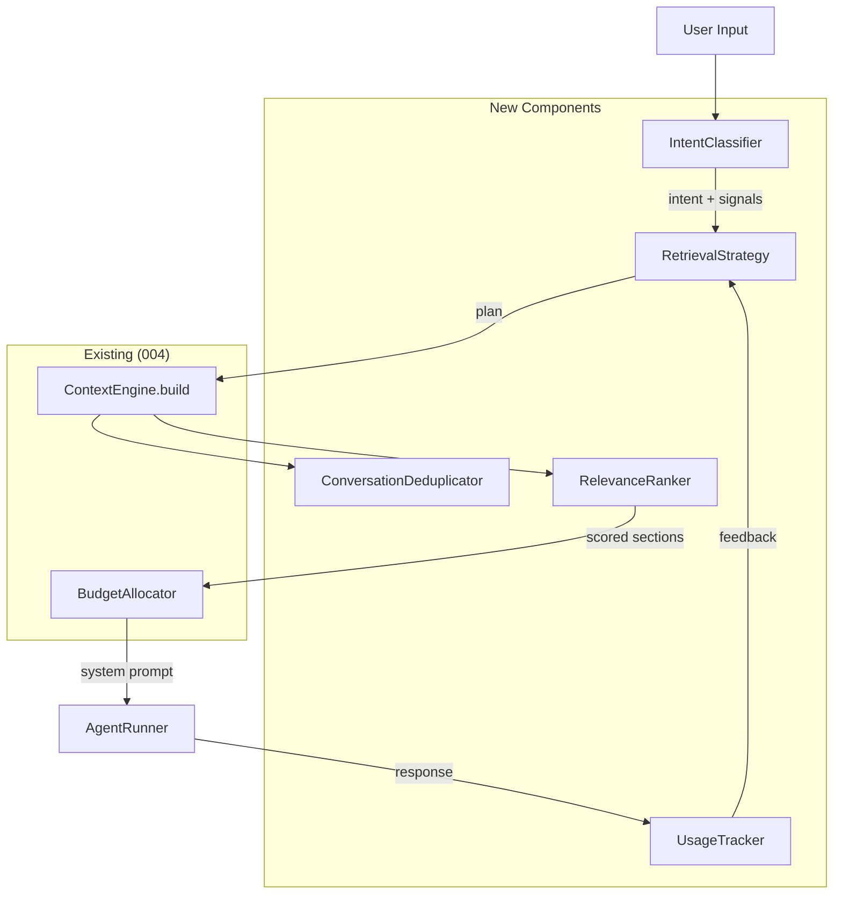

# 005.1: Smart Context Preparation

**Status:** Shipped
**Priority:** P1 — Directly improves agent quality per turn
**Estimated Effort:** 6-8 hours
**Prerequisites:** 004-cognitive-layer (merged), 005-runtime (in progress)
**Feature Spec:** [F003-cognitive-layer.md](../features/F003-cognitive-layer.md)

## Objective

Upgrade the ContextEngine from "retrieve everything, truncate to budget" to **intent-aware, feedback-driven context assembly**. The current engine queries all memory types uniformly for every input. This wastes tokens on irrelevant context and misses relevant context that doesn't keyword-match.

After this phase:
- Context retrieval is **guided by intent classification** — different inputs trigger different retrieval strategies
- Memories that **actually get used** are tracked, creating a feedback loop that improves retrieval over time
- **Conversation deduplication** prevents re-injecting facts the user just said
- **Layered injection** separates always-on context from on-demand recall tools

## Problem Statement

The current `ContextEngine.build()` has three weaknesses:

1. **Uniform retrieval**: Every input triggers the same 8 queries (decisions, facts, procedures, episodes...) regardless of whether the input is "hello" or "should we switch to Redis?"
2. **No feedback loop**: Retrieved memories that the agent never references are wasted tokens. There's no signal to improve retrieval next time.
3. **No deduplication**: If the user says "I decided to use Postgres yesterday," the engine may still inject 3 Postgres-related decisions that just echo what's already in the conversation.

## Architecture



## Design Decisions

### D1: Intent Classification is Pattern Matching, Not LLM

The IntentClassifier uses keyword patterns + frame selection output. No LLM call — the Cognitive Layer stays LLM-free (established in 004).

**Intent signals extracted:**
- Frame type (from FrameEngine — already computed in pre_turn)
- Entity mentions (names, project names, dates — regex extraction)
- Temporal signals ("yesterday", "last week", "recently" → recency bias)
- Memory-type hints ("what did I decide" → Brain focus, "how do I" → procedure focus)
- Question vs statement (questions need retrieval; statements may need dedup)

### D2: Retrieval Strategies Are Declarative, Not Hardcoded

Each intent maps to a `RetrievalPlan` — a declarative spec of what to query and how much budget to allocate. This is data, not code.

```python
@dataclass
class RetrievalPlan:
    """Declarative retrieval specification."""
    queries: list[RetrievalQuery]  # What to fetch
    budget_overrides: dict[str, int]  # Override ContextBudget fields
    dedup_against_conversation: bool = True
    max_results_per_type: dict[str, int] | None = None
```

### D3: Usage Tracking is Lightweight — Keyword Overlap, Not LLM

To determine if retrieved context was "used," compare the agent's response against injected context sections using keyword overlap (Jaccard similarity on lemmatized tokens). Threshold: ≥0.15 overlap = "referenced." This is a cheap heuristic that's good enough for feedback — not a precise attribution.

### D4: Deduplication Uses Embedding Similarity Against Conversation Window

Before injecting a retrieved memory, check its embedding against the last N messages in the conversation. If similarity > 0.85, skip it (the information is already present). Uses the same embedding provider as Heart/Brain — no extra model.

### D5: Feedback Decays Over Time

Usage tracking stores a `usage_score` per memory that decays exponentially (half-life: 7 days). Recently-useful memories get priority; old usage signals fade. This prevents the system from permanently biasing toward memories that were useful once.

### D6: On-Demand Recall Tool Supplements Pre-loaded Context

Not all context should be pre-loaded. The Runtime (005) exposes a `recall_context(query: str, memory_type: str)` tool that the agent can invoke mid-turn for deep dives. Pre-loaded context is the summary; the tool provides full detail. This extends the existing `ContextEngine.expand()` method.

### D7: Conversation Window Size is Configurable Per Frame

Decision frames need more conversation history (to understand the full problem statement). Conversation frames need less (just the last few turns). Default window sizes:

| Frame | Conversation Window (turns) |
|-------|-----------------------------|
| conversation | 3 |
| question | 5 |
| task | 5 |
| decision | 8 |
| creative | 4 |
| debug | 6 |

## Implementation

### File: `nous/cognitive/intent.py` (~120 lines)

```python
"""Intent classification for context retrieval."""

from __future__ import annotations

import re
from dataclasses import dataclass, field

from nous.cognitive.schemas import FrameSelection


@dataclass
class IntentSignals:
    """Extracted signals from user input."""

    frame_type: str
    entity_mentions: list[str] = field(default_factory=list)
    temporal_recency: float = 0.0  # 0=no signal, 1=strong recency
    memory_type_hints: dict[str, float] = field(default_factory=dict)
    is_question: bool = False
    is_greeting: bool = False
    topic_keywords: list[str] = field(default_factory=list)


@dataclass
class RetrievalQuery:
    """Single retrieval operation."""

    memory_type: str  # "decision", "fact", "procedure", "episode"
    query_text: str
    limit: int = 5
    recency_weight: float = 0.0  # 0=pure relevance, 1=pure recency


@dataclass
class RetrievalPlan:
    """Declarative retrieval specification."""

    queries: list[RetrievalQuery] = field(default_factory=list)
    budget_overrides: dict[str, int] = field(default_factory=dict)
    dedup_against_conversation: bool = True
    max_results_per_type: dict[str, int] | None = None
    skip_types: set[str] = field(default_factory=set)


# Patterns for temporal signals
_RECENCY_PATTERNS = [
    (r"\b(today|just now|right now|currently)\b", 1.0),
    (r"\b(yesterday|recently|this week)\b", 0.8),
    (r"\b(last week|few days ago)\b", 0.5),
    (r"\b(last month|a while ago)\b", 0.3),
]

# Patterns for memory type hints
_MEMORY_HINTS = {
    "decision": [r"\b(decid|decision|chose|choice|should we|recommend)\b"],
    "fact": [r"\b(what is|tell me about|fact|know about|definition)\b"],
    "procedure": [r"\b(how (do|to|can)|steps|process|workflow|guide)\b"],
    "episode": [r"\b(last time|when did|history|story|what happened)\b"],
}


class IntentClassifier:
    """Extract intent signals from user input. No LLM — pattern matching only."""

    _GREETING_PATTERNS = re.compile(
        r"^(hey|hi|hello|sup|yo|good morning|good evening|what'?s up)\b",
        re.IGNORECASE,
    )

    def classify(self, input_text: str, frame: FrameSelection) -> IntentSignals:
        """Classify input into retrieval-relevant signals."""
        signals = IntentSignals(frame_type=frame.frame_id)

        # Greeting detection
        signals.is_greeting = bool(self._GREETING_PATTERNS.match(input_text.strip()))

        # Question detection
        signals.is_question = input_text.strip().endswith("?") or bool(
            re.match(r"^(what|where|when|why|how|who|which|can|should|is|are|do|does)\b", input_text, re.IGNORECASE)
        )

        # Temporal recency
        for pattern, weight in _RECENCY_PATTERNS:
            if re.search(pattern, input_text, re.IGNORECASE):
                signals.temporal_recency = max(signals.temporal_recency, weight)

        # Memory type hints
        for mem_type, patterns in _MEMORY_HINTS.items():
            for pattern in patterns:
                if re.search(pattern, input_text, re.IGNORECASE):
                    signals.memory_type_hints[mem_type] = signals.memory_type_hints.get(mem_type, 0) + 0.5

        # Topic keywords (nouns — crude extraction: capitalized words + long words)
        words = re.findall(r"\b[A-Z][a-z]+\b|\b\w{6,}\b", input_text)
        signals.topic_keywords = list(set(w.lower() for w in words))[:10]

        return signals

    def plan_retrieval(self, signals: IntentSignals) -> RetrievalPlan:
        """Map intent signals to a retrieval plan."""

        # Greetings: minimal retrieval
        if signals.is_greeting:
            return RetrievalPlan(
                queries=[],
                skip_types={"decision", "fact", "procedure", "episode"},
                budget_overrides={"decisions": 0, "facts": 0, "procedures": 0, "episodes": 0},
            )

        plan = RetrievalPlan()
        query_text = " ".join(signals.topic_keywords) if signals.topic_keywords else ""

        # If strong memory type hints, bias toward those types
        if signals.memory_type_hints:
            dominant = max(signals.memory_type_hints, key=signals.memory_type_hints.get)
            # Double the limit for the dominant type, halve others
            for mem_type in ["decision", "fact", "procedure", "episode"]:
                limit = 8 if mem_type == dominant else 3
                plan.queries.append(
                    RetrievalQuery(
                        memory_type=mem_type,
                        query_text=query_text,
                        limit=limit,
                        recency_weight=signals.temporal_recency,
                    )
                )
        else:
            # Default: use frame-based allocation (existing behavior)
            for mem_type in ["decision", "fact", "procedure", "episode"]:
                plan.queries.append(
                    RetrievalQuery(
                        memory_type=mem_type,
                        query_text=query_text,
                        limit=5,
                        recency_weight=signals.temporal_recency,
                    )
                )

        # Frame-based overrides
        if signals.frame_type == "conversation":
            plan.budget_overrides = {"decisions": 500, "facts": 500, "procedures": 0, "episodes": 0}
        elif signals.frame_type == "decision":
            plan.budget_overrides = {"decisions": 3500, "procedures": 2000}

        return plan
```

### File: `nous/cognitive/usage_tracker.py` (~100 lines)

```python
"""Track which retrieved context the agent actually references."""

from __future__ import annotations

import math
import re
from collections import defaultdict
from dataclasses import dataclass, field
from datetime import datetime, timezone


@dataclass
class UsageRecord:
    """Single usage observation for a memory item."""

    memory_id: str
    memory_type: str
    retrieved_at: datetime
    was_referenced: bool
    overlap_score: float = 0.0


@dataclass
class MemoryUsageStats:
    """Aggregated usage stats for a memory item."""

    memory_id: str
    memory_type: str
    times_retrieved: int = 0
    times_referenced: int = 0
    usage_score: float = 0.0  # Decayed score
    last_retrieved: datetime | None = None


class UsageTracker:
    """Tracks context usage for feedback-driven retrieval.

    Stores in-memory for now (DB persistence in future iteration).
    Half-life: 7 days — usage signal decays to 50% after a week.
    """

    HALF_LIFE_DAYS = 7.0

    def __init__(self) -> None:
        self._records: list[UsageRecord] = []
        self._stats: dict[str, MemoryUsageStats] = {}

    def record_retrieval(
        self,
        memory_id: str,
        memory_type: str,
        was_referenced: bool,
        overlap_score: float = 0.0,
    ) -> None:
        """Record that a memory was retrieved and whether it was referenced."""
        now = datetime.now(timezone.utc)
        self._records.append(
            UsageRecord(
                memory_id=memory_id,
                memory_type=memory_type,
                retrieved_at=now,
                was_referenced=was_referenced,
                overlap_score=overlap_score,
            )
        )
        # Update aggregate stats
        if memory_id not in self._stats:
            self._stats[memory_id] = MemoryUsageStats(
                memory_id=memory_id, memory_type=memory_type
            )
        stats = self._stats[memory_id]
        stats.times_retrieved += 1
        if was_referenced:
            stats.times_referenced += 1
        stats.last_retrieved = now
        stats.usage_score = self._compute_decayed_score(memory_id)

    def get_usage_score(self, memory_id: str) -> float:
        """Get current decayed usage score for a memory."""
        if memory_id not in self._stats:
            return 0.0
        return self._compute_decayed_score(memory_id)

    def get_boost_factor(self, memory_id: str) -> float:
        """Get retrieval boost factor based on usage history.

        Returns 1.0 for unknown memories (no boost/penalty).
        > 1.0 for frequently-referenced memories.
        < 1.0 for frequently-retrieved but rarely-referenced memories.
        """
        stats = self._stats.get(memory_id)
        if stats is None or stats.times_retrieved < 2:
            return 1.0
        ref_rate = stats.times_referenced / stats.times_retrieved
        # Scale: 0% referenced → 0.5x, 50% → 1.0x, 100% → 1.5x
        return 0.5 + ref_rate

    def _compute_decayed_score(self, memory_id: str) -> float:
        """Compute usage score with exponential decay."""
        now = datetime.now(timezone.utc)
        score = 0.0
        for record in self._records:
            if record.memory_id != memory_id:
                continue
            age_days = (now - record.retrieved_at).total_seconds() / 86400
            decay = math.exp(-0.693 * age_days / self.HALF_LIFE_DAYS)
            value = 1.0 if record.was_referenced else 0.0
            score += value * decay
        return score

    @staticmethod
    def compute_overlap(context_text: str, response_text: str) -> float:
        """Compute Jaccard similarity between context and response.

        Crude but fast — tokenize on word boundaries, compare sets.
        """
        ctx_words = set(re.findall(r"\b\w{3,}\b", context_text.lower()))
        resp_words = set(re.findall(r"\b\w{3,}\b", response_text.lower()))
        if not ctx_words or not resp_words:
            return 0.0
        intersection = ctx_words & resp_words
        union = ctx_words | resp_words
        return len(intersection) / len(union)
```

### File: `nous/cognitive/dedup.py` (~70 lines)

```python
"""Conversation deduplication for context assembly."""

from __future__ import annotations

from dataclasses import dataclass

from nous.brain.embeddings import EmbeddingProvider


@dataclass
class DeduplicationResult:
    """Result of dedup check for a single memory item."""

    memory_id: str
    content: str
    max_similarity: float  # Highest similarity against conversation messages
    is_redundant: bool  # True if similarity > threshold


class ConversationDeduplicator:
    """Check retrieved memories against recent conversation to avoid redundancy.

    If a retrieved memory is >85% similar to something already in the
    conversation window, skip it — the information is already present.
    """

    DEFAULT_THRESHOLD = 0.85

    def __init__(
        self,
        embedding_provider: EmbeddingProvider | None = None,
        threshold: float = DEFAULT_THRESHOLD,
    ) -> None:
        self._embeddings = embedding_provider
        self._threshold = threshold

    async def check(
        self,
        memories: list[tuple[str, str]],  # (memory_id, content)
        conversation_messages: list[str],
    ) -> list[DeduplicationResult]:
        """Check each memory against conversation messages.

        If no embedding provider, falls back to keyword overlap.
        """
        if not memories or not conversation_messages:
            return [
                DeduplicationResult(mid, content, 0.0, False)
                for mid, content in memories
            ]

        results = []
        if self._embeddings is not None:
            # Embed conversation messages
            conv_embeddings = [
                await self._embeddings.embed(msg)
                for msg in conversation_messages
            ]
            for mid, content in memories:
                mem_emb = await self._embeddings.embed(content)
                max_sim = max(
                    self._cosine_similarity(mem_emb, ce)
                    for ce in conv_embeddings
                )
                results.append(
                    DeduplicationResult(mid, content, max_sim, max_sim > self._threshold)
                )
        else:
            # Fallback: keyword overlap
            from nous.cognitive.usage_tracker import UsageTracker

            for mid, content in memories:
                max_overlap = max(
                    UsageTracker.compute_overlap(content, msg)
                    for msg in conversation_messages
                )
                results.append(
                    DeduplicationResult(mid, content, max_overlap, max_overlap > 0.5)
                )
        return results

    @staticmethod
    def _cosine_similarity(a: list[float], b: list[float]) -> float:
        """Cosine similarity between two vectors."""
        dot = sum(x * y for x, y in zip(a, b))
        norm_a = sum(x * x for x in a) ** 0.5
        norm_b = sum(x * x for x in b) ** 0.5
        if norm_a == 0 or norm_b == 0:
            return 0.0
        return dot / (norm_a * norm_b)
```

### Changes to `nous/cognitive/context.py` (~60 lines changed)

Update `ContextEngine.build()` to accept and use the new components:

```python
async def build(
    self,
    agent_id: str,
    session_id: str,
    input_text: str,
    frame: FrameSelection,
    session: AsyncSession | None = None,
    *,
    conversation_messages: list[str] | None = None,
    retrieval_plan: RetrievalPlan | None = None,
    usage_tracker: UsageTracker | None = None,
) -> tuple[str, list[ContextSection]]:
    """Build system prompt + context sections within budget.

    New parameters:
    - conversation_messages: Recent messages for deduplication (D4)
    - retrieval_plan: Intent-driven retrieval plan (D2). Falls back to default.
    - usage_tracker: Feedback tracker for boost/penalty (D3).
    """
```

Key changes inside `build()`:
1. If `retrieval_plan` has `skip_types`, skip those sections entirely
2. Apply `budget_overrides` from plan on top of frame defaults
3. After retrieval, run `ConversationDeduplicator.check()` to filter redundant items
4. Apply `usage_tracker.get_boost_factor()` to re-rank retrieved items
5. Return memory IDs in `TurnContext.recalled_*_ids` for post-turn tracking

### Changes to `nous/cognitive/layer.py` (~30 lines changed)

Update `CognitiveLayer.pre_turn()` to use IntentClassifier:

```python
async def pre_turn(self, agent_id, session_id, input_text, *, session=None, conversation_messages=None):
    # 1. Select frame (existing)
    frame = await self._frames.select(input_text, session=session)

    # 2. NEW: Classify intent and plan retrieval
    signals = self._intent_classifier.classify(input_text, frame)
    plan = self._intent_classifier.plan_retrieval(signals)

    # 3. Build context with plan (enhanced)
    system_prompt, sections = await self._context.build(
        agent_id, session_id, input_text, frame,
        session=session,
        conversation_messages=conversation_messages,
        retrieval_plan=plan,
        usage_tracker=self._usage_tracker,
    )
    ...
```

Update `CognitiveLayer.post_turn()` to record usage:

```python
async def post_turn(self, turn_context, turn_result, *, session=None):
    # Existing: assess, learn censors, deliberation
    ...
    # NEW: Track which retrieved memories were referenced
    if self._usage_tracker and turn_context.recalled_decision_ids:
        for mid in turn_context.recalled_decision_ids:
            overlap = UsageTracker.compute_overlap(
                self._get_section_content(mid, turn_context),
                turn_result.response_text,
            )
            self._usage_tracker.record_retrieval(
                memory_id=mid,
                memory_type="decision",
                was_referenced=overlap >= 0.15,
                overlap_score=overlap,
            )
    # Same for facts, episodes, procedures...
```

### Changes to `nous/cognitive/schemas.py` (~15 lines)

Add `conversation_window` to `ContextBudget` (D7):

```python
class ContextBudget(BaseModel):
    """Token allocation for context assembly."""
    # ... existing fields ...
    conversation_window: int = 5  # Number of turns to include for dedup

    @classmethod
    def for_frame(cls, frame_id: str) -> ContextBudget:
        budgets = {
            "conversation": cls(total=3000, ..., conversation_window=3),
            "question": cls(total=6000, ..., conversation_window=5),
            "task": cls(total=8000, conversation_window=5),
            "decision": cls(total=12000, ..., conversation_window=8),
            "creative": cls(total=6000, ..., conversation_window=4),
            "debug": cls(total=10000, ..., conversation_window=6),
        }
        return budgets.get(frame_id, cls())
```

Add recalled IDs to `TurnContext` for tracking (already has `recalled_decision_ids` and `recalled_fact_ids` — extend with procedures/episodes):

```python
class TurnContext(BaseModel):
    recalled_decision_ids: list[str] = Field(default_factory=list)
    recalled_fact_ids: list[str] = Field(default_factory=list)
    recalled_procedure_ids: list[str] = Field(default_factory=list)  # NEW
    recalled_episode_ids: list[str] = Field(default_factory=list)   # NEW
```

## Tests

### File: `tests/test_intent.py` (~80 lines)

| Test | What it verifies |
|------|-----------------|
| `test_greeting_detection` | "hey" → is_greeting=True, skip all memory types |
| `test_question_detection` | "should we use Redis?" → is_question=True |
| `test_temporal_recency` | "yesterday" → temporal_recency=0.8 |
| `test_memory_type_hints_decision` | "what did I decide" → hints decision |
| `test_memory_type_hints_procedure` | "how do I deploy" → hints procedure |
| `test_plan_greeting_skips_all` | Greeting plan has empty queries |
| `test_plan_decision_frame_budget` | Decision frame → decisions budget 3500 |
| `test_plan_hint_biased_limits` | Dominant type gets limit=8, others get 3 |

### File: `tests/test_usage_tracker.py` (~60 lines)

| Test | What it verifies |
|------|-----------------|
| `test_record_and_score` | Recording referenced memory → positive score |
| `test_decay_over_time` | Score decays by ~50% after 7 days |
| `test_boost_factor_referenced` | >50% ref rate → boost >1.0 |
| `test_boost_factor_ignored` | 0% ref rate → 0.5x penalty |
| `test_overlap_computation` | Jaccard on known inputs |
| `test_unknown_memory_neutral` | Unknown ID → boost 1.0 |

### File: `tests/test_dedup.py` (~50 lines)

| Test | What it verifies |
|------|-----------------|
| `test_no_dedup_without_messages` | Empty conversation → nothing filtered |
| `test_redundant_memory_filtered` | Memory matching conversation → is_redundant=True |
| `test_novel_memory_kept` | Unrelated memory → is_redundant=False |
| `test_fallback_keyword_overlap` | No embeddings → keyword-based dedup |

### File: `tests/test_context_smart.py` (~70 lines)

| Test | What it verifies |
|------|-----------------|
| `test_greeting_minimal_context` | "hey" → near-empty system prompt |
| `test_decision_frame_expanded_budget` | Decision frame gets more decision tokens |
| `test_dedup_removes_redundant` | Redundant facts stripped from output |
| `test_usage_boost_reranks` | High-usage memory ranked above low-usage |

## Migration & Backward Compatibility

All new parameters in `build()` and `pre_turn()` are **optional with defaults**. Without them, behavior is identical to 004. This is purely additive:

- `conversation_messages=None` → no dedup
- `retrieval_plan=None` → default uniform retrieval
- `usage_tracker=None` → no boost/penalty

The Runtime (005) will pass these parameters. Existing tests pass unchanged.

## Future Enhancements (Not in Scope)

1. **DB-persisted usage stats** — Currently in-memory; lost on restart. Add a `memory_usage` table when usage patterns prove valuable.
2. **Embedding-based intent classification** — If pattern matching proves too crude, use embedding similarity against intent exemplars (still no LLM call).
3. **Adaptive budget learning** — Instead of fixed per-frame budgets, learn optimal allocations from usage feedback over time.
4. **Cross-session usage transfer** — Usage stats from one session informing another (requires agent-level persistence).
5. **Attention-weighted dedup** — Instead of binary "redundant/not", reduce token allocation for partially-redundant memories.

## Summary

| Component | Lines (est.) | New File? |
|-----------|-------------|-----------|
| `intent.py` | ~120 | ✅ |
| `usage_tracker.py` | ~100 | ✅ |
| `dedup.py` | ~70 | ✅ |
| `context.py` changes | ~60 | Modified |
| `layer.py` changes | ~30 | Modified |
| `schemas.py` changes | ~15 | Modified |
| `test_intent.py` | ~80 | ✅ |
| `test_usage_tracker.py` | ~60 | ✅ |
| `test_dedup.py` | ~50 | ✅ |
| `test_context_smart.py` | ~70 | ✅ |
| **Total** | **~655** | |

Three new files, three modified files, four test files. All backward compatible.
