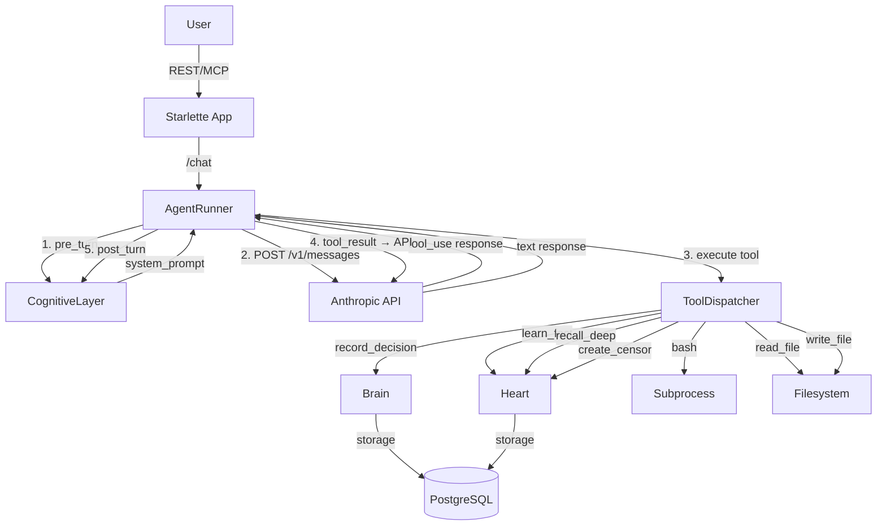

# 005.2: Direct Anthropic API — Replace Claude Agent SDK

**Status:** Shipped (PR #15)
**Priority:** P0 — Fixes auth + Docker reliability
**Estimated Effort:** 3-4 hours
**Prerequisites:** 005-runtime (shipped)
**Replaces:** Claude Agent SDK (`claude-agent-sdk` dependency)

## Motivation

The Claude Agent SDK bundles a 224MB Claude Code CLI binary and spawns it as a subprocess. This causes:

1. **Auth incompatibility** — OAuth/setup-token auth fails with `"OAuth authentication is currently not supported"` when the bundled CLI calls the API. API key works but prevents Max subscription usage.
2. **In-process MCP crash** — `create_sdk_mcp_server` causes `CLIConnectionError: ProcessTransport is not ready for writing` in Docker containers. The subprocess dies before the MCP handshake completes.
3. **Heavyweight** — 224MB binary, Node.js subprocess overhead, opaque error handling.
4. **Version fragility** — PyPI has v0.1.38 but we pinned `>=0.1.39`. SDK is pre-1.0 and unstable.

OpenClaw calls the Anthropic API directly via HTTP and handles setup-token auth correctly. Nous should do the same.

## Architecture



**Key change:** No subprocess. Direct HTTP to `https://api.anthropic.com/v1/messages`. Tool loop handled in Python.

## Design Decisions

### D1: Auth Header Selection
```python
if settings.anthropic_auth_token:
    headers["Authorization"] = f"Bearer {settings.anthropic_auth_token}"
else:
    headers["x-api-key"] = settings.anthropic_api_key
```
Auth token (setup-token / Max subscription) takes precedence. Same pattern as current runner, but now it actually works because we control the HTTP call.

### D2: Tool Loop is Explicit
The Anthropic API returns `stop_reason: "tool_use"` when the model wants to call tools. We loop:
1. Send messages → API
2. If `stop_reason == "tool_use"`, extract tool calls from response
3. Execute each tool via `ToolDispatcher`
4. Append `tool_result` messages
5. Send again → API
6. Repeat until `stop_reason == "end_turn"` or max turns reached

This is ~40 lines of loop logic. The SDK wrapped this in ~1000 lines of subprocess management.

### D3: ToolDispatcher — Registry Pattern
```python
class ToolDispatcher:
    """Routes tool calls to handler functions."""
    
    def __init__(self):
        self._handlers: dict[str, Callable] = {}
    
    def register(self, name: str, handler: Callable, schema: dict):
        self._handlers[name] = handler
        self._schemas[name] = schema
    
    async def dispatch(self, name: str, args: dict) -> str:
        handler = self._handlers.get(name)
        if not handler:
            return json.dumps({"error": f"Unknown tool: {name}"})
        return json.dumps(await handler(args))
    
    def tool_definitions(self) -> list[dict]:
        """Returns tool definitions for the API request."""
        return [{"name": n, "description": ..., "input_schema": s} 
                for n, s in self._schemas.items()]
```

Tools are registered at startup. Adding new tools (bash, read, write) = register a handler + schema.

### D4: Built-in Tools as First-Class Citizens
SDK gave us Bash/Read/Write for free. Now we implement them ourselves with **full control**:

| Tool | Handler | Safety |
|------|---------|--------|
| `bash` | `asyncio.create_subprocess_shell` | Configurable timeout, working dir, env filtering |
| `read_file` | `aiofiles.open` | Path validation, size limits |
| `write_file` | `aiofiles.open` | Path validation, directory restrictions |
| `web_search` | `httpx` to search API | Optional, disabled by default |
| `web_fetch` | `httpx.get` + readability | Optional, disabled by default |

**Advantage over SDK:** We can restrict tools per-frame. A `conversation` frame might only get Nous tools (record_decision, learn_fact). A `problem_solving` frame gets bash + file tools too.

### D5: Frame-Gated Tool Access
```python
FRAME_TOOLS: dict[str, list[str]] = {
    "conversation": ["record_decision", "learn_fact", "recall_deep", "create_censor"],
    "question": ["recall_deep", "web_search", "web_fetch"],
    "decision": ["record_decision", "recall_deep", "create_censor", "bash", "read_file"],
    "problem_solving": ["*"],  # All tools
    "creative": ["learn_fact", "recall_deep", "write_file"],
}
```
The active frame (from CognitiveLayer) determines which tools are sent in the API request. This is a Minsky-inspired administrative control — the frame manager decides what agents are available.

### D6: httpx.AsyncClient with Connection Pooling
```python
self._http = httpx.AsyncClient(
    base_url="https://api.anthropic.com",
    headers={...},  # Auth headers
    timeout=httpx.Timeout(connect=10, read=120, write=10, pool=10),
    limits=httpx.Limits(max_connections=10, max_keepalive_connections=5),
)
```
Single client instance, reused across requests. Connection pooling for free. Created at startup, closed on shutdown.

### D7: Max Turns Safety
```python
max_turns: int = 10  # Config setting, replaces sdk_max_turns
```
Hard limit on tool loop iterations. Prevents runaway tool loops. Each iteration = one API round-trip with tool results.

### D8: Streaming Support (Future-Ready)
Initial implementation uses non-streaming (`await client.post`). The response structure supports easy migration to streaming later:
```python
# Non-streaming (v1)
response = await self._http.post("/v1/messages", json=payload)

# Streaming (future)
async with self._http.stream("POST", "/v1/messages", json={**payload, "stream": True}) as r:
    async for line in r.aiter_lines():
        ...
```

### D9: Prompt Caching Support
Direct API access enables Anthropic prompt caching (system prompt + conversation history):
```python
# Mark system prompt for caching
messages_payload = {
    "system": [{"type": "text", "text": system_prompt, "cache_control": {"type": "ephemeral"}}],
    "messages": messages,
}
```
The SDK/CLI managed its own caching. Now we control it explicitly — significant cost savings for long conversations.

### D10: Error Handling — No More TaskGroup
Direct API errors are simple HTTP status codes:
- 401 → Auth error (clear message)
- 429 → Rate limited (retry with backoff)
- 500/529 → Server error (retry once)
- Timeout → Configurable, clear error

No more opaque `ExceptionGroup: unhandled errors in a TaskGroup (1 sub-exception)`.

## Files Changed

### Modified
| File | Change |
|------|--------|
| `nous/api/runner.py` | Replace `_call_sdk()` with `_call_api()`, add `_tool_loop()`, init `httpx.AsyncClient` |
| `nous/api/tools.py` | Remove `create_nous_mcp_server()`, SDK imports. Keep closures. Add `ToolDispatcher` class |
| `nous/config.py` | Remove `sdk_*` settings. Add `max_turns`, `api_base_url`, `api_timeout` |
| `pyproject.toml` | Remove `claude-agent-sdk` from deps. Add `aiofiles` to optional |
| `Dockerfile` | Shrinks ~224MB (no bundled CLI) |
| `docker-compose.yml` | Remove SDK env vars |

### New
| File | Purpose |
|------|---------|
| `nous/api/builtin_tools.py` | `bash`, `read_file`, `write_file` handlers (~150 lines) |

### Deleted
| File | Reason |
|------|--------|
| (nothing deleted) | `tools.py` refactored in place |

## Implementation Plan

### Phase A: API Client + Auth (~1h)
1. Add `httpx.AsyncClient` to `AgentRunner.__init__`
2. Implement auth header selection (D1)
3. Add `_call_api()` method — single API call, parse response
4. Add config settings (`max_turns`, `api_base_url`, `api_timeout`)

### Phase B: Tool Loop (~1h)
1. Implement `ToolDispatcher` class in `tools.py`
2. Register existing Nous tools (record_decision, learn_fact, recall_deep, create_censor)
3. Implement `_tool_loop()` in runner — iterate until `end_turn` or max turns
4. Wire into `chat()` replacing `_call_sdk()`

### Phase C: Built-in Tools (~1h)
1. Create `builtin_tools.py` with `bash`, `read_file`, `write_file`
2. Register built-in tools in dispatcher
3. Implement frame-gated tool access (D5)
4. Add safety controls (timeouts, path restrictions)

### Phase D: Cleanup + Tests (~1h)
1. Remove `claude-agent-sdk` dependency
2. Remove SDK-specific code from runner.py and tools.py
3. Remove SDK config settings
4. Update Dockerfile
5. Write tests:
   - `test_tool_dispatcher.py` — registration, dispatch, unknown tool handling
   - `test_api_client.py` — auth header selection, error handling, retry logic
   - `test_builtin_tools.py` — bash timeout, path validation, output truncation
   - `test_tool_loop.py` — mock API responses with tool_use, verify loop termination

## Tool Definitions (API Format)

### Nous Tools (existing, reformatted)
```json
{
  "name": "record_decision",
  "description": "Record a decision to the Brain (decision intelligence organ). Use when you've made a choice worth tracking.",
  "input_schema": {
    "type": "object",
    "properties": {
      "decision": {"type": "string", "description": "What was decided"},
      "confidence": {"type": "number", "minimum": 0, "maximum": 1},
      "category": {"type": "string", "enum": ["architecture", "process", "integration", "tooling", "security"]},
      "stakes": {"type": "string", "enum": ["low", "medium", "high", "critical"]},
      "context": {"type": "string"},
      "reasons": {"type": "array", "items": {"type": "object", "properties": {"type": {"type": "string"}, "text": {"type": "string"}}}}
    },
    "required": ["decision", "confidence"]
  }
}
```

### Built-in Tools (new)
```json
{
  "name": "bash",
  "description": "Run a shell command. Use for file operations, system commands, or running scripts.",
  "input_schema": {
    "type": "object",
    "properties": {
      "command": {"type": "string", "description": "Shell command to execute"},
      "timeout": {"type": "integer", "description": "Timeout in seconds (default: 30, max: 300)"}
    },
    "required": ["command"]
  }
}
```

```json
{
  "name": "read_file",
  "description": "Read the contents of a file.",
  "input_schema": {
    "type": "object",
    "properties": {
      "path": {"type": "string", "description": "File path to read"},
      "offset": {"type": "integer", "description": "Line number to start from (0-indexed)"},
      "limit": {"type": "integer", "description": "Maximum lines to read"}
    },
    "required": ["path"]
  }
}
```

```json
{
  "name": "write_file",
  "description": "Write content to a file. Creates parent directories if needed.",
  "input_schema": {
    "type": "object",
    "properties": {
      "path": {"type": "string", "description": "File path to write"},
      "content": {"type": "string", "description": "Content to write"}
    },
    "required": ["path", "content"]
  }
}
```

## Migration Checklist

- [ ] Phase A: API client + auth
- [ ] Phase B: Tool loop + dispatcher
- [ ] Phase C: Built-in tools
- [ ] Phase D: Cleanup + tests
- [ ] Verify: API key auth works
- [ ] Verify: Setup-token/auth token works (Max subscription)
- [ ] Verify: Chat with tools works end-to-end
- [ ] Verify: Frame-gated tool access
- [ ] CI green
- [ ] Docker image size reduced

## Risks

1. **Tool loop edge cases** — Model might return malformed tool calls. Handle gracefully with error tool_results.
2. **Streaming migration** — Non-streaming first is fine for v0.1.0. Long responses may feel slow without streaming.
3. **Prompt caching behavior** — Need to test cache_control with auth token (may behave differently than API key per OpenClaw docs: "subscription auth does not honor cache settings").

## Size Estimate

| Component | Lines |
|-----------|-------|
| `_call_api()` + `_tool_loop()` | ~120 |
| `ToolDispatcher` | ~60 |
| `builtin_tools.py` | ~150 |
| Config changes | ~20 |
| Tests | ~300 |
| **Total** | **~650 lines new/modified** |

Net reduction: remove ~500 lines of SDK-specific code. Docker image shrinks ~224MB.
