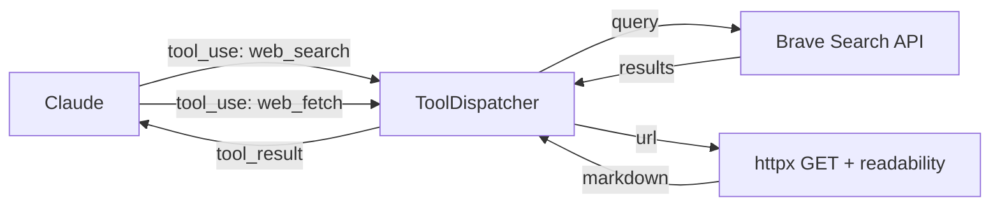

# 005.3: Web Tools — Search & Fetch

**Status:** Ready to Build
**Priority:** P1 — Extends agent capabilities beyond local environment
**Estimated Effort:** 2-3 hours
**Prerequisites:** 005.2 (shipped — direct API + builtin tools framework)

## Motivation

Nous currently has bash, read_file, write_file, and memory tools. Adding web search and fetch gives the agent access to real-time information — critical for research, fact-checking, and staying current.

## Architecture

Two new builtin tools registered via `ToolDispatcher`:



## Design Decisions

### D1: Brave Search API as Primary
- Free tier: 2,000 queries/month
- Simple REST API, single key
- Returns titles, URLs, snippets — compact for LLM consumption
- Env var: `BRAVE_SEARCH_API_KEY`

### D2: web_fetch with Readability Extraction
- Raw HTTP GET via httpx
- Extract readable content using simple HTML-to-text conversion
- Truncate to configurable max chars (default 10,000)
- No JavaScript rendering (keep it lightweight)
- Falls back to raw text if extraction fails

### D3: Frame-Gated Access
| Frame | web_search | web_fetch |
|-------|-----------|-----------|
| conversation | ✅ | ✅ |
| question | ✅ | ✅ |
| task | ✅ | ✅ |
| decision | ✅ | ✅ |
| creative | ✅ | ❌ |
| debug | ✅ | ✅ |

Both tools available in most frames — information access is broadly useful.

### D4: Rate Limiting
- Track queries per day in memory (simple counter)
- Warn at 80% of daily limit
- Block at 100% with helpful error message
- Reset counter daily
- Config: `web_search_daily_limit` (default: 100)

### D5: Result Caching (Optional, Future)
- Cache search results by query hash for 1 hour
- Reduces API calls for repeated questions
- Not in v1 — add if usage warrants

### D6: No External Dependencies
- Brave API is plain REST (httpx, already a dependency)
- HTML extraction uses Python stdlib (`html.parser`) or lightweight regex
- No beautifulsoup4 or readability-lxml needed

## Tool Definitions

### web_search
```json
{
  "name": "web_search",
  "description": "Search the web for current information. Returns titles, URLs, and snippets. Use for questions about recent events, facts you're unsure about, or topics not in memory.",
  "input_schema": {
    "type": "object",
    "properties": {
      "query": {
        "type": "string",
        "description": "Search query string"
      },
      "count": {
        "type": "integer",
        "description": "Number of results (1-10, default 5)",
        "minimum": 1,
        "maximum": 10
      },
      "freshness": {
        "type": "string",
        "description": "Filter by recency: 'day', 'week', 'month', or omit for all time",
        "enum": ["day", "week", "month"]
      }
    },
    "required": ["query"]
  }
}
```

### web_fetch
```json
{
  "name": "web_fetch",
  "description": "Fetch and extract readable content from a URL. Returns clean text/markdown. Use to read full articles, documentation, or web pages.",
  "input_schema": {
    "type": "object",
    "properties": {
      "url": {
        "type": "string",
        "description": "URL to fetch (must be http or https)"
      },
      "max_chars": {
        "type": "integer",
        "description": "Maximum characters to return (default 10000)",
        "maximum": 50000
      }
    },
    "required": ["url"]
  }
}
```

## Implementation

### Files Changed

| File | Change |
|------|--------|
| `nous/api/builtin_tools.py` | Add `_web_search()` and `_web_fetch()` handlers + schemas (~120 lines) |
| `nous/api/builtin_tools.py` | Update `register_builtin_tools()` to register new tools |
| `nous/api/runner.py` | Add `web_search`, `web_fetch` to FRAME_TOOLS |
| `nous/config.py` | Add `brave_search_api_key`, `web_search_daily_limit`, `web_fetch_max_chars` |
| `docker-compose.yml` | Add `BRAVE_SEARCH_API_KEY` env var |
| `.env.example` | Document new env var |

### New
| File | Purpose |
|------|---------|
| `tests/test_web_tools.py` | Tests for search + fetch (~100 lines) |

## Handler Implementation

### web_search
```python
async def _web_search(args: dict[str, Any]) -> dict[str, Any]:
    """Search via Brave Search API."""
    query = args["query"]
    count = min(args.get("count", 5), 10)
    freshness = args.get("freshness")

    params = {
        "q": query,
        "count": count,
    }
    if freshness:
        freshness_map = {"day": "pd", "week": "pw", "month": "pm"}
        params["freshness"] = freshness_map.get(freshness, "")

    response = await _http.get(
        "https://api.search.brave.com/res/v1/web/search",
        params=params,
        headers={
            "Accept": "application/json",
            "Accept-Encoding": "gzip",
            "X-Subscription-Token": settings.brave_search_api_key,
        },
    )

    if response.status_code != 200:
        return {"error": f"Search failed: {response.status_code}"}

    data = response.json()
    results = []
    for item in data.get("web", {}).get("results", [])[:count]:
        results.append({
            "title": item.get("title", ""),
            "url": item.get("url", ""),
            "snippet": item.get("description", ""),
        })

    return {"query": query, "results": results, "count": len(results)}
```

### web_fetch
```python
async def _web_fetch(args: dict[str, Any]) -> dict[str, Any]:
    """Fetch URL and extract readable content."""
    url = args["url"]
    max_chars = min(args.get("max_chars", 10000), 50000)

    if not url.startswith(("http://", "https://")):
        return {"error": "URL must start with http:// or https://"}

    response = await _http.get(
        url,
        headers={"User-Agent": "Nous/0.1 (cognitive agent)"},
        follow_redirects=True,
        timeout=15,
    )

    content_type = response.headers.get("content-type", "")

    if "text/html" in content_type:
        text = _extract_readable(response.text)
    else:
        text = response.text

    if len(text) > max_chars:
        text = text[:max_chars] + "\n\n[... truncated]"

    return {"url": url, "content": text, "length": len(text)}


def _extract_readable(html: str) -> str:
    """Extract readable text from HTML using stdlib parser."""
    import re
    # Remove script/style tags
    text = re.sub(r'<(script|style)[^>]*>.*?</\1>', '', html, flags=re.DOTALL | re.IGNORECASE)
    # Remove HTML tags
    text = re.sub(r'<[^>]+>', ' ', text)
    # Clean whitespace
    text = re.sub(r'\s+', ' ', text).strip()
    # Decode entities
    import html as html_module
    text = html_module.unescape(text)
    return text
```

## Config Settings

```python
# config.py additions
brave_search_api_key: str = ""  # BRAVE_SEARCH_API_KEY env var
web_search_daily_limit: int = 100  # Max searches per day
web_fetch_max_chars: int = 10000  # Default max chars for web_fetch
```

## FRAME_TOOLS Update

```python
FRAME_TOOLS: dict[str, list[str]] = {
    "conversation": [..., "web_search", "web_fetch"],
    "question": ["recall_deep", "web_search", "web_fetch"],
    "decision": [..., "web_search", "web_fetch"],
    "creative": [..., "web_search"],
    "task": ["*"],  # Already includes all
    "debug": [..., "web_search", "web_fetch"],
}
```

## Migration Checklist

- [ ] Add Brave Search API key to config
- [ ] Implement `_web_search()` handler
- [ ] Implement `_web_fetch()` handler with HTML extraction
- [ ] Register tools in `register_builtin_tools()`
- [ ] Update FRAME_TOOLS in runner.py
- [ ] Add tests (mock HTTP responses)
- [ ] Update docker-compose.yml + .env.example
- [ ] Test end-to-end: ask Nous a current events question

## Size Estimate

| Component | Lines |
|-----------|-------|
| web_search handler | ~50 |
| web_fetch handler + extraction | ~70 |
| Config additions | ~10 |
| FRAME_TOOLS updates | ~10 |
| Tests | ~100 |
| **Total** | **~240 lines** |

## Future Enhancements

- **Serper.dev integration** — news, scholar, images search
- **Result caching** — reduce API calls
- **Search + learn** — auto-store important findings as facts
- **Cited responses** — track which search results were used in the answer
