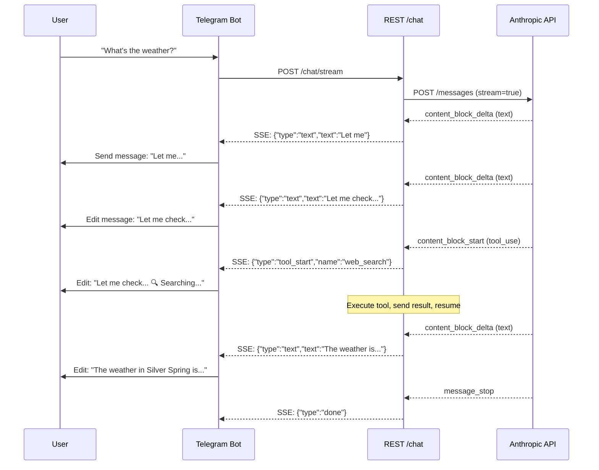

# 005.4 Streaming Responses

**Status:** Shipped (PR #23)
**Priority:** P1 — Major UX improvement
**Prerequisites:** 005.2 (Direct API)
**Estimated Effort:** 4-6 hours (revised per Nous review)
**Branch:** `feat/005.4-streaming`

## Problem

Users wait 10-30 seconds seeing nothing while Nous processes a request. With tool loops (search + recall + respond), waits can exceed 60 seconds. No feedback = bad UX.

## Solution

Stream Anthropic API responses via SSE to the REST API, and use progressive message editing for Telegram.

## Architecture



## Files Changed

| File | Change | Lines |
|------|--------|-------|
| `nous/api/runner.py` | Add `stream_chat()` method, refactor `_call_api()` to support streaming | ~150 |
| `nous/api/rest.py` | Add `POST /chat/stream` SSE endpoint | ~60 |
| `nous/telegram_bot.py` | Progressive message editing with debounce | ~80 |
| `tests/test_streaming.py` | NEW — streaming + tool loop tests | ~200 |

**Total:** ~490 lines new/modified

## ⚠️ Nous Review Findings (2026-02-24)

Review by Nous agent. These MUST be addressed during implementation.

### P0: Will Break If Missed

| # | Issue | Detail |
|---|-------|--------|
| N1 | `input_json_delta` accumulation | Tool inputs arrive as partial JSON fragments across multiple SSE events. Need a **per-block-index accumulator dict**, not simple streaming. Most complex part of the implementation. |
| N2 | In-stream error handling | Anthropic returns HTTP 200 then sends errors *inside* the stream (e.g., `{"type": "error", "error": {"type": "overloaded_error"}}`). Existing `_call_api` retry logic won't fire since HTTP response was 200. Must add in-stream error detection + retry. |
| N3 | `stop_reason` location | In streaming, `stop_reason` lives in `message_delta.delta.stop_reason`, NOT in `message_start`. The tool loop must extract it from the right event. |
| N4 | Ping events | Anthropic sends `{"type": "ping"}` keepalives regularly. Must skip gracefully — will cause JSON parse errors or unexpected behavior if treated as content events. |
| N5 | `end_conversation` reflection | The reflection call in `end_conversation` must stay non-streaming. It calls `_call_api` directly with no listener. Easy accidental regression if `_call_api` is modified. |

### P1: Will Cause Issues in Production

| # | Issue | Detail |
|---|-------|--------|
| N6 | Telegram edit rate limit | Actual limit is ~20 edits/message, roughly 1 edit per 2-3 seconds per chat. Use **1.2s debounce** (not 0.8s) to avoid 429 errors. |
| N7 | Telegram 4096 char limit | Messages cap at 4096 chars. Must handle overflow — either truncate with note, or split into new message mid-stream. |
| N8 | `event:` line in SSE | Each SSE event has `event: <type>` line before `data:`. Only checking `line.startswith("data: ")` is correct (skips event lines), but don't add hard asserts. |

### Architectural Recommendations

1. **Add `_stream_api()` as a sibling method** — don't add a `stream=True` flag to `_call_api`. Keeps the abstraction clean.
2. **`Message` dataclass doesn't need to change** — accumulated chunks produce the same final string shape.
3. **Use `AsyncGenerator` for REST, callback for Telegram** — or `AsyncGenerator` for both (Nous prefers this).
4. **Show tool indicators during execution gaps** — `"🔧 Running bash..."` while tools execute, then resume text streaming.

### Revised Effort Estimate

| Phase | Original | Revised |
|-------|----------|---------|
| `_stream_api()` + SSE parser | 30 min | 60 min |
| Tool-use input accumulator | 20 min | 45 min |
| In-stream error handling | — | 30 min |
| Streaming tool loop integration | 30 min | 60 min |
| Telegram edit + debounce | 30 min | 45 min |
| REST SSE endpoint | 20 min | 30 min |
| Tests (mock SSE events) | 30 min | 60 min |
| **Total** | **~2.5h** | **~5.5h** |

**V1 shortcut:** Stream text only, buffer tool calls non-streaming. Reduces to ~3h.

---

## Phase A: Runner Streaming (~1.5h)

### A1: Streaming API Call

Add `_call_api_stream()` to `AgentRunner`:

```python
async def _call_api_stream(
    self,
    messages: list[dict],
    tools: list[dict],
    system: str,
) -> AsyncGenerator[StreamEvent, None]:
    """Call Anthropic API with streaming enabled.
    
    Yields StreamEvent objects for each SSE chunk.
    """
    body = {
        "model": self._settings.model_name,
        "max_tokens": self._settings.max_tokens,
        "system": system,
        "messages": messages,
        "stream": True,
    }
    if tools:
        body["tools"] = tools

    headers = self._build_headers()  # Existing OAT/API key logic

    async with self._http.stream(
        "POST",
        f"{self._base_url}/v1/messages",
        json=body,
        headers=headers,
        timeout=httpx.Timeout(connect=10, read=120, write=10, pool=10),
    ) as response:
        # N2: Check HTTP status before streaming (catches 401, 400, etc.)
        if response.status_code != 200:
            error = await response.aread()
            yield StreamEvent(type="error", text=error.decode())
            return

        async for line in response.aiter_lines():
            # N8: Skip event: lines, empty lines — only process data: lines
            if not line.startswith("data: "):
                continue
            data = json.loads(line[6:])
            event = _parse_sse_event(data)
            if event:
                # N2: In-stream errors (529 overloaded, etc.) arrive as events
                if event.type == "error":
                    yield event
                    return
                yield event
```

### A2: Stream Event Types

```python
@dataclass
class StreamEvent:
    type: str  # text_delta, tool_start, tool_end, done, error, ping
    text: str = ""
    tool_name: str = ""
    tool_id: str = ""
    tool_input: dict = field(default_factory=dict)
    stop_reason: str = ""
    block_index: int = 0  # N1: Track which content block this belongs to


def _parse_sse_event(data: dict) -> StreamEvent | None:
    """Parse Anthropic SSE event into StreamEvent.
    
    IMPORTANT (N4): Skip ping events gracefully.
    IMPORTANT (N3): stop_reason is in message_delta, not message_start.
    """
    event_type = data.get("type")
    
    # N4: Skip keepalive pings
    if event_type == "ping":
        return None
    
    # N2: Handle in-stream errors (HTTP 200 but error in stream)
    if event_type == "error":
        error = data.get("error", {})
        return StreamEvent(
            type="error",
            text=f"{error.get('type', 'unknown')}: {error.get('message', '')}",
        )
    
    if event_type == "content_block_start":
        block = data.get("content_block", {})
        block_index = data.get("index", 0)
        if block.get("type") == "tool_use":
            return StreamEvent(
                type="tool_start",
                tool_name=block.get("name", ""),
                tool_id=block.get("id", ""),
                block_index=block_index,
            )
        return StreamEvent(type="text_block_start", block_index=block_index)
    
    elif event_type == "content_block_delta":
        delta = data.get("delta", {})
        block_index = data.get("index", 0)
        if delta.get("type") == "text_delta":
            return StreamEvent(type="text_delta", text=delta.get("text", ""))
        elif delta.get("type") == "input_json_delta":
            # N1: Partial JSON fragment — must accumulate per block index
            return StreamEvent(
                type="tool_input_delta",
                text=delta.get("partial_json", ""),
                block_index=block_index,
            )
        return None
    
    elif event_type == "content_block_stop":
        block_index = data.get("index", 0)
        return StreamEvent(type="block_stop", block_index=block_index)
    
    elif event_type == "message_delta":
        # N3: stop_reason lives here, NOT in message_start
        return StreamEvent(
            type="done",
            stop_reason=data.get("delta", {}).get("stop_reason", ""),
        )
    
    elif event_type == "message_stop":
        return StreamEvent(type="message_stop")
    
    return None
```

### A3: Streaming Tool Loop

```python
async def stream_chat(
    self,
    message: str,
    session_id: str,
) -> AsyncGenerator[StreamEvent, None]:
    """Full chat turn with streaming, including tool loops.
    
    Yields StreamEvents as they arrive. Tool calls are executed
    between stream segments.
    """
    messages = self._get_or_create_session(session_id)
    messages.append({"role": "user", "content": message})
    
    turn_context = await self._cognitive.pre_turn(message, session_id)
    system = turn_context.system_prompt
    tools = self._get_tools_for_frame(turn_context)
    
    for turn in range(self._settings.max_turns):
        # Accumulate text and tool calls from stream
        text_parts = []
        tool_calls = []  # list of {id, name, input}
        # N1: Per-block-index accumulator for tool input JSON fragments
        block_accumulators: dict[int, dict] = {}
        stop_reason = ""
        
        async for event in self._call_api_stream(messages, tools, system):
            if event.type == "error":
                # N2: In-stream error — propagate and abort
                yield event
                return
            
            elif event.type == "text_delta":
                text_parts.append(event.text)
                yield event
            
            elif event.type == "tool_start":
                # N1: Register accumulator for this block index
                block_accumulators[event.block_index] = {
                    "id": event.tool_id,
                    "name": event.tool_name,
                    "input_parts": [],
                }
                yield event  # Let UI show "🔧 Using tool..."
            
            elif event.type == "tool_input_delta":
                # N1: Accumulate partial JSON fragments per block index
                acc = block_accumulators.get(event.block_index)
                if acc:
                    acc["input_parts"].append(event.text)
            
            elif event.type == "block_stop":
                # N1: Finalize tool input — parse accumulated JSON
                acc = block_accumulators.pop(event.block_index, None)
                if acc:
                    input_json = "".join(acc["input_parts"])
                    try:
                        acc["input"] = json.loads(input_json) if input_json else {}
                    except json.JSONDecodeError:
                        acc["input"] = {}
                    tool_calls.append(acc)
            
            elif event.type == "done":
                # N3: stop_reason is in message_delta, not message_start
                stop_reason = event.stop_reason
        
        # After stream ends, decide what to do
        if stop_reason == "end_turn" or not tool_calls:
            full_text = "".join(text_parts)
            messages.append({"role": "assistant", "content": full_text})
            await self._cognitive.post_turn(message, full_text, session_id)
            yield StreamEvent(type="done")
            return
        
        # If we have tool calls, execute them and continue
        if tool_calls:
            # Build assistant message with tool_use blocks
            content = []
            if text_parts:
                content.append({"type": "text", "text": "".join(text_parts)})
            for tc in tool_calls:
                content.append({
                    "type": "tool_use",
                    "id": tc["id"],
                    "name": tc["name"],
                    "input": tc["input"],
                })
            messages.append({"role": "assistant", "content": content})
            
            # Execute tools
            tool_results = []
            for tc in tool_calls:
                yield StreamEvent(type="tool_start", tool_name=tc["name"])
                result = await self._dispatcher.dispatch(tc["name"], tc["input"])
                tool_results.append({
                    "type": "tool_result",
                    "tool_use_id": tc["id"],
                    "content": result.get("content", [{"type": "text", "text": str(result)}]),
                })
                yield StreamEvent(type="tool_end", tool_name=tc["name"])
            
            messages.append({"role": "user", "content": tool_results})
            # Reset for next turn
            text_parts = []
            tool_calls = []
        else:
            break
    
    yield StreamEvent(type="done")
```

## Phase B: REST SSE Endpoint (~30min)

### B1: /chat/stream Endpoint

Add to `rest.py`:

```python
from starlette.responses import StreamingResponse

async def chat_stream(request: Request) -> StreamingResponse:
    """SSE streaming chat endpoint."""
    body = await request.json()
    message = body.get("message", "")
    session_id = body.get("session_id", "default")

    runner: AgentRunner = request.app.state.components["runner"]

    async def event_generator():
        async for event in runner.stream_chat(message, session_id):
            data = json.dumps({
                "type": event.type,
                "text": event.text,
                "tool_name": event.tool_name,
            })
            yield f"data: {data}\n\n"

    return StreamingResponse(
        event_generator(),
        media_type="text/event-stream",
        headers={
            "Cache-Control": "no-cache",
            "X-Accel-Buffering": "no",
        },
    )
```

Route: `Route("/chat/stream", chat_stream, methods=["POST"])`

### B2: Keep /chat Non-Streaming

Existing `/chat` endpoint stays synchronous for backward compatibility. Clients can choose.

## Phase C: Telegram Progressive Editing (~45min)

### C1: Debounced Message Editing

Telegram rate-limits `editMessageText` to ~30 edits/min per chat. Debounce updates:

```python
class StreamingMessage:
    """Manages progressive message editing for Telegram streaming."""
    
    def __init__(self, bot, chat_id: int):
        self.bot = bot
        self.chat_id = chat_id
        self.message_id: int | None = None
        self.text = ""
        self.last_edit = 0.0
        self.min_interval = 1.2  # seconds between edits (N6: Telegram ~20 edits/msg limit)
        self.pending = False
    
    async def update(self, new_text: str):
        """Update the message text. Creates message on first call, edits after."""
        self.text = new_text
        
        now = time.time()
        if now - self.last_edit < self.min_interval:
            self.pending = True
            return  # Will be flushed later
        
        await self._send_or_edit()
    
    async def append_tool_indicator(self, tool_name: str):
        """Add a tool usage indicator."""
        indicators = {
            "web_search": "🔍 Searching...",
            "web_fetch": "🌐 Fetching...",
            "recall_deep": "🧠 Remembering...",
            "record_decision": "📝 Recording...",
            "learn_fact": "💡 Learning...",
            "bash": "⚙️ Running...",
            "read_file": "📄 Reading...",
            "write_file": "✏️ Writing...",
        }
        indicator = indicators.get(tool_name, f"🔧 {tool_name}...")
        self.text += f"\n\n_{indicator}_"
        await self._send_or_edit()
    
    async def finalize(self):
        """Send final version of message."""
        if self.pending:
            await self._send_or_edit()
    
    async def _send_or_edit(self):
        if not self.text.strip():
            return
        
        # N7: Telegram 4096 char limit — split into new message if exceeded
        display_text = self.text
        if len(display_text) > 4000:
            # Truncate current message, start a new one for overflow
            if self.message_id is not None:
                overflow = display_text[4000:]
                display_text = display_text[:4000] + "\n\n_(continued...)_"
                try:
                    await self.bot.edit_message_text(
                        display_text, self.chat_id, self.message_id, parse_mode="Markdown"
                    )
                except Exception:
                    pass
                # Start fresh message for overflow
                msg = await self.bot.send_message(self.chat_id, overflow, parse_mode="Markdown")
                self.message_id = msg.message_id
                self.text = overflow
                self.last_edit = time.time()
                self.pending = False
                return
        
        if self.message_id is None:
            msg = await self.bot.send_message(self.chat_id, display_text, parse_mode="Markdown")
            self.message_id = msg.message_id
        else:
            try:
                await self.bot.edit_message_text(
                    display_text, self.chat_id, self.message_id, parse_mode="Markdown"
                )
            except Exception:
                pass  # Telegram may reject identical edits
        self.last_edit = time.time()
        self.pending = False
```

### C2: Bot Integration

Update `handle_message()` in `telegram_bot.py`:

```python
async def handle_message_streaming(update, context):
    """Handle message with streaming response."""
    chat_id = update.effective_chat.id
    text = update.message.text
    
    streamer = StreamingMessage(context.bot, chat_id)
    
    async with httpx.AsyncClient() as client:
        async with client.stream(
            "POST",
            f"{NOUS_API_URL}/chat/stream",
            json={"message": text, "session_id": str(chat_id)},
            timeout=httpx.Timeout(connect=10, read=120, write=10, pool=10),
        ) as response:
            async for line in response.aiter_lines():
                if not line.startswith("data: "):
                    continue
                event = json.loads(line[6:])
                
                if event["type"] == "text_delta":
                    streamer.text += event["text"]
                    await streamer.update(streamer.text)
                elif event["type"] == "tool_start":
                    await streamer.append_tool_indicator(event["tool_name"])
                elif event["type"] == "done":
                    await streamer.finalize()
```

## Phase D: Tests (~30min)

### D1: Test Cases

```python
# tests/test_streaming.py

class TestStreamChat:
    """Tests for AgentRunner.stream_chat()"""
    
    # 1. Simple text response streams correctly
    # 2. Tool call mid-stream: accumulates input, executes, resumes
    # 3. Multi-tool parallel: two tool_use blocks in one response
    # 4. Error from API: yields error event
    # 5. Max turns safety: stops after max_turns
    # 6. Empty response: yields done immediately
    
class TestParseSSEEvent:
    """Tests for _parse_sse_event()"""
    
    # 7. text_delta parsed correctly
    # 8. tool_use content_block_start parsed with block_index
    # 9. input_json_delta accumulated per block_index
    # 10. message_delta with stop_reason (N3)
    # 11. Unknown event type returns None
    # 12. Ping event returns None (N4)
    # 13. In-stream error event parsed (N2)

class TestBlockAccumulator:
    """Tests for per-block-index tool input accumulation (N1)"""
    
    # 14. Single tool: fragments reassembled into valid JSON
    # 15. Multiple parallel tools: separate accumulators per block_index
    # 16. Empty tool input: parsed as {}
    # 17. Malformed JSON fragments: graceful fallback to {}

class TestStreamingMessage:
    """Tests for Telegram progressive editing"""
    
    # 18. First update creates message
    # 19. Subsequent updates edit message
    # 20. Debounce respects 1.2s min_interval (N6)
    # 21. Tool indicators appended correctly
    # 22. Finalize sends pending updates
    # 23. Message overflow splits at 4096 chars (N7)
```

## Design Decisions

| # | Decision | Rationale |
|---|----------|-----------|
| D1 | Keep `/chat` non-streaming | Backward compatibility. Simpler for scripts/tests. |
| D2 | SSE over WebSocket | Simpler, unidirectional (server→client), standard HTTP. WebSocket adds complexity with no benefit here. |
| D3 | 1.2s Telegram edit debounce | N6: Telegram limits ~20 edits/msg. 1.2s = safe margin. Always send final edit regardless of timer. |
| D4 | Tool indicators in message | User sees what's happening ("🔍 Searching...") instead of dead silence during tool execution gaps. |
| D5 | Per-block-index JSON accumulator | N1: Anthropic streams tool input as `input_json_delta` fragments across multiple events. Must track by block index and reassemble before dispatching. |
| D6 | `httpx.stream()` + `aiter_lines()` | Gives clean SSE line parsing. More reliable than raw byte accumulation. `event:` lines naturally skipped. |
| D7 | `_stream_api()` as sibling, not flag | N5: Keep `_call_api()` clean for non-streaming paths (reflection, etc.). Avoid union-type mess. |
| D8 | In-stream error detection | N2: HTTP 200 + error event inside stream. Must detect `{"type": "error"}` events and propagate. |
| D9 | Telegram 4096 char overflow → split | N7: If streaming response exceeds 4096 chars, finalize current message with "(continued...)" and start new message. |

## Acceptance Criteria

- [ ] Text streams token-by-token to `/chat/stream` SSE endpoint
- [ ] Tool calls execute mid-stream, then streaming resumes
- [ ] Tool input JSON fragments accumulated per block index (N1)
- [ ] In-stream errors (529 overloaded, etc.) detected and propagated (N2)
- [ ] `stop_reason` extracted from `message_delta` event (N3)
- [ ] Ping events skipped gracefully (N4)
- [ ] `end_conversation` reflection stays non-streaming (N5)
- [ ] Telegram messages update progressively with 1.2s debounce (N6)
- [ ] Telegram messages split at 4096 chars (N7)
- [ ] Tool indicators shown during tool execution gaps
- [ ] `/chat` endpoint unchanged (backward compatible)
- [ ] `_stream_api()` is sibling method, `_call_api()` untouched
- [ ] Max turns safety limit respected in streaming mode
- [ ] OAT token auth works with streaming
- [ ] All 23 tests pass
