# 005.4 Streaming Responses

**Status:** PLANNED
**Priority:** P1 — Major UX improvement
**Prerequisites:** 005.2 (Direct API)
**Estimated Effort:** 2-3 hours
**Branch:** `feat/005.4-streaming`

## Problem

Users wait 10-30 seconds seeing nothing while Nous processes a request. With tool loops (search + recall + respond), waits can exceed 60 seconds. No feedback = bad UX.

## Solution

Stream Anthropic API responses via SSE to the REST API, and use progressive message editing for Telegram.

## Architecture

```mermaid
sequenceDiagram
    participant U as User
    participant T as Telegram Bot
    participant R as REST /chat
    participant A as Anthropic API

    U->>T: "What's the weather?"
    T->>R: POST /chat/stream
    R->>A: POST /messages (stream=true)
    A-->>R: content_block_delta (text)
    R-->>T: SSE: {"type":"text","text":"Let me"}
    T->>U: Send message: "Let me..."
    A-->>R: content_block_delta (text)
    R-->>T: SSE: {"type":"text","text":"Let me check..."}
    T->>U: Edit message: "Let me check..."
    A-->>R: content_block_start (tool_use)
    R-->>T: SSE: {"type":"tool_start","name":"web_search"}
    T->>U: Edit: "Let me check... 🔍 Searching..."
    Note over R: Execute tool, send result, resume
    A-->>R: content_block_delta (text)
    R-->>T: SSE: {"type":"text","text":"The weather is..."}
    T->>U: Edit: "The weather in Silver Spring is..."
    A-->>R: message_stop
    R-->>T: SSE: {"type":"done"}
```



## Files Changed

| File | Change | Lines |
|------|--------|-------|
| `nous/api/runner.py` | Add `stream_chat()` method, refactor `_call_api()` to support streaming | ~150 |
| `nous/api/rest.py` | Add `POST /chat/stream` SSE endpoint | ~60 |
| `nous/telegram_bot.py` | Progressive message editing with debounce | ~80 |
| `tests/test_streaming.py` | NEW — streaming + tool loop tests | ~200 |

**Total:** ~490 lines new/modified

## Phase A: Runner Streaming (~1h)

### A1: Streaming API Call

Add `_call_api_stream()` to `AgentRunner`:

```python
async def _call_api_stream(
    self,
    messages: list[dict],
    tools: list[dict],
    system: str,
) -> AsyncGenerator[StreamEvent, None]:
    """Call Anthropic API with streaming enabled.
    
    Yields StreamEvent objects for each SSE chunk.
    """
    body = {
        "model": self._settings.model_name,
        "max_tokens": self._settings.max_tokens,
        "system": system,
        "messages": messages,
        "stream": True,
    }
    if tools:
        body["tools"] = tools

    headers = self._build_headers()  # Existing OAT/API key logic

    async with self._http.stream(
        "POST",
        f"{self._base_url}/v1/messages",
        json=body,
        headers=headers,
        timeout=httpx.Timeout(connect=10, read=120, write=10, pool=10),
    ) as response:
        if response.status_code != 200:
            error = await response.aread()
            yield StreamEvent(type="error", data=error.decode())
            return

        async for line in response.aiter_lines():
            if not line.startswith("data: "):
                continue
            data = json.loads(line[6:])
            event = _parse_sse_event(data)
            if event:
                yield event
```

### A2: Stream Event Types

```python
@dataclass
class StreamEvent:
    type: str  # text_delta, tool_start, tool_end, done, error
    text: str = ""
    tool_name: str = ""
    tool_id: str = ""
    tool_input: dict = field(default_factory=dict)
    stop_reason: str = ""


def _parse_sse_event(data: dict) -> StreamEvent | None:
    """Parse Anthropic SSE event into StreamEvent."""
    event_type = data.get("type")
    
    if event_type == "content_block_start":
        block = data.get("content_block", {})
        if block.get("type") == "tool_use":
            return StreamEvent(
                type="tool_start",
                tool_name=block.get("name", ""),
                tool_id=block.get("id", ""),
            )
        return None
    
    elif event_type == "content_block_delta":
        delta = data.get("delta", {})
        if delta.get("type") == "text_delta":
            return StreamEvent(type="text_delta", text=delta.get("text", ""))
        elif delta.get("type") == "input_json_delta":
            # Accumulate tool input JSON fragments
            return StreamEvent(type="tool_input_delta", text=delta.get("partial_json", ""))
        return None
    
    elif event_type == "content_block_stop":
        return StreamEvent(type="block_stop")
    
    elif event_type == "message_delta":
        return StreamEvent(
            type="done",
            stop_reason=data.get("delta", {}).get("stop_reason", ""),
        )
    
    elif event_type == "message_stop":
        return StreamEvent(type="message_stop")
    
    return None
```

### A3: Streaming Tool Loop

```python
async def stream_chat(
    self,
    message: str,
    session_id: str,
) -> AsyncGenerator[StreamEvent, None]:
    """Full chat turn with streaming, including tool loops.
    
    Yields StreamEvents as they arrive. Tool calls are executed
    between stream segments.
    """
    messages = self._get_or_create_session(session_id)
    messages.append({"role": "user", "content": message})
    
    turn_context = await self._cognitive.pre_turn(message, session_id)
    system = turn_context.system_prompt
    tools = self._get_tools_for_frame(turn_context)
    
    for turn in range(self._settings.max_turns):
        # Accumulate text and tool calls from stream
        text_parts = []
        tool_calls = []  # list of {id, name, input_json_parts}
        current_tool = None
        
        async for event in self._call_api_stream(messages, tools, system):
            if event.type == "text_delta":
                text_parts.append(event.text)
                yield event
            
            elif event.type == "tool_start":
                current_tool = {
                    "id": event.tool_id,
                    "name": event.tool_name,
                    "input_parts": [],
                }
                yield event  # Let UI show "🔧 Using tool..."
            
            elif event.type == "tool_input_delta":
                if current_tool:
                    current_tool["input_parts"].append(event.text)
            
            elif event.type == "block_stop":
                if current_tool:
                    input_json = "".join(current_tool["input_parts"])
                    try:
                        current_tool["input"] = json.loads(input_json) if input_json else {}
                    except json.JSONDecodeError:
                        current_tool["input"] = {}
                    tool_calls.append(current_tool)
                    current_tool = None
            
            elif event.type == "done":
                if event.stop_reason == "end_turn" or not tool_calls:
                    # Done — no more tool calls
                    full_text = "".join(text_parts)
                    messages.append({"role": "assistant", "content": full_text})
                    await self._cognitive.post_turn(message, full_text, session_id)
                    yield StreamEvent(type="done")
                    return
        
        # If we have tool calls, execute them and continue
        if tool_calls:
            # Build assistant message with tool_use blocks
            content = []
            if text_parts:
                content.append({"type": "text", "text": "".join(text_parts)})
            for tc in tool_calls:
                content.append({
                    "type": "tool_use",
                    "id": tc["id"],
                    "name": tc["name"],
                    "input": tc["input"],
                })
            messages.append({"role": "assistant", "content": content})
            
            # Execute tools
            tool_results = []
            for tc in tool_calls:
                yield StreamEvent(type="tool_start", tool_name=tc["name"])
                result = await self._dispatcher.dispatch(tc["name"], tc["input"])
                tool_results.append({
                    "type": "tool_result",
                    "tool_use_id": tc["id"],
                    "content": result.get("content", [{"type": "text", "text": str(result)}]),
                })
                yield StreamEvent(type="tool_end", tool_name=tc["name"])
            
            messages.append({"role": "user", "content": tool_results})
            # Reset for next turn
            text_parts = []
            tool_calls = []
        else:
            break
    
    yield StreamEvent(type="done")
```

## Phase B: REST SSE Endpoint (~30min)

### B1: /chat/stream Endpoint

Add to `rest.py`:

```python
from starlette.responses import StreamingResponse

async def chat_stream(request: Request) -> StreamingResponse:
    """SSE streaming chat endpoint."""
    body = await request.json()
    message = body.get("message", "")
    session_id = body.get("session_id", "default")

    runner: AgentRunner = request.app.state.components["runner"]

    async def event_generator():
        async for event in runner.stream_chat(message, session_id):
            data = json.dumps({
                "type": event.type,
                "text": event.text,
                "tool_name": event.tool_name,
            })
            yield f"data: {data}\n\n"

    return StreamingResponse(
        event_generator(),
        media_type="text/event-stream",
        headers={
            "Cache-Control": "no-cache",
            "X-Accel-Buffering": "no",
        },
    )
```

Route: `Route("/chat/stream", chat_stream, methods=["POST"])`

### B2: Keep /chat Non-Streaming

Existing `/chat` endpoint stays synchronous for backward compatibility. Clients can choose.

## Phase C: Telegram Progressive Editing (~45min)

### C1: Debounced Message Editing

Telegram rate-limits `editMessageText` to ~30 edits/min per chat. Debounce updates:

```python
class StreamingMessage:
    """Manages progressive message editing for Telegram streaming."""
    
    def __init__(self, bot, chat_id: int):
        self.bot = bot
        self.chat_id = chat_id
        self.message_id: int | None = None
        self.text = ""
        self.last_edit = 0.0
        self.min_interval = 0.8  # seconds between edits
        self.pending = False
    
    async def update(self, new_text: str):
        """Update the message text. Creates message on first call, edits after."""
        self.text = new_text
        
        now = time.time()
        if now - self.last_edit < self.min_interval:
            self.pending = True
            return  # Will be flushed later
        
        await self._send_or_edit()
    
    async def append_tool_indicator(self, tool_name: str):
        """Add a tool usage indicator."""
        indicators = {
            "web_search": "🔍 Searching...",
            "web_fetch": "🌐 Fetching...",
            "recall_deep": "🧠 Remembering...",
            "record_decision": "📝 Recording...",
            "learn_fact": "💡 Learning...",
            "bash": "⚙️ Running...",
            "read_file": "📄 Reading...",
            "write_file": "✏️ Writing...",
        }
        indicator = indicators.get(tool_name, f"🔧 {tool_name}...")
        self.text += f"\n\n_{indicator}_"
        await self._send_or_edit()
    
    async def finalize(self):
        """Send final version of message."""
        if self.pending:
            await self._send_or_edit()
    
    async def _send_or_edit(self):
        if not self.text.strip():
            return
        if self.message_id is None:
            msg = await self.bot.send_message(self.chat_id, self.text, parse_mode="Markdown")
            self.message_id = msg.message_id
        else:
            try:
                await self.bot.edit_message_text(
                    self.text, self.chat_id, self.message_id, parse_mode="Markdown"
                )
            except Exception:
                pass  # Telegram may reject identical edits
        self.last_edit = time.time()
        self.pending = False
```

### C2: Bot Integration

Update `handle_message()` in `telegram_bot.py`:

```python
async def handle_message_streaming(update, context):
    """Handle message with streaming response."""
    chat_id = update.effective_chat.id
    text = update.message.text
    
    streamer = StreamingMessage(context.bot, chat_id)
    
    async with httpx.AsyncClient() as client:
        async with client.stream(
            "POST",
            f"{NOUS_API_URL}/chat/stream",
            json={"message": text, "session_id": str(chat_id)},
            timeout=httpx.Timeout(connect=10, read=120, write=10, pool=10),
        ) as response:
            async for line in response.aiter_lines():
                if not line.startswith("data: "):
                    continue
                event = json.loads(line[6:])
                
                if event["type"] == "text_delta":
                    streamer.text += event["text"]
                    await streamer.update(streamer.text)
                elif event["type"] == "tool_start":
                    await streamer.append_tool_indicator(event["tool_name"])
                elif event["type"] == "done":
                    await streamer.finalize()
```

## Phase D: Tests (~30min)

### D1: Test Cases

```python
# tests/test_streaming.py

class TestStreamChat:
    """Tests for AgentRunner.stream_chat()"""
    
    # 1. Simple text response streams correctly
    # 2. Tool call mid-stream: accumulates input, executes, resumes
    # 3. Multi-tool parallel: two tool_use blocks in one response
    # 4. Error from API: yields error event
    # 5. Max turns safety: stops after max_turns
    # 6. Empty response: yields done immediately
    
class TestParseSSEEvent:
    """Tests for _parse_sse_event()"""
    
    # 7. text_delta parsed correctly
    # 8. tool_use content_block_start parsed
    # 9. input_json_delta accumulated
    # 10. message_delta with stop_reason
    # 11. Unknown event type returns None

class TestStreamingMessage:
    """Tests for Telegram progressive editing"""
    
    # 12. First update creates message
    # 13. Subsequent updates edit message
    # 14. Debounce respects min_interval
    # 15. Tool indicators appended correctly
    # 16. Finalize sends pending updates
```

## Design Decisions

| # | Decision | Rationale |
|---|----------|-----------|
| D1 | Keep `/chat` non-streaming | Backward compatibility. Simpler for scripts/tests. |
| D2 | SSE over WebSocket | Simpler, unidirectional (server→client), standard HTTP. WebSocket adds complexity with no benefit here. |
| D3 | 0.8s Telegram edit debounce | Telegram rate-limits ~30 edits/min. 0.8s = ~75 edits/min max, safe margin. |
| D4 | Tool indicators in message | User sees what's happening ("🔍 Searching...") instead of dead silence. |
| D5 | Accumulate tool input JSON fragments | Anthropic streams tool input as `input_json_delta` fragments. Must reassemble before dispatching. |
| D6 | `httpx.stream()` not `aiter_bytes()` | `aiter_lines()` gives clean SSE line parsing. More reliable than raw byte accumulation. |

## Acceptance Criteria

- [ ] Text streams token-by-token to `/chat/stream` SSE endpoint
- [ ] Tool calls execute mid-stream, then streaming resumes
- [ ] Telegram messages update progressively with debounce
- [ ] Tool indicators shown during tool execution
- [ ] `/chat` endpoint unchanged (backward compatible)
- [ ] Max turns safety limit respected in streaming mode
- [ ] OAT token auth works with streaming
- [ ] Error events propagated correctly
- [ ] All tests pass
