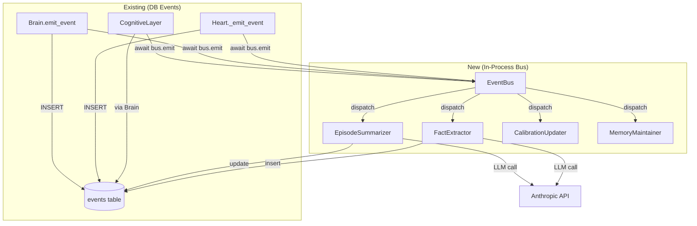
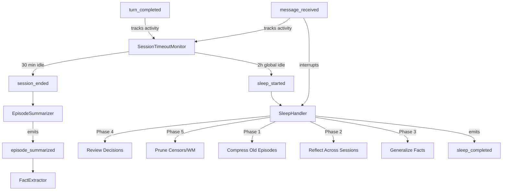

# 006 Event Bus — In-Process Async Event System

**Status:** Shipped
**Priority:** P0 — Foundation for F010, F007, F008, F009
**Prerequisites:** 004 (Cognitive Layer), 005.2 (Runtime)
**Branch:** `feat/006-event-bus`

## Problem

Nous already emits events to the database (30+ emit points across Brain, Heart, Cognitive Layer), but nothing reacts to them. Events are write-only audit logs. There's no in-process bus that can trigger automated handlers — episode summarization, fact extraction, calibration updates, censor creation all require manual invocation.

## Current State

### What Exists
- `nous_system.events` table with `(agent_id, session_id, event_type, data, created_at)`
- `Brain.emit_event()` and `Heart._emit_event()` insert rows via SQLAlchemy
- Events emitted: `turn_completed`, `session_ended`, `episode_started`, `episode_ended`, `fact_learned`, `fact_superseded`, `decision_recorded`, `decision_reviewed`, `censor_created`, `censor_triggered`, `procedure_created`, `procedure_confirmed`
- Cognitive Layer emits `turn_completed` and `session_ended` via `Brain.emit_event()`

### What's Missing
- In-process `EventBus` class that dispatches to handlers
- Handler registration system
- Background asyncio task processing the queue
- Error isolation (one handler can't crash the bus)
- F010 handlers (episode summary, fact extraction)

## Architecture



## Files

| File | Change | Lines |
|------|--------|-------|
| `nous/events.py` | **NEW** — `Event`, `EventBus`, `HandlerRegistry` | ~120 |
| `nous/handlers/__init__.py` | **NEW** — Package init | ~5 |
| `nous/handlers/episode_summarizer.py` | **NEW** — F010.1 Episode summary on session_ended | ~100 |
| `nous/handlers/fact_extractor.py` | **NEW** — F010.4 Fact extraction after episode summary | ~100 |
| `nous/handlers/session_monitor.py` | **NEW** — Session timeout detection + sleep trigger | ~80 |
| `nous/handlers/sleep_handler.py` | **NEW** — Compaction, reflection, pruning during idle | ~150 |
| `nous/cognitive/layer.py` | Wire bus into pre_turn/post_turn/end_session | ~30 |
| `nous/main.py` | Create bus, register handlers, start/stop lifecycle | ~40 |
| `nous/config.py` | Add event bus + handler config with env vars | ~15 |
| `tests/test_event_bus.py` | **NEW** — Bus + handler tests | ~300 |
| **Total** | | ~940 |

## Phase A: EventBus Core (~120 lines)

### A1: Event Dataclass

**File: `nous/events.py`**

```python
"""In-process async event bus for Nous.

Events are dispatched to registered handlers asynchronously.
Handlers run concurrently but errors are isolated — one broken
handler never crashes the bus or blocks other handlers.

Also persists events to DB (existing behavior) for audit trail.
"""

from __future__ import annotations

import asyncio
import logging
from collections import defaultdict
from dataclasses import dataclass, field
from datetime import UTC, datetime
from typing import Any, Callable, Awaitable

logger = logging.getLogger(__name__)

# Handler type: async function taking an Event
EventHandler = Callable[["Event"], Awaitable[None]]


@dataclass
class Event:
    """A typed event flowing through the bus."""
    type: str
    agent_id: str
    data: dict[str, Any] = field(default_factory=dict)
    session_id: str | None = None
    timestamp: datetime = field(default_factory=lambda: datetime.now(UTC))
```

### A2: EventBus

```python
class EventBus:
    """In-process async event bus with error isolation.

    Events are queued and processed by a background asyncio task.
    Handlers registered via on() are called concurrently for each event.
    Handler errors are logged but never propagate.

    The bus also delegates to a DB persister (the existing emit_event
    pattern) so all events remain in the audit table.
    """

    def __init__(self, max_queue: int = 1000):
        self._handlers: dict[str, list[EventHandler]] = defaultdict(list)
        self._queue: asyncio.Queue[Event] = asyncio.Queue(maxsize=max_queue)
        self._task: asyncio.Task | None = None
        self._running = False
        self._db_persister: EventHandler | None = None  # Optional DB write

    def on(self, event_type: str, handler: EventHandler) -> None:
        """Register a handler for an event type. Can register multiple."""
        self._handlers[event_type].append(handler)
        logger.debug("Registered handler for '%s': %s", event_type, handler.__qualname__)

    def set_db_persister(self, persister: EventHandler) -> None:
        """Set the DB persistence handler (existing Brain.emit_event pattern)."""
        self._db_persister = persister

    async def emit(self, event: Event) -> None:
        """Emit an event. Non-blocking — queued for async processing.

        If queue is full, logs warning and drops event (never blocks caller).
        """
        try:
            self._queue.put_nowait(event)
        except asyncio.QueueFull:
            logger.warning("Event bus queue full, dropping event: %s", event.type)

    async def start(self) -> None:
        """Start the background processing loop."""
        if self._running:
            return
        self._running = True
        self._task = asyncio.create_task(self._process_loop(), name="event-bus")
        logger.info("Event bus started")

    async def stop(self) -> None:
        """Stop the bus. Drains remaining events before stopping."""
        self._running = False
        if self._task:
            # Process remaining events in queue
            while not self._queue.empty():
                try:
                    event = self._queue.get_nowait()
                    await self._dispatch(event)
                except asyncio.QueueEmpty:
                    break
            self._task.cancel()
            try:
                await self._task
            except asyncio.CancelledError:
                pass
            self._task = None
        logger.info("Event bus stopped")

    async def _process_loop(self) -> None:
        """Main processing loop — runs as background task."""
        while self._running:
            try:
                event = await asyncio.wait_for(self._queue.get(), timeout=1.0)
                await self._dispatch(event)
            except asyncio.TimeoutError:
                continue
            except asyncio.CancelledError:
                break
            except Exception:
                logger.exception("Unexpected error in event bus loop")

    async def _dispatch(self, event: Event) -> None:
        """Dispatch event to all registered handlers + DB persister."""
        # DB persistence (fire-and-forget, errors logged)
        if self._db_persister:
            try:
                await self._db_persister(event)
            except Exception:
                logger.warning("DB persist failed for event %s", event.type)

        # Handlers — run concurrently, errors isolated
        handlers = self._handlers.get(event.type, [])
        if not handlers:
            return

        tasks = [self._safe_handle(h, event) for h in handlers]
        await asyncio.gather(*tasks)

    async def _safe_handle(self, handler: EventHandler, event: Event) -> None:
        """Run handler with error isolation. Never propagates."""
        try:
            await handler(event)
        except Exception:
            logger.exception(
                "Handler %s failed for event %s",
                handler.__qualname__,
                event.type,
            )

    @property
    def pending(self) -> int:
        """Number of events waiting in queue."""
        return self._queue.qsize()
```

## Phase B: Wire Into Existing Code (~30 lines in layer.py)

### B1: Replace Direct DB Emits with Bus

Currently `CognitiveLayer.post_turn()` calls `Brain.emit_event()` directly. Change to emit through the bus, which handles both dispatch and DB persistence.

**In `layer.py`:**

```python
# __init__ — add bus parameter
def __init__(
    self,
    brain: Brain,
    heart: Heart,
    settings: Settings,
    bus: EventBus | None = None,  # NEW
):
    ...
    self._bus = bus

# post_turn — replace Brain.emit_event with bus.emit
# BEFORE:
await self._brain.emit_event("turn_completed", {...})

# AFTER:
if self._bus:
    await self._bus.emit(Event(
        type="turn_completed",
        agent_id=agent_id,
        session_id=session_id,
        data={...},
    ))

# end_session — same pattern
if self._bus:
    await self._bus.emit(Event(
        type="session_ended",
        agent_id=agent_id,
        session_id=session_id,
        data={"reflection": reflection[:200] if reflection else None},
    ))
```

### B2: DB Persister Adapter

Bridge between new `EventBus` and existing `Brain.emit_event()`:

```python
# In main.py during setup
async def _persist_event_to_db(event: Event) -> None:
    """Adapter: EventBus → Brain.emit_event() for DB persistence."""
    await brain.emit_event(
        event.type,
        event.data,
        agent_id=event.agent_id,
        session_id=event.session_id,
    )

bus.set_db_persister(_persist_event_to_db)
```

## Phase C: Episode Summarizer Handler — F010.1 (~100 lines)

### C1: Handler

**File: `nous/handlers/episode_summarizer.py`**

```python
"""Episode Summarizer — generates structured summaries on session end.

Listens to: session_ended
Emits: episode_summarized

Uses a lightweight LLM call to summarize the conversation transcript.
Stores summary as JSONB on the episode record.
"""

from __future__ import annotations

import json
import logging
from typing import Any
from uuid import UUID

import httpx

from nous.config import Settings
from nous.events import Event, EventBus
from nous.heart.heart import Heart

logger = logging.getLogger(__name__)

_SUMMARY_PROMPT = """Given the following conversation transcript, generate a structured summary.

Transcript:
{transcript}

Return ONLY valid JSON (no markdown, no explanation):
{{
  "title": "<5-10 word descriptive title>",
  "summary": "<100-150 word prose summary of what happened>",
  "key_points": ["<point 1>", "<point 2>", "<point 3>"],
  "outcome": "<resolved|partial|unresolved|informational>",
  "topics": ["<topic1>", "<topic2>"]
}}"""


class EpisodeSummarizer:
    """Generates episode summaries on session end.

    Listens to session_ended events. If the session had an active episode,
    fetches the transcript, calls LLM for summary, stores on episode record.
    """

    def __init__(
        self,
        heart: Heart,
        settings: Settings,
        bus: EventBus,
        http_client: httpx.AsyncClient | None = None,
    ):
        self._heart = heart
        self._settings = settings
        self._bus = bus
        self._http = http_client
        bus.on("session_ended", self.handle)

    async def handle(self, event: Event) -> None:
        """Handle session_ended — summarize the episode if one exists."""
        episode_id = event.data.get("episode_id")
        if not episode_id:
            return

        try:
            # Fetch episode with its content
            episode = await self._heart.get_episode(UUID(episode_id))
            if not episode or not episode.summary:
                # summary field here is the opening message, use it as transcript seed
                pass

            # Build transcript from episode decisions/facts linked
            # For now, use the episode summary (opening message) + reflection
            transcript = event.data.get("transcript", "")
            if not transcript or len(transcript) < 50:
                logger.debug("Episode %s too short for summary, skipping", episode_id)
                return

            # Call LLM for summary
            summary = await self._generate_summary(transcript)
            if not summary:
                return

            # Store summary on episode (requires schema addition)
            await self._heart.update_episode_summary(UUID(episode_id), summary)

            # Emit for downstream handlers (fact extraction)
            await self._bus.emit(Event(
                type="episode_summarized",
                agent_id=event.agent_id,
                session_id=event.session_id,
                data={
                    "episode_id": episode_id,
                    "summary": summary,
                },
            ))

            logger.info("Episode %s summarized: %s", episode_id, summary.get("title", "?"))

        except Exception:
            logger.exception("Failed to summarize episode %s", episode_id)

    async def _generate_summary(self, transcript: str) -> dict[str, Any] | None:
        """Call LLM to generate structured summary."""
        if not self._http:
            logger.warning("No HTTP client for episode summarizer")
            return None

        # Truncate transcript to ~8000 chars
        if len(transcript) > 8000:
            half = 3800
            transcript = transcript[:half] + "\n\n[... middle truncated ...]\n\n" + transcript[-half:]

        prompt = _SUMMARY_PROMPT.format(transcript=transcript)

        # Use same auth pattern as runner
        headers: dict[str, str] = {"anthropic-version": "2023-06-01"}
        api_key = self._settings.anthropic_auth_token or self._settings.anthropic_api_key
        if api_key and "sk-ant-oat" in api_key:
            headers["Authorization"] = f"Bearer {api_key}"
            headers["anthropic-beta"] = "oauth-2025-04-20"
            headers["anthropic-dangerous-direct-browser-access"] = "true"
        else:
            headers["x-api-key"] = api_key or ""

        try:
            response = await self._http.post(
                "https://api.anthropic.com/v1/messages",
                json={
                    "model": self._settings.background_model,  # Cheap model for summaries
                    "max_tokens": 500,
                    "messages": [{"role": "user", "content": prompt}],
                },
                headers=headers,
                timeout=30,
            )

            if response.status_code != 200:
                logger.warning("Summary LLM call failed: %d", response.status_code)
                return None

            data = response.json()
            text = data.get("content", [{}])[0].get("text", "")

            # Parse JSON from response
            return json.loads(text)

        except (json.JSONDecodeError, httpx.TimeoutException) as e:
            logger.warning("Summary generation failed: %s", e)
            return None
```

## Phase D: Fact Extractor Handler — F010.4 (~100 lines)

### D1: Handler

**File: `nous/handlers/fact_extractor.py`**

```python
"""Fact Extractor — proactively learns facts from episode summaries.

Listens to: episode_summarized
Uses the structured summary to identify facts worth remembering.
Deduplicates against existing facts before storing.
"""

from __future__ import annotations

import json
import logging
from typing import Any

import httpx

from nous.config import Settings
from nous.events import Event, EventBus
from nous.heart.heart import Heart
from nous.heart.schemas import FactInput

logger = logging.getLogger(__name__)

_EXTRACT_PROMPT = """Review the following conversation summary and extract facts worth remembering long-term.

Focus on:
- User preferences (tools, formats, units, communication style)
- Project/system facts (architecture, constraints, conventions)
- People facts (roles, names, relationships)
- Rules or recurring patterns observed

Summary: {summary}
Key Points: {key_points}

Return ONLY a valid JSON array (empty array if nothing worth storing):
[
  {{
    "subject": "<who/what the fact is about>",
    "content": "<the fact, stated clearly>",
    "category": "<preference|technical|person|tool|concept|rule>",
    "confidence": <0.0-1.0>
  }}
]

Only include facts genuinely useful across future conversations.
Skip transient, trivial, or already-known information.
Max 5 facts."""


class FactExtractor:
    """Extracts and stores facts from episode summaries.

    Listens to episode_summarized events. Calls LLM to identify facts,
    deduplicates against existing facts, stores new ones.
    Max 5 facts per episode.
    """

    def __init__(
        self,
        heart: Heart,
        settings: Settings,
        bus: EventBus,
        http_client: httpx.AsyncClient | None = None,
    ):
        self._heart = heart
        self._settings = settings
        self._bus = bus
        self._http = http_client
        bus.on("episode_summarized", self.handle)

    async def handle(self, event: Event) -> None:
        """Handle episode_summarized — extract and store facts."""
        summary = event.data.get("summary", {})
        if not summary:
            return

        try:
            candidates = await self._extract_facts(summary)
            if not candidates:
                return

            stored = 0
            for fact in candidates[:5]:  # Max 5 per episode
                confidence = fact.get("confidence", 0.7)
                if confidence < 0.6:
                    logger.debug("Skipping low-confidence fact: %s", fact.get("content", "")[:50])
                    continue

                # Dedup: check if similar fact exists
                content = fact.get("content", "")
                existing = await self._heart.search_facts(content, limit=1)
                if existing and hasattr(existing[0], "similarity") and existing[0].similarity > 0.85:
                    logger.debug("Skipping duplicate fact: %s", content[:50])
                    continue

                # Store
                fact_input = FactInput(
                    subject=fact.get("subject", "unknown"),
                    content=content,
                    source="fact_extractor",
                    confidence=confidence,
                )
                await self._heart.learn(fact_input)
                stored += 1

            if stored:
                logger.info(
                    "Extracted %d facts from episode %s",
                    stored,
                    event.data.get("episode_id", "?"),
                )

        except Exception:
            logger.exception("Fact extraction failed for episode %s", event.data.get("episode_id"))

    async def _extract_facts(self, summary: dict[str, Any]) -> list[dict[str, Any]]:
        """Call LLM to extract facts from episode summary."""
        if not self._http:
            return []

        summary_text = summary.get("summary", "")
        key_points = ", ".join(summary.get("key_points", []))

        if not summary_text:
            return []

        prompt = _EXTRACT_PROMPT.format(summary=summary_text, key_points=key_points)

        # Same auth pattern as EpisodeSummarizer
        headers: dict[str, str] = {"anthropic-version": "2023-06-01"}
        api_key = self._settings.anthropic_auth_token or self._settings.anthropic_api_key
        if api_key and "sk-ant-oat" in api_key:
            headers["Authorization"] = f"Bearer {api_key}"
            headers["anthropic-beta"] = "oauth-2025-04-20"
            headers["anthropic-dangerous-direct-browser-access"] = "true"
        else:
            headers["x-api-key"] = api_key or ""

        try:
            response = await self._http.post(
                "https://api.anthropic.com/v1/messages",
                json={
                    "model": self._settings.background_model,
                    "max_tokens": 500,
                    "messages": [{"role": "user", "content": prompt}],
                },
                headers=headers,
                timeout=30,
            )

            if response.status_code != 200:
                return []

            data = response.json()
            text = data.get("content", [{}])[0].get("text", "")
            return json.loads(text)

        except (json.JSONDecodeError, httpx.TimeoutException):
            return []
```

## Phase E: Schema Changes (~10 lines SQL)

### E1: Episode Summary Column

```sql
-- F010.1: Episode summaries
ALTER TABLE heart.episodes
  ADD COLUMN IF NOT EXISTS structured_summary JSONB;

-- F010.5: User tagging
ALTER TABLE heart.episodes
  ADD COLUMN IF NOT EXISTS user_id VARCHAR(100),
  ADD COLUMN IF NOT EXISTS user_display_name VARCHAR(100);

CREATE INDEX IF NOT EXISTS idx_episodes_user_id ON heart.episodes(user_id);
CREATE INDEX IF NOT EXISTS idx_episodes_summary_gin ON heart.episodes USING GIN(structured_summary);
```

### E2: Heart Methods for Summary

Add to `episodes.py`:

```python
async def update_summary(
    self, episode_id: UUID, summary: dict, session: AsyncSession | None = None
) -> None:
    """Store structured summary on episode."""
    if session is None:
        async with self.db.session() as session:
            await self._update_summary(episode_id, summary, session)
            await session.commit()
            return
    await self._update_summary(episode_id, summary, session)

async def _update_summary(
    self, episode_id: UUID, summary: dict, session: AsyncSession
) -> None:
    episode = await self._get_episode_orm(episode_id, session)
    if episode:
        episode.structured_summary = summary
        await session.flush()
```

Add delegation in `heart.py`:

```python
async def update_episode_summary(self, episode_id: UUID, summary: dict, session=None):
    await self._episodes.update_summary(episode_id, summary, session=session)
```

## Phase F: Main.py Wiring (~30 lines)

```python
# In create_components()
from nous.events import EventBus, Event
from nous.handlers.episode_summarizer import EpisodeSummarizer
from nous.handlers.fact_extractor import FactExtractor
from nous.handlers.session_monitor import SessionTimeoutMonitor
from nous.handlers.sleep_handler import SleepHandler

# Create bus
bus = EventBus()

# DB persistence adapter
async def persist_to_db(event: Event) -> None:
    await brain.emit_event(event.type, event.data, agent_id=event.agent_id, session_id=event.session_id)
bus.set_db_persister(persist_to_db)

# Register handlers (only if enabled)
handler_http = httpx.AsyncClient(timeout=httpx.Timeout(connect=10, read=60, write=10, pool=10))
if settings.episode_summary_enabled:
    EpisodeSummarizer(heart, settings, bus, handler_http)
if settings.fact_extraction_enabled:
    FactExtractor(heart, settings, bus, handler_http)

# Session timeout monitor (always active when bus is enabled)
session_monitor = SessionTimeoutMonitor(bus, settings)

# Sleep handler (reflection, compaction, pruning)
if settings.sleep_enabled:
    SleepHandler(brain, heart, settings, bus, handler_http)

# Pass bus to Cognitive Layer
cognitive = CognitiveLayer(brain, heart, settings, bus=bus)

# Start bus + monitor
await bus.start()
await session_monitor.start()

# In shutdown_components()
await session_monitor.stop()
await bus.stop()
if handler_http:
    await handler_http.aclose()
```

## Phase G: Config (~5 lines)

```python
# config.py — add to Settings
event_bus_enabled: bool = True
episode_summary_enabled: bool = True
fact_extraction_enabled: bool = True
sleep_enabled: bool = True
background_model: str = Field("claude-sonnet-4-5-20250514", validation_alias="NOUS_BACKGROUND_MODEL")
session_idle_timeout: int = Field(1800, validation_alias="NOUS_SESSION_TIMEOUT")  # 30 min → session_ended
sleep_timeout: int = Field(7200, validation_alias="NOUS_SLEEP_TIMEOUT")  # 2h → sleep_started
sleep_check_interval: int = 60  # seconds between timeout checks
```

**Env vars:**
| Var | Default | Purpose |
|-----|---------|---------|
| `NOUS_BACKGROUND_MODEL` | `claude-sonnet-4-5-20250514` | Model for summary/extraction/reflection LLM calls |
| `NOUS_SESSION_TIMEOUT` | `1800` (30 min) | Idle seconds before session_ended fires |
| `NOUS_SLEEP_TIMEOUT` | `7200` (2h) | Idle seconds before sleep mode starts |

## Phase H: Transcript Capture

The episode summarizer needs conversation transcripts, but the current episode only stores the opening message. Need to capture the transcript during the session.

### H1: Accumulate Transcript in Session Metadata

Extend `SessionMetadata` (from 005.5):

```python
@dataclass
class SessionMetadata:
    turn_count: int = 0
    tools_used: set[str] = field(default_factory=set)
    total_user_chars: int = 0
    total_assistant_chars: int = 0
    has_explicit_remember: bool = False
    transcript: list[str] = field(default_factory=list)  # NEW
```

In `pre_turn()`:
```python
meta.transcript.append(f"User: {user_input}")
```

In `post_turn()`:
```python
meta.transcript.append(f"Assistant: {turn_result.response_text[:500]}")
```

In `end_session()`, pass transcript to event:
```python
transcript_text = "\n\n".join(meta.transcript) if meta else ""

await self._bus.emit(Event(
    type="session_ended",
    agent_id=agent_id,
    session_id=session_id,
    data={
        "episode_id": episode_id,
        "transcript": transcript_text,
        "reflection": reflection[:200] if reflection else None,
    },
))
```

## Phase I: User-Tagged Episodes — F010.5 (~20 lines)

### I1: Pass User ID Through

Add `user_id` parameter to `CognitiveLayer.pre_turn()`:

```python
async def pre_turn(
    self,
    agent_id: str,
    session_id: str,
    user_input: str,
    user_id: str | None = None,  # NEW
    user_display_name: str | None = None,  # NEW
    ...
):
    # When creating episode, pass user info
    episode_input = EpisodeInput(
        summary=user_input[:200],
        frame_used=frame.frame_id,
        trigger="user_message",
        user_id=user_id,
        user_display_name=user_display_name,
    )
```

### I2: Runner Passes User ID

In `runner.py`, extract from session context or default:

```python
# In run_turn() and stream_chat()
turn_context = await self._cognitive.pre_turn(
    _agent_id,
    session_id,
    user_message,
    user_id=kwargs.get("user_id"),
    user_display_name=kwargs.get("user_display_name"),
    ...
)
```

### I3: Telegram Bot Passes User ID

```python
# In telegram_bot.py _handle_message
await self._chat_streaming(
    chat_id, text,
    user_id=str(update.from_user.id),
    user_display_name=update.from_user.first_name,
)
```

## Phase J: Session Timeout Monitor (~80 lines)

### J1: Timeout Detection

**File: `nous/handlers/session_monitor.py`**

```python
"""Session Timeout Monitor — detects idle sessions and triggers lifecycle events.

Tracks last activity per session. Emits:
- session_ended: after NOUS_SESSION_TIMEOUT seconds idle (default 30 min)
- sleep_started: after NOUS_SLEEP_TIMEOUT seconds of global inactivity (default 2h)

This solves the problem that most sessions never explicitly end —
users just stop talking. Without this, episode summaries, fact extraction,
and reflection never trigger.
"""

from __future__ import annotations

import asyncio
import logging
import time
from typing import Any

from nous.config import Settings
from nous.events import Event, EventBus

logger = logging.getLogger(__name__)


class SessionTimeoutMonitor:
    """Monitors session activity and emits timeout events.

    Runs a periodic check (every sleep_check_interval seconds) that:
    1. Finds sessions idle > session_idle_timeout → emits session_ended
    2. If ALL sessions idle > sleep_timeout → emits sleep_started

    The monitor registers itself on turn_completed to track activity.
    """

    def __init__(self, bus: EventBus, settings: Settings):
        self._bus = bus
        self._settings = settings
        self._last_activity: dict[str, float] = {}  # session_id → monotonic time
        self._last_agent: dict[str, str] = {}  # session_id → agent_id
        self._global_last_activity: float = time.monotonic()
        self._sleep_emitted: bool = False
        self._task: asyncio.Task | None = None

        bus.on("turn_completed", self.on_activity)
        bus.on("message_received", self.on_activity)

    async def on_activity(self, event: Event) -> None:
        """Track session activity."""
        now = time.monotonic()
        if event.session_id:
            self._last_activity[event.session_id] = now
            if event.agent_id:
                self._last_agent[event.session_id] = event.agent_id
        self._global_last_activity = now
        self._sleep_emitted = False  # Reset sleep flag on any activity

    async def start(self) -> None:
        """Start the periodic timeout checker."""
        self._task = asyncio.create_task(self._check_loop(), name="session-monitor")
        logger.info("Session timeout monitor started (idle=%ds, sleep=%ds)",
                     self._settings.session_idle_timeout, self._settings.sleep_timeout)

    async def stop(self) -> None:
        """Stop the monitor."""
        if self._task:
            self._task.cancel()
            try:
                await self._task
            except asyncio.CancelledError:
                pass
            self._task = None

    async def _check_loop(self) -> None:
        """Periodic check for idle sessions."""
        while True:
            try:
                await asyncio.sleep(self._settings.sleep_check_interval)
                await self._check_timeouts()
            except asyncio.CancelledError:
                break
            except Exception:
                logger.exception("Session monitor check failed")

    async def _check_timeouts(self) -> None:
        """Check all tracked sessions for timeouts."""
        now = time.monotonic()

        # 1. Check individual session timeouts → session_ended
        expired = []
        for session_id, last in list(self._last_activity.items()):
            idle_seconds = now - last
            if idle_seconds > self._settings.session_idle_timeout:
                agent_id = self._last_agent.get(session_id, "unknown")
                logger.info("Session %s idle for %ds, emitting session_ended",
                           session_id, int(idle_seconds))
                await self._bus.emit(Event(
                    type="session_ended",
                    agent_id=agent_id,
                    session_id=session_id,
                    data={"reason": "idle_timeout", "idle_seconds": int(idle_seconds)},
                ))
                expired.append(session_id)

        for sid in expired:
            self._last_activity.pop(sid, None)
            self._last_agent.pop(sid, None)

        # 2. Check global inactivity → sleep_started
        global_idle = now - self._global_last_activity
        if (
            global_idle > self._settings.sleep_timeout
            and not self._sleep_emitted
            and not self._last_activity  # No active sessions remaining
        ):
            logger.info("Global idle for %ds, emitting sleep_started", int(global_idle))
            await self._bus.emit(Event(
                type="sleep_started",
                agent_id="system",
                data={"idle_seconds": int(global_idle)},
            ))
            self._sleep_emitted = True
```

## Phase K: Sleep Handler — Reflection & Compaction (~150 lines)

### K1: Sleep Handler

**File: `nous/handlers/sleep_handler.py`**

```python
"""Sleep Handler — runs reflection, compaction, and pruning during idle periods.

Listens to: sleep_started
Emits: sleep_completed

Mirrors how biological brains consolidate during sleep:
1. Compress — old episodes → compressed summaries
2. Reflect — cross-session pattern recognition
3. Generalize — similar facts → generalized facts
4. Review — check pending decision outcomes
5. Prune — retire low-activation censors, stale working memory

Phases 1-3 use LLM calls (background_model). Phases 4-5 are free (DB only).
Sleep is interruptible — if a new message arrives, in-progress work completes
but remaining phases are skipped.
"""

from __future__ import annotations

import json
import logging
from datetime import UTC, datetime, timedelta
from typing import Any
from uuid import UUID

import httpx

from nous.brain.brain import Brain
from nous.config import Settings
from nous.events import Event, EventBus
from nous.heart.heart import Heart

logger = logging.getLogger(__name__)

_REFLECTION_PROMPT = """You are an AI agent reviewing your recent activity. Analyze the following
episode summaries from the past 24 hours and identify:

1. Patterns — recurring topics, user needs, or behaviors
2. Lessons — what worked well, what didn't
3. Connections — links between seemingly unrelated conversations
4. Gaps — knowledge you needed but didn't have

Episodes:
{episodes}

Return ONLY valid JSON:
{{
  "patterns": ["<pattern 1>", "<pattern 2>"],
  "lessons": ["<lesson 1>", "<lesson 2>"],
  "connections": ["<connection 1>"],
  "gaps": ["<gap 1>"],
  "summary": "<2-3 sentence reflection on the day>"
}}"""

_GENERALIZE_PROMPT = """These facts are about the same topic. Create one generalized fact
that captures the essential knowledge from all of them.

Facts:
{facts}

Return ONLY valid JSON:
{{
  "subject": "<who/what>",
  "content": "<generalized fact>",
  "confidence": <0.0-1.0>
}}"""


class SleepHandler:
    """Runs reflection and maintenance during idle periods.

    Each phase checks self._interrupted before proceeding.
    A new message_received event sets _interrupted = True.
    """

    def __init__(
        self,
        brain: Brain,
        heart: Heart,
        settings: Settings,
        bus: EventBus,
        http_client: httpx.AsyncClient | None = None,
    ):
        self._brain = brain
        self._heart = heart
        self._settings = settings
        self._bus = bus
        self._http = http_client
        self._interrupted = False
        self._sleeping = False

        bus.on("sleep_started", self.handle)
        bus.on("message_received", self._on_wake)

    async def _on_wake(self, event: Event) -> None:
        """Interrupt sleep on new activity."""
        if self._sleeping:
            logger.info("Sleep interrupted by new message")
            self._interrupted = True

    async def handle(self, event: Event) -> None:
        """Run sleep phases in priority order."""
        self._sleeping = True
        self._interrupted = False
        phases_completed = []

        try:
            logger.info("Sleep mode started — beginning consolidation")

            # Phase 4 & 5 first (free, no LLM)
            if not self._interrupted:
                await self._phase_review_decisions()
                phases_completed.append("review")

            if not self._interrupted:
                await self._phase_prune()
                phases_completed.append("prune")

            # Phase 1: Compress old episodes (LLM)
            if not self._interrupted:
                await self._phase_compress()
                phases_completed.append("compress")

            # Phase 2: Reflect on recent activity (LLM)
            if not self._interrupted:
                await self._phase_reflect()
                phases_completed.append("reflect")

            # Phase 3: Generalize similar facts (LLM)
            if not self._interrupted:
                await self._phase_generalize()
                phases_completed.append("generalize")

            await self._bus.emit(Event(
                type="sleep_completed",
                agent_id=event.agent_id,
                data={
                    "phases_completed": phases_completed,
                    "interrupted": self._interrupted,
                },
            ))
            logger.info("Sleep completed: %s (interrupted=%s)", phases_completed, self._interrupted)

        except Exception:
            logger.exception("Sleep handler error")
        finally:
            self._sleeping = False

    async def _phase_review_decisions(self) -> None:
        """Phase 4: Check pending decisions for observable outcomes. Free."""
        try:
            # Get recent unreviewed decisions
            # Brain.search() with status=pending, created in last 7 days
            # For each, check if related events indicate success/failure
            # This is a stub — full implementation depends on Brain.list_pending()
            logger.debug("Sleep phase: decision review (stub)")
        except Exception:
            logger.warning("Decision review phase failed")

    async def _phase_prune(self) -> None:
        """Phase 5: Retire stale censors, clean working memory. Free."""
        try:
            # Retire censors with 0 activations in last 30 days
            # Clear working memory entries older than 7 days
            # This is a stub — full implementation depends on Heart.prune()
            logger.debug("Sleep phase: prune (stub)")
        except Exception:
            logger.warning("Prune phase failed")

    async def _phase_compress(self) -> None:
        """Phase 1: Compress old episodes (>7 days) without summaries."""
        if not self._http:
            return
        try:
            # Find episodes older than 7 days without structured_summary
            # Generate summaries for up to 5 per sleep cycle
            # Uses same EpisodeSummarizer logic but for old episodes
            logger.debug("Sleep phase: compress old episodes (stub)")
        except Exception:
            logger.warning("Compress phase failed")

    async def _phase_reflect(self) -> None:
        """Phase 2: Cross-session reflection on recent activity."""
        if not self._http:
            return
        try:
            # Gather episode summaries from last 24h
            recent = await self._heart.search_episodes("", limit=10)
            if not recent or len(recent) < 2:
                logger.debug("Not enough recent episodes for reflection")
                return

            episodes_text = "\n\n".join(
                f"- {ep.summary[:200]}" for ep in recent if ep.summary
            )
            if not episodes_text:
                return

            prompt = _REFLECTION_PROMPT.format(episodes=episodes_text)

            headers = self._build_auth_headers()
            response = await self._http.post(
                "https://api.anthropic.com/v1/messages",
                json={
                    "model": self._settings.background_model,
                    "max_tokens": 500,
                    "messages": [{"role": "user", "content": prompt}],
                },
                headers=headers,
                timeout=30,
            )

            if response.status_code != 200:
                return

            data = response.json()
            text = data.get("content", [{}])[0].get("text", "")
            reflection = json.loads(text)

            # Store reflection as a special episode
            from nous.heart.schemas import FactInput
            if reflection.get("summary"):
                await self._heart.learn(FactInput(
                    subject="daily_reflection",
                    content=reflection["summary"],
                    source="sleep_reflection",
                    confidence=0.8,
                ))

            # Store lessons as individual facts
            for lesson in reflection.get("lessons", [])[:3]:
                await self._heart.learn(FactInput(
                    subject="lesson_learned",
                    content=lesson,
                    source="sleep_reflection",
                    confidence=0.7,
                ))

            logger.info("Reflection complete: %d patterns, %d lessons",
                       len(reflection.get("patterns", [])),
                       len(reflection.get("lessons", [])))

        except (json.JSONDecodeError, Exception):
            logger.warning("Reflection phase failed")

    async def _phase_generalize(self) -> None:
        """Phase 3: Merge similar facts into generalized facts."""
        if not self._http:
            return
        try:
            # Find fact clusters (same subject, >5 facts)
            # For each cluster, generate a generalized fact
            # Supersede originals with the generalized version
            # Stub — needs Heart.find_fact_clusters()
            logger.debug("Sleep phase: generalize facts (stub)")
        except Exception:
            logger.warning("Generalize phase failed")

    def _build_auth_headers(self) -> dict[str, str]:
        """Build Anthropic auth headers (same pattern as other handlers)."""
        headers: dict[str, str] = {"anthropic-version": "2023-06-01"}
        api_key = self._settings.anthropic_auth_token or self._settings.anthropic_api_key
        if api_key and "sk-ant-oat" in api_key:
            headers["Authorization"] = f"Bearer {api_key}"
            headers["anthropic-beta"] = "oauth-2025-04-20"
            headers["anthropic-dangerous-direct-browser-access"] = "true"
        else:
            headers["x-api-key"] = api_key or ""
        return headers
```

### K2: Event Flow



### K3: Interruptibility

Sleep is designed to be interrupted. When a new `message_received` event arrives during sleep:

1. `_on_wake()` sets `self._interrupted = True`
2. The currently running phase completes (it's an LLM call, 5-30s)
3. Remaining phases are skipped
4. `sleep_completed` event reports which phases ran and that it was interrupted

Free phases (review, prune) run first so they always complete. LLM phases run last and are the most likely to be interrupted — which is fine since they're the least urgent.

## Phase L: Tests (~300 lines)

Renamed from Phase J, expanded to cover new handlers.

**File: `tests/test_event_bus.py`**

```python
class TestEventBus:
    """Core event bus tests."""
    # 1. emit + handler receives event
    # 2. Multiple handlers for same event type
    # 3. Handler error doesn't crash bus
    # 4. Handler error doesn't block other handlers
    # 5. Queue full drops event (no block)
    # 6. stop() drains remaining events
    # 7. DB persister called for every event
    # 8. Unknown event type — no handlers, no error

class TestEpisodeSummarizer:
    """Episode summary handler tests."""
    # 9. Generates summary on session_ended with transcript
    # 10. Skips short transcripts (<50 chars)
    # 11. Skips when no episode_id in event
    # 12. Emits episode_summarized event downstream
    # 13. Handles LLM failure gracefully
    # 14. Truncates long transcripts (>8000 chars)

class TestFactExtractor:
    """Fact extraction handler tests."""
    # 15. Extracts facts from episode_summarized
    # 16. Deduplicates against existing facts (>0.85 similarity)
    # 17. Skips low-confidence facts (<0.6)
    # 18. Max 5 facts per episode enforced
    # 19. Handles empty summary gracefully
    # 20. Handles LLM failure gracefully

class TestTranscriptCapture:
    """Transcript accumulation in SessionMetadata."""
    # 21. User messages appended to transcript
    # 22. Assistant responses appended (truncated to 500 chars)
    # 23. Transcript passed in session_ended event

class TestUserTagging:
    """F010.5 user-tagged episodes."""
    # 24. Episode created with user_id
    # 25. Episode created with user_display_name
    # 26. Missing user_id defaults to None (backward compat)

class TestSessionTimeoutMonitor:
    """Session timeout detection."""
    # 27. Activity tracked on turn_completed
    # 28. session_ended emitted after idle timeout
    # 29. Multiple sessions tracked independently
    # 30. sleep_started emitted after global idle (no active sessions)
    # 31. sleep_started NOT emitted while sessions still active
    # 32. Activity resets sleep flag
    # 33. Expired sessions cleaned from tracking dict

class TestSleepHandler:
    """Sleep mode — reflection, compaction, pruning."""
    # 34. All 5 phases run when not interrupted
    # 35. message_received interrupts sleep
    # 36. Free phases (review, prune) run before LLM phases
    # 37. sleep_completed reports which phases ran
    # 38. sleep_completed reports interrupted=True when interrupted
    # 39. Reflection generates facts from cross-session patterns
    # 40. Reflection skipped when <2 recent episodes
    # 41. LLM failure doesn't crash sleep handler
```

## Design Decisions

| # | Decision | Rationale |
|---|----------|-----------|
| D1 | In-process asyncio, not external broker | At Nous's scale (<100 events/min), asyncio.Queue is sufficient. No Redis/RabbitMQ needed. |
| D2 | Fire-and-forget emit (non-blocking) | Callers (pre_turn, post_turn) must not be slowed by handler execution. QueueFull drops, doesn't block. |
| D3 | DB persistence via adapter, not inside bus | Keeps bus generic. Existing Brain.emit_event() pattern preserved as an adapter function. |
| D4 | Separate httpx client for handlers | Handlers make LLM calls. Separate from runner's client (different timeouts, no auth header conflicts). |
| D5 | Background model configurable via `NOUS_BACKGROUND_MODEL` | Defaults to Sonnet (~$0.003 per summary). Configurable for cost/quality tradeoffs. Haiku for cheaper, Opus for higher quality. |
| D6 | Feature flags per handler | Can disable episode summaries or fact extraction independently without stopping the bus. |
| D7 | Transcript in SessionMetadata | Ephemeral, in-memory. No DB schema change needed. Flows through session_ended event to summarizer. |
| D8 | Max 5 facts per episode | Prevents over-accumulation from chatty conversations. |
| D9 | Session timeout triggers session_ended | Most sessions never explicitly end. 30 min idle = conversation is over. Without this, summaries/extraction never fire. |
| D10 | Sleep mode = biological sleep metaphor | Consolidation during idle, not on fixed schedule. Runs when there's material to process. Quiet days = no sleep work. |
| D11 | Free phases first, LLM phases last | If sleep is interrupted, at least review + prune completed. LLM phases are less urgent and more expensive. |
| D12 | Sleep is interruptible | New message cancels remaining phases. Current phase completes (max 30s). User experience > background work. |
| D13 | `NOUS_SESSION_TIMEOUT` / `NOUS_SLEEP_TIMEOUT` configurable | Different deployments have different idle patterns. Short for dev (5 min / 30 min), longer for prod. |

## Acceptance Criteria

- [ ] EventBus processes events asynchronously via background task
- [ ] Handler errors are logged but don't crash the bus
- [ ] Events still persisted to DB (existing behavior preserved)
- [ ] Episode summaries generated on session end (F010.1)
- [ ] Facts extracted from summaries (F010.4)
- [ ] Fact dedup prevents duplicates (>0.85 similarity)
- [ ] User ID tagged on episodes (F010.5)
- [ ] Transcript captured in SessionMetadata
- [ ] Feature flags control handler registration
- [ ] Sessions auto-end after NOUS_SESSION_TIMEOUT idle seconds
- [ ] Sleep mode triggers after NOUS_SLEEP_TIMEOUT global idle seconds
- [ ] Sleep is interruptible — new message cancels remaining phases
- [ ] Free phases (review, prune) run before LLM phases
- [ ] Reflection generates cross-session insights as facts
- [ ] Sleep handler reports phases completed and interruption status
- [ ] All 41 tests pass
- [ ] Existing tests unaffected

## Implementation Order

1. `nous/events.py` — EventBus core
2. `nous/config.py` — feature flags
3. `nous/cognitive/schemas.py` — transcript in SessionMetadata
4. `nous/cognitive/layer.py` — wire bus + transcript capture
5. `sql/init.sql` — schema additions (summary column, user columns)
6. `nous/heart/episodes.py` — update_summary method
7. `nous/handlers/episode_summarizer.py` — F010.1
8. `nous/handlers/fact_extractor.py` — F010.4
9. `nous/handlers/session_monitor.py` — timeout detection
10. `nous/handlers/sleep_handler.py` — reflection & compaction
11. `nous/main.py` — wiring (bus, handlers, monitor lifecycle)
12. `tests/test_event_bus.py` — 41 test cases

## Relationship to F010

This spec implements the **foundation** (EventBus) plus three F010 sub-features:

| F010 Item | Status | Where |
|-----------|--------|-------|
| F010.1 — Episode Summaries | ✅ Included (Phase C) | `handlers/episode_summarizer.py` |
| F010.3 — Clean Decision Descriptions | ❌ Separate | Already partially addressed by 005.5 frame instructions |
| F010.4 — Proactive Fact Learning | ✅ Included (Phase D) | `handlers/fact_extractor.py` |
| F010.5 — User-Tagged Episodes | ✅ Included (Phase I) | Schema + plumbing |

F010.3 is intentionally excluded — the 005.5 noise reduction PR already tightened frame instructions and added the Brain noise filter. A further validation layer can be added as a separate handler later.
