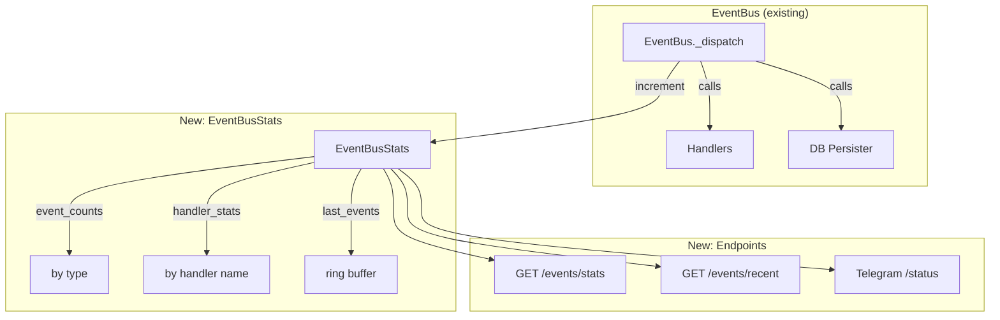

# 006.1 Event Bus Observability

**Status:** PLANNED
**Priority:** P1 — Can't verify 006 is working without this
**Prerequisites:** 006 (Event Bus)
**Estimated Effort:** 2-3 hours
**Branch:** `feat/006.1-event-bus-observability`

## Problem

The event bus (006) runs handlers silently in the background. There's no way to verify:
- Are events being processed?
- Are handlers succeeding or failing?
- Is the session monitor detecting idle sessions?
- Has sleep mode ever triggered?
- What facts/summaries have been auto-generated?

All we have is `logger` calls — useful for debugging container logs but not for quick operational checks. Need structured observability via API + Telegram.

## Current State

### What Exists
- `EventBus` with `pending` property (queue depth only)
- Handler-level `logger.info/warning/exception` calls
- `nous_system.events` table with all persisted events
- `GET /status` endpoint (agent info + memory counts + calibration)
- `GET /health` endpoint (DB connectivity only)
- Telegram bot with frame tags on messages

### What's Missing
- Event processing counters (by type, success/fail)
- Handler execution stats (invocations, errors, last run time)
- `GET /events/stats` endpoint for operational dashboard
- `GET /events/recent` endpoint for recent event history
- Event bus stats in Telegram `/status` or `/debug` command
- Session monitor visibility (tracked sessions, timeouts fired)
- Sleep handler visibility (last sleep, phases completed)

## Architecture



## Files

| File | Change | Lines |
|------|--------|-------|
| `nous/events.py` | Add `EventBusStats` class, wire into `EventBus._dispatch` | ~80 |
| `nous/api/rest.py` | Add `GET /events/stats` and `GET /events/recent` endpoints | ~80 |
| `nous/telegram_bot.py` | Add event bus stats to status/debug output | ~30 |
| `nous/handlers/session_monitor.py` | Expose stats (tracked sessions, timeouts fired) | ~15 |
| `nous/handlers/sleep_handler.py` | Expose stats (last sleep time, phases) | ~10 |
| `tests/test_event_bus_observability.py` | **NEW** — Tests for stats + endpoints | ~200 |
| **Total** | | ~415 |

## Phase A: EventBusStats (~80 lines)

### A1: Stats Collector

**File: `nous/events.py`** — Add new class

```python
from collections import deque
from dataclasses import dataclass
import time


@dataclass
class HandlerStat:
    """Stats for a single handler."""
    name: str
    invocations: int = 0
    successes: int = 0
    errors: int = 0
    last_invoked: float | None = None  # monotonic
    last_error: float | None = None
    last_error_msg: str | None = None
    total_duration_ms: float = 0.0


@dataclass
class RecentEvent:
    """Lightweight record of a recently processed event."""
    type: str
    agent_id: str
    session_id: str | None
    timestamp: str  # ISO format
    handlers_invoked: int
    handlers_failed: int
    duration_ms: float


class EventBusStats:
    """Collects event bus processing statistics.

    Thread-safe for single-threaded asyncio (dict ops are atomic).
    Keeps a ring buffer of last N events for quick inspection.
    """

    def __init__(self, recent_limit: int = 100):
        self._event_counts: dict[str, int] = defaultdict(int)  # type -> count
        self._handler_stats: dict[str, HandlerStat] = {}  # handler_qualname -> stats
        self._recent: deque[RecentEvent] = deque(maxlen=recent_limit)
        self._total_processed: int = 0
        self._total_dropped: int = 0
        self._started_at: float = time.monotonic()

    def record_event(self, event: Event, handlers_invoked: int, handlers_failed: int, duration_ms: float) -> None:
        """Record a processed event."""
        self._event_counts[event.type] += 1
        self._total_processed += 1
        self._recent.append(RecentEvent(
            type=event.type,
            agent_id=event.agent_id,
            session_id=event.session_id,
            timestamp=event.timestamp.isoformat(),
            handlers_invoked=handlers_invoked,
            handlers_failed=handlers_failed,
            duration_ms=duration_ms,
        ))

    def record_handler_success(self, handler_name: str, duration_ms: float) -> None:
        """Record a successful handler invocation."""
        stat = self._get_or_create(handler_name)
        stat.invocations += 1
        stat.successes += 1
        stat.last_invoked = time.monotonic()
        stat.total_duration_ms += duration_ms

    def record_handler_error(self, handler_name: str, error_msg: str) -> None:
        """Record a handler failure."""
        stat = self._get_or_create(handler_name)
        stat.invocations += 1
        stat.errors += 1
        stat.last_invoked = time.monotonic()
        stat.last_error = time.monotonic()
        stat.last_error_msg = error_msg[:200]

    def record_drop(self) -> None:
        """Record a dropped event (queue full)."""
        self._total_dropped += 1

    def to_dict(self) -> dict[str, Any]:
        """Serialize stats for API response."""
        now = time.monotonic()
        return {
            "uptime_seconds": int(now - self._started_at),
            "total_processed": self._total_processed,
            "total_dropped": self._total_dropped,
            "event_counts": dict(self._event_counts),
            "handlers": {
                name: {
                    "invocations": s.invocations,
                    "successes": s.successes,
                    "errors": s.errors,
                    "last_invoked_ago_seconds": int(now - s.last_invoked) if s.last_invoked else None,
                    "last_error_ago_seconds": int(now - s.last_error) if s.last_error else None,
                    "last_error_msg": s.last_error_msg,
                    "avg_duration_ms": round(s.total_duration_ms / s.invocations, 1) if s.invocations else 0,
                }
                for name, s in self._handler_stats.items()
            },
        }

    def recent_events(self, limit: int = 50) -> list[dict[str, Any]]:
        """Return recent events (newest first)."""
        events = list(self._recent)[-limit:]
        events.reverse()
        return [
            {
                "type": e.type,
                "agent_id": e.agent_id,
                "session_id": e.session_id,
                "timestamp": e.timestamp,
                "handlers_invoked": e.handlers_invoked,
                "handlers_failed": e.handlers_failed,
                "duration_ms": e.duration_ms,
            }
            for e in events
        ]

    def _get_or_create(self, handler_name: str) -> HandlerStat:
        if handler_name not in self._handler_stats:
            self._handler_stats[handler_name] = HandlerStat(name=handler_name)
        return self._handler_stats[handler_name]
```

### A2: Wire Into EventBus

Modify `EventBus` to create and populate stats:

```python
class EventBus:
    def __init__(self, max_queue: int = 1000):
        ...
        self.stats = EventBusStats()  # NEW: public for endpoint access

    async def emit(self, event: Event) -> None:
        try:
            self._queue.put_nowait(event)
        except asyncio.QueueFull:
            logger.warning("Event bus queue full, dropping event: %s", event.type)
            self.stats.record_drop()  # NEW

    async def _dispatch(self, event: Event) -> None:
        start = time.monotonic()
        handlers_invoked = 0
        handlers_failed = 0

        # DB persistence
        if self._db_persister:
            try:
                await self._db_persister(event)
            except Exception:
                logger.warning("DB persist failed for event %s", event.type)

        # Handlers
        handlers = self._handlers.get(event.type, [])
        if handlers:
            results = await asyncio.gather(
                *[self._safe_handle(h, event) for h in handlers],
                return_exceptions=False,
            )
            handlers_invoked = len(handlers)
            # Count failures from _safe_handle return values
            # (see A3 below)

        duration_ms = (time.monotonic() - start) * 1000
        self.stats.record_event(event, handlers_invoked, handlers_failed, duration_ms)

    async def _safe_handle(self, handler: EventHandler, event: Event) -> bool:
        """Run handler with error isolation. Returns True on success."""
        handler_name = handler.__qualname__
        start = time.monotonic()
        try:
            await handler(event)
            duration_ms = (time.monotonic() - start) * 1000
            self.stats.record_handler_success(handler_name, duration_ms)
            return True
        except asyncio.CancelledError:
            raise
        except BaseException as e:
            logger.exception("Handler %s failed for event %s", handler_name, event.type)
            self.stats.record_handler_error(handler_name, str(e))
            return False
```

### A3: Dispatch Counting

Update `_dispatch` to count failures from `_safe_handle` return values:

```python
async def _dispatch(self, event: Event) -> None:
    start = time.monotonic()
    handlers_invoked = 0
    handlers_failed = 0

    if self._db_persister:
        try:
            await self._db_persister(event)
        except Exception:
            logger.warning("DB persist failed for event %s", event.type)

    handlers = self._handlers.get(event.type, [])
    if handlers:
        results = await asyncio.gather(
            *[self._safe_handle(h, event) for h in handlers]
        )
        handlers_invoked = len(handlers)
        handlers_failed = sum(1 for r in results if r is False)

    duration_ms = (time.monotonic() - start) * 1000
    self.stats.record_event(event, handlers_invoked, handlers_failed, duration_ms)
```

## Phase B: REST Endpoints (~80 lines)

### B1: GET /events/stats

**File: `nous/api/rest.py`**

Returns aggregated event bus stats — event counts by type, handler success/fail rates, uptime, queue depth.

```python
async def events_stats(request: Request) -> JSONResponse:
    """GET /events/stats - Event bus processing statistics."""
    stats = bus.stats.to_dict()
    stats["queue_depth"] = bus.pending
    stats["registered_handlers"] = {
        event_type: [h.__qualname__ for h in handlers]
        for event_type, handlers in bus._handlers.items()
    }

    # Session monitor stats
    if session_monitor:
        stats["session_monitor"] = {
            "tracked_sessions": len(session_monitor._last_activity),
            "session_ids": list(session_monitor._last_activity.keys()),
            "sleep_emitted": session_monitor._sleep_emitted,
        }

    # Sleep handler stats
    if sleep_handler:
        stats["sleep_handler"] = sleep_handler.get_stats()

    return JSONResponse(stats)
```

**Example response:**
```json
{
  "uptime_seconds": 3600,
  "total_processed": 142,
  "total_dropped": 0,
  "queue_depth": 0,
  "event_counts": {
    "turn_completed": 85,
    "session_ended": 12,
    "episode_summarized": 8,
    "sleep_started": 1,
    "sleep_completed": 1
  },
  "handlers": {
    "SessionTimeoutMonitor.on_activity": {
      "invocations": 85,
      "successes": 85,
      "errors": 0,
      "last_invoked_ago_seconds": 120,
      "avg_duration_ms": 0.1
    },
    "EpisodeSummarizer.handle": {
      "invocations": 12,
      "successes": 8,
      "errors": 4,
      "last_invoked_ago_seconds": 300,
      "last_error_ago_seconds": 600,
      "last_error_msg": "Summary LLM call failed: 429",
      "avg_duration_ms": 2500.0
    },
    "FactExtractor.handle": {
      "invocations": 8,
      "successes": 7,
      "errors": 1,
      "avg_duration_ms": 1800.0
    },
    "SleepHandler.handle": {
      "invocations": 1,
      "successes": 1,
      "errors": 0,
      "avg_duration_ms": 15000.0
    }
  },
  "registered_handlers": {
    "turn_completed": ["SessionTimeoutMonitor.on_activity"],
    "session_ended": ["EpisodeSummarizer.handle", "SessionTimeoutMonitor._on_session_ended"],
    "episode_summarized": ["FactExtractor.handle"],
    "sleep_started": ["SleepHandler.handle"]
  },
  "session_monitor": {
    "tracked_sessions": 2,
    "session_ids": ["abc123", "def456"],
    "sleep_emitted": false
  },
  "sleep_handler": {
    "total_sleeps": 1,
    "last_sleep_iso": "2026-02-24T22:00:00Z",
    "last_phases_completed": ["review", "prune", "compress", "reflect"],
    "last_interrupted": false,
    "currently_sleeping": false
  }
}
```

### B2: GET /events/recent

Returns recent events from the in-memory ring buffer (fast, no DB query) or from DB for deeper history.

```python
async def events_recent(request: Request) -> JSONResponse:
    """GET /events/recent?limit=50&source=memory|db - Recent events."""
    try:
        limit = int(request.query_params.get("limit", "50"))
    except ValueError:
        return JSONResponse({"error": "limit must be an integer"}, status_code=400)

    source = request.query_params.get("source", "memory")

    if source == "memory":
        # Fast: from in-memory ring buffer
        events = bus.stats.recent_events(limit=limit)
        return JSONResponse({"events": events, "source": "memory"})

    elif source == "db":
        # Deep: from nous_system.events table
        from sqlalchemy import text
        async with database.session() as session:
            result = await session.execute(
                text("""
                    SELECT event_type, agent_id, session_id, data, created_at
                    FROM nous_system.events
                    ORDER BY created_at DESC
                    LIMIT :limit
                """),
                {"limit": limit},
            )
            rows = result.fetchall()
            events = [
                {
                    "type": row.event_type,
                    "agent_id": row.agent_id,
                    "session_id": row.session_id,
                    "data": row.data,
                    "timestamp": row.created_at.isoformat() if row.created_at else None,
                }
                for row in rows
            ]
        return JSONResponse({"events": events, "source": "db"})

    return JSONResponse({"error": "source must be 'memory' or 'db'"}, status_code=400)
```

### B3: Route Registration

```python
routes = [
    ...
    Route("/events/stats", events_stats),
    Route("/events/recent", events_recent),
    ...
]
```

## Phase C: Handler Stats Exposure (~25 lines)

### C1: SessionTimeoutMonitor Stats

Add a `get_stats()` method:

```python
def get_stats(self) -> dict[str, Any]:
    """Return monitor stats for observability."""
    now = time.monotonic()
    return {
        "tracked_sessions": len(self._last_activity),
        "sessions": {
            sid: {
                "idle_seconds": int(now - last),
                "agent_id": self._last_agent.get(sid, "unknown"),
            }
            for sid, last in self._last_activity.items()
        },
        "sleep_emitted": self._sleep_emitted,
        "global_idle_seconds": int(now - self._global_last_activity),
    }
```

### C2: SleepHandler Stats

Add tracking fields and `get_stats()`:

```python
class SleepHandler:
    def __init__(self, ...):
        ...
        # Stats
        self._total_sleeps: int = 0
        self._last_sleep_at: datetime | None = None
        self._last_phases: list[str] = []
        self._last_interrupted: bool = False

    async def _run_sleep(self, event: Event) -> None:
        ...
        # At end of sleep:
        self._total_sleeps += 1
        self._last_sleep_at = datetime.now(UTC)
        self._last_phases = phases_completed
        self._last_interrupted = self._interrupted

    def get_stats(self) -> dict[str, Any]:
        return {
            "total_sleeps": self._total_sleeps,
            "last_sleep_iso": self._last_sleep_at.isoformat() if self._last_sleep_at else None,
            "last_phases_completed": self._last_phases,
            "last_interrupted": self._last_interrupted,
            "currently_sleeping": self._sleeping,
        }
```

## Phase D: Telegram Integration (~30 lines)

### D1: Enhanced Status Command

Add event bus stats to the Telegram `/status` (or `/debug`) response. When a user sends `/status`, append:

```python
# In telegram_bot.py, after fetching /status data

# Fetch event bus stats
async with httpx.AsyncClient() as client:
    stats_resp = await client.get(f"{self._api_url}/events/stats")
    if stats_resp.status_code == 200:
        stats = stats_resp.json()
        status_parts.append(
            f"\n📡 Event Bus\n"
            f"  Events: {stats['total_processed']} processed, "
            f"{stats['total_dropped']} dropped\n"
            f"  Queue: {stats['queue_depth']} pending\n"
            f"  Uptime: {stats['uptime_seconds'] // 3600}h "
            f"{(stats['uptime_seconds'] % 3600) // 60}m"
        )

        # Handler summary
        handlers = stats.get("handlers", {})
        for name, h in handlers.items():
            short_name = name.split(".")[-1] if "." in name else name
            error_flag = " ⚠️" if h["errors"] > 0 else ""
            status_parts.append(
                f"  {short_name}: {h['successes']}/{h['invocations']}{error_flag}"
            )

        # Session monitor
        monitor = stats.get("session_monitor", {})
        if monitor:
            status_parts.append(
                f"\n👁️ Monitor: {monitor['tracked_sessions']} sessions"
            )

        # Sleep handler
        sleep = stats.get("sleep_handler", {})
        if sleep:
            sleeping = "💤 sleeping" if sleep.get("currently_sleeping") else "awake"
            status_parts.append(
                f"  Sleep: {sleep['total_sleeps']} total ({sleeping})"
            )
```

**Example Telegram `/status` output:**

```
🧠 Nous (nous-default)
Model: claude-sonnet-4-5-20250514
Calibration: 0.019 Brier, 97.5% accuracy

📊 Memory
  Decisions: 42 | Facts: 128
  Episodes: 15 | Procedures: 8
  Active censors: 3

📡 Event Bus
  Events: 142 processed, 0 dropped
  Queue: 0 pending
  Uptime: 6h 30m
  on_activity: 85/85
  handle (EpisodeSummarizer): 8/12 ⚠️
  handle (FactExtractor): 7/8
  handle (SleepHandler): 1/1

👁️ Monitor: 2 sessions
  Sleep: 1 total (awake)
```

## Phase E: Tests (~200 lines)

**File: `tests/test_event_bus_observability.py`**

```python
class TestEventBusStats:
    """Stats collection tests."""
    # 1. record_event increments total_processed and event_counts
    # 2. record_handler_success updates invocations, successes, timing
    # 3. record_handler_error updates errors and last_error_msg
    # 4. record_drop increments total_dropped
    # 5. recent_events returns newest-first, capped at limit
    # 6. recent_events ring buffer evicts oldest when full
    # 7. to_dict() serializes all fields correctly
    # 8. last_invoked_ago_seconds is relative to now
    # 9. avg_duration_ms calculated correctly
    # 10. handler with zero invocations has avg_duration_ms = 0

class TestEventBusStatsIntegration:
    """Stats wired into EventBus correctly."""
    # 11. Event dispatch populates stats.event_counts
    # 12. Successful handler recorded in stats.handlers
    # 13. Failed handler recorded with error message
    # 14. Queue full increments stats.total_dropped
    # 15. Multiple handlers for same event all tracked separately

class TestEventsStatsEndpoint:
    """GET /events/stats tests."""
    # 16. Returns 200 with expected structure
    # 17. Includes queue_depth
    # 18. Includes registered_handlers map
    # 19. Includes session_monitor stats when available
    # 20. Includes sleep_handler stats when available

class TestEventsRecentEndpoint:
    """GET /events/recent tests."""
    # 21. source=memory returns from ring buffer
    # 22. source=db returns from nous_system.events table
    # 23. limit parameter respected
    # 24. Invalid source returns 400
    # 25. Events ordered newest-first

class TestSessionMonitorStats:
    """Session monitor get_stats() tests."""
    # 26. tracked_sessions count correct
    # 27. Per-session idle_seconds calculated
    # 28. sleep_emitted flag reflected
    # 29. global_idle_seconds calculated

class TestSleepHandlerStats:
    """Sleep handler get_stats() tests."""
    # 30. total_sleeps incremented after sleep
    # 31. last_sleep_iso set
    # 32. last_phases_completed recorded
    # 33. last_interrupted flag set
    # 34. currently_sleeping reflects active state

class TestTelegramStatus:
    """Telegram /status includes event bus info."""
    # 35. Event bus section present in status output
    # 36. Handler error flag (⚠️) shown when errors > 0
    # 37. Session monitor section present
    # 38. Sleep handler section present
```

## Design Decisions

| # | Decision | Rationale |
|---|----------|-----------|
| D1 | In-memory stats, not DB | Stats are hot-path — no DB writes per event. Ring buffer for recent events, counters for aggregates. |
| D2 | Ring buffer (deque) for recent events | Fixed memory, O(1) append, no unbounded growth. 100 events ≈ 10KB. |
| D3 | `monotonic()` for timing | Wall clock shifts; monotonic doesn't. Relative "ago" times for API. |
| D4 | `_safe_handle` returns bool | Lets `_dispatch` count failures without changing error isolation. |
| D5 | Two sources for `/events/recent` | `memory` for fast operational checks; `db` for deep history (auditing). |
| D6 | Stats on `EventBus` as public `.stats` | Simpler than dependency injection. Endpoints access bus directly. |
| D7 | Handler stats keyed by `__qualname__` | Unique per handler class method. Human-readable in API output. |
| D8 | Telegram status via internal API call | Reuses REST endpoint logic. Single source of truth. |

## Acceptance Criteria

- [ ] `EventBusStats` collects event counts, handler stats, recent events
- [ ] `EventBus._dispatch` and `_safe_handle` populate stats
- [ ] Queue full events increment `total_dropped`
- [ ] `GET /events/stats` returns full stats with handler breakdown
- [ ] `GET /events/recent?source=memory` returns from ring buffer
- [ ] `GET /events/recent?source=db` returns from `nous_system.events`
- [ ] `SessionTimeoutMonitor.get_stats()` exposes tracked sessions + idle times
- [ ] `SleepHandler.get_stats()` exposes sleep history + current state
- [ ] Telegram `/status` includes event bus summary with handler health
- [ ] Handler errors shown with ⚠️ flag in Telegram
- [ ] All 38 tests pass
- [ ] Existing event bus tests unaffected
- [ ] No measurable performance impact on event processing

## Implementation Order

1. `nous/events.py` — `EventBusStats`, `HandlerStat`, `RecentEvent` classes
2. `nous/events.py` — Wire stats into `EventBus._dispatch`, `_safe_handle`, `emit`
3. `nous/handlers/session_monitor.py` — Add `get_stats()`
4. `nous/handlers/sleep_handler.py` — Add tracking fields + `get_stats()`
5. `nous/api/rest.py` — `GET /events/stats` and `GET /events/recent`
6. `nous/telegram_bot.py` — Enhanced `/status` with event bus section
7. `tests/test_event_bus_observability.py` — 38 tests
