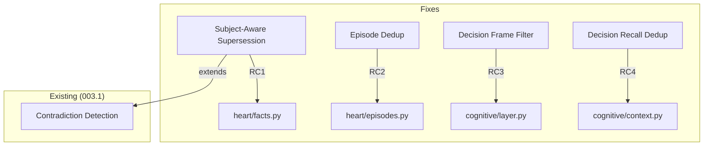

# 006.2 Context Quality — Dedup, Supersession, and Noise Reduction

**Status:** PLANNED
**Priority:** P1 — Stale/duplicate context degrades every response
**Prerequisites:** 003.1 (Heart Enhancements), 004 (Cognitive Layer), 005.5 (Noise Reduction)
**Estimated Effort:** 3-4 hours
**Branch:** `feat/006.2-context-quality`

## Problem

The system prompt gets polluted with stale, duplicate, and irrelevant context. Observed in production:

1. **Stale facts persist** — Nous learned "006 status: PLANNED" from a spec file. After the file was updated to "Shipped", the old fact remained active. Contradiction detection (003.1) didn't catch it because the facts have different wording, not direct contradictions.
2. **Duplicate episodes** — "Show me your current status" created 2 identical ongoing episodes. No dedup on episode creation.
3. **Informational responses recorded as decisions** — 5 pending decisions that are just status dumps ("Here's my full live status!"). Status/informational responses aren't decisions.
4. **Duplicate decisions in recall** — All 5 near-identical status decisions get injected into context, tripling the system prompt size.

Net effect: ~60% of the recalled context is noise. The agent sees its own past status dumps instead of useful memory.

## Root Causes

### RC1: Fact Supersession Too Narrow
`Heart.learn()` checks for contradictions via embedding similarity, but only flags exact contradictions. "006 status is PLANNED" and "006 is shipped" have moderate similarity (~0.7) but aren't flagged because the content differs enough. The threshold for supersession needs to be subject-aware: facts about the same subject should supersede each other more aggressively.

### RC2: No Episode Dedup
`CognitiveLayer.pre_turn()` creates a new episode for each session without checking if a near-identical episode is already ongoing. Two "show me status" messages from the same user create two episodes.

### RC3: Decision Recording Has No Frame Filter
Every turn that goes through the decision frame records a decision. But the frame selector sometimes picks "decision" for informational queries. There's no check for whether the response actually contains a decision vs just information.

### RC4: Decision Recall Has No Dedup
`ContextEngine._format_decisions()` formats all recalled decisions without checking for near-duplicates. 5 similar decisions → 5 blocks of nearly identical text in the system prompt.

## Architecture



## Files

| File | Change | Lines |
|------|--------|-------|
| `nous/heart/facts.py` | Subject-aware supersession on learn | ~40 |
| `nous/heart/episodes.py` | Dedup check before creating episode | ~25 |
| `nous/cognitive/layer.py` | Decision recording filter (frame + content check) | ~30 |
| `nous/cognitive/context.py` | Decision recall dedup | ~35 |
| `nous/cognitive/dedup.py` | Extract shared similarity util (reuse for decisions) | ~15 |
| `tests/test_context_quality.py` | **NEW** — Tests for all 4 fixes | ~250 |
| **Total** | | ~395 |

## Phase A: Subject-Aware Fact Supersession (~40 lines)

### A1: Problem

Current `learn()` flow:
1. Embed new fact
2. Search similar facts (cosine similarity > 0.85)
3. If found, flag as contradiction → both stay active

What should happen:
1. Embed new fact
2. Search facts **with same subject** (exact match or high similarity)
3. If same subject + new info is more recent → **supersede old fact** (mark inactive)
4. If different subject → normal flow

### A2: Implementation

**File: `nous/heart/facts.py`**

```python
async def learn(self, fact_input: FactInput, ...) -> UUID:
    """Store a fact, superseding older facts on the same subject."""
    ...
    # NEW: Subject-aware supersession
    if fact_input.subject:
        existing = await self._find_by_subject(
            fact_input.subject, agent_id, session
        )
        for old_fact in existing:
            if old_fact.active and old_fact.id != new_id:
                # Same subject, newer info supersedes
                old_fact.active = False
                old_fact.superseded_by = new_id
                logger.info(
                    "Superseded fact %s (subject=%s) with %s",
                    old_fact.id, fact_input.subject, new_id
                )
    ...

async def _find_by_subject(
    self, subject: str, agent_id: str, session: AsyncSession
) -> list[FactModel]:
    """Find active facts with matching subject (case-insensitive)."""
    result = await session.execute(
        select(FactModel).where(
            FactModel.agent_id == agent_id,
            FactModel.active == True,
            func.lower(FactModel.subject) == subject.lower(),
        )
    )
    return list(result.scalars().all())
```

### A3: Edge Cases
- Subject is empty/None → skip supersession (backward compat)
- Multiple old facts with same subject → supersede all
- New fact has lower confidence than old → still supersede (recency wins for same-subject)

## Phase B: Episode Dedup (~25 lines)

### B1: Problem

`CognitiveLayer.pre_turn()` calls `Heart.start_episode()` for each new session. If the same user sends similar messages in quick succession, multiple nearly-identical episodes are created.

### B2: Implementation

**File: `nous/heart/episodes.py`**

Add dedup check before creating:

```python
async def start(self, episode_input: EpisodeInput, ...) -> UUID:
    """Start a new episode, deduplicating against recent ongoing episodes."""
    ...
    # NEW: Check for duplicate ongoing episodes
    recent = await self._find_recent_ongoing(
        agent_id, session, minutes=30
    )
    for ep in recent:
        if self._is_similar(ep.summary, episode_input.summary):
            logger.debug(
                "Skipping duplicate episode, reusing %s", ep.id
            )
            return ep.id  # Return existing episode ID
    ...

async def _find_recent_ongoing(
    self, agent_id: str, session: AsyncSession, minutes: int = 30
) -> list[EpisodeModel]:
    """Find ongoing episodes started in the last N minutes."""
    cutoff = datetime.now(UTC) - timedelta(minutes=minutes)
    result = await session.execute(
        select(EpisodeModel).where(
            EpisodeModel.agent_id == agent_id,
            EpisodeModel.status == "ongoing",
            EpisodeModel.started_at >= cutoff,
        )
    )
    return list(result.scalars().all())

def _is_similar(self, a: str | None, b: str | None) -> bool:
    """Quick text similarity check (word overlap ratio)."""
    if not a or not b:
        return False
    words_a = set(a.lower().split())
    words_b = set(b.lower().split())
    if not words_a or not words_b:
        return False
    overlap = len(words_a & words_b)
    smaller = min(len(words_a), len(words_b))
    return (overlap / smaller) > 0.7  # 70% word overlap = duplicate
```

## Phase C: Decision Recording Filter (~30 lines)

### C1: Problem

The cognitive layer records a decision for every turn that uses the decision frame. But sometimes the frame selector picks "decision" for queries that are actually informational ("what's your status?"). The response is just information, not a decision.

### C2: Implementation

**File: `nous/cognitive/layer.py`**

Add a post-turn check before recording:

```python
async def post_turn(self, agent_id, session_id, turn_result, turn_context):
    ...
    # NEW: Skip decision recording for informational responses
    if self._is_informational_response(turn_result, turn_context):
        logger.debug("Skipping decision recording: informational response")
        # Still do everything else (monitor, episode update, etc.)
    else:
        # Existing decision recording logic
        ...

def _is_informational_response(self, turn_result: TurnResult, turn_context: TurnContext) -> bool:
    """Detect responses that are information, not decisions.
    
    Heuristics:
    1. No tools were called (pure text response)
    2. Response doesn't contain decision language
    3. Frame was conversation or question (not decision/task)
    """
    # Non-decision frames are informational by default
    non_decision_frames = {"conversation", "question", "creative"}
    if turn_context.frame.frame_id in non_decision_frames:
        return True
    
    # Even in decision/task frame: if no record_decision tool was called,
    # the agent didn't actually make a decision
    decision_tools = {"record_decision"}
    tools_used = {r.tool_name for r in turn_result.tool_results}
    if not tools_used & decision_tools:
        # No decision tool used — check if response looks like a status dump
        response_lower = turn_result.response_text[:500].lower()
        info_signals = ["here's", "current status", "here is", "available tools",
                        "i remember", "my memory", "what i know"]
        if any(signal in response_lower for signal in info_signals):
            return True
    
    return False
```

## Phase D: Decision Recall Dedup (~35 lines)

### D1: Problem

`ContextEngine._format_decisions()` includes all recalled decisions in the system prompt. When 5 near-identical status decisions exist, they all get included.

### D2: Implementation

**File: `nous/cognitive/context.py`**

Add dedup before formatting:

```python
def _format_decisions(self, decisions: list) -> str:
    """Format decisions as markdown, deduplicating near-duplicates."""
    # NEW: Dedup decisions by content similarity
    deduped = self._dedup_decisions(decisions)
    
    lines = ["## Related Decisions"]
    for d in deduped:
        status = d.outcome if hasattr(d, "outcome") and d.outcome else "pending"
        desc = d.decision[:120] if hasattr(d, "decision") else str(d)[:120]
        confidence = f" (confidence: {d.confidence:.2f})" if hasattr(d, "confidence") else ""
        lines.append(f"- [{status}] {desc}{confidence}")
    return "\n".join(lines)

def _dedup_decisions(self, decisions: list) -> list:
    """Remove near-duplicate decisions, keeping the most recent."""
    if len(decisions) <= 1:
        return decisions
    
    kept: list = []
    for d in decisions:
        desc = d.decision[:100] if hasattr(d, "decision") else str(d)[:100]
        is_dup = False
        for k in kept:
            k_desc = k.decision[:100] if hasattr(k, "decision") else str(k)[:100]
            if self._text_overlap(desc, k_desc) > 0.7:
                is_dup = True
                break
        if not is_dup:
            kept.append(d)
    return kept

def _text_overlap(self, a: str, b: str) -> float:
    """Word overlap ratio between two strings."""
    words_a = set(a.lower().split())
    words_b = set(b.lower().split())
    if not words_a or not words_b:
        return 0.0
    overlap = len(words_a & words_b)
    smaller = min(len(words_a), len(words_b))
    return overlap / smaller
```

### D3: Shared Utility

**File: `nous/cognitive/dedup.py`**

Extract the overlap function for reuse:

```python
def text_overlap(a: str, b: str) -> float:
    """Word overlap ratio between two strings.
    
    Used for deduplicating decisions, episodes, and facts
    where embedding-based similarity is overkill.
    """
    words_a = set(a.lower().split())
    words_b = set(b.lower().split())
    if not words_a or not words_b:
        return 0.0
    overlap = len(words_a & words_b)
    smaller = min(len(words_a), len(words_b))
    return overlap / smaller
```

Both episode dedup and decision dedup import from here.

## Phase E: Tests (~250 lines)

**File: `tests/test_context_quality.py`**

```python
class TestFactSupersession:
    """Subject-aware fact supersession."""
    # 1. New fact with same subject supersedes old fact
    # 2. Old fact marked inactive with superseded_by
    # 3. Different subject does not supersede
    # 4. Empty/None subject skips supersession
    # 5. Multiple old facts with same subject all superseded
    # 6. Case-insensitive subject matching
    # 7. Superseded fact not returned in search results

class TestEpisodeDedup:
    """Episode creation deduplication."""
    # 8. Identical summary within 30 min returns existing episode ID
    # 9. Similar summary (>70% overlap) returns existing episode
    # 10. Different summary creates new episode
    # 11. Same summary after 30 min creates new episode (window expired)
    # 12. Completed episodes are not reused (only ongoing)
    # 13. Empty summaries don't trigger false dedup

class TestDecisionRecordingFilter:
    """Skip recording decisions for informational responses."""
    # 14. Conversation frame response not recorded as decision
    # 15. Question frame response not recorded as decision
    # 16. Task frame with record_decision tool IS recorded
    # 17. Task frame with status dump language is filtered
    # 18. Decision frame with actual decision IS recorded
    # 19. Creative frame response not recorded
    # 20. Monitor and episode update still happen even when decision skipped

class TestDecisionRecallDedup:
    """Dedup near-identical decisions in context assembly."""
    # 21. 5 similar decisions reduced to 1
    # 22. 3 distinct decisions all kept
    # 23. Mix of similar and distinct: duplicates removed, unique kept
    # 24. Empty decisions list returns empty
    # 25. Single decision returns as-is
    # 26. Most recent duplicate is the one kept

class TestTextOverlap:
    """Shared text overlap utility."""
    # 27. Identical strings return 1.0
    # 28. No overlap returns 0.0
    # 29. Partial overlap returns correct ratio
    # 30. Case insensitive
    # 31. Empty string returns 0.0
    # 32. Single word strings work correctly
```

## Design Decisions

| # | Decision | Rationale |
|---|----------|-----------|
| D1 | Subject-based supersession (not embedding) | Same-subject facts should always supersede. Embedding similarity is too fuzzy — "006 PLANNED" and "006 shipped" might not be similar enough. Exact subject match is deterministic. |
| D2 | 70% word overlap threshold for dedup | High enough to catch near-duplicates ("Here's my status" vs "Here's my current status"), low enough to not false-positive on legitimately different content. |
| D3 | 30-minute window for episode dedup | Covers rapid message bursts. Longer would risk merging genuinely separate conversations. |
| D4 | Heuristic-based informational detection | No LLM call needed. Frame + tool usage + keyword signals are fast and sufficient. The cost of a false positive (not recording an actual decision) is low — the agent can always explicitly record_decision. |
| D5 | Word overlap over cosine similarity | Cheaper, no embedding call, good enough for dedup. Cosine similarity is better for search/recall; word overlap is better for "is this basically the same text?" |
| D6 | Recency wins for same-subject facts | Newer information about the same thing should replace older info, regardless of confidence. The world changes; facts must too. |

## Acceptance Criteria

- [ ] Facts with same subject supersede older facts automatically
- [ ] Superseded facts are inactive and not returned in searches
- [ ] Duplicate ongoing episodes are reused, not recreated
- [ ] Informational responses (status dumps, memory recalls) not recorded as decisions
- [ ] Near-identical decisions deduped in context assembly (5 → 1)
- [ ] Text overlap utility shared between episode and decision dedup
- [ ] Existing 003.1 contradiction detection still works (not replaced)
- [ ] All 32 tests pass
- [ ] No regression in existing context assembly tests

## Implementation Order

1. `nous/cognitive/dedup.py` — Extract `text_overlap()` utility
2. `nous/heart/facts.py` — Subject-aware supersession in `learn()`
3. `nous/heart/episodes.py` — Dedup check in `start()`
4. `nous/cognitive/layer.py` — `_is_informational_response()` filter
5. `nous/cognitive/context.py` — `_dedup_decisions()` in formatting
6. `tests/test_context_quality.py` — 32 tests
