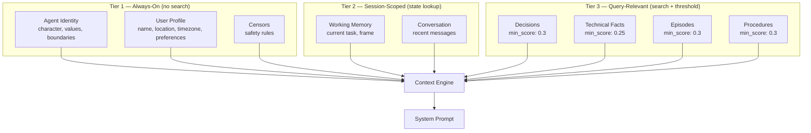

# 008 — Agent Identity & Tiered Context Model

> **Status:** Planned
> **Priority:** P0
> **Features:** F018 (Agent Identity) + 007.5 (Tiered Context) + #57 (Recall Threshold)
> **Depends on:** F002 (Heart), F003 (Cognitive Layer), F005 (Context Engine)
> **Estimated effort:** ~6-8 hours

## Problem

The context engine has a single retrieval strategy: semantic similarity search across all memory types. This causes two conflicting failures:

1. **Without threshold** — irrelevant content fills context (808 tokens of Nous facts for a weather query)
2. **With threshold** — identity/preference facts get filtered out (Decisions: 0, Facts: 0, Episodes: 0)

The root cause: **all facts are treated equally.** "Tim prefers Celsius" and "Nous spec 006.1 is planned" go through the same search pipeline, but they serve fundamentally different purposes.

## Solution: Tiered Context Model

Split context assembly into three tiers with different retrieval strategies:



### Current Context Assembly (priorities 1-8)

| Priority | Section | Current Strategy | New Tier |
|----------|---------|-----------------|----------|
| 1 | Identity prompt | Static env var | **Tier 1** — from DB |
| 2 | Censors | Always loaded | **Tier 1** — unchanged |
| 3 | Frame | Always loaded | **Tier 2** — unchanged |
| 4 | Working memory | Session lookup | **Tier 2** — unchanged |
| 5 | Decisions | Semantic search | **Tier 3** — with threshold |
| 6 | Facts | Semantic search (ALL facts) | **Split: Tier 1 + Tier 3** |
| 7 | Procedures | Semantic search | **Tier 3** — with threshold |
| 8 | Episodes | Semantic search | **Tier 3** — with threshold |

**The key change:** Facts split across tiers. Identity/preference facts → Tier 1 (always loaded). Technical/concept facts → Tier 3 (search with threshold).

## Implementation

### Part A: Agent Identity Table (F018)

#### A1. New ORM Model

```python
# storage/models.py

class AgentIdentity(Base):
    __tablename__ = "agent_identity"
    __table_args__ = (
        UniqueConstraint("agent_id", "section", "version", name="uq_identity_agent_section_version"),
        {"schema": "nous_system"},
    )

    id: Mapped[uuid.UUID] = mapped_column(UUID(as_uuid=True), primary_key=True, server_default=func.gen_random_uuid())
    agent_id: Mapped[str] = mapped_column(String(50), ForeignKey("nous_system.agents.agent_id"), nullable=False)
    section: Mapped[str] = mapped_column(String(50), nullable=False)
    content: Mapped[str] = mapped_column(Text, nullable=False)
    version: Mapped[int] = mapped_column(Integer, nullable=False, server_default="1")
    updated_at: Mapped[datetime] = mapped_column(server_default=func.now())
    updated_by: Mapped[str | None] = mapped_column(String(50))
    previous_version_id: Mapped[uuid.UUID | None] = mapped_column(UUID(as_uuid=True), ForeignKey("nous_system.agent_identity.id"))
```

#### A2. Identity Manager

```python
# nous/identity/manager.py

class IdentityManager:
    SECTIONS = ["character", "values", "protocols", "preferences", "boundaries"]

    def __init__(self, database: Database, agent_id: str):
        self.db = database
        self.agent_id = agent_id

    async def get_current(self, session: AsyncSession | None = None) -> dict[str, str]:
        """Load latest version of each identity section."""
        # SELECT DISTINCT ON (section) ... ORDER BY section, version DESC
        ...

    async def update_section(self, section: str, content: str,
                              updated_by: str = "user", session: AsyncSession | None = None) -> None:
        """Create new version of a section."""
        ...

    async def get_user_profile(self, session: AsyncSession | None = None) -> dict[str, str]:
        """Load user-related identity (preferences section + user facts)."""
        ...

    def assemble_prompt(self, sections: dict[str, str]) -> str:
        """Assemble identity sections into system prompt text."""
        parts = []
        for section_name in self.SECTIONS:
            if section_name in sections and sections[section_name]:
                parts.append(f"## {section_name.title()}\n{sections[section_name]}")
        return "\n\n".join(parts)
```

#### A3. Seed from Environment + Existing Facts

On first startup (no identity rows in DB):

```python
async def seed(self, identity_prompt: str, heart: Heart, session: AsyncSession):
    """Seed identity table from env var + existing user facts."""
    existing = await self.get_current(session=session)
    if existing:
        return  # Already seeded

    # 1. Seed character from NOUS_IDENTITY_PROMPT
    await self.update_section("character", identity_prompt, updated_by="system", session=session)

    # 2. Migrate user preference/person facts to identity
    user_facts = await heart.search_facts("", category="preference", session=session)
    person_facts = await heart.search_facts("", category="person", session=session)
    rule_facts = await heart.search_facts("", category="rule", session=session)

    if user_facts or person_facts:
        prefs = "\n".join(f"- {f.content}" for f in user_facts)
        person = "\n".join(f"- {f.content}" for f in person_facts)
        rules = "\n".join(f"- {f.content}" for f in rule_facts)
        content = ""
        if person:
            content += f"### User\n{person}\n\n"
        if prefs:
            content += f"### Preferences\n{prefs}\n\n"
        if rules:
            content += f"### Rules\n{rules}"
        await self.update_section("preferences", content.strip(), updated_by="system", session=session)

    # 3. Seed empty boundaries from censors
    await self.update_section("boundaries",
        "See Active Censors section for current safety rules.",
        updated_by="system", session=session)
```

### Part B: Tiered Context Engine

#### B1. Tier 1 — Always-On Identity

Replace the static identity prompt with DB-backed identity:

```python
# context.py — build()

# 1. Identity (Tier 1 — always loaded, no search)
identity_sections = await self._identity_manager.get_current(session=session)
if identity_sections:
    identity_text = self._identity_manager.assemble_prompt(identity_sections)
else:
    # Fallback to static env var
    identity_text = self._identity_prompt or ""

identity_text = self._truncate_to_budget(identity_text, budget.identity)
sections.append(
    ContextSection(priority=1, label="Identity", content=identity_text,
                   token_estimate=self._estimate_tokens(identity_text))
)
```

#### B2. Tier 1 — User Profile Facts (always loaded)

New section between identity and censors:

```python
# 1b. User Profile (Tier 1 — always loaded)
# Load preference/person/rule facts without semantic search
profile_facts = await self._heart.list_facts_by_category(
    categories=["preference", "person", "rule"],
    active_only=True,
    session=session,
)
if profile_facts:
    profile_text = self._format_facts(profile_facts)
    profile_text = self._truncate_to_budget(profile_text, budget.user_profile)
    sections.append(
        ContextSection(priority=1, label="User Profile", content=profile_text,
                       token_estimate=self._estimate_tokens(profile_text))
    )
```

This requires a new method on Heart:

```python
# heart/facts.py

async def list_by_category(self, categories: list[str], active_only: bool = True,
                            limit: int = 20, session: AsyncSession | None = None) -> list[FactSummary]:
    """Load facts by category without semantic search. For Tier 1 always-on context."""
    stmt = select(Fact).where(
        Fact.agent_id == self.agent_id,
        Fact.category.in_(categories),
    )
    if active_only:
        stmt = stmt.where(Fact.active == True)
    stmt = stmt.order_by(Fact.confidence.desc()).limit(limit)
    result = await session.execute(stmt)
    return [self._to_summary(f) for f in result.scalars().all()]
```

#### B3. Tier 3 — Search with Threshold

Re-apply min_score filtering to remaining memory types (same as reverted 007.5, but now only Tier 3 facts go through search):

```python
# 6. Facts (Tier 3 — search with threshold, exclude Tier 1 categories)
if budget.facts > 0 and "fact" not in skip_types:
    try:
        limit = _limits.get("fact", 5)
        q_text = _query_texts.get("fact", _default_query)
        # Exclude Tier 1 categories from search
        facts = await self._heart.search_facts(
            q_text, limit=limit, session=session,
            exclude_categories=["preference", "person", "rule"],
        )
        if facts:
            # Tier 3 threshold — safe because identity facts are in Tier 1
            facts = [f for f in facts if (f.score or 0) >= 0.25]
        if facts:
            ...
```

And for decisions/episodes/procedures:

```python
decisions = await self._brain.query(q_text, limit=limit, session=session)
if decisions:
    decisions = [d for d in decisions if (d.score or 0) >= 0.3]

episodes = await self._heart.search_episodes(q_text, limit=limit, session=session)
if episodes:
    episodes = [e for e in episodes if (e.score or 0) >= 0.3]

procedures = await self._heart.search_procedures(q_text, limit=limit, session=session)
if procedures:
    procedures = [p for p in procedures if (p.score or 0) >= 0.3]
```

#### B4. Context Budget Update

Add `user_profile` to the budget:

```python
@dataclass
class ContextBudget:
    identity: int = 300        # Tier 1
    user_profile: int = 200    # Tier 1 (NEW)
    censors: int = 200         # Tier 1
    frame: int = 150           # Tier 2
    working_memory: int = 200  # Tier 2
    decisions: int = 400       # Tier 3
    facts: int = 300           # Tier 3
    procedures: int = 200      # Tier 3
    episodes: int = 200        # Tier 3
```

## Expected Context Assembly

### Weather query (after 008)

```
## Identity                          (~200 tokens, Tier 1)
You are Nous, a cognitive AI agent...

## User Profile                      (~80 tokens, Tier 1, NEW)
- [Tim] Tim lives in Silver Spring, Maryland, USA
- [Tim] Tim prefers Celsius for temperature measurements.
- [Tim] Tim's local time zone is EST

## Active Censors                    (~30 tokens, Tier 1)
- BLOCK: api.key|token|password...

## Current Frame                     (~20 tokens, Tier 2)
Task Execution: Focused on completing a specific task

## Working Memory                    (~20 tokens, Tier 2)
Current task: tell me about weather

## Related Decisions                 (0 tokens, Tier 3 — nothing above 0.3)
## Relevant Facts                    (0 tokens, Tier 3 — nothing above 0.25)
## Past Episodes                     (0 tokens, Tier 3 — nothing above 0.3)

Total: ~350 tokens (vs 808 before, with Tim's prefs included)
```

### Nous technical query (after 008)

```
## Identity                          (~200 tokens, Tier 1)
## User Profile                      (~80 tokens, Tier 1)
## Active Censors                    (~30 tokens, Tier 1)
## Current Frame                     (~20 tokens, Tier 2)
## Working Memory                    (~20 tokens, Tier 2)
## Related Decisions                 (~200 tokens, Tier 3 — relevant ones above 0.3)
## Relevant Facts                    (~200 tokens, Tier 3 — Nous facts above 0.25)
## Past Episodes                     (~100 tokens, Tier 3 — relevant above 0.3)

Total: ~850 tokens (similar to now, but all relevant)
```

## Database Migration

```sql
-- New table
CREATE TABLE nous_system.agent_identity (
    id UUID PRIMARY KEY DEFAULT gen_random_uuid(),
    agent_id VARCHAR(50) NOT NULL REFERENCES nous_system.agents(agent_id),
    section VARCHAR(50) NOT NULL,
    content TEXT NOT NULL,
    version INTEGER NOT NULL DEFAULT 1,
    updated_at TIMESTAMPTZ NOT NULL DEFAULT NOW(),
    updated_by VARCHAR(50),
    previous_version_id UUID REFERENCES nous_system.agent_identity(id),
    UNIQUE(agent_id, section, version)
);

CREATE INDEX idx_identity_agent_section ON nous_system.agent_identity(agent_id, section);
```

No changes to existing tables. Existing `preference`/`person`/`rule` facts stay in `heart.facts` — they're read by category, not migrated.

## Files Changed

| File | Change | Lines |
|------|--------|-------|
| `nous/storage/models.py` | AgentIdentity ORM model | +20 |
| `nous/identity/__init__.py` | New package | +1 |
| `nous/identity/manager.py` | IdentityManager + seeding | +120 |
| `nous/identity/schemas.py` | IdentitySection, AgentIdentity models | +30 |
| `nous/heart/facts.py` | `list_by_category()` + `exclude_categories` param on search | +25 |
| `nous/cognitive/context.py` | Tier 1 identity + user profile, Tier 3 thresholds | +40 |
| `nous/cognitive/budget.py` | Add `user_profile` budget slot | +3 |
| `nous/main.py` | Initialize IdentityManager, run seed on startup | +15 |
| `nous/api/rest.py` | GET /identity, PUT /identity/{section} endpoints | +30 |
| `tests/test_identity.py` | Identity manager tests | +120 |
| `tests/test_tiered_context.py` | Tiered context assembly tests | +100 |
| `tests/test_recall_threshold.py` | Tier 3 threshold tests (from reverted 007.5) | +80 |

**Estimated:** ~585 lines new, ~40 lines modified

## Implementation Order

1. **A1** — ORM model + migration SQL
2. **A2** — IdentityManager (CRUD)
3. **A3** — Seed from env + existing facts
4. **B4** — Budget update (add user_profile)
5. **B1** — Tier 1 identity in context engine
6. **B2** — Tier 1 user profile facts (list_by_category)
7. **B3** — Tier 3 thresholds (re-apply 007.5 to non-Tier-1 facts)
8. REST endpoints (GET/PUT identity)
9. Tests

Steps 1-3 can be a first PR. Steps 4-7 are a second PR. Step 8 is a third.

## Self-Evolution Guardrails (Future)

Not in this spec — deferred to F018 Phase 2:
- Agent can update `preferences` and `protocols` only
- `character`, `values`, `boundaries` require user approval
- Max 1 identity update per day
- All changes versioned with rollback

## Open Questions

1. Should `person`/`preference`/`rule` facts be deactivated in `heart.facts` after seeding identity, or kept as-is?
2. Token budget for user_profile — 200 enough? Tim currently has 4 user facts (~80 tokens).
3. Should identity be cached in memory (avoid DB hit every turn) with TTL invalidation?
