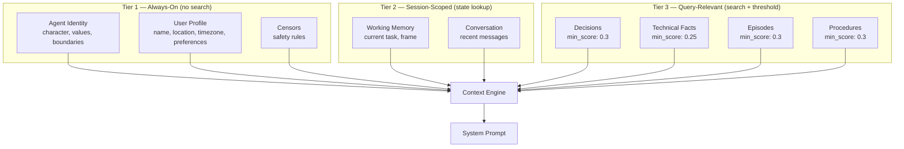

# 008 — Agent Identity & Tiered Context Model

> **Status:** Revised (post 3-agent review)
> **Priority:** P0
> **Features:** F018 (Agent Identity) + 007.5 (Tiered Context) + #57 (Recall Threshold)
> **Depends on:** F002 (Heart), F003 (Cognitive Layer), F005 (Context Engine)
> **Estimated effort:** ~8-10 hours

## 3-Agent Review Findings (2026-02-26)

Reviewed by Correctness (🔬), Architecture (🏗️), and Devil's Advocate (😈). All critical issues addressed below.

### Revisions Applied

| # | Finding | Source | Fix Applied |
|---|---------|--------|-------------|
| 1 | FK references `agents.agent_id` (doesn't exist) | 🔬 P1-1 | Changed to `agents.id`, `VARCHAR(100)` |
| 2 | `@tool` decorator doesn't exist in codebase | 🔬 P1-3 | Use `async def` + `dispatcher.register()` pattern |
| 3 | Initiation tools unreachable (no frame entry) | 🔬🏗️😈 | Add `"initiation"` to `FRAME_TOOLS`, force frame during initiation |
| 4 | Partial initiation = permanent limbo | 🏗️😈 | Check `is_initiated` flag, not `len(identity)`. Three states: UNINITIATED/IN_PROGRESS/COMPLETE |
| 5 | Existing deployments get "I'm new!" treatment | 🏗️😈 | Auto-detect existing facts at startup, auto-seed + mark initiated |
| 6 | `store_identity` section names don't match `SECTIONS` | 🔬😈 | Align tool schema with SECTIONS, drop `user_profile`, validate input |
| 7 | IdentityManager in both CognitiveLayer AND ContextEngine | 🏗️ | Load identity once in CognitiveLayer, pass string to ContextEngine |
| 8 | `status` stored as identity section (semantic mismatch) | 🏗️😈 | Add `is_initiated BOOLEAN` to `nous_system.agents` table instead |
| 9 | `DISTINCT ON` versioning is complex | 🏗️ | Add `is_current BOOLEAN` column, simple WHERE filter |
| 10 | Race condition on concurrent first messages | 🔬😈 | Atomic INSERT with ON CONFLICT for initiation claim |
| 11 | Normal tools available during initiation | 😈 | Initiation frame restricts tools to `store_identity` + `complete_initiation` only |
| 12 | Migration numbered 008 (no 007) | 🔬 | Renumber to `007_agent_identity.sql` |
| 13 | Identity should be cached | 🏗️ | 60s TTL cache on IdentityManager, invalidated on update |

## Problem

The context engine has a single retrieval strategy: semantic similarity search across all memory types. This causes two conflicting failures:

1. **Without threshold** — irrelevant content fills context (808 tokens of Nous facts for a weather query)
2. **With threshold** — identity/preference facts get filtered out (Decisions: 0, Facts: 0, Episodes: 0)

The root cause: **all facts are treated equally.** "Tim prefers Celsius" and "Nous spec 006.1 is planned" go through the same search pipeline, but they serve fundamentally different purposes.

## Solution: Tiered Context Model

Split context assembly into three tiers with different retrieval strategies:



### Current Context Assembly (priorities 1-8)

| Priority | Section | Current Strategy | New Tier |
|----------|---------|-----------------|----------|
| 1 | Identity prompt | Static env var | **Tier 1** — from DB |
| 2 | Censors | Always loaded | **Tier 1** — unchanged |
| 3 | Frame | Always loaded | **Tier 2** — unchanged |
| 4 | Working memory | Session lookup | **Tier 2** — unchanged |
| 5 | Decisions | Semantic search | **Tier 3** — with threshold |
| 6 | Facts | Semantic search (ALL facts) | **Split: Tier 1 + Tier 3** |
| 7 | Procedures | Semantic search | **Tier 3** — with threshold |
| 8 | Episodes | Semantic search | **Tier 3** — with threshold |

**The key change:** Facts split across tiers. Identity/preference facts → Tier 1 (always loaded). Technical/concept facts → Tier 3 (search with threshold).

## Implementation

### Part A: Agent Identity Table (F018)

#### A1. New ORM Model

```python
# storage/models.py

class AgentIdentity(Base):
    __tablename__ = "agent_identity"
    __table_args__ = (
        UniqueConstraint("agent_id", "section", "version", name="uq_identity_agent_section_version"),
        {"schema": "nous_system"},
    )

    id: Mapped[uuid.UUID] = mapped_column(UUID(as_uuid=True), primary_key=True, server_default=func.gen_random_uuid())
    agent_id: Mapped[str] = mapped_column(String(50), ForeignKey("nous_system.agents.agent_id"), nullable=False)
    section: Mapped[str] = mapped_column(String(50), nullable=False)
    content: Mapped[str] = mapped_column(Text, nullable=False)
    version: Mapped[int] = mapped_column(Integer, nullable=False, server_default="1")
    updated_at: Mapped[datetime] = mapped_column(server_default=func.now())
    updated_by: Mapped[str | None] = mapped_column(String(50))
    previous_version_id: Mapped[uuid.UUID | None] = mapped_column(UUID(as_uuid=True), ForeignKey("nous_system.agent_identity.id"))
```

#### A2. Identity Manager

```python
# nous/identity/manager.py

class IdentityManager:
    SECTIONS = ["character", "values", "protocols", "preferences", "boundaries"]

    def __init__(self, database: Database, agent_id: str):
        self.db = database
        self.agent_id = agent_id

    async def get_current(self, session: AsyncSession | None = None) -> dict[str, str]:
        """Load latest version of each identity section."""
        # SELECT DISTINCT ON (section) ... ORDER BY section, version DESC
        ...

    async def update_section(self, section: str, content: str,
                              updated_by: str = "user", session: AsyncSession | None = None) -> None:
        """Create new version of a section."""
        ...

    async def get_user_profile(self, session: AsyncSession | None = None) -> dict[str, str]:
        """Load user-related identity (preferences section + user facts)."""
        ...

    def assemble_prompt(self, sections: dict[str, str]) -> str:
        """Assemble identity sections into system prompt text."""
        parts = []
        for section_name in self.SECTIONS:
            if section_name in sections and sections[section_name]:
                parts.append(f"## {section_name.title()}\n{sections[section_name]}")
        return "\n\n".join(parts)
```

#### A3. Initiation Protocol (replaces static seeding)

Instead of silently seeding from env vars, Nous runs an **interactive first-conversation protocol** when no identity exists in the DB. This is how Nous and its user get to know each other.

##### Detection

```python
# cognitive/layer.py — pre_turn()

async def _check_initiation(self, agent_id: str, session: AsyncSession) -> bool:
    """Check if identity exists. If not, trigger initiation protocol."""
    identity = await self._identity_manager.get_current(session=session)
    return len(identity) == 0  # No sections = first run
```

On first user message, if `_check_initiation()` returns True, the cognitive layer injects the initiation system prompt instead of normal context.

##### Initiation System Prompt

```python
INITIATION_PROMPT = """You are a new AI agent running for the first time. You have no identity yet.
Your job is to introduce yourself and learn about your user through natural conversation.

You MUST cover these topics (in natural order, not as a checklist):

1. **Your name** — Your default name is "Nous" (Greek for mind). Ask if they'd like to
   keep it or give you a different name. Suggest a few fun alternatives if they're unsure.

2. **Their name** — What should you call them?

3. **Their location & timezone** — Helps with weather, time references, local context.

4. **Their preferences** — Temperature units (Celsius/Fahrenheit), communication style
   (concise vs detailed), formatting preferences.

5. **Your personality** — Ask what vibe they want: formal/professional, casual/friendly,
   technical/precise, playful/witty. Offer to blend styles.

6. **Proactivity level** — Should you volunteer information and suggestions, or wait to
   be asked? Should you check in proactively or stay quiet until needed?

7. **Initial censors/boundaries** — Are there topics to avoid? Data that should never be
   stored? Actions that need approval first?

As you learn each piece of information, call the `store_identity` tool to save it.
When all topics are covered, call `complete_initiation` to finish.

Be warm, natural, and conversational — NOT robotic. This is a first meeting, not a form.
Show personality from the start. Use humor if it fits."""
```

##### Initiation Tools

Two special tools available only during initiation:

```python
# nous/identity/tools.py

@tool
async def store_identity(section: str, content: str) -> str:
    """Store a piece of identity information.

    Args:
        section: One of: character, preferences, boundaries, user_profile
        content: The information to store
    """
    await identity_manager.update_section(section, content, updated_by="initiation")
    return f"Stored {section} identity."

@tool
async def complete_initiation() -> str:
    """Mark initiation as complete. Call when all topics have been covered."""
    await identity_manager.update_section(
        "status", "initiated", updated_by="system"
    )
    return "Initiation complete! I'm ready to work."
```

##### Conversation Flow Example

```
Nous:  Hey! 👋 I just came online for the first time. I'm Nous — it's Greek
       for "mind," which felt right for an AI that's trying to build one.

       Before we dive in, I'd love to get to know you. And honestly, I'm still
       figuring out who I am too — so maybe we can sort that out together.

       First things first — should I stay "Nous," or do you have something
       better in mind?

User:  Nous is fine actually

Nous:  Nous it is! 🧠 And who do I have the pleasure of working with?

User:  Tim

Nous:  Good to meet you, Tim. Where are you based? Helps me with time zones,
       weather, that kind of thing.

User:  Silver Spring MD

Nous:  East coast — noted. I'll use EST for time references.

       Quick preference: Celsius or Fahrenheit?

User:  Celsius

Nous:  A person of culture. 🌡️

       Now for the fun part — what kind of AI do you want me to be? I can be:
       • 🎯 Technical and precise — straight to the point
       • 💬 Casual and friendly — like a smart coworker
       • 🧪 Curious and proactive — I'll dig into things on my own
       • Mix of the above?

User:  casual but technical when needed. be proactive.

Nous:  Got it — casual default, technical when the work calls for it, and I
       won't wait around to be useful.

       Last thing — any guardrails I should know about? Topics to avoid,
       data that should never be stored, actions I should always ask
       before taking?

User:  never store API keys or passwords. ask before sending emails.

Nous:  Locked in:
       🔒 Never store credentials
       ✋ Ask before external communications

       I think we're good! I know who you are, who I am, and how we work
       together. Let's build something. What are you working on?
```

##### Identity Stored After Initiation

```
system.agent_identity rows:
┌─────────────┬────────────────────────────────────────────────────┐
│ section     │ content                                            │
├─────────────┼────────────────────────────────────────────────────┤
│ character   │ Name: Nous                                         │
│             │ Personality: Casual and friendly, technical when    │
│             │ needed. Proactive — volunteer info and suggestions. │
├─────────────┼────────────────────────────────────────────────────┤
│ preferences │ User: Tim                                          │
│             │ Location: Silver Spring, MD                         │
│             │ Timezone: EST (America/New_York)                    │
│             │ Temperature: Celsius                                │
│             │ Communication: Casual, emoji ok                     │
├─────────────┼────────────────────────────────────────────────────┤
│ boundaries  │ Never store API keys, tokens, or passwords.        │
│             │ Ask before sending emails or external messages.     │
├─────────────┼────────────────────────────────────────────────────┤
│ status      │ initiated                                          │
└─────────────┴────────────────────────────────────────────────────┘
```

##### Edge Cases

- **Existing deployment (upgrade path):** If `heart.facts` already has `preference`/`person` facts but no identity rows, show a shorter initiation: "Hey, I know some things about you already — Tim, Silver Spring, Celsius. Want to confirm and fill in the gaps?"
- **User skips questions:** Store what was given, mark initiation complete. Nous learns the rest organically through `learn_fact` over time.
- **Multi-user:** Each `agent_id` gets its own initiation. Identity is per-agent, not global.
- **Re-initiation:** A `/reinitiate` command can reset identity and re-run the protocol.

### Part B: Tiered Context Engine

#### B1. Tier 1 — Always-On Identity

Replace the static identity prompt with DB-backed identity:

```python
# context.py — build()

# 1. Identity (Tier 1 — always loaded, no search)
identity_sections = await self._identity_manager.get_current(session=session)
if identity_sections:
    identity_text = self._identity_manager.assemble_prompt(identity_sections)
else:
    # Fallback to static env var
    identity_text = self._identity_prompt or ""

identity_text = self._truncate_to_budget(identity_text, budget.identity)
sections.append(
    ContextSection(priority=1, label="Identity", content=identity_text,
                   token_estimate=self._estimate_tokens(identity_text))
)
```

#### B2. Tier 1 — User Profile Facts (always loaded)

New section between identity and censors:

```python
# 1b. User Profile (Tier 1 — always loaded)
# Load preference/person/rule facts without semantic search
profile_facts = await self._heart.list_facts_by_category(
    categories=["preference", "person", "rule"],
    active_only=True,
    session=session,
)
if profile_facts:
    profile_text = self._format_facts(profile_facts)
    profile_text = self._truncate_to_budget(profile_text, budget.user_profile)
    sections.append(
        ContextSection(priority=1, label="User Profile", content=profile_text,
                       token_estimate=self._estimate_tokens(profile_text))
    )
```

This requires a new method on Heart:

```python
# heart/facts.py

async def list_by_category(self, categories: list[str], active_only: bool = True,
                            limit: int = 20, session: AsyncSession | None = None) -> list[FactSummary]:
    """Load facts by category without semantic search. For Tier 1 always-on context."""
    stmt = select(Fact).where(
        Fact.agent_id == self.agent_id,
        Fact.category.in_(categories),
    )
    if active_only:
        stmt = stmt.where(Fact.active == True)
    stmt = stmt.order_by(Fact.confidence.desc()).limit(limit)
    result = await session.execute(stmt)
    return [self._to_summary(f) for f in result.scalars().all()]
```

#### B3. Tier 3 — Search with Threshold

Re-apply min_score filtering to remaining memory types (same as reverted 007.5, but now only Tier 3 facts go through search):

```python
# 6. Facts (Tier 3 — search with threshold, exclude Tier 1 categories)
if budget.facts > 0 and "fact" not in skip_types:
    try:
        limit = _limits.get("fact", 5)
        q_text = _query_texts.get("fact", _default_query)
        # Exclude Tier 1 categories from search
        facts = await self._heart.search_facts(
            q_text, limit=limit, session=session,
            exclude_categories=["preference", "person", "rule"],
        )
        if facts:
            # Tier 3 threshold — safe because identity facts are in Tier 1
            facts = [f for f in facts if (f.score or 0) >= 0.25]
        if facts:
            ...
```

And for decisions/episodes/procedures:

```python
decisions = await self._brain.query(q_text, limit=limit, session=session)
if decisions:
    decisions = [d for d in decisions if (d.score or 0) >= 0.3]

episodes = await self._heart.search_episodes(q_text, limit=limit, session=session)
if episodes:
    episodes = [e for e in episodes if (e.score or 0) >= 0.3]

procedures = await self._heart.search_procedures(q_text, limit=limit, session=session)
if procedures:
    procedures = [p for p in procedures if (p.score or 0) >= 0.3]
```

#### B4. Context Budget Update

Add `user_profile` to the budget:

```python
@dataclass
class ContextBudget:
    identity: int = 300        # Tier 1
    user_profile: int = 200    # Tier 1 (NEW)
    censors: int = 200         # Tier 1
    frame: int = 150           # Tier 2
    working_memory: int = 200  # Tier 2
    decisions: int = 400       # Tier 3
    facts: int = 300           # Tier 3
    procedures: int = 200      # Tier 3
    episodes: int = 200        # Tier 3
```

## Expected Context Assembly

### Weather query (after 008)

```
## Identity                          (~200 tokens, Tier 1)
You are Nous, a cognitive AI agent...

## User Profile                      (~80 tokens, Tier 1, NEW)
- [Tim] Tim lives in Silver Spring, Maryland, USA
- [Tim] Tim prefers Celsius for temperature measurements.
- [Tim] Tim's local time zone is EST

## Active Censors                    (~30 tokens, Tier 1)
- BLOCK: api.key|token|password...

## Current Frame                     (~20 tokens, Tier 2)
Task Execution: Focused on completing a specific task

## Working Memory                    (~20 tokens, Tier 2)
Current task: tell me about weather

## Related Decisions                 (0 tokens, Tier 3 — nothing above 0.3)
## Relevant Facts                    (0 tokens, Tier 3 — nothing above 0.25)
## Past Episodes                     (0 tokens, Tier 3 — nothing above 0.3)

Total: ~350 tokens (vs 808 before, with Tim's prefs included)
```

### Nous technical query (after 008)

```
## Identity                          (~200 tokens, Tier 1)
## User Profile                      (~80 tokens, Tier 1)
## Active Censors                    (~30 tokens, Tier 1)
## Current Frame                     (~20 tokens, Tier 2)
## Working Memory                    (~20 tokens, Tier 2)
## Related Decisions                 (~200 tokens, Tier 3 — relevant ones above 0.3)
## Relevant Facts                    (~200 tokens, Tier 3 — Nous facts above 0.25)
## Past Episodes                     (~100 tokens, Tier 3 — relevant above 0.3)

Total: ~850 tokens (similar to now, but all relevant)
```

## Database Changes

No changes to existing tables. Existing `preference`/`person`/`rule` facts stay in `heart.facts` — they're read by category, not migrated.

### New table: `nous_system.agent_identity`

```sql
CREATE TABLE nous_system.agent_identity (
    id UUID PRIMARY KEY DEFAULT gen_random_uuid(),
    agent_id VARCHAR(50) NOT NULL REFERENCES nous_system.agents(agent_id),
    section VARCHAR(50) NOT NULL,
    content TEXT NOT NULL,
    version INTEGER NOT NULL DEFAULT 1,
    updated_at TIMESTAMPTZ NOT NULL DEFAULT NOW(),
    updated_by VARCHAR(50),
    previous_version_id UUID REFERENCES nous_system.agent_identity(id),
    UNIQUE(agent_id, section, version)
);

CREATE INDEX idx_identity_agent_section ON nous_system.agent_identity(agent_id, section);
```

### Deployment (automatic — no manual SQL)

Nous has an auto-migration system (`nous/storage/migrator.py`) that discovers `sql/migrations/*.sql` files on startup and applies them in order.

**New installs:** Table added to `sql/init.sql` (runs on fresh DB setup).

**Existing installs (upgrade):** New migration file `sql/migrations/008_agent_identity.sql` — auto-applied on next container restart. Tracked in `nous_system.schema_migrations`.

```
sql/
├── init.sql                          ← add agent_identity here
├── seed.sql
└── migrations/
    ├── 006_event_bus.sql             ← existing
    └── 008_agent_identity.sql        ← NEW (auto-applied on startup)
```

Users just pull the new image and restart. Zero manual steps.

## Files Changed

| File | Change | Lines |
|------|--------|-------|
| `nous/storage/models.py` | AgentIdentity ORM model | +20 |
| `nous/identity/__init__.py` | New package | +1 |
| `nous/identity/manager.py` | IdentityManager (CRUD + assemble) | +120 |
| `nous/identity/schemas.py` | IdentitySection, AgentIdentity models | +30 |
| `nous/identity/tools.py` | `store_identity` + `complete_initiation` tools | +40 |
| `nous/identity/protocol.py` | Initiation prompt + detection logic | +60 |
| `nous/heart/facts.py` | `list_by_category()` + `exclude_categories` param on search | +25 |
| `nous/cognitive/context.py` | Tier 1 identity + user profile, Tier 3 thresholds | +40 |
| `nous/cognitive/layer.py` | `_check_initiation()` + initiation routing | +20 |
| `nous/cognitive/budget.py` | Add `user_profile` budget slot | +3 |
| `nous/main.py` | Initialize IdentityManager | +10 |
| `nous/api/rest.py` | GET /identity, PUT /identity/{section} endpoints | +30 |
| `tests/test_identity.py` | Identity manager tests | +120 |
| `tests/test_initiation.py` | Initiation protocol tests | +80 |
| `tests/test_tiered_context.py` | Tiered context assembly tests | +100 |
| `tests/test_recall_threshold.py` | Tier 3 threshold tests | +80 |

**Estimated:** ~780 lines new, ~40 lines modified

## Implementation Order

### PR 1 — Identity Foundation
1. **A1** — ORM model + migration SQL
2. **A2** — IdentityManager (CRUD)
3. **A3** — Initiation protocol (prompt, tools, detection)
4. Tests for identity + initiation

### PR 2 — Tiered Context
5. **B4** — Budget update (add user_profile)
6. **B1** — Tier 1 identity in context engine
7. **B2** — Tier 1 user profile facts (list_by_category)
8. **B3** — Tier 3 thresholds (re-apply 007.5 to non-Tier-1 facts)
9. Tests for tiered context + threshold

### PR 3 — API + Polish
10. REST endpoints (GET/PUT identity, POST /reinitiate)
11. Telegram `/identity` command to view current identity
12. Edge case: upgrade path for existing deployments with facts but no identity

## Self-Evolution Guardrails (Future)

Not in this spec — deferred to F018 Phase 2:
- Agent can update `preferences` and `protocols` only
- `character`, `values`, `boundaries` require user approval
- Max 1 identity update per day
- All changes versioned with rollback

## Open Questions

1. Should `person`/`preference`/`rule` facts be deactivated in `heart.facts` after initiation, or kept as-is? (Recommendation: keep as-is — no data loss, Tier 1 reads by category anyway)
2. Token budget for user_profile — 200 enough? Tim currently has 4 user facts (~80 tokens).
3. Should identity be cached in memory (avoid DB hit every turn) with TTL invalidation?
4. Should initiation create default censors (credential blocking) or only what the user explicitly mentions?
5. How to handle the upgrade path when Nous already has facts but no identity? Short initiation vs auto-seed?
