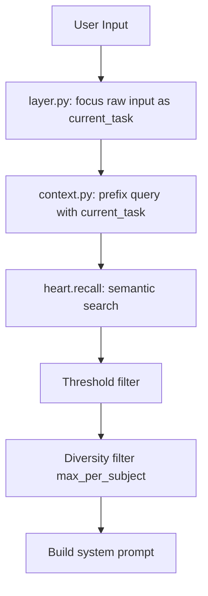
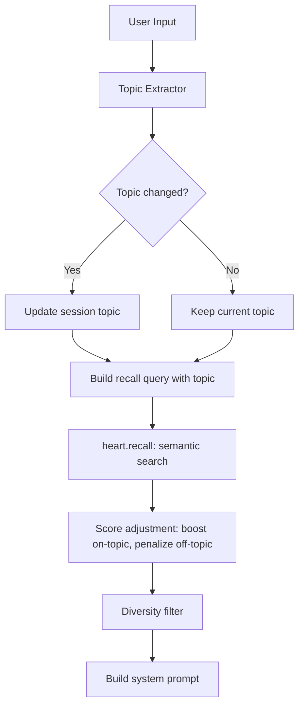

# 008.2 — Topic-Aware Recall v2

> **Status:** Draft
> **Priority:** P0
> **Issue:** #52
> **Supersedes:** 007.2 (partial implementation)
> **Estimated effort:** ~6-8 hours (2 phases)

## Problem

Despite 007.2's topic-enhanced query and diversity filter, recall still fails on topic switches. The root causes:

1. **`current_task` is raw user input, not a topic.** `layer.py:287` sets `focus(user_input[:200])` — so `current_task` is "what do you know about cognition-engines?" not "cognition-engines". The topic prefix then becomes `"what do you know about cognition-engines?: what do you know about cognition-engines?"` — doubling the query (partially fixed by equality check, but near-duplicates still slip through).

2. **No topic extraction.** There's no mechanism to extract the actual topic from user input. "Switch to cognition-engines, what do you know?" should produce topic=`cognition-engines`, not the full sentence.

3. **Diversity filter is too weak.** `max_per_subject=3` for decisions and `max_per_subject=2` for facts doesn't help when 90% of content shares the same subject prefix. The filter needs a topic-aware boost, not just a cap.

4. **No topic persistence across turns.** If the user says "tell me about cognition-engines" in turn 1, then "what's the latest?" in turn 2, the topic reverts to the vague query "what's the latest?" with no memory of the established topic.

5. **No negative signal.** When the user explicitly switches topics ("now let's talk about X"), old-topic results should be penalized, not just capped.

## Current Flow



**Problems at each stage:**
- B: `current_task` is not a topic
- C: Prefix is often a near-duplicate of input
- D: Semantic search returns dominant-topic results regardless
- F: Caps per-subject but doesn't boost on-topic results

## Proposed Flow



## Design

### Phase 1: Topic Extraction + Persistence

#### 1.1 Topic Extractor (lightweight, no LLM)

Extract topic from user input using heuristics + keyword matching against known subjects in the DB.

```python
# nous/cognitive/topic.py

class TopicExtractor:
    """Extract conversation topic from user input.

    Uses heuristics first (explicit markers), then falls back to
    matching against known subjects in the database.
    """

    # Explicit topic switch markers
    SWITCH_PATTERNS = [
        r"(?:let'?s |now |switch to |talk about |focus on |moving to )(.+?)(?:\.|,|$)",
        r"(?:what about |how about |regarding |about )(.+?)(?:\?|\.|,|$)",
        r"(?:tell me about |explain |describe )(.+?)(?:\?|\.|,|$)",
    ]

    def __init__(self, known_subjects: list[str] | None = None):
        self._known_subjects = known_subjects or []
        self._compiled = [re.compile(p, re.IGNORECASE) for p in self.SWITCH_PATTERNS]

    def update_known_subjects(self, subjects: list[str]) -> None:
        """Refresh the known subjects list (call at startup or periodically)."""
        self._known_subjects = subjects

    def extract(self, user_input: str, current_topic: str | None = None) -> TopicResult:
        """Extract topic from user input.

        Returns:
            TopicResult with:
                topic: The extracted or maintained topic
                is_switch: True if this is a topic change
                confidence: 0.0-1.0 how confident we are in the extraction
                method: How the topic was extracted
        """
        # 1. Check for explicit switch markers
        for pattern in self._compiled:
            match = pattern.search(user_input)
            if match:
                candidate = match.group(1).strip().lower()
                # Validate against known subjects
                best_match = self._match_known(candidate)
                if best_match:
                    return TopicResult(
                        topic=best_match,
                        is_switch=best_match != (current_topic or "").lower(),
                        confidence=0.9,
                        method="explicit_switch",
                    )
                # Use raw candidate if no known match
                return TopicResult(
                    topic=candidate,
                    is_switch=candidate != (current_topic or "").lower(),
                    confidence=0.7,
                    method="explicit_unmatched",
                )

        # 2. Check if input contains a known subject
        input_lower = user_input.lower()
        for subject in sorted(self._known_subjects, key=len, reverse=True):
            if subject.lower() in input_lower:
                return TopicResult(
                    topic=subject.lower(),
                    is_switch=subject.lower() != (current_topic or "").lower(),
                    confidence=0.8,
                    method="keyword_match",
                )

        # 3. No topic detected — maintain current
        return TopicResult(
            topic=current_topic,
            is_switch=False,
            confidence=0.5,
            method="maintained",
        )

    def _match_known(self, candidate: str) -> str | None:
        """Fuzzy match candidate against known subjects."""
        candidate_lower = candidate.lower()
        # Exact match
        for s in self._known_subjects:
            if s.lower() == candidate_lower:
                return s
        # Substring match (candidate in subject or vice versa)
        for s in self._known_subjects:
            if candidate_lower in s.lower() or s.lower() in candidate_lower:
                return s
        return None


@dataclass
class TopicResult:
    topic: str | None
    is_switch: bool
    confidence: float
    method: str  # explicit_switch, explicit_unmatched, keyword_match, maintained
```

#### 1.2 Known Subjects Collection

At startup (or on first context build), collect distinct subjects from:
- `brain.decisions` — distinct `subject` column
- `heart.facts` — distinct `subject` column
- `heart.episodes` — distinct `title` column

Cache in `ContextEngine` and refresh every N turns (e.g., 50).

```python
# context.py — init or lazy load
async def _refresh_known_subjects(self, session: AsyncSession) -> None:
    """Collect known subjects from all memory types."""
    subjects = set()
    # Decisions
    result = await session.execute(
        select(distinct(Decision.subject)).where(Decision.subject.isnot(None))
    )
    subjects.update(r[0] for r in result)
    # Facts
    result = await session.execute(
        select(distinct(Fact.subject)).where(Fact.subject.isnot(None))
    )
    subjects.update(r[0] for r in result)
    # Episodes
    result = await session.execute(
        select(distinct(Episode.title)).where(Episode.title.isnot(None))
    )
    subjects.update(r[0] for r in result)
    self._topic_extractor.update_known_subjects(list(subjects))
```

#### 1.3 Topic Persistence

Replace the current `focus(user_input[:200])` with extracted topic:

```python
# layer.py — pre_turn, step 6

# Current (broken):
# await self._heart.focus(session_id, user_input[:200], frame.frame_id, session=session)

# New:
topic_result = self._context.extract_topic(user_input, current_topic)
if topic_result.is_switch:
    logger.info("Topic switch detected: %r -> %r (method=%s, conf=%.2f)",
                current_topic, topic_result.topic, topic_result.method, topic_result.confidence)
await self._heart.focus(
    session_id,
    topic_result.topic or user_input[:200],
    frame.frame_id,
    session=session,
)
```

The key change: `current_task` now stores the **topic** ("cognition-engines"), not the raw input ("what do you know about cognition-engines?").

### Phase 2: Score Adjustment + Improved Diversity

#### 2.1 Topic-Aware Score Adjustment

After recall, adjust scores based on topic relevance:

```python
# context.py — after threshold filter, before diversity

def _apply_topic_adjustment(
    self,
    items: list,
    current_topic: str | None,
    is_switch: bool,
    subject_attr: str = "subject",
    boost: float = 0.15,
    penalty: float = 0.10,
) -> list:
    """Boost on-topic results and penalize off-topic ones.

    Only penalizes when a topic switch is detected (is_switch=True).
    Boost always applies when a topic is set.
    """
    if not current_topic:
        return items

    topic_lower = current_topic.lower()

    for item in items:
        subject = getattr(item, subject_attr, None) or ""
        subject_lower = subject.lower()

        if topic_lower in subject_lower or subject_lower in topic_lower:
            # On-topic: boost score
            item.score = min(1.0, (item.score or 0) + boost)
        elif is_switch:
            # Off-topic during topic switch: penalize
            item.score = max(0.0, (item.score or 0) - penalty)

    # Re-sort after adjustment
    items.sort(key=lambda x: getattr(x, "score", 0), reverse=True)
    return items
```

#### 2.2 Improved Diversity with Topic Priority

Replace `max_per_subject` cap with topic-aware allocation:

```python
def _enforce_diversity_v2(
    self,
    items: list,
    subject_attr: str,
    limit: int,
    current_topic: str | None = None,
    on_topic_ratio: float = 0.6,
) -> list:
    """Allocate slots: 60% to current topic, 40% to others.

    Ensures on-topic results get priority while still allowing
    some diversity from other topics for serendipitous connections.
    """
    if not current_topic or not items:
        return items[:limit]

    topic_lower = current_topic.lower()
    on_topic = []
    off_topic = []

    for item in items:
        subject = getattr(item, subject_attr, None) or ""
        if topic_lower in subject.lower() or subject.lower() in topic_lower:
            on_topic.append(item)
        else:
            off_topic.append(item)

    on_topic_slots = max(1, int(limit * on_topic_ratio))
    off_topic_slots = limit - on_topic_slots

    result = on_topic[:on_topic_slots] + off_topic[:off_topic_slots]
    # Fill remaining slots if one category is short
    remaining = limit - len(result)
    if remaining > 0:
        unused = [i for i in items if i not in result]
        result.extend(unused[:remaining])

    return result
```

#### 2.3 Integration Points

Apply in `context.py` for each memory type:

```python
# After threshold filter, before formatting:
decisions = self._apply_topic_adjustment(
    decisions, current_topic, topic_result.is_switch, "category"
)
decisions = self._enforce_diversity_v2(
    decisions, "category", limit, current_topic
)

facts = self._apply_topic_adjustment(
    facts, current_topic, topic_result.is_switch, "subject"
)
facts = self._enforce_diversity_v2(
    facts, "subject", limit, current_topic
)

episodes = self._apply_topic_adjustment(
    episodes, current_topic, topic_result.is_switch, "title"
)
episodes = self._enforce_diversity_v2(
    episodes, "title", limit, current_topic
)
```

## Configuration

New settings in `config.py`:

```python
# Topic recall
topic_boost: float = 0.15        # Score boost for on-topic results
topic_penalty: float = 0.10      # Score penalty for off-topic on switch
topic_on_ratio: float = 0.6      # Fraction of slots allocated to current topic
topic_refresh_turns: int = 50    # Refresh known subjects every N turns
```

## Files Changed

| File | Change | Lines |
|------|--------|-------|
| `nous/cognitive/topic.py` | **NEW** — TopicExtractor + TopicResult | ~120 |
| `nous/cognitive/context.py` | Topic-aware scoring, diversity v2, known subjects cache | ~80 |
| `nous/cognitive/layer.py` | Replace raw focus with extracted topic | ~10 |
| `nous/config.py` | 4 new settings | ~10 |
| `tests/test_topic.py` | **NEW** — TopicExtractor unit tests | ~150 |
| `tests/test_context_topic.py` | **NEW** — Integration tests for topic-aware recall | ~120 |

**Total: ~490 lines across 6 files**

## Test Plan

### Unit Tests (test_topic.py)
- `test_explicit_switch_detected` — "let's talk about X" → topic=X, is_switch=True
- `test_explicit_switch_with_known_subject` — matches against DB subjects
- `test_keyword_match` — input contains known subject name
- `test_topic_maintained` — vague follow-up keeps current topic
- `test_fuzzy_match` — "cognition-engines" matches "cognition-engines-decisions"
- `test_no_topic_no_crash` — no current topic, vague input → graceful
- `test_case_insensitive` — "NOUS" matches "nous"

### Integration Tests (test_context_topic.py)
- `test_topic_switch_boosts_new_topic` — results for new topic score higher
- `test_topic_switch_penalizes_old_topic` — old topic results scored lower
- `test_diversity_allocates_on_topic_slots` — 60% slots go to current topic
- `test_no_topic_no_boost` — without topic, scoring unchanged
- `test_topic_persists_across_turns` — follow-up query uses previous topic
- `test_known_subjects_refreshed` — subjects collected from DB

### Manual Verification
1. Talk to Nous about "Nous" for several turns
2. Say "let's switch to cognition-engines, what do you know?"
3. Verify recalled context is cognition-engines related
4. Say "what's the latest?" — verify topic persists
5. Say "back to Nous" — verify switch back works

## Migration

- No schema changes needed
- No data migration
- Backward compatible: if topic extraction fails, falls back to current behavior
- `_enforce_diversity` (v1) replaced by `_enforce_diversity_v2` — same interface

## Risks

1. **False topic switches:** User mentions a project name casually → false switch. Mitigated by confidence threshold and requiring explicit switch patterns.
2. **Unknown topics:** New project not in DB → keyword match fails, falls back to maintained topic. Acceptable degradation.
3. **Topic extraction latency:** DB query for known subjects. Mitigated by caching + periodic refresh.
4. **Regex fragility:** Switch patterns may miss uncommon phrasing. Can be expanded over time, and keyword match catches most cases.

## Open Questions

1. Should topic extraction use the LLM on low-confidence cases? (Adds latency, probably not worth it for v2.)
2. Should we store topic history (last N topics) for "go back to what we were discussing"?
3. Should the event bus emit `topic_switch` events for episode boundary detection?
