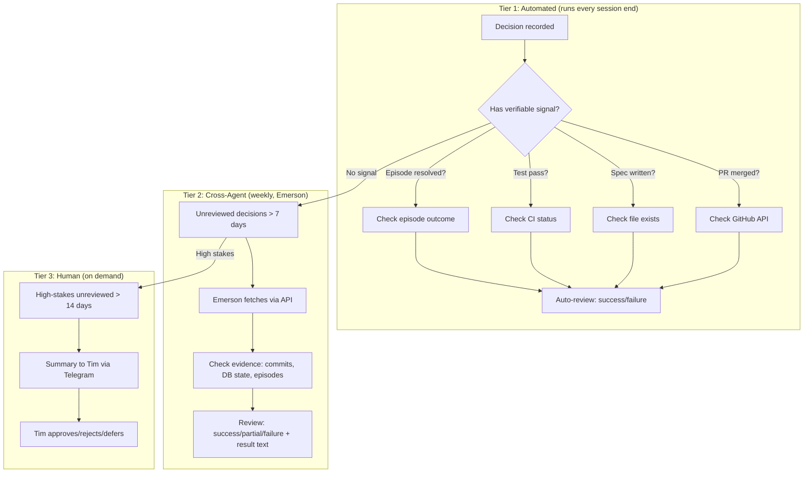

# Spec 008.5: Decision Review Loop

**Status:** Draft
**Depends on:** F001 (Brain Module), 008.3 (Episode Backfill)
**Related:** F007 (Metrics & Growth), Cognition Engines calibration system

## Problem

Nous records decisions but never reviews them. 30 decisions exist, 0 reviewed, 0 calibration snapshots. Without review:

- Confidence scores are unvalidated guesses — no learning loop
- Bad patterns repeat (0.3 confidence error decisions stay "pending" forever)
- No Brier score or accuracy metrics — F007 is dead without data
- The entire Brain module is write-only

### Who Reviews?

This is the core design challenge. Options considered:

| Approach | Pros | Cons |
|----------|------|------|
| Nous self-reviews | No external dependency | Can't be objective about own work |
| Tim reviews all | Most accurate | Doesn't scale (30+ decisions/week) |
| Emerson reviews | Has DB/repo access, already does calibration | Cross-agent dependency |
| Automated detection | Scales infinitely | Only works for verifiable outcomes |

**Decision: Hybrid approach** — automated detection for verifiable outcomes + Emerson cross-agent review for judgment calls + Tim escalation for high-stakes only.

---

## Architecture

### Three-Tier Review System



---

## Tier 1: Automated Outcome Detection

### When It Runs
- After each `session_ended` event (piggybacks on existing event bus)
- Checks decisions made in the session that just ended
- Also runs as a periodic sweep (daily) for older unreviewed decisions

### Signal Types

| Signal | How to Check | Maps To |
|--------|-------------|---------|
| **PR merged** | Decision has `pattern` mentioning PR/commit → check GitHub API | `success` if merged, `failure` if closed |
| **File created** | Decision mentions spec/doc → check filesystem | `success` if file exists |
| **Episode resolved** | Decision linked to episode → check `episode.outcome` | `success` if resolved |
| **Error decision** | Confidence < 0.5 or description contains "error"/"failed" | `failure` auto-marked |
| **Superseded** | New decision in same category contradicts earlier one | Earlier = `partial`, superseded |

### Implementation

**New handler:** `nous/handlers/decision_reviewer.py`

```python
class DecisionReviewer:
    """Auto-reviews decisions with verifiable outcomes.

    Listens to: session_ended (for session decisions), timer (daily sweep)
    Uses: Brain.review() to mark outcomes
    """

    # Signal matchers — extensible list
    SIGNALS = [
        GitHubSignal(),      # Check PR/commit status
        FileExistsSignal(),  # Check if mentioned files exist
        EpisodeSignal(),     # Check linked episode outcome
        ErrorSignal(),       # Auto-fail low-confidence errors
    ]

    async def handle(self, event: Event) -> None:
        """Review decisions from the ended session."""
        session_decisions = await self._brain.get_session_decisions(
            event.session_id
        )
        for decision in session_decisions:
            if decision.reviewed_at is not None:
                continue
            outcome = await self._check_signals(decision)
            if outcome:
                await self._brain.review(
                    decision.id,
                    outcome=outcome.result,
                    result=outcome.explanation,
                )

    async def sweep(self) -> list[ReviewResult]:
        """Daily sweep of all unreviewed decisions."""
        unreviewed = await self._brain.get_unreviewed(max_age_days=30)
        results = []
        for decision in unreviewed:
            outcome = await self._check_signals(decision)
            if outcome:
                await self._brain.review(
                    decision.id,
                    outcome=outcome.result,
                    result=outcome.explanation,
                )
                results.append(outcome)
        return results
```

### Signal Interface

```python
class ReviewSignal(Protocol):
    async def check(self, decision: DecisionInfo) -> ReviewResult | None:
        """Return ReviewResult if this signal can determine the outcome."""
        ...

@dataclass
class ReviewResult:
    result: str        # "success" | "partial" | "failure"
    explanation: str   # Human-readable reason
    confidence: float  # How sure the signal is (0-1)
    signal_type: str   # Which signal produced this
```

---

## Tier 2: Cross-Agent Review (Emerson)

### When It Runs
- Weekly cron job (Sundays, coordinated with Emerson's existing memory maintenance)
- Reviews decisions that Tier 1 couldn't auto-resolve
- Targets decisions older than 7 days without review

### How It Works

Emerson already has:
- Access to Nous's Postgres DB (read)
- Access to the GitHub repo
- CSTP calibration experience (does this for his own decisions)

**Emerson's review process:**
1. Query Nous DB for unreviewed decisions older than 7 days
2. For each decision:
   - Read the description, context, reasons, thinking blocks
   - Check evidence: git log, file state, subsequent decisions
   - Determine outcome: success/partial/failure
   - Write review via Brain API or direct DB
3. Generate calibration snapshot if enough reviews accumulated (≥10)
4. Report summary to Tim if notable findings

### API Endpoint (new)

```
POST /api/review_decision
{
    "decision_id": "uuid",
    "outcome": "success|partial|failure",
    "result": "Explanation of what happened",
    "reviewer": "emerson"   // Track who reviewed
}
```

Or Emerson can use the existing Brain module directly via DB access.

### Emerson Cron Job

```python
# Add to Emerson's HEARTBEAT.md or as a dedicated cron job
"""
## Decision Review (weekly, Sundays)
Review Nous's unreviewed decisions:

1. Query Nous DB:
   SELECT id, description, confidence, category, stakes, context, created_at
   FROM brain.decisions
   WHERE reviewed_at IS NULL AND created_at < NOW() - INTERVAL '7 days'
   ORDER BY stakes DESC, created_at ASC

2. For each decision:
   - Check git log for related commits
   - Check if referenced files/specs exist
   - Check episode outcomes
   - Review: POST /api/review_decision

3. After reviews, trigger calibration snapshot:
   POST /api/calibration/snapshot
"""
```

---

## Tier 3: Human Escalation

### When It Triggers
- High-stakes decisions unreviewed after 14 days
- Decisions where Tier 1 and Tier 2 disagree
- Decisions where confidence was very low (< 0.4) on something important

### Format (Telegram to Tim)

```
🧠 Nous Decision Review — 2 items need your input

1. [architecture/high] conf=0.78
   "Recommended G4 Memory Lifecycle as highest-impact next step"
   Evidence: Specs 009.1-009.4 written but shelved
   Emerson's take: partial — shelved is a reasonable outcome
   ➜ Approve / Override?

2. [architecture/high] conf=0.82
   "Proposed 3 new roadmap items (G7, G8, G9)"
   Evidence: Items documented in plans, not yet implemented
   ➜ Approve / Override?
```

Tim replies inline. Emerson processes the response and updates reviews.

---

## Brain API Changes

### New Methods

```python
# brain.py additions

async def get_unreviewed(
    self, max_age_days: int = 30, stakes: str | None = None
) -> list[DecisionInfo]:
    """Fetch unreviewed decisions, optionally filtered by stakes."""

async def get_session_decisions(
    self, session_id: str
) -> list[DecisionInfo]:
    """Fetch decisions made during a specific session."""

async def generate_calibration_snapshot(self) -> CalibrationSnapshot:
    """Compute and store calibration metrics from reviewed decisions."""
```

### Schema Addition

Add `reviewer` column to track who reviewed:

```sql
ALTER TABLE brain.decisions ADD COLUMN reviewer VARCHAR(50);
-- Values: 'auto', 'emerson', 'tim'
```

---

## Files Changed

| File | Change | Lines (est.) |
|------|--------|-------------|
| `nous/handlers/decision_reviewer.py` | New — Tier 1 auto-review handler | ~120 |
| `nous/brain/brain.py` | `get_unreviewed()`, `get_session_decisions()` | ~30 |
| `nous/api/rest.py` | `POST /api/review_decision` endpoint | ~25 |
| `nous/main.py` | Wire handler to event bus | ~5 |
| `tests/test_decision_reviewer.py` | Signal tests, auto-review tests | ~80 |
| Migration | Add `reviewer` column | ~5 |

**Total:** ~265 lines. One new file, one new endpoint.

---

## Incremental Delivery

### Phase 1: Auto-Review Foundation (~100 lines)
- `DecisionReviewer` handler with `ErrorSignal` and `EpisodeSignal`
- Wire to `session_ended` event
- Auto-fail error decisions, auto-succeed episode-resolved decisions

### Phase 2: Evidence Signals (~80 lines)
- `FileExistsSignal` — check if specs/docs mentioned in decision exist
- `GitHubSignal` — check PR status (requires GitHub token in Nous env)
- Daily sweep task

### Phase 3: Cross-Agent Review (~60 lines)
- REST endpoint for external review
- Emerson cron job spec
- Calibration snapshot generation

### Phase 4: Human Escalation (~25 lines)
- Telegram notification for high-stakes unreviewed
- Reply processing

---

## Success Metrics

| Metric | Current | Target (30 days) |
|--------|---------|-------------------|
| Decisions reviewed | 0/30 (0%) | > 80% |
| Calibration snapshots | 0 | ≥ 4 (weekly) |
| Auto-reviewable decisions | 0% | ~40% (error + episode signals) |
| Mean time to review | ∞ | < 7 days |
| High-stakes unreviewed > 14d | 8 | 0 |

---

## Risks

| Risk | Mitigation |
|------|------------|
| Auto-review marks wrong outcome | Conservative — only auto-review when signal confidence > 0.8. All others go to Tier 2. |
| Emerson doesn't have full context | He has DB + repo access. Thinking blocks (deliberation traces) provide reasoning context. |
| Tim gets spammed with reviews | Only high-stakes after 14 days. Estimated: 1-2 per week max. |
| Circular review (Nous reviews Nous) | Explicitly excluded. Tier 1 uses objective signals, not LLM judgment. Tier 2 is external. |
| GitHub API rate limits | Cache PR status. Most decisions don't reference PRs. |

---

## Not In Scope

- **Retroactive review of all 30 existing decisions:** First pass should be done manually by Emerson as a bootstrap. Not automated.
- **Decision reversal:** Review marks outcomes but doesn't undo decisions. Separate concern.
- **Multi-reviewer consensus:** One reviewer per decision is sufficient for now.
- **Real-time review:** Review happens async (session end or scheduled). Not blocking.
