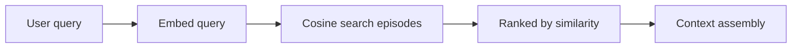
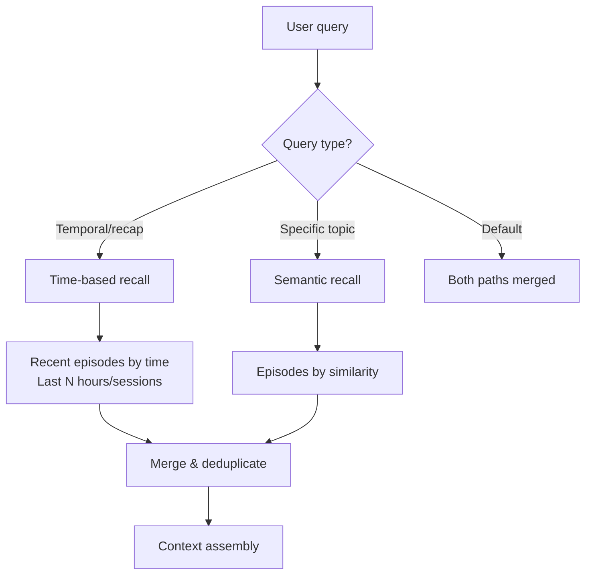

# Spec 008.6: Temporal Recall

**Status:** Draft
**Depends on:** 008.3 (Episode Backfill), F005 (Context Engine)
**Related:** 008.2 (Topic-Aware Recall), #52 (Topic recall ignores topic switch)

## Problem

When a user asks "what did we talk about recently?", Nous uses semantic search (`recall_deep` / `search_episodes`) to find relevant episodes. But semantic search matches by **meaning similarity**, not by **time**. A ski trip planning session has zero semantic overlap with "what did we talk about recently" — so it's invisible.

### Reproduction

```
User: [has a long ski trip planning conversation]
User: /new
User: what did we talk about recently
Nous: [returns development topics, research, specs — misses ski trip entirely]
User: what about our ski discussion?
Nous: [finds it immediately via "ski" keyword match]
```

### Root Cause

The entire recall pipeline is semantic-only:

```
User input → embed → cosine similarity → ranked results
```

There is **no temporal dimension** — no way to ask "what happened in the last N hours regardless of topic."

### Additional Bug: `list_recent()` Excludes Closed Episodes

`episodes.py:list_recent()` filters `WHERE active = true`. After 008.3, all properly closed episodes have `active=false`. So `list_recent()` returns **nothing** — it only shows ongoing episodes. This is a compounding bug: even if something called `list_recent()`, it would return empty results.

---

## Architecture

### Current Recall Flow



**Problem:** "What did we talk about" → embeds as generic meta-question → matches nothing specific.

### Proposed: Dual-Path Recall



---

## Changes

### Change 1: Fix `list_recent()` Active Filter

**File:** `nous/heart/episodes.py`

The `active=True` filter was correct pre-008.3 (closed episodes kept `active=true`). Now it excludes all closed episodes. Fix: remove the active filter or change to include closed.

```python
async def _list_recent(self, limit, outcome, session):
    stmt = (
        select(Episode)
        .where(Episode.agent_id == self.agent_id)
        # 008.6: Include closed episodes in recent list
        .where(Episode.ended_at.isnot(None))  # Only completed episodes
        .order_by(Episode.started_at.desc())
        .limit(limit)
    )
```

**Rationale:** "Recent episodes" should mean recently completed conversations, not currently active ones. Active (ongoing) episodes are handled by working memory.

### Change 2: Add `recall_recent` Tool

**File:** `nous/cognitive/tools.py` (or wherever tools are defined)

New agent tool that retrieves episodes by time, not similarity:

```python
@tool
async def recall_recent(hours: int = 48, limit: int = 10) -> str:
    """Recall recent episodes by time (not by topic similarity).
    
    Use this when:
    - User asks "what did we talk about" / "what happened recently"
    - You need a comprehensive overview of recent activity
    - Semantic recall might miss cross-domain topics
    
    Args:
        hours: Look back this many hours (default 48)
        limit: Max episodes to return (default 10)
    """
    episodes = await heart.list_recent(limit=limit)
    # Filter by time window
    cutoff = datetime.now(UTC) - timedelta(hours=hours)
    episodes = [e for e in episodes if e.started_at >= cutoff]
    
    if not episodes:
        return "No episodes found in the last {hours} hours."
    
    lines = [f"Recent episodes (last {hours}h):"]
    for e in episodes:
        title = e.title or e.summary[:60]
        time_str = e.started_at.strftime("%b %d %H:%M")
        lines.append(f"- [{time_str}] {title}")
        if e.summary and e.summary != e.title:
            lines.append(f"  {e.summary[:150]}")
    return "\n".join(lines)
```

### Change 3: Temporal Recall in Context Assembly

**File:** `nous/cognitive/context.py`

Add a temporal tier to context assembly that always includes recent episode titles, regardless of semantic relevance. This ensures the agent *knows about* recent conversations even if it doesn't include their full context.

```python
# In _build_context(), add before semantic episode search:

# 008.6: Temporal awareness — always include recent episode titles
if budget.episodes > 0:
    recent = await self._heart.list_recent(limit=5)
    cutoff = datetime.now(UTC) - timedelta(hours=48)
    recent = [e for e in recent if e.started_at >= cutoff]
    if recent:
        recent_text = "Recent conversations:\n"
        for e in recent:
            title = e.title or e.summary[:60]
            time_str = e.started_at.strftime("%b %d %H:%M")
            recent_text += f"- [{time_str}] {title}\n"
        sections.append(("recent_episodes", recent_text))
```

This is cheap — just titles and timestamps, ~20-50 tokens for 5 episodes. Always present in Tier 2 (session context). The agent sees "oh I had a ski trip conversation 2 hours ago" and can decide to `recall_deep` for details.

### Change 4: Recap Frame Detection

**File:** `nous/cognitive/layer.py`

When the user asks recap-type questions, trigger temporal recall automatically:

```python
_RECAP_PATTERNS = frozenset({
    "what did we talk about",
    "what have we discussed",
    "what did we do",
    "recent conversations",
    "catch me up",
    "what happened",
    "recap",
    "summary of recent",
})

def _is_recap_query(self, user_input: str) -> bool:
    """Detect if user is asking for a temporal recap."""
    lower = user_input.lower().strip()
    return any(p in lower for p in _RECAP_PATTERNS)
```

When detected, the cognitive layer injects `recall_recent` results into context before the agent even responds — so the agent has temporal awareness without needing to decide to call the tool.

---

## Files Changed

| File | Change | Lines (est.) |
|------|--------|-------------|
| `nous/heart/episodes.py` | Fix `list_recent()` active filter | ~5 |
| `nous/cognitive/tools.py` | New `recall_recent` tool | ~30 |
| `nous/cognitive/context.py` | Temporal tier in context assembly | ~20 |
| `nous/cognitive/layer.py` | Recap detection + auto-inject | ~25 |
| `tests/test_episodes.py` | Fix list_recent test, add temporal tests | ~30 |
| `tests/test_context.py` | Test temporal tier inclusion | ~20 |

**Total:** ~130 lines. No schema changes, no migrations.

---

## Incremental Delivery

### Phase 1: Fix `list_recent()` + Temporal Context (~25 lines)
- Fix the active filter bug
- Add recent episode titles to context assembly
- Immediate improvement: agent always knows about recent conversations

### Phase 2: `recall_recent` Tool (~30 lines)
- Explicit tool for the agent to call
- Better for detailed recaps ("what did we talk about in the last week")

### Phase 3: Recap Detection + Auto-Inject (~25 lines)
- Automatic temporal recall on recap-type questions
- Zero-thought path: user asks recap → agent already has the answer in context

---

## How This Fixes the Ski Trip Problem

**Before 008.6:**
```
Context assembly:
  - Identity (Tier 1)
  - Working memory: current_task=null (new session)
  - Semantic search for "what did we talk about": returns dev topics
  → Ski trip invisible
```

**After 008.6:**
```
Context assembly:
  - Identity (Tier 1)
  - Working memory: current_task=null (new session)
  - Recent conversations (Tier 2, temporal):
    - [Feb 28 12:24] Solo Ski Trip Budget for Breckenridge March 2026
    - [Feb 28 12:22] Conversation with Emerson about capabilities
    - [Feb 28 11:49] Episode Summary System Verification
  - Semantic search for "what did we talk about": returns dev topics
  → Ski trip visible in recent conversations list
  → Agent mentions it in response without needing to search
```

Cost: ~30-50 extra tokens in every context window. Benefit: agent never forgets recent conversations.

---

## Risks

| Risk | Mitigation |
|------|------------|
| Token budget increase from temporal tier | Titles only, ~10 tokens per episode, capped at 5 episodes = ~50 tokens max |
| Recap detection false positives | Conservative pattern list. "What did we do" could be about a code task — but including recent episodes as context doesn't hurt, agent can ignore them |
| `list_recent` returns too many episodes | Capped by limit + time window. Default 48h/10 episodes. |
| Overlap between temporal and semantic results | Deduplicate by episode ID in context assembly |

---

## Not In Scope

- **Full conversation replay:** Temporal recall returns titles/summaries, not transcripts. Deep dive uses existing `recall_deep`.
- **Cross-user temporal recall:** Only shows episodes for the current agent. Multi-user scoping is F016.
- **Calendar-style "what happened on Tuesday":** Specific date queries need a different approach (date parsing + range query). Future enhancement.
