# Spec 011.1: Subtasks & Scheduling

**Status:** Draft
**Implements:** F009 (Async Subtasks)
**Depends on:** F004 (Runtime), F006 (Event Bus)
**Related:** 008.5 (Decision Review Loop), 008.6 (Temporal Recall)

## Overview

Give Nous two new capabilities:
1. **Subtasks** — spawn parallel work that runs in the background
2. **Scheduling** — set timers and recurring tasks that fire autonomously

Both share the same infrastructure: a Postgres-backed task queue with async workers.

---

## Part 1: Subtasks

### How It Works

Nous calls `spawn_task` during a conversation. The task runs as an independent agent session with full tool access (bash, web_search, recall_deep, learn_fact). Results are delivered via Telegram notification, stored as episodes, and available for future recall.


### Subtask Execution

Each subtask is a real agent turn via the existing `AgentRunner`:

```python
async def _execute_subtask(self, subtask: Subtask) -> str:
    """Execute a subtask as an independent agent session."""
    session_id = f"subtask-{subtask.id.hex[:8]}"
    
    # System prompt scoping — subtask knows it's a subtask
    system_prefix = (
        f"You are executing a background subtask.\n"
        f"Task: {subtask.task}\n"
        f"Parent session: {subtask.parent_session_id}\n"
        f"Deliver a clear, complete result. Do not ask questions.\n"
    )
    
    result = await self._runner.run_turn(
        session_id=session_id,
        user_input=subtask.task,
        agent_id=self._settings.agent_id,
        system_prompt_prefix=system_prefix,
    )
    
    return result.response_text
```

Key properties:
- Full tool access (bash, web, memory, file I/O)
- Own episode, decisions, working memory
- Cannot spawn sub-subtasks (recursion depth = 1)
- Shares Brain and Heart with main session (facts learned are immediately available)
- Configurable timeout (default 120s, max 600s)

### Agent Tool

```python
@tool
async def spawn_task(
    task: str,
    priority: str = "normal",
    timeout: int = 120,
    notify: bool = True,
) -> str:
    """Spawn a background subtask for parallel or long-running work.
    
    Use when:
    - Work will take more than a few seconds
    - Multiple independent research tasks can run in parallel
    - You want to keep the conversation responsive while working
    - A scheduled task needs to kick off work
    
    The subtask runs as a full agent turn with all your tools.
    Results are delivered via Telegram and stored in memory.
    
    Args:
        task: Clear, specific instruction for what to do
        priority: "urgent" | "normal" | "low"
        timeout: Max seconds (default 120, max 600)
        notify: Send Telegram notification when done (default True)
    """
```

### Result Delivery

When a subtask completes:

1. **Telegram push** (if `notify=True`):
   ```
   ✅ Task completed: "Research snow conditions for Breckenridge..."
   
   Result: Base depth is 62" at Breck, 78" at A-Basin. 
   6" of fresh snow expected March 10-12. Conditions looking excellent.
   ```

2. **Episode stored** — the subtask's session creates its own episode with structured summary (via 008.4). Available for `recall_deep` in future conversations.

3. **Facts learned** — any `learn_fact` calls during the subtask persist in Heart immediately. Main session can access them on the next turn.

4. **Event emitted** — `subtask_completed` on the bus. If the parent session is still active, results are injected into context.

---

## Part 2: Scheduling

### How It Works

Nous calls `schedule_task` to create a timer or recurring job. The scheduler is a background loop (like the existing `SessionTimeoutMonitor`) that checks for due tasks and enqueues them as subtasks.

```mermaid
graph TB
    subgraph "Task Creation"
        T1[spawn_task — immediate] --> Q
        T2[schedule_task — deferred] --> SCH
    end
    
    subgraph "Scheduler"
        SCH[Schedule Table] --> CK{Check loop<br/>every 60s}
        CK -->|task is due| Q[(Subtask Queue)]
    end
    
    subgraph "Execution"
        Q --> W[Worker Pool]
        W --> R[Result]
        R --> N[Notify + Store]
    end
```



### Schedule Types

```python
@tool
async def schedule_task(
    task: str,
    when: str | None = None,
    every: str | None = None,
    notify: bool = True,
) -> str:
    """Schedule a task for later or recurring execution.
    
    Use when:
    - User asks to be reminded of something
    - A periodic check is needed (weather, prices, conditions)
    - Work should happen at a specific time
    - You want to monitor something and alert on changes
    
    Args:
        task: What to do when the schedule fires
        when: One-shot — ISO timestamp or relative ("in 2 hours", "tomorrow 9am")
        every: Recurring — interval ("30 minutes", "6 hours", "daily at 9am EST")
        notify: Send Telegram notification with results (default True)
    
    Exactly one of 'when' or 'every' must be provided.
    
    Examples:
        schedule_task("Check snow conditions in Breckenridge", every="daily at 8am EST")
        schedule_task("Remind Tim about the ski trip gear checklist", when="2026-03-10T09:00:00-05:00")
        schedule_task("Check if Breck lift ticket prices dropped below $150", every="12 hours")
    """
```

### Database Schema

```sql
-- Subtask queue (F009)
CREATE TABLE heart.subtasks (
    id UUID PRIMARY KEY DEFAULT gen_random_uuid(),
    agent_id VARCHAR NOT NULL,
    parent_session_id VARCHAR,
    task TEXT NOT NULL,
    priority INTEGER DEFAULT 100,
    status VARCHAR NOT NULL DEFAULT 'pending',
    result TEXT,
    error TEXT,
    worker_id VARCHAR,
    timeout_seconds INTEGER DEFAULT 120,
    notify BOOLEAN DEFAULT TRUE,
    created_at TIMESTAMPTZ NOT NULL DEFAULT now(),
    started_at TIMESTAMPTZ,
    completed_at TIMESTAMPTZ,
    metadata JSONB DEFAULT '{}'::jsonb
);

CREATE INDEX idx_subtasks_pending 
    ON heart.subtasks (priority, created_at) WHERE status = 'pending';

-- Schedule table
CREATE TABLE heart.schedules (
    id UUID PRIMARY KEY DEFAULT gen_random_uuid(),
    agent_id VARCHAR NOT NULL,
    task TEXT NOT NULL,
    schedule_type VARCHAR NOT NULL,  -- 'once' or 'recurring'
    
    -- For one-shot
    fire_at TIMESTAMPTZ,
    
    -- For recurring
    interval_seconds INTEGER,
    cron_expr VARCHAR,              -- Optional cron expression
    
    -- State
    active BOOLEAN DEFAULT TRUE,
    last_fired_at TIMESTAMPTZ,
    next_fire_at TIMESTAMPTZ,
    fire_count INTEGER DEFAULT 0,
    max_fires INTEGER,              -- NULL = unlimited
    
    -- Config
    notify BOOLEAN DEFAULT TRUE,
    timeout_seconds INTEGER DEFAULT 120,
    
    created_at TIMESTAMPTZ NOT NULL DEFAULT now(),
    created_by_session VARCHAR,
    metadata JSONB DEFAULT '{}'::jsonb
);

CREATE INDEX idx_schedules_next 
    ON heart.schedules (next_fire_at) WHERE active = TRUE;
```

### Scheduler Loop

```python
class TaskScheduler:
    """Background scheduler that enqueues due tasks as subtasks."""
    
    def __init__(self, heart: Heart, settings: Settings):
        self._heart = heart
        self._settings = settings
    
    async def start(self):
        """Start the scheduler check loop."""
        self._task = asyncio.create_task(self._loop())
    
    async def _loop(self):
        while True:
            await asyncio.sleep(60)  # Check every minute
            await self._fire_due_tasks()
    
    async def _fire_due_tasks(self):
        """Find and enqueue all due scheduled tasks."""
        now = datetime.now(UTC)
        due = await self._heart.get_due_schedules(now)
        
        for schedule in due:
            # Create subtask from schedule
            await self._heart.create_subtask(
                task=schedule.task,
                parent_session_id=f"schedule-{schedule.id.hex[:8]}",
                timeout=schedule.timeout_seconds,
                notify=schedule.notify,
            )
            
            # Update schedule state
            if schedule.schedule_type == "once":
                await self._heart.deactivate_schedule(schedule.id)
            else:
                await self._heart.advance_schedule(schedule.id, now)
```

### Natural Language Time Parsing

For `when` and `every` parameters, use a lightweight parser:

```python
def parse_when(when: str) -> datetime:
    """Parse relative or absolute time strings.
    
    Supports:
    - ISO 8601: "2026-03-10T09:00:00-05:00"
    - Relative: "in 2 hours", "in 30 minutes", "tomorrow"
    - Named: "tomorrow 9am", "next monday 8am EST"
    """

def parse_every(every: str) -> tuple[int, str | None]:
    """Parse interval strings to seconds + optional cron.
    
    Supports:
    - Simple: "30 minutes", "6 hours", "2 days"
    - Daily: "daily at 9am EST" → cron + timezone
    - Weekly: "every monday at 10am"
    """
```

Use `dateutil.parser` for ISO, simple regex for relative ("in N hours/minutes/days"), and manual parsing for "daily at X" → cron expression. No heavy NLP dependency needed.

---

## Part 3: Management Tools

```python
@tool
async def list_tasks(status: str = "all") -> str:
    """List subtasks and scheduled tasks.
    
    Args:
        status: "pending" | "running" | "completed" | "scheduled" | "all"
    """

@tool
async def cancel_task(task_id: str) -> str:
    """Cancel a pending subtask or deactivate a scheduled task."""
```

### REST Endpoints

| Method | Path | Description |
|--------|------|-------------|
| GET | `/subtasks` | List subtasks (filter by status, session) |
| GET | `/subtasks/{id}` | Get subtask detail + result |
| DELETE | `/subtasks/{id}` | Cancel subtask |
| GET | `/schedules` | List active schedules |
| POST | `/schedules` | Create schedule (external API) |
| DELETE | `/schedules/{id}` | Deactivate schedule |

---

## Worker Pool

```python
class SubtaskWorkerPool:
    """Pool of async workers that execute subtasks."""
    
    def __init__(self, runner: AgentRunner, settings: Settings, bus: EventBus):
        self._runner = runner
        self._settings = settings
        self._bus = bus
        self._workers: list[asyncio.Task] = []
    
    async def start(self):
        for i in range(self._settings.subtask_workers):
            task = asyncio.create_task(
                self._worker_loop(f"worker-{i}"),
                name=f"subtask-worker-{i}",
            )
            self._workers.append(task)
    
    async def _worker_loop(self, worker_id: str):
        while True:
            subtask = await self._dequeue(worker_id)
            if subtask is None:
                await asyncio.sleep(self._settings.subtask_poll_interval)
                continue
            
            try:
                result = await asyncio.wait_for(
                    self._execute(subtask),
                    timeout=subtask.timeout_seconds,
                )
                await self._complete(subtask, result)
            except asyncio.TimeoutError:
                await self._fail(subtask, "Timeout exceeded")
            except Exception as e:
                await self._fail(subtask, str(e))
    
    async def _dequeue(self, worker_id: str) -> Subtask | None:
        """Atomic dequeue via SELECT FOR UPDATE SKIP LOCKED."""
        ...
    
    async def _complete(self, subtask: Subtask, result: str):
        """Mark complete, emit event, notify if configured."""
        await self._heart.complete_subtask(subtask.id, result)
        await self._bus.emit(Event(
            type="subtask_completed",
            agent_id=subtask.agent_id,
            data={
                "subtask_id": str(subtask.id),
                "task": subtask.task,
                "result": result,
                "parent_session": subtask.parent_session_id,
            },
        ))
        if subtask.notify:
            await self._notify_telegram(subtask, result)
```

---

## Configuration

```python
# config.py additions
subtask_enabled: bool = True
subtask_workers: int = 2
subtask_poll_interval: float = 2.0
subtask_default_timeout: int = 120
subtask_max_timeout: int = 600
subtask_max_concurrent: int = 3     # Max running at once
schedule_enabled: bool = True
schedule_check_interval: int = 60   # Seconds between schedule checks
```

---

## Example Flows

### Parallel Research
```
Tim: Research snow conditions AND lift prices for my March ski trip
Nous: I'll research both in parallel.
  → spawn_task("Research snow conditions Breckenridge, A-Basin, Copper March 12-16")
  → spawn_task("Research lift ticket prices and advance purchase deals March 12-16")

[2 minutes later, Tim's Telegram:]
✅ Snow conditions: Breck 62" base, A-Basin 78". 6" expected March 10-12.
✅ Lift tickets: Breck $165/day advance, A-Basin 3-day pack $289, Copper $107/day.
```

### Recurring Monitoring
```
Tim: Keep an eye on snow conditions for Breck, check every morning
Nous: Set up daily monitoring.
  → schedule_task("Check current snow conditions at Breckenridge and report 
     base depth, recent snowfall, and 3-day forecast", every="daily at 8am EST")

[Every morning at 8am, Tim's Telegram:]
🏔 Breck Snow Report — March 8:
Base: 64" (+2" overnight), 3-day forecast: 4-8" expected Tuesday
```

### Reminder
```
Tim: Remind me to book the Frisco hotel next Monday
Nous: Done.
  → schedule_task("Remind Tim: Book the Frisco hotel for the March 12-16 
     ski trip. He was looking at Frisco Inn on Galena (~$225/night).", 
     when="next monday 9am EST")

[Monday 9am:]
⏰ Reminder: Book the Frisco hotel for your March 12-16 ski trip.
You were looking at Frisco Inn on Galena (~$225/night).
```

---

## Files Changed

| File | Change | Lines (est.) |
|------|--------|-------------|
| `sql/migrations/010_subtasks.sql` | Subtasks + schedules tables | ~40 |
| `nous/storage/models.py` | ORM models for subtasks, schedules | ~50 |
| `nous/heart/subtasks.py` | SubtaskManager — CRUD, dequeue, complete | ~120 |
| `nous/heart/schedules.py` | ScheduleManager — CRUD, due check, advance | ~100 |
| `nous/heart/heart.py` | Wire subtask + schedule managers | ~20 |
| `nous/handlers/subtask_worker.py` | Worker pool — execute, complete, notify | ~150 |
| `nous/handlers/task_scheduler.py` | Scheduler loop — check due, enqueue | ~60 |
| `nous/cognitive/tools.py` | `spawn_task`, `schedule_task`, `list_tasks`, `cancel_task` | ~80 |
| `nous/api/rest.py` | REST endpoints for subtasks + schedules | ~60 |
| `nous/config.py` | New settings | ~15 |
| `nous/main.py` | Wire workers + scheduler on startup | ~20 |
| `tests/test_subtasks.py` | Queue, worker, completion, timeout tests | ~120 |
| `tests/test_schedules.py` | Schedule creation, firing, recurring tests | ~100 |

**Total:** ~935 lines. 2 new tables, 4 new tools, 6 REST endpoints.

---

## Incremental Delivery

### Phase 1: Subtask Queue + Workers (~400 lines)
- Schema, models, SubtaskManager
- Worker pool with execution, timeout, completion
- `spawn_task` tool
- Telegram notification on complete
- Tests

### Phase 2: Scheduling (~350 lines)
- Schedule table, ScheduleManager
- Scheduler loop
- `schedule_task` tool with time parsing
- Recurring task advancement
- Tests

### Phase 3: Management + Polish (~185 lines)
- `list_tasks`, `cancel_task` tools
- REST endpoints
- Subtask results in context assembly (next turn sees completed subtask results)
- Episode creation for subtask sessions

---

## Risks

| Risk | Mitigation |
|------|------------|
| Runaway subtask spawning | Max 3 concurrent, max 5 pending. `spawn_task` rejects beyond limit. |
| Worker crashes leave tasks stuck | Heartbeat timeout — if `started_at` > timeout without completion, re-enqueue. |
| LLM costs from background tasks | Subtasks use `background_model` (Haiku-class). Schedules have `max_fires` limit. |
| Time parsing ambiguity | Conservative parser — reject ambiguous, ask user to clarify. Fall back to ISO. |
| Recursive spawning | Subtask sessions don't have `spawn_task` tool. Depth limited to 1. |
| Telegram rate limits | Batch notifications, respect 30 msg/sec limit. |

---

## Not In Scope

- **Multi-agent subtasks:** Spawning work on Emerson or other agents. Future F016.
- **Approval gates:** "Ask Tim before proceeding." Future enhancement.
- **Priority preemption:** All workers are equal. No task can bump another.
- **Distributed workers:** Everything runs in one container. Scaling is a separate concern.
