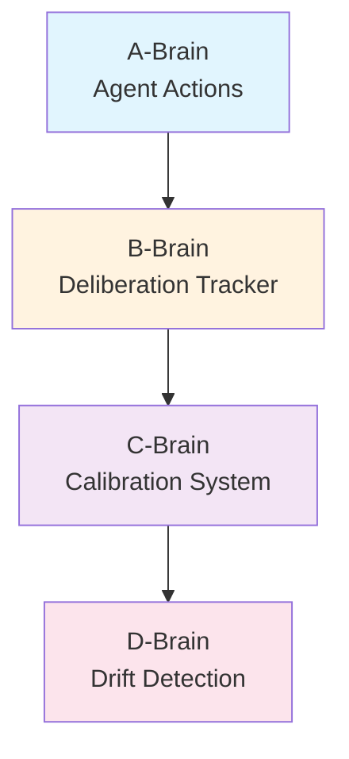

# Research Note 002: Minsky Chapter-to-Architecture Mapping

*Complete mapping of Society of Mind concepts to Newton components.*

## Coverage

We've read 14 of 30 chapters. Here's what maps where, plus predictions for unread chapters.

## Read Chapters → Newton Components

### Ch 4: The Self
**Key idea:** There is no single Self — it's an illusion created by coordination.
**Newton:** Identity emerges from SOUL.md + AGENTS.md + consistent behavior, not from any "self module." The agent doesn't have a self-model — it has slow-changing configuration that produces consistent behavior.

### Ch 5: Individuality
**Key idea:** Traits become real by being declared. Personality is self-fulfilling prophecy.
**Newton:** SOUL.md is a specification, not a description. Writing "I'm opinionated" makes the agent opinionated. Identity files are prescriptive, not descriptive.
**Component:** Identity Layer (slow-changing agencies)

### Ch 6: Consciousness (B-Brains)
**Key idea:** Consciousness is surface signals that steer deeper machinery. B-brain watches A-brain.
**Newton:** Deliberation tracker = B-brain. Calibration = C-brain. Drift detection = D-brain. Each layer watches the one below.
**Component:** Self-Monitoring Stack

### Ch 7: Problems & Goals
**Key idea:** Common sense is harder than expertise. Intelligence disappears once explained.
**Newton:** Don't over-engineer narrow capabilities. Focus on the hard "easy" things — when to speak, when to stay silent, what frame to use. These require common sense, not expertise.
**Component:** Frame Selection Engine (the hardest part)

### Ch 8: K-Lines
**Key idea:** Memory reconnects you to past mental states. Level-bands: core transfers, fringes flex.
**Newton:** K-line files with explicit zones. Upper fringe (goals, weakly attached), core (patterns & tools, strongly attached), lower fringe (implementation details, easily displaced).
**Component:** K-Line System

### Ch 9: Censors & Suppressors
**Key idea:** Learning from failure = building agents that prevent bad actions.
**Newton:** Guardrails at multiple severity levels. Censors block, suppressors redirect. Escalation from warn → block as confidence in the failure mode grows.
**Component:** Censor Registry

### Ch 10: Papert's Principle
**Key idea:** Growth is administrative, not accumulative. Build detours, not replacements.
**Newton:** Git hooks, pre-action protocols, quality gates. Each is a detour that intercepts existing behavior without replacing it. The agent grows by adding better managers.
**Component:** Administrative Growth Engine

### Ch 12: Bridge Definitions
**Key idea:** Describe things by both structure (what it looks like) and function (what it does).
**Newton:** Every decision has structure + function bridge definitions. Enables recall from both angles — "what solved problems like this?" (function) and "where did we use this pattern?" (structure).
**Component:** Bridge Definition System (in Cognition Engines)

### Ch 15: Causes & Clauses
**Key idea:** Causation is constructed, not observed. We impose causal narratives.
**Newton:** Decision context and reasoning fields are causal narratives the agent constructs. They're useful models, not ground truth. Calibration keeps them honest.

### Ch 17: Attachment & Goals
**Key idea:** Goal formation through reinforcement. Functional autonomy — subgoals detach from original purpose.
**Newton:** Be aware that optimization metrics can become goals in themselves. An agent that optimizes "Brier score" might start avoiding hard decisions (lower confidence = riskier Brier). Need meta-monitoring.
**Component:** Goal Integrity Monitor (future)

### Ch 18: Reasoning (Parallel Bundles)
**Key idea:** Multiple independent reasons > one logical chain. Chains break at any weak link.
**Newton:** Decision quality scoring requires diverse reason types. Single-type reasoning is fragile. Cross-connected knowledge networks over thin definitions.
**Component:** Reason Diversity Scoring (in Cognition Engines)

### Ch 19: Words & Meaning (Polynemes)
**Key idea:** Words trigger state changes across agencies. Tags are polynemes.
**Newton:** Tag system where each tag activates different subsystems independently. Decision descriptions written for activation (future search), not accuracy (current description).
**Component:** Tag/Polyneme System (in Cognition Engines)

### Ch 20: Micronemes
**Key idea:** Tiny features constrain search. "Closing the ring" — partial clues reconstruct wholes.
**Newton:** Bridge definitions as micronemes. Hybrid search leverages partial matches to reconstruct full context. Imperfect recall beats no recall.
**Component:** Hybrid Search (in Cognition Engines)

### Ch 25: Frames
**Key idea:** One frame at a time. Can't blend interpretations. Must switch explicitly.
**Newton:** Frame selection at task start. Frame-splitting via sub-agents for parallel perspectives. Distrust your first frame.
**Component:** Frame Engine + Frame-Splitting Protocol

## Unread Chapters → Predicted Components

### Ch 1-3: Building Blocks, Mind & Brain, Conflict
**Predicted:** Foundation for agent composition. How simple agents combine. Conflict resolution between competing agencies.
**Newton need:** Agent priority/conflict resolution system

### Ch 11: The Shape of Space
**Predicted:** Spatial reasoning, mental models of physical space.
**Newton relevance:** Possibly low for text-based agents. May inform diagram/architecture thinking.

### Ch 13-14: Reformulation, Seeing & Believing
**Predicted:** How to re-represent problems. Perception vs interpretation.
**Newton need:** Problem reformulation as a frame-switching strategy. "If you're stuck, re-represent the problem."

### Ch 16: Emotion
**Predicted:** Emotions as resource managers. Anxiety = too many subgoals. Happiness = subgoals aligning.
**Newton need:** Agent "mood" system — when overloaded, simplify. When confident, take on more.

### Ch 21-24: Pronomes, Expression, Comparison, Logic
**Predicted:** Variable binding, language generation, analogical reasoning.
**Newton need:** Pronome system (assignment vs action separation), analogy engine

### Ch 26-30: Language, Minds & Machines, The Soul
**Predicted:** Higher-level integration. Minsky's conclusions about consciousness, identity, meaning.
**Newton need:** Final architecture validation against Minsky's full vision

## Priority Reading for Newton

1. **Ch 1-3** — Foundational. Need for conflict resolution design.
2. **Ch 16 (Emotion)** — Resource management model could solve agent overload.
3. **Ch 21 (Pronomes)** — Variable binding is core to template system.
4. **Ch 26-30** — Integration and validation.

---

*This mapping will update as we read more chapters.*
