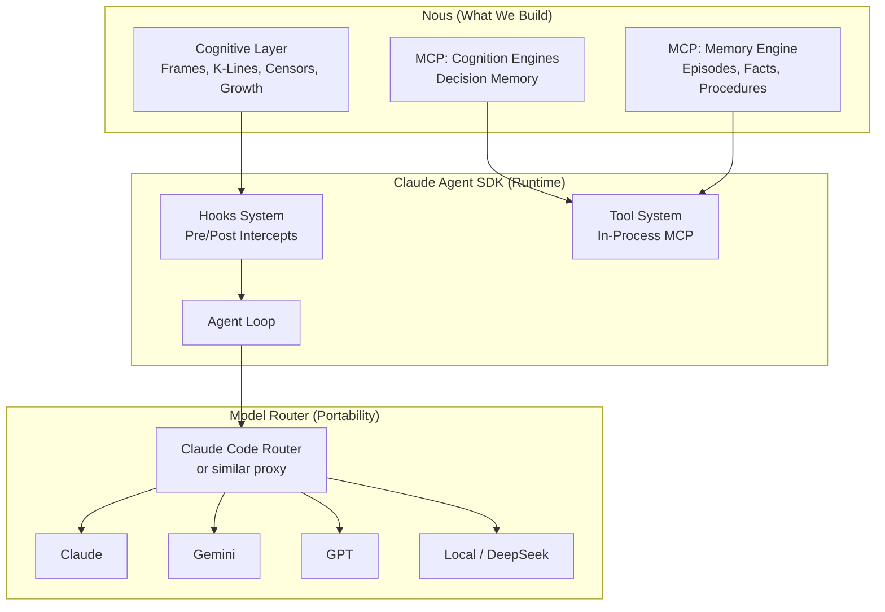

# Research Note 003: Runtime & SDK Decision

*Which foundation do we build on?*

## Decision

**Claude Agent SDK + Model Router proxy for LLM portability.**

## Architecture Stack

## Why Claude Agent SDK

### Hooks = Papert's Principle
The SDK's hook system lets us intercept the agent loop at specific points without modifying it. This is literally Minsky's "detour" pattern:

| Hook Point | Nous Intercept |
|------------|-----------------|
| Pre-tool-call | Pre-Action Protocol (query decisions, check guardrails) |
| Post-tool-call | Self-monitoring (B-brain assessment) |
| Pre-response | Frame validation (am I still in the right frame?) |
| Session start | K-line activation, context loading |
| Error | Censor activation (learn from failure) |

We don't replace the agent loop — we add cognitive intercepts around it.

### MCP = Native Integration
Cognition Engines already has MCP support. The SDK supports in-process MCP servers with zero subprocess overhead. Nous's memory systems plug in directly:

- `mcp__nous__pre_action` — Think before acting
- `mcp__nous__recall` — K-line activation
- `mcp__nous__frame` — Select cognitive frame
- `mcp__nous__deliberate` — Record reasoning
- `mcp__nous__monitor` — Self-assessment

### Claude Code's Loop is Battle-Tested
The same loop powers Claude Code — used by thousands of developers daily. We get:
- Tool permission management
- Working directory isolation
- Conversation management
- Sub-agent spawning
- Regular improvements from Anthropic

## Why Model Router for Portability

**Problem:** Claude Agent SDK calls Claude's API directly. Lock-in risk.

**Solution:** Model routers like `claude-code-router` intercept API calls and forward to any provider:

- **OpenRouter** — access to 100+ models
- **Gemini** — Google's models
- **DeepSeek** — cost-effective coding
- **Ollama** — fully local/private
- **Any OpenAI-compatible API**

**Key insight:** Nous's cognitive layer doesn't care which LLM runs underneath. K-lines, frames, censors, deliberation — all work at the prompt/tool level, not the model level. The router makes model selection a deployment choice, not an architecture choice.

### Router Options

| Router | Status | Notes |
|--------|--------|-------|
| [claude-code-router](https://github.com/musistudio/claude-code-router) | Active, maintained | Multi-provider, plugin system, dynamic switching |
| Custom proxy | Build if needed | Simple HTTP proxy that rewrites API calls |
| Portkey | Commercial | Enterprise features, observability |

## Alternatives Considered

### LangGraph / LangChain
- Heavy abstractions we'd fight against
- Their "agent loop" is different from what we want
- Would need to rebuild Nous's loop inside their framework

### Google ADK
- Good A2A support but Google-biased
- Less mature than Claude's SDK
- Hooks/intercepts not as clean

### CrewAI
- Good for multi-agent orchestration
- But frames ≠ crews (frames are cognitive, crews are organizational)
- Memory system would conflict with ours

### From Scratch
- Maximum control but massive effort
- Would rebuild what Claude Agent SDK already provides
- Tool management, permissions, conversation — all solved problems

## What We Build vs What We Get

| Component | Build (Nous) | Get (SDK) | Get (Router) |
|-----------|---------------|-----------|--------------|
| Cognitive layer | ✅ | | |
| Memory engine | ✅ | | |
| K-line system | ✅ | | |
| Frame engine | ✅ | | |
| Censor registry | ✅ | | |
| Growth tracking | ✅ | | |
| Agent loop | | ✅ | |
| Tool management | | ✅ | |
| MCP hosting | | ✅ | |
| Hook system | | ✅ | |
| Model routing | | | ✅ |
| Multi-provider | | | ✅ |

**We focus on the mind. They handle the body.**

## Risk Assessment

| Risk | Mitigation |
|------|-----------|
| Anthropic deprecates SDK | Cognitive layer is MCP-based, portable to any MCP host |
| Router adds latency | <10ms overhead per call, negligible vs LLM latency |
| SDK hooks insufficient | Can fall back to wrapping SDK calls at Python level |
| Model quality varies | Nous's calibration tracks per-model performance |

## Next Steps

1. Set up basic Claude Agent SDK project with hooks
2. Implement pre-action hook (simplest Nous intercept)
3. Connect Cognition Engines via MCP
4. Test with router to verify model portability
5. Build K-line activation as second hook

---

*Decision confidence: 0.82. Strongest independent reason: hooks map to Papert's detours (theoretical alignment). Second: MCP already works with CE (practical alignment). Risk: SDK maturity is unknown (new project).*
