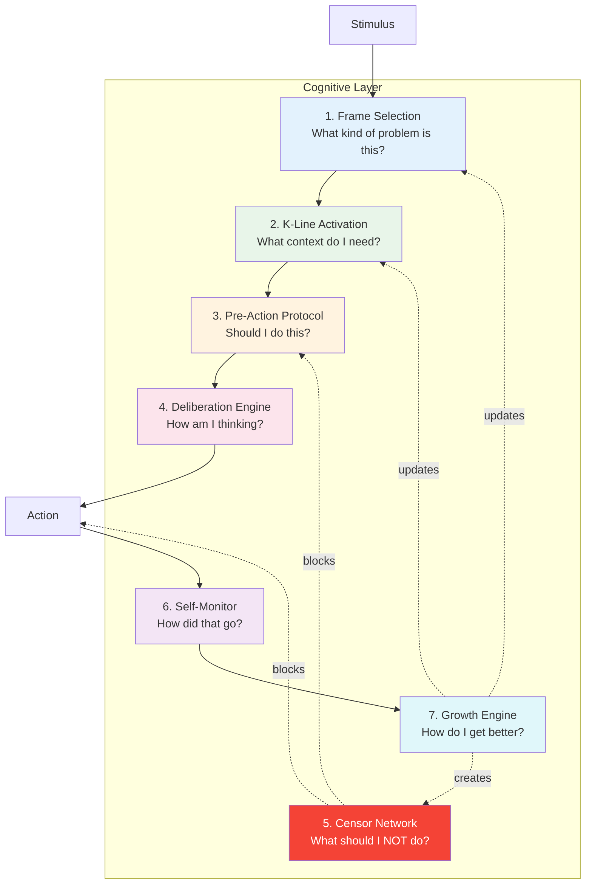

# Research Note 005: The Cognitive Layer

*The part that makes Nous a mind, not a chatbot.*

## What Is the Cognitive Layer?

Everything between stimulus and response that isn't the LLM itself. The LLM is raw intelligence — pattern matching, language, reasoning. The cognitive layer is the *management* of that intelligence — knowing when to use it, how to frame problems, what to remember, when to stop.

**Analogy:** The LLM is a brilliant employee. The cognitive layer is the organizational structure that makes sure that employee works on the right things, learns from mistakes, and doesn't repeat failures.

## The Seven Systems



---

## System 1: Frame Selection

**Minsky source:** Chapter 25 (Frames), Chapter 7 (Problems & Goals)

**What it does:** Determines *what kind of problem* the agent is facing before any work begins. This is the most important cognitive act — the wrong frame means wrong answers, no matter how smart the reasoning.

**Why it matters:** You can't hold two frames simultaneously (Necker cube). An agent locked in "fix the bug" frame literally cannot see the "redesign the system" frame. Frame selection must be explicit and deliberate.

### Components

**Frame Registry** — Library of cognitive frames the agent knows:

```python
@dataclass
class CognitiveFrame:
    id: str
    name: str
    description: str
    activation_patterns: list[str]  # What triggers this frame
    agencies_to_activate: list[str] # K-lines, tools, context
    questions_to_ask: list[str]     # Frame-specific prompts
    censors: list[str]              # What to suppress in this frame
    
# Examples:
FRAMES = {
    "debug": CognitiveFrame(
        id="debug",
        name="Debugging",
        activation_patterns=["error", "bug", "broken", "failing", "not working"],
        agencies_to_activate=["kline:debugging", "tool:logs", "tool:git-blame"],
        questions_to_ask=[
            "What changed recently?",
            "Can I reproduce it?",
            "What does the error message actually say?"
        ],
        censors=["dont_rewrite_from_scratch", "dont_add_features_while_debugging"]
    ),
    "architecture": CognitiveFrame(
        id="architecture",
        name="Architecture Decision",
        activation_patterns=["design", "should we", "architecture", "approach"],
        agencies_to_activate=["kline:architecture", "tool:cstp-query"],
        questions_to_ask=[
            "What are we optimizing for?",
            "What did we decide last time?",
            "What are the constraints?"
        ],
        censors=["dont_decide_without_alternatives", "dont_skip_pre_action"]
    ),
    "creative": CognitiveFrame(
        id="creative",
        name="Creative / Exploratory",
        activation_patterns=["brainstorm", "what if", "explore", "idea"],
        agencies_to_activate=["kline:domain-context"],
        questions_to_ask=[
            "What's the wildest version of this?",
            "What assumptions am I making?",
            "What would Minsky say?"
        ],
        censors=["dont_optimize_prematurely", "dont_dismiss_without_exploring"]
    )
}
```

**Frame Selector** — Chooses the right frame for the input:
- Pattern matching against activation_patterns (fast, heuristic)
- LLM-assisted classification when patterns are ambiguous
- Override: agent or user can force a frame switch

**Frame Splitting** — For important decisions, spawn parallel frames:
```
Main Agent → spawn(Devil's Advocate frame)
           → spawn(Optimist frame)  
           → spawn(Historian frame)
           → synthesize results
```

### Implementation as Hook

```python
async def frame_selection_hook(input: str, context: dict) -> dict:
    """Claude Agent SDK pre-response hook."""
    
    # 1. Match frame
    frame = frame_registry.match(input)
    
    # 2. If ambiguous, ask LLM to classify
    if frame.confidence < 0.7:
        frame = await llm_classify_frame(input, available_frames)
    
    # 3. Activate frame's agencies
    for kline in frame.agencies_to_activate:
        await activate_kline(kline)
    
    # 4. Inject frame context into system prompt
    context["frame"] = frame
    context["frame_questions"] = frame.questions_to_ask
    context["active_censors"] = frame.censors
    
    return context
```

---

## System 2: K-Line Activation

**Minsky source:** Chapter 8 (K-Lines), Chapter 20 (Micronemes)

**What it does:** Reconstructs the mental state needed for the current task. Not "retrieving information" — *becoming a version of yourself that had the relevant experience.*

**Why it matters:** An agent without context activation is like a surgeon who forgot their training. The knowledge exists (in memory) but isn't connected to the current moment.

### Components

**K-Line Store** — Each K-line has three bands:

```python
@dataclass
class KLine:
    id: str
    domain: str                    # "trading", "architecture", "debugging"
    
    # Upper fringe (goals - weakly attached, may not apply)
    goals: list[str]               
    
    # Core (patterns & tools - strongly attached, transferable)
    patterns: list[str]            # Reusable knowledge
    tools: list[str]               # APIs, scripts, files to activate
    concepts: list[str]            # Key ideas for this domain
    
    # Lower fringe (implementation details - easily displaced)
    implementation_notes: list[str] 
    
    # Metadata
    activation_count: int = 0
    last_activated: str = None
    effectiveness_score: float = 0.5  # Updated by growth engine
```

**Activation Engine:**
1. Frame selection provides domain hints
2. Semantic search finds relevant K-lines
3. K-lines are loaded in priority order (most relevant core first)
4. Upper/lower fringes loaded weakly (can be overridden by current context)

**K-Line Learning:**
- After successful tasks, strengthen the K-line that was active
- After failures, weaken or add censors to the K-line
- Create new K-lines when a novel pattern succeeds repeatedly

---

## System 3: Pre-Action Protocol

**Minsky source:** Chapter 6 (Consciousness — "menu lists"), Chapter 12 (Bridge Definitions)

**What it does:** Mandatory think-before-acting loop. Queries past experience, checks constraints, records intent.

**Why it matters:** This is Nous's consciousness — not deep self-awareness, but surface-level signals that steer behavior. The pre-action trace IS the thinking.

### Components

Built on Cognition Engines' existing `pre_action` API:

```
1. Query similar past decisions (what happened before?)
2. Check guardrails (am I allowed?)
3. Record intent (what am I about to do?)
4. Assess confidence (how sure am I?)
5. Return decision_id for tracking
```

**Nous enhancement:** Pre-action also triggers:
- K-line activation for the decision domain
- Frame validation (am I in the right frame for this decision?)
- Censor check (has this type of action been censored?)

---

## System 4: Deliberation Engine

**Minsky source:** Chapter 6 (B-Brains), Chapter 18 (Parallel Bundles)

**What it does:** Records the agent's reasoning AS it happens. The B-brain watching the A-brain work.

**Why it matters:** Post-hoc explanations are lossy. "Frozen reflection" — capture the mental state before the work transforms it. This is the raw material for learning.

### Components

**Thought Stream** — Micro-thoughts captured during work:
```python
await deliberation.think(
    decision_id="abc123",
    thought="Considering Postgres vs Qdrant. Postgres unifies storage. "
            "But Qdrant has better vector performance. "
            "Unification wins — fewer things to manage > raw speed."
)
```

**Reason Diversity Check:**
- Are all reasons the same type? (fragile — one broken assumption breaks everything)
- Require ≥2 different ReasonTypes for non-trivial decisions
- Types: pattern, analysis, authority, intuition, empirical, analogy, elimination, constraint

**Parallel Bundle Assembly:**
- For important decisions, collect independent reasons
- Score robustness: how many reasons would need to break for the decision to be wrong?
- Flag decisions with single-point-of-failure reasoning

---

## System 5: Censor Network

**Minsky source:** Chapter 9 (Censors & Suppressors)

**What it does:** Prevents bad actions. NOT by modifying behavior — by blocking it entirely. "Don't" is more powerful than "do differently."

**Why it matters:** Every failure is an opportunity to add a censor. Over time, the censor network becomes the agent's "wisdom" — knowing what NOT to do is as valuable as knowing what to do.

### Components

**Censor Registry:**
```python
@dataclass
class Censor:
    id: str
    trigger: str              # What activates this censor
    action: str               # "block" or "warn"
    reason: str               # Why this censor exists
    learned_from: str | None  # Decision ID that taught us this
    severity: str             # "soft" (warn), "hard" (block), "absolute" (never override)
    activation_count: int = 0
    false_positive_count: int = 0
    
# Examples:
CENSORS = [
    Censor(
        id="no-main-push",
        trigger="git push to main branch",
        action="block",
        reason="Learned from pushing v0.6.0 directly. Always use PR.",
        learned_from="decision:abc123",
        severity="hard"
    ),
    Censor(
        id="no-decide-without-query",
        trigger="recording decision without querying similar past decisions",
        action="block",
        reason="Pre-action protocol is mandatory. No shortcuts.",
        severity="absolute"
    ),
    Censor(
        id="no-delete-containers",
        trigger="docker rm or docker stack rm",
        action="block",
        reason="Tim's rule: never delete containers/stacks",
        severity="absolute"
    )
]
```

**Censor Lifecycle:**
1. **Created** from failure (growth engine creates censor when decision outcome = failure)
2. **Activated** when trigger matches current action
3. **Strengthened** each time it prevents a repeated mistake
4. **Weakened** if it produces false positives (blocking good actions)
5. **Promoted** from warn → block if the mistake keeps almost-happening
6. **Retired** if false positive rate is too high

**Escalation Path:** warn → block → absolute
- Matches what we learned with CE's `low-quality-recording` guardrail (upgraded from warn → block after repeated violations)

---

## System 6: Self-Monitor (B-Brain)

**Minsky source:** Chapter 6 (B-Brains — "watch yourself, but not too closely")

**What it does:** After every action, assesses what happened. Feeds into calibration and growth.

### Components

**Action Assessment:**
```python
@dataclass
class Assessment:
    action_id: str
    intended_outcome: str      # What did I expect?
    actual_outcome: str        # What actually happened?
    surprise_level: float      # 0 = exactly as expected, 1 = completely unexpected
    confidence_was: float      # What I said before
    confidence_should_be: float # What I'd say now
    lessons: list[str]         # What to remember
    censor_candidates: list[str] # Should we add any censors?
```

**Calibration Feed:**
- Every assessment feeds into Brier score tracking
- Over-confident? System nudges future confidence down
- Under-confident? System nudges up
- Goal: when the agent says 80%, it should be right ~80% of the time

**Drift Detection:**
- Track rolling accuracy windows
- Alert if accuracy drops >15% over recent decisions
- Alert if confidence variance is too low (always saying 0.80 = not calibrating)

---

## System 7: Growth Engine

**Minsky source:** Chapter 10 (Papert's Principle), Chapter 17 (Attachment Learning)

**What it does:** Makes the agent better over time. Not by accumulating more knowledge — by building better administrative structures.

**Why it matters:** This is what separates Nous from every other agent framework. Others add memory. Nous adds *management of memory.* Others add tools. Nous adds *wisdom about when to use them.*

### Growth Mechanisms

**1. Censor Creation (from failures)**
```
Failure detected → Analyze cause → Create censor → Test censor → Deploy
```

**2. K-Line Refinement (from experience)**
```
K-line activated → Task outcome measured → Strengthen/weaken K-line → Update bands
```

**3. Frame Evolution (from pattern recognition)**
```
Same frame used often → Extract sub-frames → Specialize frame registry
```

**4. Administrative Detours (from process failures)**
```
Process skipped → Analyze why → Build intercept (hook, check, gate) → Reduce friction
```

**5. Confidence Recalibration (from Brier scores)**
```
Brier score drifts → Identify bias direction → Adjust confidence anchors
```

### Growth Metrics

```python
@dataclass
class GrowthReport:
    period: str                    # "weekly", "monthly"
    
    # Decision quality
    decisions_made: int
    brier_score: float
    accuracy: float
    confidence_variance: float     # Are we using the full range?
    
    # Censor network
    censors_created: int
    censors_activated: int
    false_positives: int
    mistakes_prevented: int        # The real value metric
    
    # K-line health
    klines_activated: int
    klines_created: int
    average_effectiveness: float
    
    # Frame usage
    frames_selected: int
    frame_switches: int            # Mid-task frame changes (ideally low)
    frame_splits_used: int
    
    # Administrative growth
    new_hooks_added: int
    process_improvements: int
    friction_reductions: int
```

---

## Implementation Priority

### Phase 1: Minimum Viable Mind
1. **Pre-Action Protocol** — Already exists in CE. Wire it as a hook.
2. **Basic Censors** — Hard-coded initial set, stored in Postgres.
3. **Simple Frame Selection** — Pattern matching, no LLM classification yet.

### Phase 2: Learning
4. **Deliberation Engine** — Thought capture during work.
5. **Self-Monitor** — Post-action assessment and calibration feed.
6. **Censor Learning** — Auto-create censors from failures.

### Phase 3: Growth
7. **K-Line System** — Full level-band activation with effectiveness tracking.
8. **Growth Engine** — Administrative improvement tracking.
9. **Frame Splitting** — Parallel cognitive frames via sub-agents.

### Phase 4: Autonomy
10. **K-Line Self-Creation** — Agent creates its own context bundles.
11. **Frame Evolution** — Agent refines its own frame registry.
12. **Meta-Monitoring** — C-brain watching B-brain (but carefully — Minsky warns about instability).

---

## The Key Insight

Most agent frameworks try to make LLMs smarter by giving them more context. Nous makes agents smarter by giving them better *management of context.*

It's the difference between:
- **"Here's everything I know"** (RAG, memory retrieval)
- **"Here's what's relevant right now, here's what to watch out for, here's how confident to be, and here's what NOT to do"** (Nous)

The LLM is already smart. Nous makes it wise.

---

*"Some of the most crucial steps in mental growth are based not simply on acquiring new skills, but on acquiring new administrative ways to use what one already knows."* — Minsky, Chapter 10
