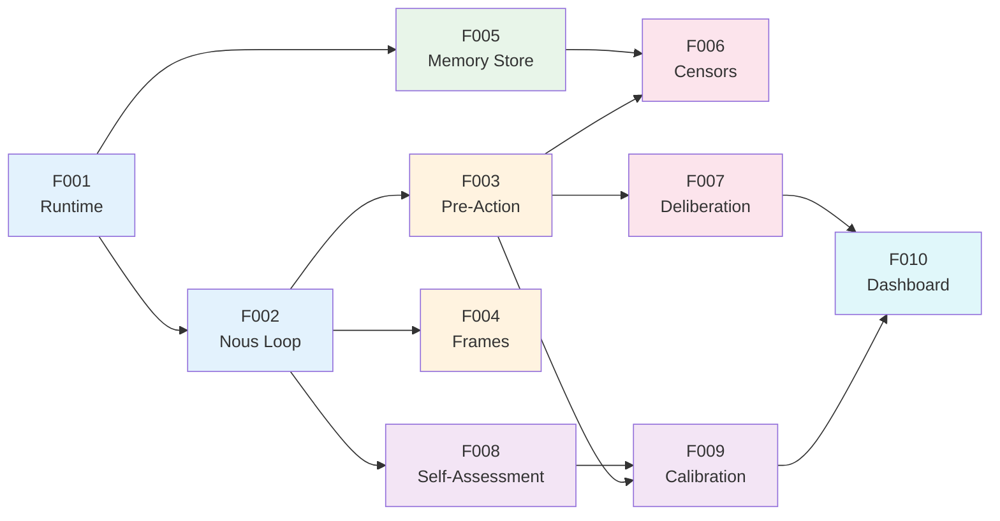

# Research Note 006: v0.1.0 Features

*What does the first Nous agent actually do?*

## Guiding Principle

Ship the smallest thing that demonstrates Nous is different from a regular agent. Not a demo — a real agent that does real work and gets better at it.

## v0.1.0: "The Thinking Agent"

An agent that can be given a task, works through it using the Nous Loop, and demonstrably improves over repeated interactions.

### F001: Agent Runtime (Docker)

**What:** A Docker container that runs a Nous agent with Claude Agent SDK.

```bash
docker run -e ANTHROPIC_API_KEY=sk-... \
           -e NOUS_DB_URL=postgresql://... \
           ghcr.io/tfatykhov/nous:latest
```

**Includes:**
- Claude Agent SDK with hooks wired
- Connection to Postgres (pgvector)
- Connection to Cognition Engines (MCP)
- REST API for sending messages
- WebSocket for real-time interaction (optional)

**User story:** "I can start a Nous agent with one command and talk to it."

---

### F002: The Nous Loop (Core Agent Cycle)

**What:** Every interaction follows: Sense → Frame → Recall → Deliberate → Act → Monitor → Learn

**Implementation:** Claude Agent SDK hooks at each stage:

```
pre_tool_use hook    → Frame selection + K-line activation + Pre-action check
                     → Inject context into system prompt
                     
[Claude does the work]

post_tool_use hook   → Self-monitor assessment
                     → Update decision record
                     → Feed calibration
                     
session_end hook     → Growth engine review
                     → K-line updates
                     → Censor creation if failures detected
```

**User story:** "I can see the agent's thinking process — what frame it chose, what context it loaded, what it considered."

---

### F003: Pre-Action Protocol (via Cognition Engines)

**What:** Before any significant action, the agent:
1. Queries similar past decisions
2. Checks guardrails/censors  
3. Records intent with confidence
4. Proceeds (or blocks)

**Implementation:** MCP connection to CSTP server. Uses existing `pre_action` API.

**User story:** "The agent checks its past experience before making decisions, and I can see what it found."

---

### F004: Basic Frame Selection

**What:** Agent classifies each input into a cognitive frame before responding.

**Initial frames:**
| Frame | Triggers | Behavior |
|-------|----------|----------|
| `task` | "do X", "create", "build", "fix" | Action-oriented, structured output |
| `question` | "what", "why", "how", "explain" | Research-oriented, thorough |
| `decision` | "should we", "which", "choose", "compare" | Pre-action mandatory, parallel reasons |
| `creative` | "brainstorm", "explore", "what if" | Expansive, fewer censors |
| `conversation` | Greetings, casual, social | Lightweight, no heavy cognitive machinery |

**Implementation:** Pattern matching first, LLM classification as fallback.

**User story:** "The agent approaches a bug report differently than a brainstorm request."

---

### F005: Memory Store (Postgres + pgvector)

**What:** Unified storage for all memory types with semantic search.

**Initial memory types:**
- `fact` — Things learned ("Tim prefers Celsius")
- `episode` — Interaction summaries (auto-generated per session)
- `censor` — Things not to do
- `procedure` — How-to knowledge

Decisions stay in Cognition Engines (the expert system for that).

**User story:** "The agent remembers what I told it last week without me repeating it."

---

### F006: Basic Censor Network

**What:** A set of rules that block bad actions before they happen.

**Initial censors (hard-coded + learnable):**
```
HARD-CODED:
- Don't expose secrets/API keys
- Don't delete data without confirmation
- Don't send external messages without review

LEARNABLE:
- Created from failed decisions (via growth engine)
- Stored in Postgres
- Escalate from warn → block based on repeat triggers
```

**Implementation:** Check censors during pre-action hook. Block or warn.

**User story:** "The agent caught itself about to make the same mistake it made last week."

---

### F007: Deliberation Traces

**What:** The agent records its reasoning during work, not just the outcome.

**Implementation:** 
- Micro-thoughts captured via `record_thought` MCP tool
- Attached to decision records in CE
- Visible in dashboard

**User story:** "I can see WHY the agent made a decision, not just what it decided."

---

### F008: Self-Assessment

**What:** After each task, the agent evaluates its own performance.

**Assessment captures:**
- Did the outcome match intent?
- Surprise level (0 = expected, 1 = unexpected)
- What would I do differently?
- Any new censors needed?

**Implementation:** Post-action hook generates assessment, stores in memory.

**User story:** "The agent reflects on its work and flags when something surprised it."

---

### F009: Confidence Calibration

**What:** Track confidence vs outcomes. Learn to be accurately uncertain.

**Implementation:** 
- Every decision has a confidence score
- Outcomes reviewed periodically
- Brier score computed
- Agent adjusts future confidence based on track record

**Already built in CE.** Nous just needs to ensure every decision flows through calibration.

**User story:** "The agent's confidence predictions are actually meaningful — when it says 80%, it's right about 80% of the time."

---

### F010: Growth Dashboard

**What:** Visualization of the agent's cognitive development over time.

**Shows:**
- Decision timeline with confidence and outcomes
- Calibration curve (predicted vs actual)
- Censor network (created, activated, false positives)
- Frame usage distribution
- Growth metrics (mistakes prevented, K-lines created)

**Implementation:** Extend CE dashboard or build Nous-specific UI.

**User story:** "I can see my agent getting smarter over time."

---

## What v0.1.0 Does NOT Include

- K-line system (v0.2 — need more experience data first)
- Frame splitting / parallel frames (v0.2)
- Growth engine / administrative improvement (v0.2)
- Multi-agent coordination (v0.3)
- Model router / LLM portability (v0.2)
- Voice / multimodal (later)

## Feature Dependency Map



## Build Order

| Priority | Feature | Effort | Why First |
|----------|---------|--------|-----------|
| 1 | F001 Runtime | Medium | Foundation — nothing works without this |
| 2 | F005 Memory Store | Medium | Storage layer for everything else |
| 3 | F002 Nous Loop | Medium | Core agent cycle with hooks |
| 4 | F003 Pre-Action | Low | Already exists in CE, just wire MCP |
| 5 | F004 Basic Frames | Low | Pattern matching, no ML needed |
| 6 | F006 Basic Censors | Low | Hard-coded set + DB storage |
| 7 | F007 Deliberation | Low | Already exists in CE |
| 8 | F008 Self-Assessment | Medium | New logic, post-action hook |
| 9 | F009 Calibration | Low | Already exists in CE |
| 10 | F010 Dashboard | Medium | Visualization layer |

**Estimated total for v0.1.0:** 2-3 weeks of focused work.

## v0.1.0 Demo Scenario

Imagine this interaction:

```
User: "Should we use Redis or Postgres for our cache layer?"

Nous's cognitive process:
  [FRAME] → Decision frame selected (detected "should we")
  [RECALL] → No K-lines yet, skipping
  [PRE-ACTION] → Queried CE: found 2 similar past decisions
    - Decision #147: "Chose Postgres over ChromaDB for unified storage" (success)
    - Decision #89: "Used Redis for session cache" (success)
  [CENSORS] → No active censors for this domain
  [DELIBERATION] → Recording: "Two past decisions relevant. Postgres worked 
    for storage unification. Redis worked for pure caching. This decision 
    depends on whether cache needs persistence..."
  
Nous's response: "Based on my past experience with similar decisions..."
  [Gives reasoned answer with confidence: 0.75]

  [SELF-ASSESS] → Recorded assessment, awaiting outcome
  [CALIBRATION] → Logged confidence for future tracking
```

**The difference from a normal agent:** Nous didn't just answer — it framed the problem, checked its history, recorded its reasoning, and set up tracking for future learning. If this decision turns out badly, it'll create a censor for next time.

---

## v0.2.0 Preview

After v0.1.0 proves the core loop works:
- K-line system with level-bands
- Frame splitting (parallel perspectives)
- Growth engine (administrative improvements)
- Model router integration
- Censor auto-creation from failures
- K-line auto-creation from repeated patterns

---

*Ship small, learn fast. The agent will teach us what it needs next.*
