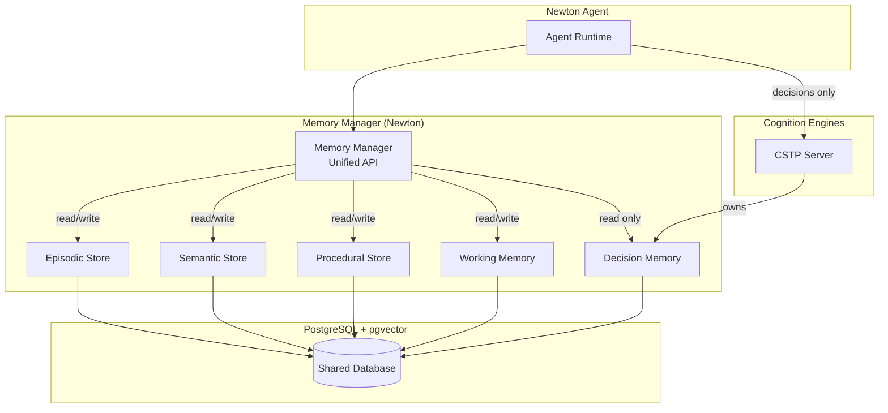
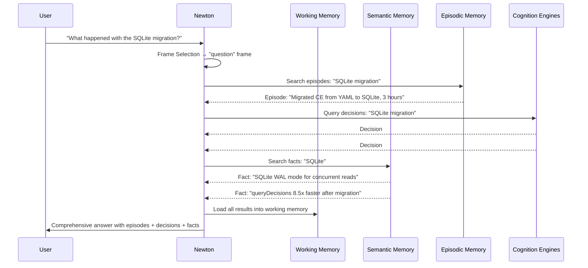
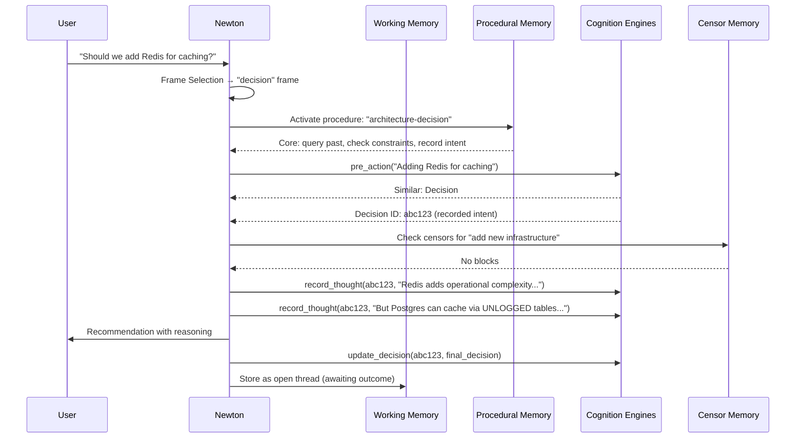
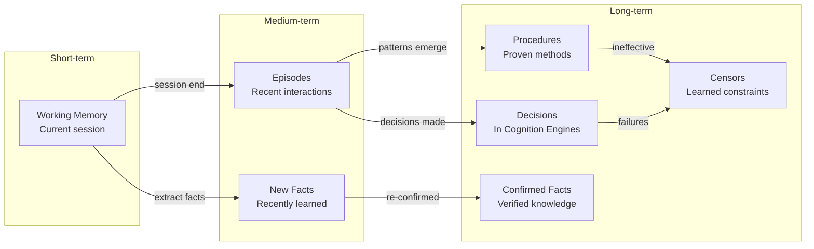

# Research Note 007: Memory Architecture & CE Integration

*How does a Newton agent remember, and where does Cognition Engines fit?*

## The Problem

A mind needs different kinds of memory. Humans have:
- **Episodic** — What happened (events, experiences)
- **Semantic** — What I know (facts, concepts)
- **Procedural** — How to do things (skills, habits)
- **Working** — What I'm focused on right now

Cognition Engines handles **decisions** brilliantly — but decisions are just one slice of memory. Newton needs ALL of these, organized and searchable.

## Memory Architecture



## The Five Memory Types

### 1. Decision Memory (Owned by Cognition Engines)

**What:** Choices the agent made, with deliberation traces, confidence, outcomes.

**CE handles:** Recording, querying, calibration, guardrails, graph relationships.

**Newton's role:** Consumer, not producer. Newton triggers decisions through CE's MCP API and reads results back.

**Schema:** CE's existing tables (in `ce` schema)

```
ce.decisions        — Decision records
ce.tags             — Decision tags
ce.reasons          — Decision reasoning
ce.bridge           — Structure/function definitions
ce.deliberation     — Thought traces
ce.graph_edges      — Decision relationships
```

**Newton reads from CE via MCP:**
```python
# Query past decisions
results = await mcp.call("pre_action", {
    "description": "Choosing cache layer",
    "auto_record": True
})

# Record a thought
await mcp.call("record_thought", {
    "decision_id": "abc123",
    "text": "Considering Redis vs Postgres..."
})

# Review outcome later
await mcp.call("review_outcome", {
    "id": "abc123",
    "outcome": "success",
    "result": "Postgres cache working well"
})
```

**Key principle:** Newton never writes directly to CE's tables. All decision operations go through CE's API. Clean boundary.

---

### 2. Episodic Memory (Owned by Newton)

**What:** What happened during interactions. Not decisions — experiences. The narrative of "what went on."

**Examples:**
- "Had a conversation about Newton architecture with Tim"
- "Debugged a SQLite migration issue for 45 minutes"
- "Read Minsky Chapter 10 and extracted 3 insights"

**Schema:**
```sql
CREATE TABLE newton.episodes (
    id UUID PRIMARY KEY DEFAULT gen_random_uuid(),
    agent_id VARCHAR(100) NOT NULL,
    title VARCHAR(500),
    summary TEXT NOT NULL,
    detail TEXT,                     -- Full narrative if needed
    embedding vector(1536),
    
    -- Temporal
    started_at TIMESTAMPTZ NOT NULL,
    ended_at TIMESTAMPTZ,
    duration_seconds INT,
    
    -- Connections
    decision_ids TEXT[],            -- Links to CE decisions made during this episode
    participants TEXT[],            -- Who was involved
    tags TEXT[],
    
    -- Context
    frame_used VARCHAR(100),       -- What cognitive frame was active
    klines_activated TEXT[],       -- What K-lines were loaded
    
    -- Assessment
    outcome VARCHAR(50),           -- success, partial, failure, ongoing
    surprise_level FLOAT,          -- 0-1, how unexpected was the outcome
    lessons_learned TEXT[],
    
    created_at TIMESTAMPTZ DEFAULT NOW()
);
```

**Auto-generated:** Newton creates episode records at the end of each interaction or task. Summarized by the LLM.

**Recall:** "What happened when I worked on X?" → semantic search over episodes.

---

### 3. Semantic Memory (Owned by Newton)

**What:** Facts, preferences, knowledge. Things that are true (or believed true) independent of when they were learned.

**Examples:**
- "Tim prefers Celsius"
- "The CSTP server runs on port 9991"
- "Jackson @JsonTypeInfo conflicts with Java records"
- "PostgreSQL pgvector uses ivfflat for ANN indexing"

**Schema:**
```sql
CREATE TABLE newton.facts (
    id UUID PRIMARY KEY DEFAULT gen_random_uuid(),
    agent_id VARCHAR(100) NOT NULL,
    content TEXT NOT NULL,
    embedding vector(1536),
    
    -- Classification
    category VARCHAR(100),         -- "preference", "technical", "person", "tool", "concept"
    subject VARCHAR(500),          -- What/who is this about
    confidence FLOAT DEFAULT 1.0,  -- How sure (facts can be uncertain)
    
    -- Provenance
    source VARCHAR(500),           -- Where did we learn this
    source_episode_id UUID,        -- Link to the episode where learned
    source_decision_id VARCHAR(100), -- Link to CE decision if applicable
    
    -- Lifecycle
    learned_at TIMESTAMPTZ NOT NULL,
    last_confirmed TIMESTAMPTZ,    -- When was this last verified true
    superseded_by UUID,            -- If a newer fact replaces this
    active BOOLEAN DEFAULT TRUE,
    
    tags TEXT[],
    created_at TIMESTAMPTZ DEFAULT NOW()
);
```

**Lifecycle:**
1. **Learned** — Agent encounters new information, stores as fact
2. **Confirmed** — Fact is re-encountered, `last_confirmed` updated
3. **Superseded** — New contradicting information arrives, old fact linked to new
4. **Deactivated** — Fact proven wrong, `active = false`

**Recall:** "What do I know about Tim?" → semantic + category search.

---

### 4. Procedural Memory (Owned by Newton)

**What:** How to do things. Patterns, methods, recipes. Not what happened (episodic) or what's true (semantic) — but how to act.

**Examples:**
- "To deploy to production: branch → PR → review → CI → merge"
- "When debugging: check logs first, reproduce second, fix third"
- "To check trader logs: curl API, parse with Python, analyze skip rates"

**This is the K-line system.** Each procedure has level-bands.

**Schema:**
```sql
CREATE TABLE newton.procedures (
    id UUID PRIMARY KEY DEFAULT gen_random_uuid(),
    agent_id VARCHAR(100) NOT NULL,
    name VARCHAR(500) NOT NULL,
    domain VARCHAR(100),           -- "trading", "deployment", "debugging"
    embedding vector(1536),
    
    -- Level bands (Minsky Ch 8)
    goals TEXT[],                  -- Upper fringe: why you'd use this
    core_patterns TEXT[],          -- Core: the actual method/steps
    core_tools TEXT[],             -- Core: tools/APIs involved
    core_concepts TEXT[],          -- Core: key ideas
    implementation_notes TEXT[],   -- Lower fringe: specific details
    
    -- Effectiveness tracking
    activation_count INT DEFAULT 0,
    success_count INT DEFAULT 0,
    failure_count INT DEFAULT 0,
    effectiveness FLOAT GENERATED ALWAYS AS (
        CASE WHEN activation_count > 0 
        THEN success_count::FLOAT / activation_count 
        ELSE 0.5 END
    ) STORED,
    last_activated TIMESTAMPTZ,
    
    -- Connections
    related_procedures UUID[],
    related_decision_ids TEXT[],   -- CE decisions that used this procedure
    censors TEXT[],                -- Associated censors (don't do X with this)
    
    tags TEXT[],
    created_at TIMESTAMPTZ DEFAULT NOW(),
    updated_at TIMESTAMPTZ DEFAULT NOW()
);
```

**Activation:** When a task matches a procedure's domain + goals, load the core band into context. Lower fringe loads weakly (displaced by current specifics). Upper fringe validates applicability.

**Learning:** After each use, update activation/success/failure counts. Effectiveness score auto-computed. Low-effectiveness procedures get flagged for review.

---

### 5. Working Memory (Owned by Newton)

**What:** The agent's current focus. What's in the "mental workspace" right now. Cleared between sessions (or persisted for continuity).

**Examples:**
- Currently working on: Newton v0.1.0 feature spec
- Active frame: architecture decision
- Loaded K-lines: newton-architecture, postgres-patterns
- Open threads: waiting for Tim's feedback on storage

**Schema:**
```sql
CREATE TABLE newton.working_memory (
    id UUID PRIMARY KEY DEFAULT gen_random_uuid(),
    agent_id VARCHAR(100) NOT NULL,
    session_id VARCHAR(100),
    
    -- Current state
    current_task TEXT,
    current_frame VARCHAR(100),
    active_procedures UUID[],      -- Currently loaded procedures
    active_facts UUID[],           -- Recently accessed facts
    
    -- Context window
    items JSONB NOT NULL DEFAULT '[]',  -- Ordered list of working memory items
    -- Each item: {type, id, content_summary, loaded_at, relevance_score}
    
    -- Threads
    open_threads JSONB DEFAULT '[]',  -- Things waiting on response/action
    
    created_at TIMESTAMPTZ DEFAULT NOW(),
    updated_at TIMESTAMPTZ DEFAULT NOW()
);
```

**Capacity management:** Working memory has a soft limit. When too many items are loaded, lowest-relevance items are evicted (but remain in long-term stores). This mirrors human attention constraints.

---

## How They Work Together

### Example: Agent receives "What happened with the SQLite migration?"



### Example: Agent makes a decision



## Censor Memory (Subset of Procedural)

Censors are stored alongside procedures but have a special role:

```sql
CREATE TABLE newton.censors (
    id UUID PRIMARY KEY DEFAULT gen_random_uuid(),
    agent_id VARCHAR(100) NOT NULL,
    
    trigger_pattern TEXT NOT NULL,   -- What activates this censor
    action VARCHAR(20) NOT NULL,     -- 'warn', 'block', 'absolute'
    reason TEXT NOT NULL,            -- Why this censor exists
    embedding vector(1536),          -- For semantic matching
    
    -- Provenance
    learned_from_decision VARCHAR(100),  -- CE decision that taught us
    learned_from_episode UUID,
    
    -- Lifecycle
    severity VARCHAR(20) DEFAULT 'warn',
    activation_count INT DEFAULT 0,
    last_activated TIMESTAMPTZ,
    false_positive_count INT DEFAULT 0,
    
    -- Escalation
    escalation_threshold INT DEFAULT 3,  -- Activations before auto-escalate
    
    active BOOLEAN DEFAULT TRUE,
    created_at TIMESTAMPTZ DEFAULT NOW()
);
```

## Integration Boundaries

```
┌─────────────────────────────────────────────────────┐
│                    Newton Agent                      │
│                                                      │
│  ┌──────────────┐    ┌──────────────────────────┐   │
│  │ Memory       │    │ Cognition Engines (MCP)   │   │
│  │ Manager      │    │                          │   │
│  │              │    │  pre_action ──────────►   │   │
│  │ • episodes   │    │  record_thought ──────►   │   │
│  │ • facts      │    │  update_decision ─────►   │   │
│  │ • procedures │    │  review_outcome ──────►   │   │
│  │ • censors    │    │  get_calibration ─────►   │   │
│  │ • working    │    │                          │   │
│  └──────┬───────┘    └──────────┬───────────────┘   │
│         │                       │                    │
│         ▼                       ▼                    │
│  ┌──────────────────────────────────────────────┐   │
│  │         PostgreSQL + pgvector                 │   │
│  │                                               │   │
│  │  newton schema          │  ce schema          │   │
│  │  • episodes             │  • decisions        │   │
│  │  • facts                │  • tags             │   │
│  │  • procedures           │  • reasons          │   │
│  │  • censors              │  • bridge           │   │
│  │  • working_memory       │  • deliberation     │   │
│  │                         │  • graph_edges      │   │
│  └──────────────────────────────────────────────┘   │
└─────────────────────────────────────────────────────┘
```

**Rules:**
1. Newton NEVER writes to `ce` schema directly
2. CE NEVER reads from `newton` schema
3. Both share the same Postgres instance for operational simplicity
4. Cross-references use IDs (newton stores CE decision IDs as strings, not foreign keys)
5. Either system can be replaced independently

## Unified Search

The Memory Manager provides unified search across all types:

```python
class MemoryManager:
    """Unified interface to all memory systems."""
    
    async def recall(
        self,
        query: str,
        types: list[str] | None = None,  # Filter by memory type
        limit: int = 10,
        mode: str = "hybrid"
    ) -> list[MemoryResult]:
        """Search across all memory types.
        
        Returns results from episodes, facts, procedures, AND decisions
        (via CE), ranked by relevance.
        """
        results = []
        
        # Search Newton's stores
        if types is None or any(t in types for t in ["episode", "fact", "procedure", "censor"]):
            newton_results = await self.store.search(query, type_filter=types, limit=limit)
            results.extend(newton_results)
        
        # Search CE decisions
        if types is None or "decision" in types:
            ce_results = await self.ce_client.query_decisions(query, limit=limit)
            results.extend(ce_results)
        
        # Merge and rank by combined relevance score
        return self._rank_results(results, limit)
    
    async def remember(
        self,
        content: str,
        type: str,
        **kwargs
    ) -> str:
        """Store a new memory. Routes to appropriate store."""
        if type == "decision":
            raise ValueError("Use CE for decisions (pre_action/record_decision)")
        
        record = MemoryRecord(type=type, content=content, **kwargs)
        record.embedding = await self.embedder.embed(content)
        return await self.store.store(record)
```

## Embedding Strategy

**Single embedding model** for all memory types — so cross-type search works:

```python
# Everything embedded with same model
EMBEDDING_MODEL = "text-embedding-3-small"  # or voyage-3, or local
EMBEDDING_DIMENSIONS = 1536

# This means episodes, facts, procedures, AND CE decisions 
# all live in the same vector space → unified semantic search
```

**CE alignment:** If CE currently uses a different embedding model, we'll need a migration or dual-embedding approach. Ideally CE adopts the same model for true unified search.

## Memory Lifecycle



**Auto-extraction:** After each episode, Newton extracts:
- Facts mentioned (→ semantic store, checked for duplicates)
- Procedures used (→ update activation counts)
- Decisions made (→ already in CE)
- Lessons learned (→ censor candidates)

---

*Memory isn't one thing. It's five things pretending to be one, managed by a sixth thing (the Memory Manager) that knows which to ask and when to update.*
