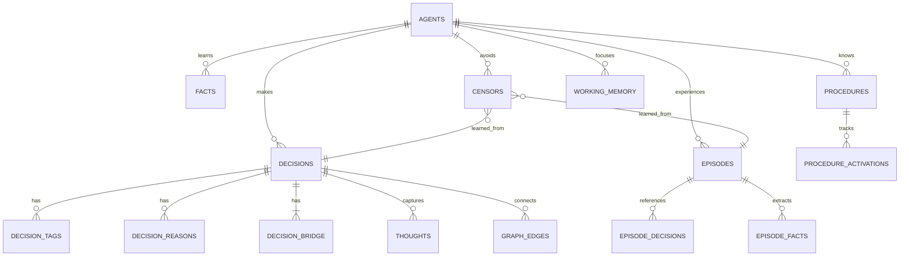

# Research Note 008: Complete Database Design

*Every table, every column, every relationship.*

## Design Principles

1. **One database, three schemas** — `brain`, `heart`, `system`
2. **pgvector for all embeddings** — unified semantic search across everything
3. **JSONB for flexibility** — structured where we can, flexible where we must
4. **Temporal everything** — created_at, updated_at on every table
5. **Agent-scoped** — every record belongs to an agent_id (multi-agent ready)
6. **Soft deletes** — `active` flag, never hard delete memory

## Schema Overview



---

## Schema: `brain` (Decision Intelligence)

### brain.decisions
The core record. Every choice the agent makes.

```sql
CREATE TABLE brain.decisions (
    id UUID PRIMARY KEY DEFAULT gen_random_uuid(),
    agent_id VARCHAR(100) NOT NULL,
    
    -- Content
    description TEXT NOT NULL,
    context TEXT,                          -- Situation, background
    pattern TEXT,                          -- Abstract principle ("Unify to reduce surface area")
    
    -- Assessment
    confidence FLOAT NOT NULL CHECK (confidence BETWEEN 0 AND 1),
    category VARCHAR(50) NOT NULL,         -- architecture, process, tooling, security, integration
    stakes VARCHAR(20) NOT NULL,           -- low, medium, high, critical
    quality_score FLOAT,                   -- Auto-computed from tags/reasons/pattern presence
    
    -- Outcome (filled later via review)
    outcome VARCHAR(20) DEFAULT 'pending', -- pending, success, partial, failure
    outcome_result TEXT,                   -- What actually happened
    reviewed_at TIMESTAMPTZ,
    
    -- Search
    embedding vector(1536),
    
    -- Temporal
    created_at TIMESTAMPTZ DEFAULT NOW(),
    updated_at TIMESTAMPTZ DEFAULT NOW()
);

CREATE INDEX idx_decisions_agent ON brain.decisions(agent_id);
CREATE INDEX idx_decisions_category ON brain.decisions(category);
CREATE INDEX idx_decisions_outcome ON brain.decisions(outcome);
CREATE INDEX idx_decisions_created ON brain.decisions(created_at DESC);
CREATE INDEX idx_decisions_embedding ON brain.decisions 
    USING ivfflat(embedding vector_cosine_ops) WITH (lists = 100);
CREATE INDEX idx_decisions_fts ON brain.decisions 
    USING GIN(to_tsvector('english', description || ' ' || COALESCE(context, '') || ' ' || COALESCE(pattern, '')));
```

### brain.decision_tags
```sql
CREATE TABLE brain.decision_tags (
    decision_id UUID NOT NULL REFERENCES brain.decisions(id) ON DELETE CASCADE,
    tag VARCHAR(100) NOT NULL,
    PRIMARY KEY (decision_id, tag)
);

CREATE INDEX idx_tags_tag ON brain.decision_tags(tag);
```

### brain.decision_reasons
```sql
CREATE TABLE brain.decision_reasons (
    id UUID PRIMARY KEY DEFAULT gen_random_uuid(),
    decision_id UUID NOT NULL REFERENCES brain.decisions(id) ON DELETE CASCADE,
    type VARCHAR(50) NOT NULL,             -- analysis, pattern, empirical, authority, intuition, analogy, elimination, constraint
    text TEXT NOT NULL,
    created_at TIMESTAMPTZ DEFAULT NOW()
);

CREATE INDEX idx_reasons_decision ON brain.decision_reasons(decision_id);
CREATE INDEX idx_reasons_type ON brain.decision_reasons(type);
```

### brain.decision_bridge
Structure (what it looks like) + Function (what it does) for dual-angle recall.

```sql
CREATE TABLE brain.decision_bridge (
    decision_id UUID PRIMARY KEY REFERENCES brain.decisions(id) ON DELETE CASCADE,
    structure TEXT,                         -- "A PostgreSQL schema with 3 schemas and 12 tables"
    function TEXT                           -- "Provides persistent, searchable memory for an AI agent"
);
```

### brain.thoughts
Micro-thoughts captured during deliberation (B-brain).

```sql
CREATE TABLE brain.thoughts (
    id UUID PRIMARY KEY DEFAULT gen_random_uuid(),
    decision_id UUID NOT NULL REFERENCES brain.decisions(id) ON DELETE CASCADE,
    agent_id VARCHAR(100) NOT NULL,
    text TEXT NOT NULL,
    created_at TIMESTAMPTZ DEFAULT NOW()
);

CREATE INDEX idx_thoughts_decision ON brain.thoughts(decision_id);
CREATE INDEX idx_thoughts_created ON brain.thoughts(created_at);
```

### brain.graph_edges
Relationships between decisions.

```sql
CREATE TABLE brain.graph_edges (
    id UUID PRIMARY KEY DEFAULT gen_random_uuid(),
    source_id UUID NOT NULL REFERENCES brain.decisions(id) ON DELETE CASCADE,
    target_id UUID NOT NULL REFERENCES brain.decisions(id) ON DELETE CASCADE,
    relation VARCHAR(50) NOT NULL,         -- supports, contradicts, supersedes, related_to, caused_by
    weight FLOAT DEFAULT 1.0,
    auto_linked BOOLEAN DEFAULT FALSE,     -- True if created by similarity, false if manual
    created_at TIMESTAMPTZ DEFAULT NOW(),
    UNIQUE(source_id, target_id, relation)
);

CREATE INDEX idx_edges_source ON brain.graph_edges(source_id);
CREATE INDEX idx_edges_target ON brain.graph_edges(target_id);
```

### brain.guardrails
Configurable rules that block or warn before actions.

```sql
CREATE TABLE brain.guardrails (
    id UUID PRIMARY KEY DEFAULT gen_random_uuid(),
    agent_id VARCHAR(100) NOT NULL,
    name VARCHAR(200) NOT NULL UNIQUE,
    description TEXT,
    
    -- Rule
    condition JSONB NOT NULL,              -- {"stakes": "high", "confidence_lt": 0.5}
    severity VARCHAR(20) NOT NULL DEFAULT 'warn',  -- warn, block, absolute
    
    -- Tracking
    activation_count INT DEFAULT 0,
    last_activated TIMESTAMPTZ,
    active BOOLEAN DEFAULT TRUE,
    
    created_at TIMESTAMPTZ DEFAULT NOW()
);
```

### brain.calibration_snapshots
Periodic snapshots of calibration metrics for trend tracking.

```sql
CREATE TABLE brain.calibration_snapshots (
    id UUID PRIMARY KEY DEFAULT gen_random_uuid(),
    agent_id VARCHAR(100) NOT NULL,
    
    total_decisions INT,
    reviewed_decisions INT,
    brier_score FLOAT,
    accuracy FLOAT,
    confidence_mean FLOAT,
    confidence_stddev FLOAT,
    
    -- Per-category breakdown
    category_stats JSONB,                  -- {"architecture": {"count": 50, "accuracy": 0.92}, ...}
    -- Per-reason-type breakdown
    reason_stats JSONB,                    -- {"analysis": {"count": 80, "brier": 0.02}, ...}
    
    snapshot_at TIMESTAMPTZ DEFAULT NOW()
);

CREATE INDEX idx_calibration_agent ON brain.calibration_snapshots(agent_id, snapshot_at DESC);
```

---

## Schema: `heart` (Memory System)

### heart.episodes
What happened. The narrative record of interactions and tasks.

```sql
CREATE TABLE heart.episodes (
    id UUID PRIMARY KEY DEFAULT gen_random_uuid(),
    agent_id VARCHAR(100) NOT NULL,
    
    -- Content
    title VARCHAR(500),
    summary TEXT NOT NULL,                 -- LLM-generated summary
    detail TEXT,                           -- Full narrative if available
    
    -- Temporal
    started_at TIMESTAMPTZ NOT NULL DEFAULT NOW(),
    ended_at TIMESTAMPTZ,
    duration_seconds INT,
    
    -- Context
    frame_used VARCHAR(100),               -- What cognitive frame was active
    trigger VARCHAR(100),                  -- What initiated this episode (user_message, cron, hook)
    participants TEXT[],                   -- Who was involved
    
    -- Assessment
    outcome VARCHAR(50),                   -- success, partial, failure, ongoing, abandoned
    surprise_level FLOAT CHECK (surprise_level BETWEEN 0 AND 1),
    lessons_learned TEXT[],
    
    -- Search
    embedding vector(1536),
    tags TEXT[],
    
    -- Lifecycle
    active BOOLEAN DEFAULT TRUE,
    created_at TIMESTAMPTZ DEFAULT NOW()
);

CREATE INDEX idx_episodes_agent ON heart.episodes(agent_id);
CREATE INDEX idx_episodes_started ON heart.episodes(started_at DESC);
CREATE INDEX idx_episodes_outcome ON heart.episodes(outcome);
CREATE INDEX idx_episodes_tags ON heart.episodes USING GIN(tags);
CREATE INDEX idx_episodes_embedding ON heart.episodes 
    USING ivfflat(embedding vector_cosine_ops) WITH (lists = 100);
CREATE INDEX idx_episodes_fts ON heart.episodes 
    USING GIN(to_tsvector('english', COALESCE(title, '') || ' ' || summary));
```

### heart.episode_decisions
Links episodes to decisions made during them.

```sql
CREATE TABLE heart.episode_decisions (
    episode_id UUID NOT NULL REFERENCES heart.episodes(id) ON DELETE CASCADE,
    decision_id UUID NOT NULL REFERENCES brain.decisions(id) ON DELETE CASCADE,
    PRIMARY KEY (episode_id, decision_id)
);
```

### heart.episode_procedures
Which procedures were activated during an episode.

```sql
CREATE TABLE heart.episode_procedures (
    episode_id UUID NOT NULL REFERENCES heart.episodes(id) ON DELETE CASCADE,
    procedure_id UUID NOT NULL REFERENCES heart.procedures(id) ON DELETE CASCADE,
    effectiveness VARCHAR(20),              -- helped, neutral, hindered
    PRIMARY KEY (episode_id, procedure_id)
);
```

### heart.facts
What the agent knows. Learned information with provenance and lifecycle.

```sql
CREATE TABLE heart.facts (
    id UUID PRIMARY KEY DEFAULT gen_random_uuid(),
    agent_id VARCHAR(100) NOT NULL,
    
    -- Content
    content TEXT NOT NULL,
    
    -- Classification
    category VARCHAR(100),                 -- preference, technical, person, tool, concept, rule
    subject VARCHAR(500),                  -- What/who this is about
    
    -- Confidence
    confidence FLOAT DEFAULT 1.0 CHECK (confidence BETWEEN 0 AND 1),
    
    -- Provenance
    source VARCHAR(500),                   -- Where we learned this
    source_episode_id UUID REFERENCES heart.episodes(id),
    source_decision_id UUID REFERENCES brain.decisions(id),
    
    -- Lifecycle
    learned_at TIMESTAMPTZ NOT NULL DEFAULT NOW(),
    last_confirmed TIMESTAMPTZ,            -- Last time this was verified true
    confirmation_count INT DEFAULT 0,
    superseded_by UUID REFERENCES heart.facts(id),
    contradiction_of UUID REFERENCES heart.facts(id),
    
    -- Search
    embedding vector(1536),
    tags TEXT[],
    
    -- State
    active BOOLEAN DEFAULT TRUE,
    created_at TIMESTAMPTZ DEFAULT NOW(),
    updated_at TIMESTAMPTZ DEFAULT NOW()
);

CREATE INDEX idx_facts_agent ON heart.facts(agent_id);
CREATE INDEX idx_facts_category ON heart.facts(category);
CREATE INDEX idx_facts_subject ON heart.facts(subject);
CREATE INDEX idx_facts_active ON heart.facts(active) WHERE active = TRUE;
CREATE INDEX idx_facts_tags ON heart.facts USING GIN(tags);
CREATE INDEX idx_facts_embedding ON heart.facts 
    USING ivfflat(embedding vector_cosine_ops) WITH (lists = 100);
CREATE INDEX idx_facts_fts ON heart.facts 
    USING GIN(to_tsvector('english', content || ' ' || COALESCE(subject, '')));
```

### heart.procedures
How to do things. K-lines with level-bands and effectiveness tracking.

```sql
CREATE TABLE heart.procedures (
    id UUID PRIMARY KEY DEFAULT gen_random_uuid(),
    agent_id VARCHAR(100) NOT NULL,
    
    -- Identity
    name VARCHAR(500) NOT NULL,
    domain VARCHAR(100),                   -- architecture, debugging, deployment, trading, research
    description TEXT,
    
    -- Level Bands (Minsky Ch 8)
    goals TEXT[],                           -- Upper fringe: why you'd use this (weakly attached)
    core_patterns TEXT[],                   -- Core: reusable methods/steps (strongly attached)
    core_tools TEXT[],                      -- Core: APIs, scripts, commands
    core_concepts TEXT[],                   -- Core: key ideas for this domain
    implementation_notes TEXT[],            -- Lower fringe: specific details (easily displaced)
    
    -- Effectiveness
    activation_count INT DEFAULT 0,
    success_count INT DEFAULT 0,
    failure_count INT DEFAULT 0,
    neutral_count INT DEFAULT 0,
    last_activated TIMESTAMPTZ,
    
    -- Connections
    related_procedures UUID[],
    censor_ids UUID[],                     -- Censors associated with this procedure
    
    -- Search
    embedding vector(1536),
    tags TEXT[],
    
    -- State
    active BOOLEAN DEFAULT TRUE,
    created_at TIMESTAMPTZ DEFAULT NOW(),
    updated_at TIMESTAMPTZ DEFAULT NOW()
);

CREATE INDEX idx_procedures_agent ON heart.procedures(agent_id);
CREATE INDEX idx_procedures_domain ON heart.procedures(domain);
CREATE INDEX idx_procedures_active ON heart.procedures(active) WHERE active = TRUE;
CREATE INDEX idx_procedures_embedding ON heart.procedures 
    USING ivfflat(embedding vector_cosine_ops) WITH (lists = 100);
CREATE INDEX idx_procedures_fts ON heart.procedures 
    USING GIN(to_tsvector('english', name || ' ' || COALESCE(description, '')));
```

### heart.censors
Things NOT to do. Learned constraints.

```sql
CREATE TABLE heart.censors (
    id UUID PRIMARY KEY DEFAULT gen_random_uuid(),
    agent_id VARCHAR(100) NOT NULL,
    
    -- Rule
    trigger_pattern TEXT NOT NULL,          -- What activates this censor
    action VARCHAR(20) NOT NULL DEFAULT 'warn',  -- warn, block, absolute
    reason TEXT NOT NULL,                   -- Why this exists
    domain VARCHAR(100),                   -- What area this applies to
    
    -- Provenance
    learned_from_decision UUID REFERENCES brain.decisions(id),
    learned_from_episode UUID REFERENCES heart.episodes(id),
    created_by VARCHAR(50) DEFAULT 'manual', -- manual, auto_failure, auto_escalation
    
    -- Lifecycle
    activation_count INT DEFAULT 0,
    last_activated TIMESTAMPTZ,
    false_positive_count INT DEFAULT 0,
    last_false_positive TIMESTAMPTZ,
    escalation_threshold INT DEFAULT 3,    -- Activations before auto-escalate severity
    
    -- Search
    embedding vector(1536),
    
    -- State
    active BOOLEAN DEFAULT TRUE,
    created_at TIMESTAMPTZ DEFAULT NOW(),
    updated_at TIMESTAMPTZ DEFAULT NOW()
);

CREATE INDEX idx_censors_agent ON heart.censors(agent_id);
CREATE INDEX idx_censors_action ON heart.censors(action);
CREATE INDEX idx_censors_domain ON heart.censors(domain);
CREATE INDEX idx_censors_active ON heart.censors(active) WHERE active = TRUE;
CREATE INDEX idx_censors_embedding ON heart.censors 
    USING ivfflat(embedding vector_cosine_ops) WITH (lists = 100);
```

### heart.working_memory
Current session state. What the agent is focused on right now.

```sql
CREATE TABLE heart.working_memory (
    id UUID PRIMARY KEY DEFAULT gen_random_uuid(),
    agent_id VARCHAR(100) NOT NULL,
    session_id VARCHAR(100) NOT NULL,
    
    -- Current state
    current_task TEXT,
    current_frame VARCHAR(100),
    
    -- Loaded context (ordered by relevance)
    items JSONB NOT NULL DEFAULT '[]',
    -- Each item: {
    --   "type": "fact|procedure|decision|censor",
    --   "ref_id": "uuid",
    --   "summary": "short text",
    --   "relevance": 0.95,
    --   "band": "core|upper_fringe|lower_fringe",
    --   "loaded_at": "timestamp"
    -- }
    
    -- Pending threads
    open_threads JSONB DEFAULT '[]',
    -- Each thread: {
    --   "description": "waiting for Tim's feedback",
    --   "decision_id": "uuid or null",
    --   "created_at": "timestamp",
    --   "priority": "low|medium|high"
    -- }
    
    -- Capacity
    max_items INT DEFAULT 20,
    
    created_at TIMESTAMPTZ DEFAULT NOW(),
    updated_at TIMESTAMPTZ DEFAULT NOW(),
    
    UNIQUE(agent_id, session_id)
);
```

---

## Schema: `system` (Agent Configuration & Events)

### system.agents
Registered agents. Multi-agent ready from day one.

```sql
CREATE TABLE system.agents (
    id VARCHAR(100) PRIMARY KEY,
    name VARCHAR(200) NOT NULL,
    description TEXT,
    
    -- Configuration
    config JSONB NOT NULL DEFAULT '{}',
    -- {
    --   "identity": {"traits": ["analytical", "cautious"]},
    --   "embedding_model": "text-embedding-3-small",
    --   "embedding_dimensions": 1536,
    --   "working_memory_capacity": 20,
    --   "auto_extract_facts": true,
    --   "auto_create_censors": true,
    --   "censor_escalation": true
    -- }
    
    -- Status
    active BOOLEAN DEFAULT TRUE,
    last_active TIMESTAMPTZ,
    
    created_at TIMESTAMPTZ DEFAULT NOW(),
    updated_at TIMESTAMPTZ DEFAULT NOW()
);
```

### system.frames
Cognitive frame definitions.

```sql
CREATE TABLE system.frames (
    id VARCHAR(100) PRIMARY KEY,
    agent_id VARCHAR(100) REFERENCES system.agents(id),  -- NULL = global frame
    
    name VARCHAR(200) NOT NULL,
    description TEXT,
    
    -- Activation
    activation_patterns TEXT[],            -- Keywords that trigger this frame
    default_category VARCHAR(50),          -- Default decision category in this frame
    default_stakes VARCHAR(20),            -- Default stakes level
    
    -- Context
    questions_to_ask TEXT[],               -- Frame-specific prompts
    agencies_to_activate TEXT[],           -- K-line domains to load
    suppressed_frames TEXT[],              -- Frames that can't co-activate
    
    -- Censors active in this frame
    frame_censors TEXT[],                  -- Additional censor patterns when this frame is active
    
    -- Tracking
    usage_count INT DEFAULT 0,
    last_used TIMESTAMPTZ,
    
    active BOOLEAN DEFAULT TRUE,
    created_at TIMESTAMPTZ DEFAULT NOW()
);
```

### system.events
Audit trail. Every significant cognitive event logged.

```sql
CREATE TABLE system.events (
    id UUID PRIMARY KEY DEFAULT gen_random_uuid(),
    agent_id VARCHAR(100) NOT NULL,
    session_id VARCHAR(100),
    
    event_type VARCHAR(50) NOT NULL,
    -- Types:
    -- frame_selected, frame_switched
    -- procedure_activated, procedure_deactivated
    -- censor_triggered, censor_created, censor_escalated
    -- decision_recorded, decision_reviewed
    -- guardrail_blocked, guardrail_warned
    -- fact_learned, fact_superseded
    -- episode_completed
    -- calibration_snapshot
    -- growth_event
    
    data JSONB NOT NULL DEFAULT '{}',      -- Event-specific payload
    
    created_at TIMESTAMPTZ DEFAULT NOW()
);

CREATE INDEX idx_events_agent ON system.events(agent_id);
CREATE INDEX idx_events_type ON system.events(event_type);
CREATE INDEX idx_events_created ON system.events(created_at DESC);
CREATE INDEX idx_events_session ON system.events(session_id);
```

---

## Cross-Schema Relationships

```
brain.decisions ←──── heart.episode_decisions ────→ heart.episodes
brain.decisions ←──── heart.facts.source_decision_id
brain.decisions ←──── heart.censors.learned_from_decision

heart.episodes  ←──── heart.facts.source_episode_id
heart.episodes  ←──── heart.censors.learned_from_episode
heart.episodes  ←──── heart.episode_procedures ────→ heart.procedures

system.agents   ←──── brain.decisions.agent_id
system.agents   ←──── heart.episodes.agent_id
system.agents   ←──── heart.facts.agent_id
system.agents   ←──── heart.procedures.agent_id
system.agents   ←──── heart.censors.agent_id
system.agents   ←──── heart.working_memory.agent_id
```

## Table Count Summary

| Schema | Tables | Purpose |
|--------|--------|---------|
| brain | 7 | decisions, tags, reasons, bridge, thoughts, graph_edges, guardrails, calibration_snapshots |
| heart | 7 | episodes, episode_decisions, episode_procedures, facts, procedures, censors, working_memory |
| system | 3 | agents, frames, events |
| **Total** | **17** | |

## Data Volume Estimates (per agent, per year)

| Table | Records/Year | Avg Size | Total |
|-------|-------------|----------|-------|
| decisions | ~2,000 | 2 KB | 4 MB |
| thoughts | ~10,000 | 200 B | 2 MB |
| episodes | ~1,500 | 3 KB | 4.5 MB |
| facts | ~5,000 | 500 B | 2.5 MB |
| procedures | ~200 | 2 KB | 400 KB |
| censors | ~100 | 500 B | 50 KB |
| events | ~50,000 | 300 B | 15 MB |
| embeddings | ~8,700 vectors | 6 KB each | 52 MB |
| **Total** | | | **~80 MB/agent/year** |

Postgres handles this trivially. Even 100 agents for 10 years is only ~80 GB.

## Migration Script

```sql
-- init.sql: Run on first startup
CREATE EXTENSION IF NOT EXISTS vector;
CREATE EXTENSION IF NOT EXISTS pg_trgm;  -- For fuzzy text matching

CREATE SCHEMA IF NOT EXISTS brain;
CREATE SCHEMA IF NOT EXISTS heart;
CREATE SCHEMA IF NOT EXISTS system;

-- Then create all tables above in order:
-- 1. system.agents (no deps)
-- 2. system.frames (depends on agents)
-- 3. brain.decisions (depends on agents via agent_id)
-- 4. brain.decision_tags, brain.decision_reasons, brain.decision_bridge (depend on decisions)
-- 5. brain.thoughts (depends on decisions)
-- 6. brain.graph_edges (depends on decisions)
-- 7. brain.guardrails (no table deps)
-- 8. brain.calibration_snapshots (no table deps)
-- 9. heart.episodes (no table deps)
-- 10. heart.episode_decisions (depends on episodes + decisions)
-- 11. heart.facts (depends on episodes, decisions)
-- 12. heart.procedures (no table deps)
-- 13. heart.episode_procedures (depends on episodes + procedures)
-- 14. heart.censors (depends on decisions, episodes)
-- 15. heart.working_memory (no table deps)
-- 16. system.events (no table deps)
```

## Hybrid Search Implementation

All searchable tables share the same pattern:

```sql
-- Unified search function (works for any table with embedding + text)
CREATE OR REPLACE FUNCTION search_hybrid(
    p_table TEXT,
    p_schema TEXT,
    p_query_embedding vector(1536),
    p_query_text TEXT,
    p_agent_id VARCHAR(100),
    p_limit INT DEFAULT 10,
    p_semantic_weight FLOAT DEFAULT 0.7
) RETURNS TABLE(id UUID, score FLOAT) AS $$
BEGIN
    RETURN QUERY EXECUTE format(
        'WITH semantic AS (
            SELECT id, 1 - (embedding <=> $1) AS score
            FROM %I.%I
            WHERE agent_id = $3 AND embedding IS NOT NULL
            ORDER BY embedding <=> $1
            LIMIT $4 * 2
        ),
        keyword AS (
            SELECT id, ts_rank_cd(
                to_tsvector(''english'', content_text),
                plainto_tsquery(''english'', $2)
            ) AS score
            FROM %I.%I
            WHERE agent_id = $3
              AND to_tsvector(''english'', content_text) @@ plainto_tsquery(''english'', $2)
            LIMIT $4 * 2
        )
        SELECT COALESCE(s.id, k.id) AS id,
            (COALESCE(s.score, 0) * $5 + COALESCE(k.score, 0) * (1 - $5)) AS score
        FROM semantic s
        FULL OUTER JOIN keyword k ON s.id = k.id
        ORDER BY score DESC
        LIMIT $4',
        p_schema, p_table, p_schema, p_table
    ) USING p_query_embedding, p_query_text, p_agent_id, p_limit, p_semantic_weight;
END;
$$ LANGUAGE plpgsql;
```

---

*17 tables. 3 schemas. One mind.*
