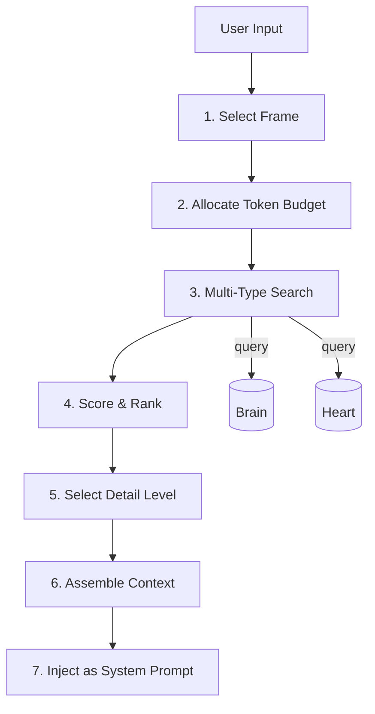

# Research Note 009: Context Management

*The right information, at the right detail level, at the right time.*

## The Problem

An LLM's context window is finite and expensive. A Newton agent accumulates thousands of memories over time. The challenge isn't storage — it's **selection and compression**. What goes into context for this specific interaction?

```
Agent has:          Context window fits:
~2,000 decisions    → maybe 10 relevant ones
~5,000 facts        → maybe 15 relevant ones  
~1,500 episodes     → maybe 3 relevant ones
~200 procedures     → maybe 2 relevant ones
~100 censors        → maybe 5 active ones
```

Getting this wrong means:
- **Too much** → token waste, confused LLM, slow responses, hallucination from conflicting info
- **Too little** → repeated mistakes, no learning, "who are you again?"
- **Wrong stuff** → agent confidently uses irrelevant context

## Design Principles

1. **Relevance over recency** — A 6-month-old decision about Postgres is more relevant to a Postgres question than yesterday's chat about weather
2. **Summaries first, details on demand** — Load one-line summaries, expand only what the LLM actually needs
3. **Hard token budget** — Context assembly has a ceiling, not a suggestion
4. **Layered detail** — Identity (always) → Active censors (always) → Task context (selected) → Background (if space)
5. **The agent doesn't see the selection** — Context management is invisible infrastructure, not a prompt the LLM reasons about

## Context Budget

```
Total context budget: ~8,000 tokens (configurable)

┌─────────────────────────────────────────┐
│ Layer 1: Identity (always loaded)       │  ~500 tokens
│ Agent name, traits, core rules          │
├─────────────────────────────────────────┤
│ Layer 2: Active Censors (always loaded) │  ~300 tokens
│ Things NOT to do right now              │
├─────────────────────────────────────────┤
│ Layer 3: Frame Context                  │  ~500 tokens
│ Current frame, questions to consider    │
├─────────────────────────────────────────┤
│ Layer 4: Working Memory                 │  ~700 tokens
│ Current task, open threads              │
├─────────────────────────────────────────┤
│ Layer 5: Relevant Decisions             │  ~2,000 tokens
│ Similar past decisions (summaries)      │
├─────────────────────────────────────────┤
│ Layer 6: Relevant Facts                 │  ~1,500 tokens
│ Known information about this topic      │
├─────────────────────────────────────────┤
│ Layer 7: Active Procedures              │  ~1,500 tokens
│ How-to knowledge (core band only)       │
├─────────────────────────────────────────┤
│ Layer 8: Relevant Episodes              │  ~1,000 tokens
│ Past experiences (summaries only)       │
├─────────────────────────────────────────┤
│ Calibration Note                        │  ~100 tokens
│ "You tend to be overconfident..."       │
└─────────────────────────────────────────┘
```

Layers 1-4 are **always present**. Layers 5-8 are **filled by relevance** within their budgets. If a layer has nothing relevant, its budget flows to other layers.

## Memory Record Sizes

Every memory type needs multiple representations at different detail levels:

### Micro (one line, ~20 tokens) — for ranked lists
```
"Chose Postgres over ChromaDB for unified storage [success, 0.85 confidence]"
"Tim prefers Celsius not Fahrenheit"
"To deploy: branch → PR → review → CI → merge"
"Don't push directly to main"
```

### Summary (~50-100 tokens) — for context loading
```
"Decision: Chose Postgres + pgvector as Newton's storage backend.
Reasons: Unifies structured + vector data, cloud-native, one backup target.
Outcome: Success. Query performance 8.5x faster than SQLite."
```

### Full (unlimited) — for deep inspection only
```
[Complete decision record with all reasons, thoughts, context, outcome details]
```

**The context window only ever sees Micro and Summary.** Full records are loaded only when the agent explicitly needs to inspect a specific memory.

## Storage Schema Addition

Each memory type gets a `summary` column (pre-computed, not generated at query time):

```sql
-- Add to brain.decisions
ALTER TABLE brain.decisions ADD COLUMN summary TEXT;
-- "Chose Postgres over ChromaDB for storage unification [success, 0.85]"

-- Add to heart.episodes  
-- Already has 'summary' column ✓

-- Add to heart.facts
-- 'content' IS the summary (facts are inherently short)

-- Add to heart.procedures
-- 'name' + 'description' serve as summary

-- Add to heart.censors
-- 'trigger_pattern' + 'reason' serve as summary
```

Summaries are generated:
- **At creation time** for decisions, episodes
- **At update time** when outcomes are added
- **By the LLM** for complex records, or by template for simple ones

## Context Assembly Pipeline



### Step 1: Select Frame
Determines which memory types and domains to prioritize.

```python
frame = await frame_engine.select(input)
# frame.name = "decision"
# frame.agencies_to_activate = ["architecture", "infrastructure"]  
# frame.priorities = {"decisions": 1.0, "procedures": 0.8, "facts": 0.6, "episodes": 0.4}
```

### Step 2: Allocate Token Budget
Based on frame and input complexity.

```python
budget = ContextBudget(
    total=8000,
    identity=500,         # Fixed
    censors=300,           # Fixed
    frame=500,             # Fixed
    working=700,           # Fixed
    decisions=2000,        # Flexible
    facts=1500,            # Flexible
    procedures=1500,       # Flexible
    episodes=1000,         # Flexible
)

# Short question? Reduce flexible budgets
# Complex architecture decision? Increase decision + procedure budgets
budget.adjust_for_complexity(input)
```

### Step 3: Multi-Type Search
Query all memory types in parallel.

```python
async def search_all(query: str, frame: Frame, agent_id: str) -> RawResults:
    """Search all memory types concurrently."""
    
    embedding = await embedder.embed(query)
    
    # Parallel searches
    decisions, facts, procedures, episodes, censors = await asyncio.gather(
        brain.search(query, embedding, limit=20),
        heart.search_facts(query, embedding, limit=30),
        heart.search_procedures(query, embedding, domain=frame.domain, limit=10),
        heart.search_episodes(query, embedding, limit=10),
        heart.get_active_censors(agent_id, domain=frame.domain),
    )
    
    return RawResults(decisions, facts, procedures, episodes, censors)
```

### Step 4: Score & Rank
Each result gets a composite relevance score.

```python
def score_result(result, query_embedding, frame) -> float:
    """Compute composite relevance score."""
    
    # Base: semantic similarity (0-1)
    semantic = 1 - cosine_distance(result.embedding, query_embedding)
    
    # Boost: frame priority for this memory type
    type_boost = frame.priorities.get(result.type, 0.5)
    
    # Boost: recency (exponential decay, half-life = 30 days)
    days_old = (now() - result.created_at).days
    recency = math.exp(-0.023 * days_old)  # 0.023 ≈ ln(2)/30
    
    # Boost: outcome quality (successful decisions rank higher)
    outcome_boost = 1.0
    if hasattr(result, 'outcome'):
        outcome_boost = {"success": 1.2, "partial": 1.0, "failure": 0.8, "pending": 0.9}[result.outcome]
    
    # Boost: activation count (frequently used procedures rank higher)
    usage_boost = 1.0
    if hasattr(result, 'activation_count') and result.activation_count > 0:
        usage_boost = min(1.0 + math.log10(result.activation_count) * 0.1, 1.5)
    
    # Penalty: low confidence facts
    confidence_penalty = getattr(result, 'confidence', 1.0)
    
    # Composite
    score = (
        semantic * 0.50 +          # Similarity is primary signal
        type_boost * 0.15 +        # Frame-appropriate types
        recency * 0.15 +           # Newer is slightly better
        outcome_boost * 0.10 +     # Proven knowledge
        usage_boost * 0.05 +       # Battle-tested procedures
        confidence_penalty * 0.05  # Trust confident facts
    )
    
    return score
```

### Step 5: Select Detail Level
Fill each budget layer, choosing detail level based on remaining space.

```python
def select_for_budget(ranked_results: list, budget_tokens: int) -> list[ContextItem]:
    """Greedily fill budget with highest-ranked results."""
    
    selected = []
    tokens_used = 0
    
    for result in ranked_results:
        # Try summary first
        summary_tokens = count_tokens(result.summary)
        
        if tokens_used + summary_tokens <= budget_tokens:
            selected.append(ContextItem(
                result=result,
                detail_level="summary",
                tokens=summary_tokens
            ))
            tokens_used += summary_tokens
        else:
            # Try micro (one-liner)
            micro_tokens = count_tokens(result.micro)
            if tokens_used + micro_tokens <= budget_tokens:
                selected.append(ContextItem(
                    result=result,
                    detail_level="micro",
                    tokens=micro_tokens
                ))
                tokens_used += micro_tokens
            else:
                break  # Budget full
    
    return selected
```

### Step 6: Assemble Context
Build the final context string with clear sections.

```python
def assemble_context(layers: dict[str, list[ContextItem]]) -> str:
    """Build structured context for system prompt."""
    
    sections = []
    
    # Layer 1: Identity (always)
    sections.append(f"## Identity\n{agent.identity_prompt}")
    
    # Layer 2: Censors (always)
    if layers["censors"]:
        lines = [f"- **{c.action.upper()}:** {c.trigger_pattern} — {c.reason}" 
                 for c in layers["censors"]]
        sections.append(f"## Active Constraints\n" + "\n".join(lines))
    
    # Layer 3: Frame
    sections.append(f"## Current Approach: {frame.name}\n{frame.description}")
    if frame.questions_to_ask:
        sections.append("Consider:\n" + "\n".join(f"- {q}" for q in frame.questions_to_ask))
    
    # Layer 4: Working memory
    if layers["working"]:
        sections.append(f"## Current Focus\n{working_memory.current_task}")
    
    # Layer 5: Decisions
    if layers["decisions"]:
        lines = [item.render() for item in layers["decisions"]]
        sections.append(f"## Relevant Past Decisions\n" + "\n".join(lines))
    
    # Layer 6: Facts
    if layers["facts"]:
        lines = [f"- {item.render()}" for item in layers["facts"]]
        sections.append(f"## Known Information\n" + "\n".join(lines))
    
    # Layer 7: Procedures
    if layers["procedures"]:
        for item in layers["procedures"]:
            sections.append(f"## Procedure: {item.result.name}\n{item.render()}")
    
    # Layer 8: Episodes
    if layers["episodes"]:
        lines = [f"- {item.render()}" for item in layers["episodes"]]
        sections.append(f"## Past Experience\n" + "\n".join(lines))
    
    # Calibration
    if calibration:
        sections.append(f"## Note\n{calibration.advice}")
    
    return "\n\n".join(sections)
```

## Example: Context Assembly in Action

**User asks:** "Should we use Redis for caching in Newton?"

**Frame selected:** `decision` (priorities: decisions=1.0, procedures=0.8, facts=0.6, episodes=0.4)

**Search returns (pre-ranking):**
- 12 decisions mentioning cache/Redis/Postgres
- 25 facts about Redis, Postgres, caching
- 3 procedures (architecture-decision, infrastructure-evaluation, deployment)
- 5 episodes involving infrastructure choices

**After scoring & ranking, context assembled:**

```
## Identity
Newton agent. Analytical, cautious, curious.

## Active Constraints
- BLOCK: Don't add infrastructure without evaluating operational cost — learned from over-engineering incidents
- WARN: Don't decide without at least 2 alternatives — architecture decisions need comparison

## Current Approach: Decision
Architecture/infrastructure decision detected.
Consider:
- What are we optimizing for?
- What did we decide last time?
- What are the constraints?

## Current Focus
Designing Newton's storage and runtime architecture.

## Relevant Past Decisions
- Chose Postgres + pgvector over separate ChromaDB for unified storage [success, 0.85] — "Unification reduces operational surface. One backup, one monitor, one connection pool."
- Built CE with SQLite first, migrated to Postgres later [success, 0.80] — "Start simple, migrate when proven. Abstract storage layer made migration painless."
- Rejected Qdrant in favor of pgvector [success, 0.82] — "Operational simplicity beat raw vector performance."

## Known Information
- PostgreSQL supports UNLOGGED tables for cache-like workloads (no WAL overhead)
- Redis adds a separate service to manage, monitor, and backup
- Newton's docker-compose currently has 3 services (newton, postgres, dashboard)
- pgvector query performance: 0.37s for hybrid search over 300+ records

## Procedure: Architecture Decision
Core patterns:
- Query similar past decisions before committing
- Evaluate at least 2 alternatives with pros/cons
- Record decision with confidence BEFORE implementing
- Consider operational cost, not just capability

## Past Experience
- Newton storage architecture discussion (2h, with Tim) — chose Postgres + pgvector, rejected multi-service approaches
- CE SQLite migration (3h) — abstracting storage layer first made backend swap painless

## Note
Recent accuracy: 97%. Brier: 0.019. Slightly underconfident — trust your analysis.
```

**Total: ~1,800 tokens.** Well under budget. Highly relevant. No noise.

The LLM now has exactly what it needs: past decisions about similar infrastructure choices, known facts about the technologies, a procedure to follow, and relevant experience — all at summary level, all ranked by relevance.

## Context Refresh

Context isn't static during a conversation. It refreshes when:

1. **Frame switches** — User shifts from debugging to architecture → reload context
2. **Significant new information** — User mentions a technology not in current context → targeted search + inject
3. **Decision point reached** — Agent is about to act → pre-action loads decision-specific context
4. **Token pressure** — Long conversation fills context → evict lowest-relevance items, keep censors and frame

```python
class ContextManager:
    def __init__(self, brain, heart, budget=8000):
        self.brain = brain
        self.heart = heart
        self.budget = budget
        self.current_context = None
        self.current_frame = None
    
    async def build(self, input: str, frame: CognitiveFrame) -> str:
        """Build fresh context for this input."""
        self.current_frame = frame
        raw = await self.search_all(input, frame)
        ranked = self.score_and_rank(raw, frame)
        layers = self.fill_budget(ranked)
        self.current_context = self.assemble(layers, frame)
        return self.current_context
    
    async def refresh_if_needed(self, new_input: str) -> str | None:
        """Check if context needs updating."""
        
        # Does the new input suggest a frame change?
        new_frame = await self.frame_engine.select(new_input)
        if new_frame.id != self.current_frame.id:
            return await self.build(new_input, new_frame)
        
        # Is the new input about something not in current context?
        similarity = self.input_matches_context(new_input)
        if similarity < 0.5:
            return await self.build(new_input, self.current_frame)
        
        # Context is still relevant
        return None
    
    async def expand_detail(self, memory_id: str) -> str:
        """Agent wants to inspect a specific memory more closely."""
        record = await self.get_full_record(memory_id)
        return record.full_text  # Injected as user-visible content, not system prompt
```

## Garbage Collection & Lifecycle

### Facts
```
NEW → CONFIRMED → CORE → SUPERSEDED → INACTIVE

NEW: Just learned. confidence = source confidence.
CONFIRMED: Re-encountered. confirmation_count++, last_confirmed updated.  
CORE: confirmed 3+ times OR manually marked. Higher retrieval priority.
SUPERSEDED: Contradicted by newer fact. superseded_by set. Still searchable but lower rank.
INACTIVE: Proven wrong. active = false. Excluded from search by default.
```

### Episodes  
```
ACTIVE → SUMMARIZED → ARCHIVED

ACTIVE: Recent (< 30 days). Full detail available.
SUMMARIZED: Older. detail field may be trimmed, summary preserved.
ARCHIVED: > 90 days. Only summary + metadata. Facts/decisions extracted. 
         Full detail moved to cold storage or deleted.
```

### Procedures
```
ACTIVE → EFFECTIVE → INEFFECTIVE → RETIRED

ACTIVE: In use. effectiveness not yet computed (< 5 activations).
EFFECTIVE: effectiveness > 0.6 after 5+ activations. Prioritized in recall.
INEFFECTIVE: effectiveness < 0.4 after 5+ activations. Flagged for review.
RETIRED: Manually deactivated or replaced. active = false.
```

### Censors
```
CREATED → ACTIVE → ESCALATED → RETIRED

CREATED: severity = warn. Monitoring.
ACTIVE: Regularly triggered. activation_count growing.
ESCALATED: activation_count > threshold → severity upgraded (warn → block).
RETIRED: false_positive_count too high OR manually deactivated.
```

### Decisions (in Brain)
```
RECORDED → PENDING → REVIEWED

RECORDED: Intent captured with confidence.
PENDING: Work done, awaiting outcome.
REVIEWED: Outcome logged. Feeds calibration.

No deletion. Decisions are permanent records. Even failures are valuable.
```

## Key Metrics

Track these to know if context management is working:

| Metric | What It Measures | Target |
|--------|-----------------|--------|
| Context relevance score | Avg similarity of loaded items to query | > 0.6 |
| Budget utilization | % of token budget used | 50-90% |
| Context refresh rate | How often context rebuilds per conversation | < 0.3 per turn |
| Recall precision | % of loaded items the LLM actually references | > 40% |
| Cold start time | Time to build context from scratch | < 500ms |
| Memory growth rate | New records per day | Monitored, not targeted |
| Fact confirmation rate | % of facts confirmed vs one-time | > 20% |

---

*The goal isn't to give the LLM everything. It's to give it exactly what it needs and nothing more. A well-curated 2,000-token context beats a noisy 50,000-token dump every time.*
