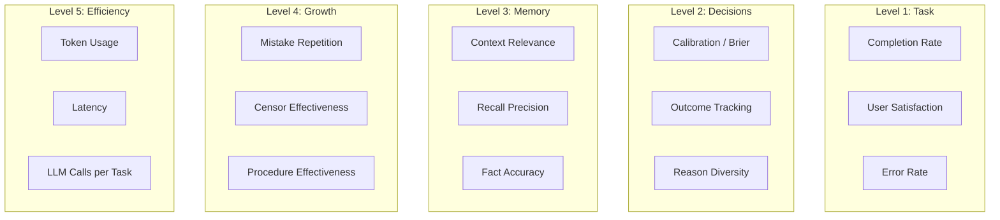

# Research Note 011: Measuring Success

*How do you know if a mind is working?*

## The Problem

"Did it work?" seems simple but it's actually five different questions:

1. **Did the agent complete the task?** (Task success)
2. **Did the agent make good decisions?** (Decision quality)
3. **Did the agent use the right context?** (Memory relevance)
4. **Is the agent getting better over time?** (Growth)
5. **Is the agent efficient?** (Resource usage)

Each needs different metrics and different measurement approaches.

## Measurement Framework



---

## Level 1: Task Success

The most visible layer. Did the user get what they wanted?

### Metrics

**Completion Rate**
```
completion_rate = tasks_completed / tasks_attempted
```
Tracked per frame type. A 95% completion rate on `question` frames but 60% on `debug` frames tells you where to invest.

**User Feedback (Explicit)**
When available: thumbs up/down, rating, "was this helpful?"
```sql
CREATE TABLE system.feedback (
    id UUID PRIMARY KEY DEFAULT gen_random_uuid(),
    agent_id VARCHAR(100) NOT NULL,
    episode_id UUID REFERENCES heart.episodes(id),
    decision_id UUID REFERENCES brain.decisions(id),
    
    rating INT CHECK (rating BETWEEN -1 AND 1),  -- -1 bad, 0 neutral, 1 good
    comment TEXT,
    
    created_at TIMESTAMPTZ DEFAULT NOW()
);
```

**User Feedback (Implicit)**
No explicit feedback? Infer from behavior:
- User accepted the suggestion → likely success
- User asked the same question again → likely failure
- User corrected the agent → definite failure
- Conversation continued naturally → likely success
- User abandoned mid-task → likely failure

```python
class ImplicitFeedback:
    async def assess_from_conversation(self, episode) -> float:
        """Estimate satisfaction from conversation patterns. Returns -1 to 1."""
        
        signals = []
        
        # Did user correct the agent?
        corrections = self.detect_corrections(episode.transcript)
        if corrections:
            signals.append(-0.5 * len(corrections))
        
        # Did user repeat a request?
        repeats = self.detect_repeats(episode.transcript)
        if repeats:
            signals.append(-0.3 * len(repeats))
        
        # Did user say thanks / express satisfaction?
        positive = self.detect_positive_signals(episode.transcript)
        if positive:
            signals.append(0.5 * len(positive))
        
        # Did the conversation flow naturally?
        turn_count = self.count_turns(episode.transcript)
        if turn_count > 1 and not corrections and not repeats:
            signals.append(0.3)  # Continued engagement = probably ok
        
        # Did user abandon?
        if episode.outcome == "abandoned":
            signals.append(-1.0)
        
        return max(-1.0, min(1.0, sum(signals)))
```

**Error Rate**
```
error_rate = tasks_with_errors / tasks_attempted
```
Errors include: tool failures, incorrect outputs, censor violations, guardrail blocks.

### How to Track

Every episode gets an outcome assessment:
```python
async def assess_episode(self, episode_id: str):
    episode = await self.heart.get_episode(episode_id)
    
    # Explicit feedback if available
    feedback = await self.get_feedback(episode_id)
    
    # Implicit feedback from conversation
    implicit = await self.implicit_feedback.assess(episode)
    
    # Combined score
    if feedback:
        score = feedback.rating  # Explicit wins
    else:
        score = implicit
    
    await self.heart.update_episode(episode_id, 
        outcome=self.score_to_outcome(score),
        satisfaction_score=score
    )
```

---

## Level 2: Decision Quality

The Brain's performance. Are decisions good?

### Metrics

**Brier Score (Calibration)**
```
brier = (1/N) * Σ(confidence - outcome)²
```
Where outcome is 1 (success) or 0 (failure). Perfect calibration = 0.0. Random = 0.25.

Already proven in CE. Nous inherits this directly.

**Target:** Brier < 0.05 after 100+ reviewed decisions.

**Accuracy**
```
accuracy = successful_decisions / reviewed_decisions
```
Simple but important. Track per category and per stakes level.

**Confidence Distribution**
```python
async def check_confidence_health(self):
    """Is the agent using the full confidence range?"""
    decisions = await self.brain.list(reviewed=True)
    confidences = [d.confidence for d in decisions]
    
    stddev = statistics.stdev(confidences)
    
    if stddev < 0.05:
        return "WARNING: Confidence variance too low. Agent always says ~{:.0%}. Not calibrating.".format(
            statistics.mean(confidences))
    
    if stddev > 0.25:
        return "WARNING: Confidence variance very high. Agent may be guessing."
    
    return f"OK: stddev={stddev:.3f}"
```

**Reason Diversity**
```python
async def check_reason_diversity(self):
    """Are decisions supported by diverse reasoning?"""
    recent = await self.brain.list(limit=50)
    
    single_type = 0
    for d in recent:
        reason_types = set(r.type for r in d.reasons)
        if len(reason_types) < 2:
            single_type += 1
    
    fragility = single_type / len(recent)
    # >50% single-type = fragile reasoning
    return fragility
```

**Decision Velocity**
```
decisions_per_day = total_decisions / active_days
```
Too low = agent isn't recording. Too high = recording noise. Sweet spot: 3-10/day for active agent.

### Outcome Tracking

The hardest part: knowing if a decision was actually good.

**Automatic outcomes:**
- Tool call succeeded/failed → immediate outcome
- Test passed/failed → immediate outcome
- PR merged/rejected → tracked outcome (hours/days later)
- Deployment healthy/broken → tracked outcome

**Manual outcomes:**
- User says "that worked" or "that didn't work"
- User provides explicit review
- Periodic review prompts ("How did decision X turn out?")

**Inferred outcomes:**
- Decision was about approach X, agent later used approach X successfully → likely success
- Decision was about approach X, agent later switched to approach Y → possible failure
- Similar decision made later with higher confidence → previous one informed this one (success)

```python
class OutcomeTracker:
    async def auto_detect_outcomes(self):
        """Scan for decisions whose outcomes can be determined."""
        
        pending = await self.brain.list(outcome="pending", older_than_hours=24)
        
        for decision in pending:
            # Check if subsequent episodes reference this decision
            episodes = await self.heart.get_episodes_referencing(decision.id)
            
            for episode in episodes:
                if episode.outcome == "success":
                    # Episode succeeded and used this decision
                    await self.brain.review(decision.id, 
                        outcome="success",
                        result=f"Applied in episode '{episode.title}' — succeeded"
                    )
                    break
                elif episode.outcome == "failure":
                    # Check if failure was related to this decision
                    if self.failure_related_to_decision(episode, decision):
                        await self.brain.review(decision.id,
                            outcome="failure",
                            result=f"Failed in episode '{episode.title}'"
                        )
                        break
            
            # Check for superseding decisions
            newer = await self.brain.search(decision.description, 
                newer_than=decision.created_at, limit=3)
            for n in newer:
                if n.id != decision.id and self.is_superseding(decision, n):
                    await self.brain.review(decision.id,
                        outcome="partial",
                        result=f"Superseded by decision '{n.description[:100]}'"
                    )
                    break
```

---

## Level 3: Memory Relevance

Is the memory system actually helping?

### Metrics

**Context Relevance Score**
After the LLM responds, measure how much of the loaded context it actually referenced.

```python
async def measure_context_relevance(self, context_items, llm_response):
    """What % of loaded context items were referenced in the response?"""
    
    referenced = 0
    for item in context_items:
        # Check if any key terms from the context item appear in response
        key_terms = self.extract_key_terms(item.summary)
        if any(term.lower() in llm_response.lower() for term in key_terms):
            referenced += 1
    
    return referenced / len(context_items) if context_items else 0
```

**Target:** > 40% of loaded context items should be referenced. Below that = loading irrelevant stuff.

**Recall Precision**
When the agent searches memory, how relevant are the top results?

```python
async def measure_recall_precision(self, query, results, k=5):
    """Are the top-K results actually relevant to the query?"""
    
    # Use LLM to judge relevance (sampled, not every query)
    judgments = await self.llm.generate(f"""
Rate the relevance of each result to the query on a scale of 0-2:
0 = not relevant, 1 = somewhat relevant, 2 = highly relevant

Query: "{query}"

Results:
{chr(10).join(f'{i+1}. {r.summary}' for i, r in enumerate(results[:k]))}

Return as JSON array of integers.
""")
    
    scores = parse_json(judgments)
    precision = sum(1 for s in scores if s >= 1) / len(scores)
    ndcg = self.compute_ndcg(scores)
    
    return {"precision@k": precision, "ndcg@k": ndcg}
```

**Target:** Precision@5 > 0.7, NDCG@5 > 0.8

**Fact Accuracy**
Track how often facts turn out to be wrong.

```
fact_accuracy = active_facts / (active_facts + superseded_facts + inactive_facts)
```

Low accuracy = agent is learning wrong things. Investigation needed.

**Memory Utilization**
Are all memory types being used, or is one dominating?

```python
async def memory_balance(self):
    """Check distribution across memory types."""
    counts = {
        "decisions": await self.brain.count(),
        "episodes": await self.heart.count_episodes(),
        "facts": await self.heart.count_facts(),
        "procedures": await self.heart.count_procedures(),
        "censors": await self.heart.count_censors(),
    }
    
    total = sum(counts.values())
    distribution = {k: v/total for k, v in counts.items()}
    
    # Flag if any type is >60% or <5% of total
    warnings = []
    for type_name, pct in distribution.items():
        if pct > 0.60:
            warnings.append(f"{type_name} dominates at {pct:.0%} — other types underused")
        if pct < 0.05 and total > 100:
            warnings.append(f"{type_name} barely used at {pct:.0%} — extraction may be broken")
    
    return distribution, warnings
```

---

## Level 4: Growth

Is the agent getting better, not just bigger?

### Metrics

**Mistake Repetition Rate (THE key metric)**

The single most important growth indicator: does the agent make the same mistake twice?

```python
async def mistake_repetition_rate(self, window_days=90):
    """How often does the agent repeat a failed pattern?"""
    
    failed = await self.brain.list(outcome="failure", days=window_days)
    
    repetitions = 0
    for failure in failed:
        # Find later decisions similar to this failure
        similar_after = await self.brain.search(
            failure.description,
            newer_than=failure.created_at,
            limit=5
        )
        
        for later in similar_after:
            if later.outcome == "failure" and later.id != failure.id:
                # Same type of failure repeated
                repetitions += 1
                break
    
    rate = repetitions / len(failed) if failed else 0
    return rate
```

**Target:** < 10%. If the agent repeats more than 10% of its mistakes, the censor/learning system is failing.

**Censor Effectiveness**
```python
async def censor_effectiveness(self):
    """Are censors preventing mistakes or just annoying?"""
    
    censors = await self.heart.list_censors(active=True)
    
    stats = {
        "total_activations": sum(c.activation_count for c in censors),
        "total_false_positives": sum(c.false_positive_count for c in censors),
        "precision": None,
        "censors_escalated": len([c for c in censors if c.action == "block"]),
        "censors_retired": await self.heart.count_censors(active=False),
    }
    
    total = stats["total_activations"]
    if total > 0:
        stats["precision"] = 1 - (stats["total_false_positives"] / total)
    
    return stats
```

**Target:** Censor precision > 85%. Below that = too many false blocks.

**Procedure Effectiveness Trend**
```python
async def procedure_improvement(self, window_days=30):
    """Are procedures getting more effective over time?"""
    
    procedures = await self.heart.list_procedures(
        min_activations=5, active=True
    )
    
    improving = 0
    declining = 0
    
    for proc in procedures:
        # Compare recent effectiveness to historical
        recent = await self.heart.get_procedure_effectiveness(
            proc.id, last_n=5
        )
        historical = proc.success_count / proc.activation_count
        
        if recent > historical + 0.05:
            improving += 1
        elif recent < historical - 0.05:
            declining += 1
    
    return {
        "improving": improving,
        "stable": len(procedures) - improving - declining,
        "declining": declining,
    }
```

**Calibration Trend**
```python
async def calibration_trend(self, snapshots=10):
    """Is Brier score improving over time?"""
    
    history = await self.brain.get_calibration_snapshots(limit=snapshots)
    
    if len(history) < 3:
        return "insufficient_data"
    
    # Simple linear regression on Brier scores
    briers = [h.brier_score for h in history]
    slope = self.linear_slope(briers)
    
    if slope < -0.001:
        return "improving"
    elif slope > 0.001:
        return "degrading"
    else:
        return "stable"
```

---

## Level 5: Efficiency

Is the agent doing this without burning money?

### Metrics

**Tokens per Task**
```
tokens_per_task = total_tokens_used / tasks_completed
```
Track by frame type. Creative tasks should use more than simple questions.

**Context Overhead**
```
context_overhead = context_tokens / total_tokens_per_turn
```
Target: < 15% of total tokens per turn should be context injection. If context is 50% of every turn, it's too much.

**LLM Calls per Task**
```
llm_calls_per_task = total_llm_calls / tasks_completed
```
Includes: response generation + summarization + extraction + dedup checks.
Target: < 1.5 LLM calls per turn on average (1 for response + occasional overhead).

**Memory Query Latency**
```
p50_recall_latency, p95_recall_latency, p99_recall_latency
```
Target: p95 < 200ms for context assembly.

---

## The Growth Report

All metrics combined into a periodic report:

```python
@dataclass
class GrowthReport:
    period: str                     # "weekly" or "monthly"
    generated_at: str
    
    # Level 1: Task
    tasks_completed: int
    completion_rate: float
    avg_satisfaction: float         # -1 to 1
    error_rate: float
    
    # Level 2: Decisions
    decisions_made: int
    decisions_reviewed: int
    brier_score: float
    accuracy: float
    confidence_stddev: float
    reason_fragility: float         # % of single-type reasoning
    
    # Level 3: Memory
    context_relevance: float        # % of context items referenced
    recall_precision: float         # precision@5
    fact_accuracy: float
    memory_balance: dict            # Distribution across types
    
    # Level 4: Growth
    mistake_repetition_rate: float  # THE metric
    censor_precision: float
    procedures_improving: int
    procedures_declining: int
    calibration_trend: str          # improving / stable / degrading
    
    # Level 5: Efficiency
    avg_tokens_per_task: int
    avg_context_overhead: float
    avg_llm_calls_per_task: float
    p95_recall_latency_ms: float
    
    # Summary
    strengths: list[str]
    concerns: list[str]
    recommendations: list[str]
```

**Generated weekly.** Stored as calibration snapshot. Displayed on dashboard. Trend lines show growth (or lack thereof) over time.

### Example Report

```
=== Nous Growth Report — Week of Feb 22, 2026 ===

TASK SUCCESS
  Completed: 47/52 (90%)
  Satisfaction: 0.72 (good)
  Errors: 3 (6%)

DECISIONS
  Made: 31 | Reviewed: 24
  Brier: 0.023 (excellent)
  Accuracy: 96%
  Confidence StdDev: 0.12 (healthy range)

MEMORY
  Context Relevance: 61% (above target)
  Recall Precision@5: 0.78 (good)
  Fact Accuracy: 98%
  Balance: decisions 35%, facts 30%, episodes 20%, procedures 10%, censors 5% ✓

GROWTH
  Mistake Repetition: 4% ✓ (target: <10%)
  Censor Precision: 91% ✓ (target: >85%)
  Procedures: 2 improving, 8 stable, 0 declining
  Calibration: stable

EFFICIENCY
  Tokens/Task: 3,200 avg
  Context Overhead: 11% ✓
  LLM Calls/Task: 1.3 avg
  Recall Latency p95: 145ms ✓

STRENGTHS
  ✅ Excellent calibration (Brier 0.023)
  ✅ No repeated mistakes this week
  ✅ Memory relevance above target

CONCERNS
  ⚠️ 3 errors in debug frame — investigate
  ⚠️ Procedures not improving (all stable)

RECOMMENDATIONS
  → Review debug-frame failures for new censors
  → Consider splitting "task" frame into sub-frames (too broad?)
  → 7 decisions still pending review — schedule reviews
```

---

## Tracking Infrastructure

```sql
-- Add to existing tables

-- Satisfaction tracking on episodes
ALTER TABLE heart.episodes ADD COLUMN satisfaction_score FLOAT;

-- Context relevance per turn (sampled)
CREATE TABLE system.context_metrics (
    id UUID PRIMARY KEY DEFAULT gen_random_uuid(),
    agent_id VARCHAR(100) NOT NULL,
    episode_id UUID REFERENCES heart.episodes(id),
    
    items_loaded INT,
    items_referenced INT,
    context_tokens INT,
    total_tokens INT,
    recall_latency_ms INT,
    llm_calls INT,
    
    created_at TIMESTAMPTZ DEFAULT NOW()
);

-- Growth reports
CREATE TABLE system.growth_reports (
    id UUID PRIMARY KEY DEFAULT gen_random_uuid(),
    agent_id VARCHAR(100) NOT NULL,
    period VARCHAR(20) NOT NULL,
    report JSONB NOT NULL,
    
    created_at TIMESTAMPTZ DEFAULT NOW()
);

CREATE INDEX idx_growth_agent ON system.growth_reports(agent_id, created_at DESC);
```

Updated table count: **17 → 20 tables**.

---

*The agent that measures itself can improve itself. The agent that doesn't is just getting bigger, not smarter.*
