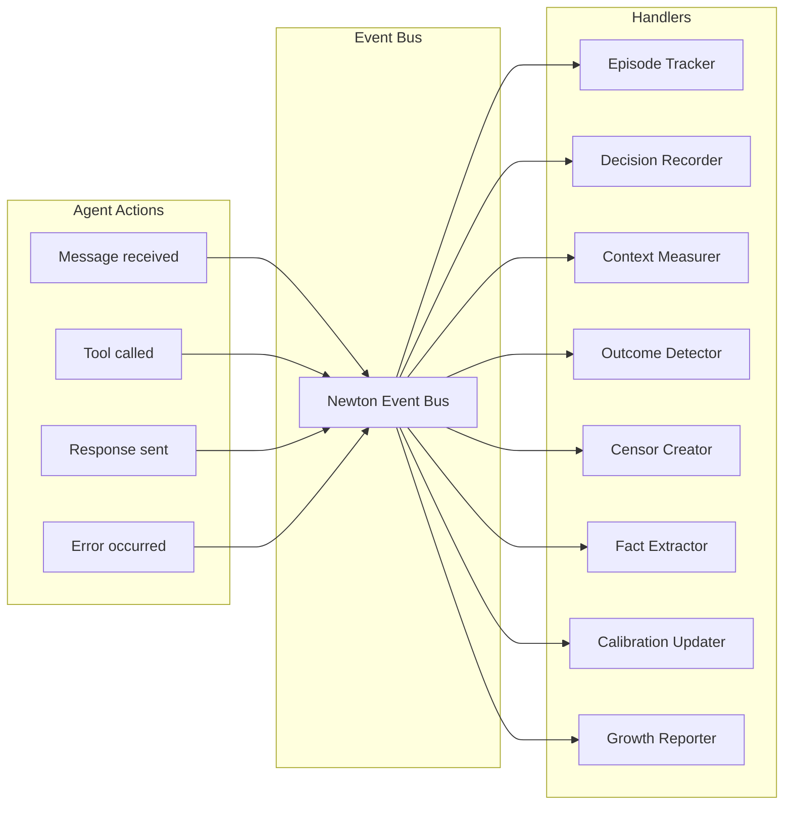

# Research Note 012: Automation Pipeline

*Nothing manual. Everything triggered by events.*

## Core Idea

Newton's measurement and learning systems run on an **event-driven pipeline**. Agent actions emit events. Events trigger handlers. Handlers update metrics, create censors, adjust context. No cron jobs, no manual reviews, no human in the loop (except when asked).

## Event Architecture



## The Event Flow

Every interaction generates a cascade of automatic actions:

```
User sends message
  │
  ├─► EVENT: message_received
  │     └─► Episode Tracker: start/continue episode
  │
  ├─► Cognitive Layer: frame selection, context assembly
  │     │
  │     ├─► EVENT: frame_selected {frame_id, confidence}
  │     │     └─► Metrics: log frame usage
  │     │
  │     ├─► EVENT: context_assembled {items_loaded, tokens, latency_ms}
  │     │     └─► Context Measurer: store metrics
  │     │
  │     └─► EVENT: censors_checked {triggered: [...], passed: [...]}
  │           └─► Censor Updater: increment activation counts
  │
  ├─► LLM generates response + tool calls
  │     │
  │     ├─► EVENT: decision_point_detected
  │     │     └─► Decision Recorder: auto-record via Brain
  │     │
  │     └─► EVENT: tool_called {tool, args, result, success}
  │           └─► Outcome Detector: match to pending decisions
  │
  ├─► Response delivered
  │     │
  │     ├─► EVENT: response_sent {tokens, context_items_referenced}
  │     │     └─► Context Measurer: compute relevance score
  │     │
  │     └─► EVENT: turn_completed {episode_id, duration}
  │           └─► Episode Tracker: update episode
  │
  └─► If error
        │
        ├─► EVENT: error_occurred {type, message, context}
        │     └─► Censor Creator: analyze for new censor
        │
        └─► EVENT: task_failed {episode_id, reason}
              └─► Outcome Detector: mark related decisions as failed
```

## Event Bus Implementation

```python
from collections import defaultdict
from dataclasses import dataclass, field
from typing import Callable, Any
import asyncio

@dataclass
class Event:
    type: str
    data: dict
    agent_id: str
    session_id: str | None = None
    timestamp: str = field(default_factory=lambda: datetime.utcnow().isoformat())

class EventBus:
    """In-process async event bus. No external dependencies."""
    
    def __init__(self):
        self._handlers: dict[str, list[Callable]] = defaultdict(list)
        self._queue: asyncio.Queue = asyncio.Queue()
        self._running = False
    
    def on(self, event_type: str, handler: Callable):
        """Register a handler for an event type."""
        self._handlers[event_type].append(handler)
    
    async def emit(self, event: Event):
        """Emit an event. Non-blocking — queued for async processing."""
        await self._queue.put(event)
    
    async def start(self):
        """Start processing events. Run as background task."""
        self._running = True
        while self._running:
            try:
                event = await asyncio.wait_for(self._queue.get(), timeout=1.0)
                handlers = self._handlers.get(event.type, [])
                
                # Run handlers concurrently but don't block the bus
                tasks = [self._safe_handle(h, event) for h in handlers]
                if tasks:
                    await asyncio.gather(*tasks)
                    
            except asyncio.TimeoutError:
                continue
    
    async def _safe_handle(self, handler: Callable, event: Event):
        """Run handler with error isolation."""
        try:
            await handler(event)
        except Exception as e:
            # Log but never crash the bus
            logger.error(f"Handler error for {event.type}: {e}")
    
    def stop(self):
        self._running = False
```

## Automated Handlers

### 1. Episode Tracker

Automatically creates and manages episodes from conversation flow.

```python
class EpisodeTracker:
    """Auto-tracks episodes from conversation events."""
    
    def __init__(self, heart: Heart, bus: EventBus):
        self.heart = heart
        self.active_episodes: dict[str, str] = {}  # session_id → episode_id
        
        bus.on("message_received", self.on_message)
        bus.on("response_sent", self.on_response)
        bus.on("session_ended", self.on_session_end)
        bus.on("frame_selected", self.on_frame_change)
    
    async def on_message(self, event: Event):
        session = event.session_id
        
        if session not in self.active_episodes:
            # New episode
            episode_id = await self.heart.create_episode(
                agent_id=event.agent_id,
                title=None,  # Generated at close
                trigger="user_message"
            )
            self.active_episodes[session] = episode_id
        
        # Accumulate transcript
        await self.heart.append_to_episode(
            self.active_episodes[session],
            role="user",
            content=event.data["message"]
        )
    
    async def on_response(self, event: Event):
        session = event.session_id
        if session in self.active_episodes:
            await self.heart.append_to_episode(
                self.active_episodes[session],
                role="assistant",
                content=event.data.get("response_summary", "")
            )
    
    async def on_session_end(self, event: Event):
        session = event.session_id
        if session in self.active_episodes:
            episode_id = self.active_episodes.pop(session)
            await self._close_episode(episode_id, event.agent_id)
    
    async def _close_episode(self, episode_id: str, agent_id: str):
        """Summarize and extract on episode close."""
        episode = await self.heart.get_episode(episode_id)
        
        # 1. Generate title + summary (one LLM call)
        summary_result = await self.llm.generate(f"""
Summarize this interaction. Return JSON:
{{"title": "short title", "summary": "100-150 word summary", "outcome": "success|partial|failure", "lessons": ["lesson1", "lesson2"]}}

Transcript:
{episode.raw_transcript[:6000]}
""")
        
        parsed = json.loads(summary_result)
        
        # 2. Update episode
        embedding = await self.embedder.embed(parsed["summary"])
        await self.heart.update_episode(episode_id,
            title=parsed["title"],
            summary=parsed["summary"],
            outcome=parsed["outcome"],
            lessons_learned=parsed.get("lessons", []),
            embedding=embedding,
            ended_at=datetime.utcnow()
        )
        
        # 3. Emit for downstream handlers
        await self.bus.emit(Event(
            type="episode_completed",
            agent_id=agent_id,
            data={"episode_id": episode_id, "outcome": parsed["outcome"]}
        ))
```

### 2. Automatic Fact Extraction

Triggered by episode_completed. No manual step.

```python
class FactExtractor:
    def __init__(self, heart: Heart, bus: EventBus):
        self.heart = heart
        bus.on("episode_completed", self.on_episode_completed)
    
    async def on_episode_completed(self, event: Event):
        episode = await self.heart.get_episode(event.data["episode_id"])
        
        # Extract facts from summary (cheap — summary is short)
        facts_json = await self.llm.generate(f"""
Extract discrete NEW facts from this interaction summary.
Only include specific, reusable information. Not opinions or plans.
Return JSON array: [{{"content": "fact text", "category": "technical|preference|person|tool|concept", "subject": "what this is about"}}]

Summary: {episode.summary}
""")
        
        facts = json.loads(facts_json)
        
        for fact in facts:
            # Dedup handled inside learn()
            await self.heart.learn(
                content=fact["content"],
                category=fact.get("category"),
                subject=fact.get("subject"),
                source_episode_id=event.data["episode_id"]
            )
```

### 3. Automatic Outcome Detection

Links task results back to decisions.

```python
class OutcomeDetector:
    def __init__(self, brain: Brain, bus: EventBus):
        self.brain = brain
        self.pending_decisions: dict[str, list[str]] = {}  # session → [decision_ids]
        
        bus.on("decision_recorded", self.on_decision)
        bus.on("tool_called", self.on_tool_result)
        bus.on("episode_completed", self.on_episode_completed)
        bus.on("error_occurred", self.on_error)
    
    async def on_decision(self, event: Event):
        """Track new decisions for outcome matching."""
        session = event.session_id
        if session not in self.pending_decisions:
            self.pending_decisions[session] = []
        self.pending_decisions[session].append(event.data["decision_id"])
    
    async def on_tool_result(self, event: Event):
        """Immediate outcome: tool succeeded or failed."""
        if not event.data.get("related_decision_id"):
            return
        
        decision_id = event.data["related_decision_id"]
        
        if event.data["success"]:
            await self.brain.review(decision_id,
                outcome="success",
                result=f"Tool {event.data['tool']} succeeded"
            )
        else:
            await self.brain.review(decision_id,
                outcome="failure",
                result=f"Tool {event.data['tool']} failed: {event.data.get('error', '')[:200]}"
            )
    
    async def on_episode_completed(self, event: Event):
        """Match episode outcome to pending decisions."""
        session = event.session_id
        decision_ids = self.pending_decisions.pop(session, [])
        
        if not decision_ids:
            return
        
        outcome = event.data.get("outcome", "pending")
        
        for decision_id in decision_ids:
            decision = await self.brain.get(decision_id)
            if decision and decision.outcome == "pending":
                await self.brain.review(decision_id,
                    outcome=outcome,
                    result=f"Episode completed with outcome: {outcome}"
                )
    
    async def on_error(self, event: Event):
        """Error during session → mark recent decisions as potential failures."""
        session = event.session_id
        decision_ids = self.pending_decisions.get(session, [])
        
        # Only mark the most recent decision as failed (not all)
        if decision_ids:
            latest = decision_ids[-1]
            decision = await self.brain.get(latest)
            if decision and decision.outcome == "pending":
                await self.brain.review(latest,
                    outcome="failure",
                    result=f"Error during execution: {event.data.get('message', '')[:200]}"
                )
```

### 4. Automatic Censor Creation

Failures automatically generate censor candidates.

```python
class CensorCreator:
    def __init__(self, brain: Brain, heart: Heart, bus: EventBus):
        self.brain = brain
        self.heart = heart
        
        bus.on("decision_reviewed", self.on_decision_reviewed)
        bus.on("error_occurred", self.on_error)
        bus.on("censor_triggered", self.on_censor_triggered)
    
    async def on_decision_reviewed(self, event: Event):
        """Failed decision → create censor candidate."""
        if event.data.get("outcome") != "failure":
            return
        
        decision = await self.brain.get(event.data["decision_id"])
        
        # Check if similar censor already exists
        existing = await self.heart.search_censors(
            decision.description, min_score=0.8
        )
        if existing:
            return  # Already covered
        
        # Generate censor from failure
        censor_json = await self.llm.generate(f"""
This decision failed:
Description: {decision.description}
Context: {decision.context}
Result: {decision.outcome_result}

Generate a censor rule to prevent similar failures.
Return JSON: {{"trigger_pattern": "what to watch for", "reason": "why to avoid this", "domain": "relevant domain"}}
""")
        
        parsed = json.loads(censor_json)
        
        await self.heart.add_censor(
            trigger_pattern=parsed["trigger_pattern"],
            reason=parsed["reason"],
            domain=parsed.get("domain"),
            severity="warn",  # Always start as warning
            learned_from_decision=event.data["decision_id"],
            created_by="auto_failure"
        )
    
    async def on_censor_triggered(self, event: Event):
        """Auto-escalate censors that trigger repeatedly."""
        censor = await self.heart.get_censor(event.data["censor_id"])
        
        if (censor.action == "warn" and 
            censor.activation_count >= censor.escalation_threshold):
            
            await self.heart.update_censor(censor.id,
                action="block",
                updated_at=datetime.utcnow()
            )
            
            await self.bus.emit(Event(
                type="censor_escalated",
                agent_id=event.agent_id,
                data={"censor_id": censor.id, "from": "warn", "to": "block"}
            ))
```

### 5. Automatic Calibration

Updated after every decision review. No batch job needed.

```python
class CalibrationUpdater:
    def __init__(self, brain: Brain, bus: EventBus):
        self.brain = brain
        self.review_count = 0
        
        bus.on("decision_reviewed", self.on_review)
    
    async def on_review(self, event: Event):
        """Recompute calibration incrementally."""
        self.review_count += 1
        
        # Snapshot every 10 reviews (not every single one)
        if self.review_count % 10 == 0:
            cal = await self.brain.compute_calibration()
            await self.brain.save_calibration_snapshot(cal)
            
            # Check for drift
            previous = await self.brain.get_calibration_snapshots(limit=2)
            if len(previous) == 2:
                brier_delta = previous[0].brier_score - previous[1].brier_score
                
                if brier_delta > 0.02:  # Getting worse
                    await self.bus.emit(Event(
                        type="calibration_drift",
                        agent_id=event.agent_id,
                        data={
                            "direction": "degrading",
                            "brier_current": previous[0].brier_score,
                            "brier_previous": previous[1].brier_score
                        }
                    ))
```

### 6. Automatic Growth Report

Triggered by time, not by events.

```python
class GrowthReporter:
    def __init__(self, brain: Brain, heart: Heart, bus: EventBus):
        self.brain = brain
        self.heart = heart
        
        bus.on("daily_tick", self.on_daily)
        bus.on("weekly_tick", self.on_weekly)
    
    async def on_daily(self, event: Event):
        """Quick daily health check."""
        # Just check for red flags
        mistake_rate = await self.compute_mistake_rate(days=7)
        if mistake_rate > 0.15:
            await self.bus.emit(Event(
                type="growth_alert",
                agent_id=event.agent_id,
                data={"alert": f"Mistake repetition rate at {mistake_rate:.0%}"}
            ))
    
    async def on_weekly(self, event: Event):
        """Full growth report."""
        report = await self.generate_full_report(event.agent_id)
        await self.brain.save_growth_report(report)
        
        await self.bus.emit(Event(
            type="growth_report_generated",
            agent_id=event.agent_id,
            data={"report_id": report.id}
        ))
```

### 7. Memory Maintenance

Background cleanup, also event-driven.

```python
class MemoryMaintainer:
    def __init__(self, heart: Heart, bus: EventBus):
        self.heart = heart
        
        bus.on("daily_tick", self.on_daily)
    
    async def on_daily(self, event: Event):
        """Daily memory maintenance."""
        
        # 1. Trim old episodes (30 days)
        trimmed = await self.heart.trim_episodes(older_than_days=30)
        
        # 2. Archive very old episodes (90 days)
        archived = await self.heart.archive_episodes(older_than_days=90)
        
        # 3. Deactivate contradicted facts
        # (facts that have been superseded but still active)
        deactivated = await self.heart.deactivate_superseded_facts()
        
        # 4. Flag ineffective procedures
        flagged = await self.heart.flag_ineffective_procedures(
            min_activations=5, max_effectiveness=0.4
        )
        
        # 5. Retire high-false-positive censors
        retired = await self.heart.retire_noisy_censors(
            min_false_positive_rate=0.5, min_activations=5
        )
        
        if any([trimmed, archived, deactivated, flagged, retired]):
            logger.info(f"Maintenance: trimmed={trimmed}, archived={archived}, "
                       f"deactivated={deactivated}, flagged={flagged}, retired={retired}")
```

## Tick Events

The only "scheduled" events. Everything else is reactive.

```python
class TickEmitter:
    """Emits periodic tick events for time-based handlers."""
    
    def __init__(self, bus: EventBus, agent_id: str):
        self.bus = bus
        self.agent_id = agent_id
    
    async def start(self):
        last_daily = None
        last_weekly = None
        
        while True:
            now = datetime.utcnow()
            today = now.date()
            
            # Daily tick (once per day at first activity)
            if last_daily != today:
                await self.bus.emit(Event(
                    type="daily_tick", 
                    agent_id=self.agent_id,
                    data={"date": str(today)}
                ))
                last_daily = today
            
            # Weekly tick (Sundays)
            if today.weekday() == 6 and last_weekly != today:
                await self.bus.emit(Event(
                    type="weekly_tick",
                    agent_id=self.agent_id,
                    data={"week": today.isocalendar()[1]}
                ))
                last_weekly = today
            
            await asyncio.sleep(3600)  # Check hourly
```

## Wiring It All Together

```python
class Newton:
    """The complete Newton agent with all automation."""
    
    async def start(self, config: dict):
        # Core organs
        self.db = await create_pool(config["db_url"])
        self.brain = Brain(self.db)
        self.heart = Heart(self.db)
        self.bus = EventBus()
        
        # Automated handlers
        self.episode_tracker = EpisodeTracker(self.heart, self.bus)
        self.fact_extractor = FactExtractor(self.heart, self.bus)
        self.outcome_detector = OutcomeDetector(self.brain, self.bus)
        self.censor_creator = CensorCreator(self.brain, self.heart, self.bus)
        self.calibration_updater = CalibrationUpdater(self.brain, self.bus)
        self.growth_reporter = GrowthReporter(self.brain, self.heart, self.bus)
        self.memory_maintainer = MemoryMaintainer(self.heart, self.bus)
        self.context_measurer = ContextMeasurer(self.bus)
        
        # Cognitive layer
        self.cognitive = CognitiveLayer(self.brain, self.heart, self.bus)
        
        # Tick emitter (only scheduled component)
        self.ticker = TickEmitter(self.bus, config["agent_id"])
        
        # Start event processing
        await asyncio.gather(
            self.bus.start(),
            self.ticker.start(),
            self.cognitive.start(),
        )
```

## What's Manual vs Automatic

| Action | Trigger | Automatic? |
|--------|---------|-----------|
| Episode creation | Message received | ✅ |
| Episode summary | Session end | ✅ |
| Fact extraction | Episode completed | ✅ |
| Fact deduplication | New fact learned | ✅ |
| Decision recording | Decision point in conversation | ✅ via cognitive layer |
| Outcome detection | Tool result / episode end / error | ✅ |
| Censor creation | Decision failed | ✅ |
| Censor escalation | Repeat triggers | ✅ |
| Censor retirement | Too many false positives | ✅ |
| Calibration update | Every 10 reviews | ✅ |
| Drift detection | Calibration snapshot | ✅ |
| Context measurement | Every turn (sampled) | ✅ |
| Episode trimming | Daily tick | ✅ |
| Episode archiving | Daily tick | ✅ |
| Procedure effectiveness | Episode with procedure completed | ✅ |
| Growth report | Weekly tick | ✅ |
| Memory health check | Daily tick | ✅ |
| Frame selection | Every message | ✅ via cognitive layer |
| Context assembly | Every turn | ✅ via cognitive layer |
| Explicit feedback | User provides rating | Manual (optional) |
| Override censor | User says "do it anyway" | Manual |
| Create procedure | User teaches agent | Manual (initially) |

**27 of 29 actions are fully automatic.** Only explicit user feedback and procedure teaching require human involvement — and even those could be automated later (implicit feedback + procedure auto-creation from repeated patterns).

---

*The best automation is invisible. The agent learns, adapts, and grows without anyone telling it to. You just notice one day that it's gotten smarter.*
